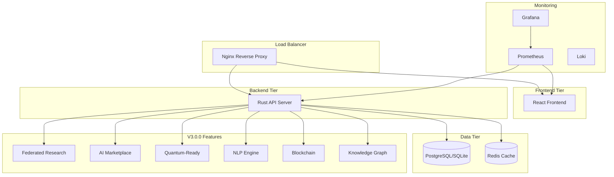

# Free Deep Research System - Docker Deployment Guide

[](https://github.com/usemanusai/free-deep-research/releases)
[](https://www.docker.com/)
[](LICENSE)

Complete Docker containerization setup for the Free Deep Research System Version 3.0.0 "Global Intelligence Network" with support for development and production environments.

## 🚀 Quick Start

### Prerequisites

- **Docker**: Version 20.10+ ([Install Docker](https://docs.docker.com/get-docker/))
- **Docker Compose**: Version 2.0+ ([Install Docker Compose](https://docs.docker.com/compose/install/))
- **Git**: For cloning the repository
- **OpenSSL**: For SSL certificate generation (optional)

### One-Command Setup

**Linux/macOS/WSL:**
```bash
# Development environment
./setup.sh

# Production environment
./setup.sh -e production
```

**Windows:**
```cmd
# Development environment
setup.bat

# Production environment
setup.bat -e production
```

## 📋 Table of Contents

- [Architecture Overview](#architecture-overview)
- [Environment Configurations](#environment-configurations)
- [Setup Instructions](#setup-instructions)
- [Service Management](#service-management)
- [Configuration](#configuration)
- [Monitoring & Logging](#monitoring--logging)
- [Security](#security)
- [Backup & Recovery](#backup--recovery)
- [Troubleshooting](#troubleshooting)
- [Performance Tuning](#performance-tuning)
- [CI/CD Integration](#cicd-integration)

## 🏗️ Architecture Overview

The Free Deep Research System uses a microservices architecture with the following components:



### Container Services

| Service | Purpose | Ports | Dependencies |
|---------|---------|-------|--------------|
| **nginx** | Reverse proxy, SSL termination, load balancing | 80, 443 | frontend, backend |
| **frontend** | React web application | 3000 | backend |
| **backend** | Rust API server with V3.0.0 features | 8080 | database, redis |
| **database** | PostgreSQL (prod) / SQLite (dev) | 5432 | - |
| **redis** | Caching and session management | 6379 | - |
| **prometheus** | Metrics collection | 9090 | backend, frontend |
| **grafana** | Monitoring dashboards | 3001 | prometheus |
| **loki** | Log aggregation (production) | 3100 | - |

## 🔧 Environment Configurations

### Development Environment

- **Database**: SQLite (lightweight, file-based)
- **SSL**: Self-signed certificates
- **Hot Reload**: Enabled for frontend and backend
- **Debug Tools**: Adminer, Redis Commander, Mailhog
- **Logging**: Verbose debug logging
- **Security**: Relaxed for development ease

**Services included:**
- All core services
- Development tools (adminer, redis-commander, mailhog)
- Hot reload capabilities
- Debug configurations

### Production Environment

- **Database**: PostgreSQL with optimizations
- **SSL**: Production-ready certificates (replace defaults)
- **Performance**: Optimized builds and configurations
- **Monitoring**: Full Prometheus/Grafana stack
- **Security**: Hardened security headers and policies
- **Scaling**: Multi-replica support

**Services included:**
- All core services
- Production monitoring stack
- Backup services
- Security hardening
- Performance optimizations

## 📖 Setup Instructions

### 1. Clone Repository

```bash
git clone https://github.com/usemanusai/free-deep-research.git
cd free-deep-research
```

### 2. Choose Setup Method

#### Option A: Automated Setup (Recommended)

**Linux/macOS/WSL:**
```bash
# Make setup script executable
chmod +x setup.sh

# Development setup
./setup.sh

# Production setup with custom options
./setup.sh -e production --skip-ssl -v
```

**Windows:**
```cmd
# Development setup
setup.bat

# Production setup
setup.bat -e production
```

#### Option B: Manual Setup

1. **Copy environment file:**
```bash
# For development
cp .env.dev .env

# For production
cp .env.prod .env
```

2. **Edit environment variables:**
```bash
# Edit the .env file with your specific configuration
nano .env
```

3. **Create directories:**
```bash
mkdir -p docker/{nginx,backend,frontend,database,redis,prometheus,grafana}/{logs,ssl,cache,config}
mkdir -p bmad-agent/free-deep-research/data
```

4. **Generate SSL certificates:**
```bash
# Development self-signed certificate
openssl req -x509 -nodes -days 365 -newkey rsa:2048 \
  -keyout docker/nginx/ssl/key.pem \
  -out docker/nginx/ssl/cert.pem \
  -subj "/C=US/ST=Dev/L=Dev/O=FDR/CN=localhost"
```

5. **Start services:**
```bash
# Development
docker-compose -f docker-compose.dev.yml up -d

# Production
docker-compose -f docker-compose.prod.yml up -d
```

### 3. Verify Installation

```bash
# Check service status
docker-compose ps

# View logs
docker-compose logs -f

# Test endpoints
curl http://localhost:8080/health
curl http://localhost:3000
```

## 🎛️ Service Management

### Basic Commands

```bash
# Start all services
docker-compose up -d

# Stop all services
docker-compose down

# Restart specific service
docker-compose restart backend

# View logs
docker-compose logs -f backend

# Scale services (production)
docker-compose up -d --scale backend=3

# Update and rebuild
docker-compose build --no-cache
docker-compose up -d
```

### Development Commands

```bash
# Start with development tools
docker-compose -f docker-compose.dev.yml --profile devtools up -d

# Access development shell
docker-compose exec backend bash
docker-compose exec frontend sh

# Run database migrations
docker-compose exec backend ./free-deep-research migrate

# View real-time logs
docker-compose logs -f --tail=100
```

### Production Commands

```bash
# Start production environment
docker-compose -f docker-compose.prod.yml up -d

# Start with monitoring
docker-compose -f docker-compose.prod.yml --profile monitoring up -d

# Backup database
docker-compose exec database pg_dump -U $DB_USER $DB_NAME > backup.sql

# Update production deployment
docker-compose -f docker-compose.prod.yml pull
docker-compose -f docker-compose.prod.yml up -d --remove-orphans
```

## ⚙️ Configuration

### Environment Variables

Key environment variables in `.env` file:

```bash
# Database Configuration
DB_NAME=free_deep_research
DB_USER=fdr_user
DB_PASSWORD=secure_password_change_me

# Redis Configuration
REDIS_PASSWORD=redis_password_change_me

# Security
JWT_SECRET=jwt_secret_key_change_me
SSL_CERT_PATH=./docker/nginx/ssl/cert.pem

# API Keys (V3.0.0 Features)
OPENROUTER_API_KEY=your_openrouter_key
SERPAPI_KEY=your_serpapi_key
JINA_API_KEY=your_jina_key
FIRECRAWL_API_KEY=your_firecrawl_key
TAVILY_API_KEY=your_tavily_key
EXA_API_KEY=your_exa_key

# V3.0.0 Feature Flags
FEDERATED_RESEARCH_ENABLED=true
AI_MARKETPLACE_ENABLED=true
QUANTUM_READY_ENABLED=true
BLOCKCHAIN_ENABLED=true
KNOWLEDGE_GRAPH_ENABLED=true
```

### Service-Specific Configuration

#### Nginx Configuration
- **File**: `docker/nginx/nginx.conf`
- **SSL**: `docker/nginx/ssl/`
- **Logs**: `docker/nginx/logs/`

#### Backend Configuration
- **Logs**: `docker/backend/logs/`
- **Uploads**: `docker/backend/uploads/`
- **Cache**: `docker/backend/cache/`

#### Database Configuration
- **Backups**: `docker/database/backups/`
- **Init Scripts**: `docker/database/init/`

## 📊 Monitoring & Logging

### Prometheus Metrics

Access Prometheus at `http://localhost:9090`

**Available metrics:**
- HTTP request rates and latencies
- Database connection pools
- Redis cache hit rates
- Custom application metrics
- System resource usage

### Grafana Dashboards

Access Grafana at `http://localhost:3001`
- **Default credentials**: admin/admin (change in production)

**Pre-configured dashboards:**
- System Overview
- Application Performance
- Database Metrics
- Redis Metrics
- Error Tracking

### Log Aggregation

**Development**: Docker logs via `docker-compose logs`
**Production**: Loki + Grafana for centralized logging

```bash
# View aggregated logs
docker-compose logs -f --tail=100

# Filter by service
docker-compose logs -f backend

# Search logs
docker-compose logs backend | grep ERROR
```

## 🔒 Security

### SSL/TLS Configuration

**Development**: Self-signed certificates (auto-generated)
**Production**: Replace with valid certificates

```bash
# Replace production certificates
cp your-cert.pem docker/nginx/ssl/cert.pem
cp your-key.pem docker/nginx/ssl/key.pem
```

### Security Headers

Configured in `docker/nginx/nginx.conf`:
- HSTS (HTTP Strict Transport Security)
- CSP (Content Security Policy)
- X-Frame-Options
- X-Content-Type-Options

### Secrets Management

**Development**: Plain text in `.env` (acceptable for dev)
**Production**: Use Docker secrets or external secret management

```bash
# Using Docker secrets (production)
echo "your_secret" | docker secret create jwt_secret -
```

### Network Security

- Internal Docker network isolation
- Rate limiting on API endpoints
- CORS configuration
- Input validation and sanitization

## 💾 Backup & Recovery

### Automated Backups

**Production environment includes automated backup service:**

```bash
# Manual backup
docker-compose exec database pg_dump -U $DB_USER $DB_NAME > backup_$(date +%Y%m%d_%H%M%S).sql

# Restore from backup
docker-compose exec -T database psql -U $DB_USER $DB_NAME < backup.sql
```

### Backup Configuration

Set in `.env` file:
```bash
BACKUP_SCHEDULE=0 2 * * *  # Daily at 2 AM
BACKUP_RETENTION_DAYS=30
S3_BACKUP_BUCKET=your-backup-bucket
```

### Data Persistence

**Persistent volumes:**
- `postgres_data`: Database data
- `redis_data`: Redis data
- `prometheus_data`: Metrics data
- `grafana_data`: Dashboard configurations

## 🔧 Troubleshooting

### Common Issues

#### 1. Port Conflicts
```bash
# Check port usage
netstat -tulpn | grep :8080

# Change ports in .env file
BACKEND_PORT=8081
FRONTEND_PORT=3001
```

#### 2. Permission Issues
```bash
# Fix file permissions
sudo chown -R $USER:$USER docker/
chmod -R 755 docker/
```

#### 3. Database Connection Issues
```bash
# Check database status
docker-compose exec database pg_isready -U $DB_USER

# Reset database
docker-compose down -v
docker-compose up -d database
```

#### 4. SSL Certificate Issues
```bash
# Regenerate certificates
rm docker/nginx/ssl/*
./setup.sh --skip-deps
```

### Debug Commands

```bash
# Check container health
docker-compose ps
docker inspect <container_name>

# Access container shell
docker-compose exec backend bash
docker-compose exec database psql -U $DB_USER $DB_NAME

# View container logs
docker-compose logs -f --tail=50 backend

# Check resource usage
docker stats
```

### Performance Issues

```bash
# Monitor resource usage
docker stats

# Check disk usage
docker system df

# Clean up unused resources
docker system prune -a
```

## ⚡ Performance Tuning

### Production Optimizations

1. **Resource Limits**: Set in docker-compose.prod.yml
2. **Connection Pooling**: Configured for database and Redis
3. **Caching**: Multi-layer caching strategy
4. **Load Balancing**: Nginx upstream configuration

### Scaling

```bash
# Scale backend services
docker-compose -f docker-compose.prod.yml up -d --scale backend=3

# Scale with resource limits
docker-compose -f docker-compose.prod.yml up -d --scale backend=3 --scale frontend=2
```

### Monitoring Performance

- Use Grafana dashboards for real-time monitoring
- Set up alerts for resource thresholds
- Monitor application-specific metrics

## 🔄 CI/CD Integration

### GitHub Actions Example

```yaml
name: Docker Build and Deploy

on:
  push:
    branches: [main]

jobs:
  build:
    runs-on: ubuntu-latest
    steps:
      - uses: actions/checkout@v3
      
      - name: Build Docker images
        run: |
          docker-compose -f docker-compose.prod.yml build
          
      - name: Run tests
        run: |
          docker-compose -f docker-compose.dev.yml up -d
          docker-compose exec -T backend cargo test
          
      - name: Deploy to production
        if: github.ref == 'refs/heads/main'
        run: |
          # Deploy to production server
          ./deploy.sh production
```

### Deployment Strategies

1. **Blue-Green Deployment**: Zero-downtime deployments
2. **Rolling Updates**: Gradual service updates
3. **Canary Releases**: Gradual traffic shifting

## 📚 Additional Resources

- [Docker Documentation](https://docs.docker.com/)
- [Docker Compose Reference](https://docs.docker.com/compose/)
- [Nginx Configuration Guide](https://nginx.org/en/docs/)
- [PostgreSQL Docker Guide](https://hub.docker.com/_/postgres)
- [Redis Docker Guide](https://hub.docker.com/_/redis)
- [Prometheus Configuration](https://prometheus.io/docs/)
- [Grafana Documentation](https://grafana.com/docs/)

## 🆘 Support

For issues and questions:

1. Check the [Troubleshooting](#troubleshooting) section
2. Review container logs: `docker-compose logs -f`
3. Check service health: `docker-compose ps`
4. Open an issue on GitHub with:
   - Environment details (dev/prod)
   - Error messages and logs
   - Steps to reproduce
   - System information

## 📄 License

This project is licensed under the MIT License - see the [LICENSE](LICENSE) file for details.
