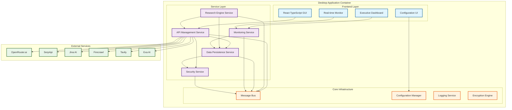

# Free Deep Research System 🔬

[](https://github.com/usemanusai/free-deep-research/actions)
[](https://github.com/usemanusai/free-deep-research/releases)
[](https://opensource.org/licenses/MIT)
[](https://github.com/usemanusai/free-deep-research/releases)

**Enterprise-grade deep research system operating entirely on free service tiers**

A powerful desktop application that orchestrates multiple AI services and research methodologies to deliver comprehensive research workflows while maintaining zero operational costs through intelligent free-tier management.

---

## Table of Contents

- [Project Description](#project-description)
- [Architecture Overview](#architecture-overview)
- [Installation Instructions](#installation-instructions)
- [Usage Examples](#usage-examples)
- [API Documentation](#api-documentation)
- [Configuration](#configuration)
- [Contributing Guidelines](#contributing-guidelines)
- [License Information](#license-information)
- [Changelog/Roadmap](#changelogroadmap)
- [Support/Contact](#supportcontact)

---

## Project Description

The Free Deep Research System is a sophisticated desktop application built with Tauri (Rust + React) that revolutionizes how researchers, analysts, and organizations conduct comprehensive research while maintaining zero operational costs. By intelligently orchestrating multiple free-tier AI services, the system delivers enterprise-grade research capabilities without the traditional financial barriers.

### Key Features

🚀 **Zero-Cost Operation**: Operates entirely on free service tiers through intelligent API management and rate limiting
🔒 **Enterprise Security**: AES-256 encryption, secure key management, and comprehensive audit logging
🤖 **Multi-AI Orchestration**: Seamlessly integrates OpenRouter, SerpAPI, Jina AI, Firecrawl, Tavily, and Exa
📊 **Real-Time Monitoring**: Live system health monitoring, usage analytics, and performance metrics
🔄 **Automated Workflows**: Pre-built research methodologies with customizable parameters
💾 **Encrypted Storage**: Local encrypted database with automated backup systems
🎯 **BMAD Methodology**: Built using the proven BMAD (Business Model Analysis & Design) framework

### Value Proposition

Traditional research tools require expensive subscriptions and complex integrations. Our system eliminates these barriers by:

- **Maximizing Free Tiers**: Intelligent rotation and management of multiple free API keys
- **Preventing Rate Limits**: Predictive algorithms that prevent service interruptions
- **Ensuring Reliability**: Automatic failover between service providers
- **Maintaining Security**: Enterprise-grade encryption and audit trails
- **Providing Insights**: Comprehensive analytics and reporting capabilities

---

## Architecture Overview

The system follows a modular microservices architecture within a desktop application container, ensuring scalability, maintainability, and security.



### Component Responsibilities

- **API Management Service**: Handles all external API interactions, implements intelligent key rotation, rate limiting, and predictive limit prevention
- **Research Engine Service**: Orchestrates research workflows, integrates multiple methodologies, manages research queues, and processes results compilation
- **Data Persistence Service**: Manages encrypted local storage, implements automatic backup systems, handles configuration management, and provides data integrity verification
- **Monitoring Service**: Provides real-time system monitoring, collects performance metrics, generates analytics reports, and manages alert systems
- **Security Service**: Implements AES-256 encryption, manages API key security, provides audit logging, and handles authentication/authorization

---

## Installation Instructions

### Prerequisites

Before installing the Free Deep Research System, ensure your system meets the following requirements:

- **Operating System**: Windows 10+, macOS 10.15+, or Linux (Ubuntu 18.04+)
- **Memory**: Minimum 4GB RAM (8GB recommended)
- **Storage**: 2GB available disk space
- **Network**: Stable internet connection for API services

### Platform-Specific Installation

#### Windows Installation

1. **Download the installer**:
   ```bash
   # Download the latest Windows installer
   curl -L https://github.com/usemanusai/free-deep-research/releases/latest/download/free-deep-research-setup.exe -o setup.exe
   ```

2. **Run the installer**:
   - Double-click `setup.exe`
   - Follow the installation wizard
   - Choose installation directory (default: `C:\Program Files\Free Deep Research`)

3. **Launch the application**:
   - Use the desktop shortcut or Start Menu entry
   - The application will initialize on first launch

#### macOS Installation

1. **Download the DMG file**:
   ```bash
   # Download the latest macOS installer
   curl -L https://github.com/usemanusai/free-deep-research/releases/latest/download/free-deep-research.dmg -o free-deep-research.dmg
   ```

2. **Install the application**:
   - Open the downloaded DMG file
   - Drag the application to your Applications folder
   - Right-click and select "Open" on first launch (security requirement)

3. **Grant permissions**:
   - Allow network access when prompted
   - Grant file system access for data storage

#### Linux Installation

1. **Download the AppImage**:
   ```bash
   # Download the latest Linux AppImage
   wget https://github.com/usemanusai/free-deep-research/releases/latest/download/free-deep-research.AppImage
   ```

2. **Make executable and run**:
   ```bash
   # Make the AppImage executable
   chmod +x free-deep-research.AppImage

   # Run the application
   ./free-deep-research.AppImage
   ```

3. **Optional: Install system-wide**:
   ```bash
   # Move to system applications
   sudo mv free-deep-research.AppImage /usr/local/bin/free-deep-research

   # Create desktop entry
   cat > ~/.local/share/applications/free-deep-research.desktop << EOF
   [Desktop Entry]
   Name=Free Deep Research System
   Exec=/usr/local/bin/free-deep-research
   Icon=free-deep-research
   Type=Application
   Categories=Office;Research;
   EOF
   ```

### Development Installation

For developers who want to build from source:

1. **Clone the repository**:
   ```bash
   git clone https://github.com/usemanusai/free-deep-research.git
   cd free-deep-research/bmad-agent/free-deep-research
   ```

2. **Install dependencies**:
   ```bash
   # Install Rust (if not already installed)
   curl --proto '=https' --tlsv1.2 -sSf https://sh.rustup.rs | sh

   # Install Node.js dependencies
   npm install

   # Install Tauri CLI
   npm install -g @tauri-apps/cli
   ```

3. **Build and run**:
   ```bash
   # Development mode
   npm run dev

   # Production build
   npm run build
   ```

### Initial Setup

After installation, complete the initial setup:

1. **Launch the application**
2. **Set master password** (required for encryption)
3. **Configure API keys** (see Configuration section)
4. **Run system health check**
5. **Create your first research workflow**

---

## Usage Examples

### Basic Research Workflow

Here's how to conduct your first research project:

```typescript
// 1. Initialize the research system
const researchSystem = new FreeDeepResearchSystem();
await researchSystem.initialize();

// 2. Create a new research workflow
const workflow = await researchSystem.createWorkflow({
  name: "AI Market Analysis 2024",
  query: "Current trends in artificial intelligence market growth and key players",
  methodology: "comprehensive",
  parameters: {
    depth: "deep",
    sources: ["academic", "industry", "news"],
    timeframe: "last_12_months"
  }
});

// 3. Execute the research
const results = await workflow.execute();
console.log(`Research completed: ${results.summary}`);
```

### API Key Management

```typescript
// Add a new API key
await apiManager.addKey({
  service: "openrouter",
  name: "Primary OpenRouter Key",
  key: "your-api-key-here",
  rateLimit: 1000
});

// Test API key connectivity
const testResult = await apiManager.testKey(keyId);
if (testResult.success) {
  console.log("API key is working correctly");
}

// Monitor usage
const usage = await apiManager.getUsageStats();
console.log(`Current usage: ${usage.currentUsage}/${usage.rateLimit}`);
```

### Real-Time Monitoring

```typescript
// Subscribe to system metrics
const monitor = researchSystem.getMonitor();
monitor.subscribe('metrics', (metrics) => {
  console.log(`CPU: ${metrics.cpu}%, Memory: ${metrics.memory}%`);
  console.log(`Active APIs: ${metrics.activeApis}`);
  console.log(`Research Queue: ${metrics.queueLength}`);
});

// Get system health status
const health = await monitor.getHealthStatus();
if (health.status === 'healthy') {
  console.log("All systems operational");
}
```

### Advanced Configuration

```typescript
// Configure research parameters
await configManager.updateSystemConfig({
  maxConcurrentResearch: 3,
  rateLimitBuffer: 15, // 15% buffer
  autoBackupInterval: 1800, // 30 minutes
  encryptionEnabled: true
});

// Set up custom research methodology
await researchEngine.registerMethodology({
  name: "custom-analysis",
  steps: [
    { type: "web-search", provider: "serpapi" },
    { type: "content-extraction", provider: "firecrawl" },
    { type: "ai-analysis", provider: "openrouter" },
    { type: "synthesis", provider: "openrouter" }
  ]
});
```

### Common Use Cases

#### 1. Market Research
```bash
# CLI example for market research
free-deep-research research create \
  --name "SaaS Market Analysis" \
  --query "Software as a Service market trends 2024" \
  --methodology "market-analysis" \
  --output "./reports/saas-analysis.md"
```

#### 2. Competitive Analysis
```bash
# Analyze competitors
free-deep-research research create \
  --name "Competitor Analysis" \
  --query "AI research tools competitive landscape" \
  --methodology "competitive-analysis" \
  --depth "comprehensive"
```

#### 3. Academic Research
```bash
# Academic paper research
free-deep-research research create \
  --name "ML Ethics Research" \
  --query "Machine learning ethics frameworks" \
  --methodology "academic" \
  --sources "arxiv,scholar,pubmed"
```

### Expected Outputs

Research results are delivered in multiple formats:

- **Executive Summary**: High-level findings and recommendations
- **Detailed Report**: Comprehensive analysis with sources
- **Data Visualizations**: Charts and graphs where applicable
- **Source Bibliography**: Complete reference list with links
- **Raw Data**: Structured data for further analysis

---

## API Documentation

### Core Services API

#### Research Engine Service

```rust
// Execute research workflow
impl ResearchEngine {
    // Execute research workflow
    pub async fn execute_research(&self, request: ResearchRequest) -> AppResult<ResearchResult>;

    // Get workflow status
    pub async fn get_workflow_status(&self, workflow_id: Uuid) -> AppResult<WorkflowStatus>;

    // Cancel running workflow
    pub async fn cancel_workflow(&self, workflow_id: Uuid) -> AppResult<()>;

    // List available methodologies
    pub async fn list_methodologies(&self) -> AppResult<Vec<ResearchMethodology>>;
}
```

#### API Management Service

```rust
impl ApiManagerService {
    // Get all API keys
    pub async fn get_all_keys(&self) -> AppResult<Vec<ApiKey>>;

    // Add new API key
    pub async fn add_key(&mut self, request: CreateApiKeyRequest) -> AppResult<ApiKey>;

    // Update existing API key
    pub async fn update_key(&mut self, key_id: Uuid, request: UpdateApiKeyRequest) -> AppResult<ApiKey>;

    // Delete API key
    pub async fn delete_key(&mut self, key_id: Uuid) -> AppResult<()>;

    // Test API key connection
    pub async fn test_key(&self, key_id: Uuid) -> AppResult<ApiKeyTestResult>;
}
```

#### Security Service

```rust
impl SecurityService {
    // Encrypt sensitive data
    pub async fn encrypt(&self, data: &[u8]) -> AppResult<Vec<u8>>;

    // Decrypt sensitive data
    pub async fn decrypt(&self, encrypted_data: &[u8]) -> AppResult<Vec<u8>>;

    // Authenticate with master password
    pub async fn authenticate(&self, password: &str) -> AppResult<bool>;

    // Store secret in key vault
    pub async fn store_secret(&self, key: &str, value: &str) -> AppResult<()>;
}
```

### Data Models

#### API Key Model

```typescript
interface ApiKey {
  id: string;
  service: ServiceProvider;
  name: string;
  key: string;  // Encrypted in storage
  status: ApiKeyStatus;
  rateLimit: number;
  currentUsage: number;
  lastUsed?: Date;
  createdAt: Date;
  updatedAt: Date;
  metadata: Record<string, any>;
}

enum ServiceProvider {
  OPENROUTER = "openrouter",
  SERPAPI = "serpapi",
  JINA = "jina",
  FIRECRAWL = "firecrawl",
  TAVILY = "tavily",
  EXA = "exa"
}

enum ApiKeyStatus {
  ACTIVE = "active",
  INACTIVE = "inactive",
  RATE_LIMITED = "rate_limited",
  ERROR = "error"
}
```

#### Research Workflow Model

```typescript
interface ResearchWorkflow {
  id: string;
  name: string;
  query: string;
  status: WorkflowStatus;
  methodology: string;
  parameters: WorkflowParameters;
  results?: ResearchResult;
  createdAt: Date;
  updatedAt: Date;
  completedAt?: Date;
}

interface ResearchResult {
  summary: string;
  detailedFindings: string;
  sources: Source[];
  confidence: number;
  metadata: Record<string, any>;
}
```

---

## Configuration

### Environment Variables

The system uses environment variables for sensitive configuration:

```bash
# API Service Configuration
OPENROUTER_API_KEY=your_openrouter_key_here
SERPAPI_KEY=your_serpapi_key_here
JINA_API_KEY=your_jina_key_here
FIRECRAWL_API_KEY=your_firecrawl_key_here
TAVILY_API_KEY=your_tavily_key_here
EXA_API_KEY=your_exa_key_here

# System Configuration
FDRS_DATA_DIR=/path/to/data/directory
FDRS_LOG_LEVEL=info
FDRS_MAX_CONCURRENT_RESEARCH=5
FDRS_BACKUP_INTERVAL=1800
FDRS_RATE_LIMIT_BUFFER=10

# Security Configuration
FDRS_ENCRYPTION_ENABLED=true
FDRS_SESSION_TIMEOUT=3600
FDRS_MAX_LOGIN_ATTEMPTS=5
```

### Configuration Files

#### System Configuration (`config/system.json`)

```json
{
  "system": {
    "backupInterval": 1800,
    "encryptionEnabled": true,
    "rateLimitBuffer": 10,
    "monitoringEnabled": true,
    "logLevel": "info",
    "uiTheme": "auto",
    "autoStartMonitoring": true,
    "maxConcurrentResearch": 5,
    "dataRetentionDays": 90
  },
  "api": {
    "requestTimeout": 30000,
    "retryAttempts": 3,
    "retryDelay": 1000,
    "healthCheckInterval": 300
  },
  "research": {
    "defaultMethodology": "comprehensive",
    "maxResultsPerSource": 50,
    "confidenceThreshold": 0.7,
    "enableCaching": true,
    "cacheExpiryHours": 24
  }
}
```

#### Security Configuration (`config/security.json`)

```json
{
  "encryption": {
    "algorithm": "AES_256_GCM",
    "keyDerivationIterations": 100000
  },
  "authentication": {
    "sessionTimeoutMinutes": 60,
    "maxLoginAttempts": 5,
    "requireMasterPassword": true,
    "autoLockEnabled": true,
    "autoLockTimeoutMinutes": 15
  },
  "audit": {
    "logRetentionDays": 365,
    "enableDetailedLogging": true,
    "encryptAuditLogs": true
  }
}
```

### API Service Configuration

Each API service can be configured individually:

```json
{
  "services": {
    "openrouter": {
      "baseUrl": "https://openrouter.ai/api/v1",
      "rateLimit": 1000,
      "resetPeriod": "daily",
      "priority": 1,
      "enabled": true
    },
    "serpapi": {
      "baseUrl": "https://serpapi.com",
      "rateLimit": 100,
      "resetPeriod": "monthly",
      "priority": 2,
      "enabled": true
    },
    "jina": {
      "baseUrl": "https://api.jina.ai",
      "rateLimit": 1000,
      "resetPeriod": "daily",
      "priority": 3,
      "enabled": true
    }
  }
}
```

### Customization Options

#### Research Methodologies

Create custom research methodologies by defining workflow steps:

```json
{
  "methodologies": {
    "custom-market-analysis": {
      "name": "Custom Market Analysis",
      "description": "Tailored market research methodology",
      "steps": [
        {
          "type": "web-search",
          "provider": "serpapi",
          "parameters": {
            "num_results": 20,
            "time_range": "last_year"
          }
        },
        {
          "type": "content-extraction",
          "provider": "firecrawl",
          "parameters": {
            "extract_depth": "advanced"
          }
        },
        {
          "type": "ai-analysis",
          "provider": "openrouter",
          "parameters": {
            "model": "anthropic/claude-3-sonnet",
            "temperature": 0.3
          }
        }
      ]
    }
  }
}
```

#### UI Themes

Customize the application appearance:

```json
{
  "themes": {
    "custom-dark": {
      "name": "Custom Dark Theme",
      "colors": {
        "primary": "#3b82f6",
        "secondary": "#64748b",
        "background": "#0f172a",
        "surface": "#1e293b",
        "text": "#f8fafc"
      }
    }
  }
}
```

---

## Contributing Guidelines

We welcome contributions from the community! Here's how to get involved:

### Development Setup

1. **Fork the repository**:
   ```bash
   git clone https://github.com/your-username/free-deep-research.git
   cd free-deep-research/bmad-agent/free-deep-research
   ```

2. **Install development dependencies**:
   ```bash
   # Install Rust toolchain
   curl --proto '=https' --tlsv1.2 -sSf https://sh.rustup.rs | sh

   # Install Node.js dependencies
   npm install

   # Install development tools
   npm install -g @tauri-apps/cli
   cargo install cargo-watch
   ```

3. **Set up development environment**:
   ```bash
   # Copy environment template
   cp .env.example .env

   # Edit with your API keys
   nano .env
   ```

### Coding Standards

#### Rust Backend

```bash
# Format code
cargo fmt

# Check for common mistakes
cargo clippy

# Run both with strict settings
cargo fmt -- --check
cargo clippy -- -D warnings
```

**Best Practices:**
- Use `#[derive(Debug)]` for all structs
- Implement proper error handling with custom error types
- Write comprehensive documentation for public APIs
- Use meaningful variable and function names
- Prefer explicit types over type inference in public APIs
- Handle all `Result` types explicitly

#### TypeScript/React Frontend

```bash
# Lint code
npm run lint

# Format code
npm run format

# Type checking
npm run type-check

# Run all quality checks
npm run validate
```

**Best Practices:**
- Use TypeScript strict mode
- Implement proper error boundaries
- Write unit tests for all components
- Use semantic HTML and ARIA attributes
- Follow React hooks best practices
- Implement proper loading and error states

### Testing Guidelines

#### Test Coverage Requirements

- **Minimum Coverage**: 80% for new code
- **Target Coverage**: 90% for critical components
- **Required Tests**: All public APIs must have tests

#### Running Tests

```bash
# Frontend tests
npm test                    # Unit tests
npm run test:e2e           # End-to-end tests
npm run test:coverage      # Coverage report

# Backend tests
cargo test                 # Unit and integration tests
cargo test --release      # Performance tests

# Full test suite
npm run test:all          # All tests
```

### Pull Request Process

#### Before Submitting

1. **Ensure all tests pass**:
   ```bash
   npm run test:all
   cargo test
   ```

2. **Run quality checks**:
   ```bash
   npm run validate
   cargo clippy
   cargo fmt -- --check
   ```

3. **Update documentation**:
   - Update README if needed
   - Add/update inline documentation
   - Update changelog

#### PR Requirements

- **Clear Description**: Explain what changes were made and why
- **Issue Reference**: Link to related issues
- **Test Coverage**: Include tests for new functionality
- **Documentation**: Update relevant documentation
- **Breaking Changes**: Clearly mark any breaking changes

#### Review Process

1. **Automated Checks**: All CI checks must pass
2. **Code Review**: At least one maintainer review required
3. **Testing**: Manual testing for UI changes
4. **Documentation Review**: Ensure documentation is accurate

---

## License Information

This project is licensed under the MIT License - see the [LICENSE](LICENSE) file for details.

### MIT License Summary

```
MIT License

Copyright (c) 2024 BMAD AI Agent Team

Permission is hereby granted, free of charge, to any person obtaining a copy
of this software and associated documentation files (the "Software"), to deal
in the Software without restriction, including without limitation the rights
to use, copy, modify, merge, publish, distribute, sublicense, and/or sell
copies of the Software, and to permit persons to whom the Software is
furnished to do so, subject to the following conditions:

The above copyright notice and this permission notice shall be included in all
copies or substantial portions of the Software.

THE SOFTWARE IS PROVIDED "AS IS", WITHOUT WARRANTY OF ANY KIND, EXPRESS OR
IMPLIED, INCLUDING BUT NOT LIMITED TO THE WARRANTIES OF MERCHANTABILITY,
FITNESS FOR A PARTICULAR PURPOSE AND NONINFRINGEMENT. IN NO EVENT SHALL THE
AUTHORS OR COPYRIGHT HOLDERS BE LIABLE FOR ANY CLAIM, DAMAGES OR OTHER
LIABILITY, WHETHER IN AN ACTION OF CONTRACT, TORT OR OTHERWISE, ARISING FROM,
OUT OF OR IN CONNECTION WITH THE SOFTWARE OR THE USE OR OTHER DEALINGS IN THE
SOFTWARE.
```

### Third-Party Licenses

This project includes several third-party libraries and services:

- **Tauri**: MIT License
- **React**: MIT License
- **Rust**: MIT/Apache-2.0 License
- **TypeScript**: Apache-2.0 License
- **Tailwind CSS**: MIT License

For a complete list of dependencies and their licenses, see [THIRD_PARTY_LICENSES.md](THIRD_PARTY_LICENSES.md).

---

## Changelog/Roadmap

### Recent Updates

#### Version 1.0.0 (Current)
- ✅ **Core Architecture**: Complete modular service architecture
- ✅ **Security Implementation**: AES-256 encryption and secure key management
- ✅ **API Management**: Multi-service integration with rate limiting
- ✅ **Data Persistence**: Encrypted local storage with backup systems
- ✅ **User Interface**: React-based desktop application
- ✅ **Documentation**: Comprehensive documentation and examples

#### Version 0.9.0 (Previous)
- ✅ **BMAD Methodology Integration**: Full BMAD framework implementation
- ✅ **Research Engine**: Basic research workflow orchestration
- ✅ **Monitoring System**: Real-time system health monitoring
- ✅ **Configuration Management**: Flexible configuration system

### Planned Features

#### Version 1.1.0 (Next Release - Q1 2025)
- 🔄 **Enhanced AI Models**: Support for latest OpenRouter models
- 🔄 **Advanced Analytics**: Comprehensive research analytics dashboard
- 🔄 **Export Formats**: PDF, Word, and PowerPoint export options
- 🔄 **Collaboration Tools**: Team sharing and collaboration features
- 🔄 **Mobile Companion**: Mobile app for monitoring and basic operations

#### Version 1.2.0 (Q2 2025)
- 📋 **Custom Integrations**: Plugin system for custom API integrations
- 📋 **Advanced Workflows**: Visual workflow builder
- 📋 **Machine Learning**: Predictive analytics for research optimization
- 📋 **Cloud Sync**: Optional cloud synchronization for multi-device access
- 📋 **Enterprise Features**: Advanced user management and permissions

#### Version 2.0.0 (Q3 2025)
- 📋 **Distributed Architecture**: Multi-node deployment support
- 📋 **Advanced AI Orchestration**: Multi-agent AI collaboration
- 📋 **Real-time Collaboration**: Live collaborative research sessions
- 📋 **Advanced Security**: Zero-knowledge architecture option
- 📋 **API Marketplace**: Community-driven API service marketplace

### Long-term Vision

- **Global Research Network**: Decentralized research collaboration platform
- **AI Research Assistant**: Advanced AI-powered research companion
- **Open Research Standards**: Industry-standard research data formats
- **Educational Integration**: University and research institution partnerships

---

## Support/Contact

### Getting Help

#### 📚 Documentation
- **User Guide**: [docs/user-guide.md](docs/user-guide.md)
- **API Reference**: [docs/api-reference.md](docs/api-reference.md)
- **Troubleshooting**: [docs/troubleshooting.md](docs/troubleshooting.md)
- **FAQ**: [docs/faq.md](docs/faq.md)

#### 💬 Community Support
- **GitHub Discussions**: [Ask questions and share ideas](https://github.com/usemanusai/free-deep-research/discussions)
- **Discord Server**: [Join our community chat](https://discord.gg/free-deep-research)
- **Reddit Community**: [r/FreeDeepResearch](https://reddit.com/r/FreeDeepResearch)

#### 🐛 Bug Reports
- **GitHub Issues**: [Report bugs and request features](https://github.com/usemanusai/free-deep-research/issues)
- **Security Issues**: [security@usemanusai.com](mailto:security@usemanusai.com)

#### 📧 Direct Contact
- **General Inquiries**: [hello@usemanusai.com](mailto:hello@usemanusai.com)
- **Business Partnerships**: [partnerships@usemanusai.com](mailto:partnerships@usemanusai.com)
- **Media Inquiries**: [media@usemanusai.com](mailto:media@usemanusai.com)

### Contributing

We welcome contributions! Please see our [Contributing Guidelines](#contributing-guidelines) for details on:
- Code contributions
- Documentation improvements
- Bug reports and feature requests
- Community support

### Acknowledgments

Special thanks to:
- **BMAD Methodology Team** for the foundational framework
- **Open Source Community** for the amazing tools and libraries
- **Beta Testers** for their valuable feedback and testing
- **Contributors** who have helped improve the project

---

## Project Statistics


**Built with ❤️ by the BMAD AI Agent Team**

*Empowering researchers worldwide with free, enterprise-grade research tools.*