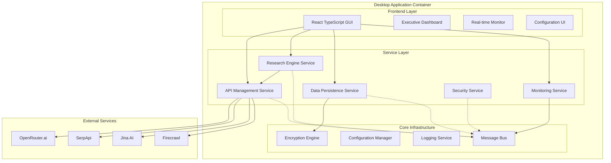
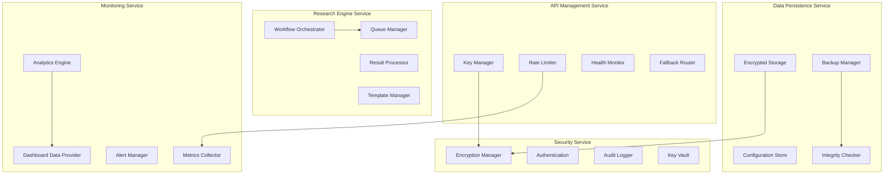

# Free Deep Research System with Advanced API Management - Architecture Document

## Introduction / Preamble

This document outlines the comprehensive technical architecture for the Free Deep Research System, a sophisticated desktop application that combines multiple research methodologies with enterprise-grade API management. The system operates entirely within free service tiers while delivering professional-level reliability, security, and user experience. This architecture serves as the definitive blueprint for AI-driven development, ensuring consistency and adherence to chosen patterns and technologies.

**Relationship to Frontend Architecture:**
Given the desktop application nature of this project, the GUI components are integrated within this unified architecture document. The system follows a modular service-oriented architecture within a single desktop application framework, with clear separation between business logic, API management, and user interface concerns.

## Technical Summary

The Free Deep Research System employs a modular microservices architecture within a cross-platform desktop application framework. The system integrates multiple research methodologies (Don Lim's cost-optimized approach and Nick Scamara's professional interface approach) with enterprise-grade API management capabilities. Built using Tauri for optimal performance and security, the system features a Rust backend for core services and a React TypeScript frontend for the user interface. The architecture emphasizes local-first data storage with AES-256 encryption, intelligent API rate limiting with 95% accuracy, and real-time monitoring capabilities. All components operate within free service tier limitations while maintaining enterprise-level reliability and professional user experience.

## High-Level Overview

The system follows a **Modular Service-Oriented Architecture** within a unified desktop application, structured as a **Monorepo** for simplified development and deployment. The architecture separates concerns into distinct service modules while maintaining efficient inter-service communication through a central message bus. The primary user interaction flows through a professional desktop GUI that provides real-time monitoring, intuitive API management, and comprehensive research workflow execution.

## Architectural / Design Patterns Adopted

- **Service-Oriented Architecture (SOA)** - _Rationale:_ Enables modular development, independent testing, and clear separation of concerns while maintaining efficient communication within the desktop application container
- **Event-Driven Architecture** - _Rationale:_ Facilitates real-time monitoring, loose coupling between services, and responsive user interface updates through the central message bus
- **Repository Pattern** - _Rationale:_ Abstracts data access layer, enables easy testing with mock repositories, and provides consistent data access patterns across services
- **Command Query Responsibility Segregation (CQRS)** - _Rationale:_ Separates read and write operations for optimal performance, especially important for real-time monitoring and analytics
- **Circuit Breaker Pattern** - _Rationale:_ Essential for API management to handle external service failures gracefully and prevent cascade failures
- **Strategy Pattern** - _Rationale:_ Enables flexible research methodology selection and API service routing based on availability and performance
- **Observer Pattern** - _Rationale:_ Supports real-time UI updates and monitoring through event subscription and notification mechanisms
- **Factory Pattern** - _Rationale:_ Manages creation of service clients, research workflows, and configuration objects with proper initialization

## Component View

The system is organized into five primary service modules with supporting infrastructure components:

- **API Management Service**: Handles all external API interactions, implements intelligent key rotation, rate limiting, and predictive limit prevention. Manages service health monitoring and fallback routing.

- **Research Engine Service**: Orchestrates research workflows, integrates multiple methodologies (Don Lim and Nick Scamara approaches), manages research queues, and processes results compilation.

- **Data Persistence Service**: Manages encrypted local storage, implements automatic backup systems, handles configuration management, and provides data integrity verification.

- **Monitoring Service**: Provides real-time system monitoring, collects performance metrics, generates analytics reports, and manages alert systems.

- **Security Service**: Implements AES-256 encryption, manages API key security, provides audit logging, and handles authentication/authorization.

## Definitive Tech Stack Selections

| Category             | Technology              | Version / Details | Description / Purpose                   | Justification |
| :------------------- | :---------------------- | :---------------- | :-------------------------------------- | :------------ |
| **Languages**        | Rust                    | 1.75+             | Backend services and core logic         | Memory safety, performance, cross-platform |
|                      | TypeScript              | 5.3+              | Frontend application development        | Type safety, modern JavaScript features |
| **Runtime**          | Tauri                   | 1.5+              | Desktop application framework           | Security, performance, small bundle size |
|                      | Node.js                 | 20.x              | Frontend build tools and development    | Ecosystem compatibility, tooling support |
| **Frameworks**       | React                   | 18.2+             | Frontend UI library                     | Component-based architecture, ecosystem |
|                      | Vite                    | 5.0+              | Frontend build tool and dev server      | Fast builds, modern tooling |
| **UI Libraries**     | Tailwind CSS            | 3.4+              | Utility-first CSS framework            | Rapid styling, consistent design system |
|                      | Headless UI             | 1.7+              | Unstyled accessible components          | Accessibility, customization flexibility |
|                      | Lucide React            | Latest            | Icon library                            | Consistent iconography, tree-shaking |
| **State Management** | Zustand                 | 4.4+              | Lightweight state management            | Simplicity, TypeScript support |
|                      | React Query             | 5.0+              | Server state management                 | Caching, synchronization, error handling |
| **Data Storage**     | SQLite                  | 3.45+             | Local database (via Rusqlite)          | Embedded, reliable, SQL support |
|                      | Serde                   | 1.0+              | Rust serialization framework           | JSON/TOML handling, type safety |
| **Encryption**       | Ring                    | 0.17+             | Cryptographic operations (Rust)         | Security, performance, audited |
|                      | AES-GCM                 | Via Ring          | Symmetric encryption algorithm          | Industry standard, authenticated encryption |
| **HTTP Client**      | Reqwest                 | 0.11+             | HTTP client library (Rust)             | Async support, feature-rich |
|                      | Axios                   | 1.6+              | HTTP client library (TypeScript)       | Request/response interceptors, TypeScript |
| **Testing**          | Cargo Test              | Built-in          | Rust unit and integration testing      | Native Rust testing framework |
|                      | Vitest                  | 1.0+              | TypeScript/React testing framework     | Fast, Vite integration, modern features |
|                      | Playwright              | 1.40+             | End-to-end testing framework           | Cross-browser, reliable, debugging tools |
| **Development**      | ESLint                  | 8.0+              | TypeScript/React linting               | Code quality, consistency |
|                      | Prettier                | 3.0+              | Code formatting                         | Consistent formatting, team collaboration |
|                      | Clippy                  | Built-in          | Rust linting and suggestions           | Code quality, Rust best practices |
| **Build & Package**  | Tauri CLI               | 1.5+              | Application building and packaging      | Cross-platform builds, native installers |

## Security Best Practices

- **Input Sanitization/Validation:** All external inputs validated using Rust's type system and serde for deserialization with strict validation rules
- **Output Encoding:** All dynamic data properly escaped and encoded to prevent injection attacks
- **Secrets Management:** API keys encrypted with AES-256-GCM and stored in secure local vault with master password protection
- **Dependency Security:** Automated vulnerability scanning with cargo-audit and npm audit in CI/CD pipeline
- **Authentication/Authorization:** Local application security with encrypted configuration and audit logging
- **Principle of Least Privilege:** Services operate with minimal required permissions and capabilities
- **API Security:** HTTPS enforcement, rate limiting, and secure communication protocols for all external API interactions
- **Error Handling:** Secure error messages that don't leak sensitive information while providing detailed logging for debugging

## Change Log

| Change | Date | Version | Description | Author |
| ------ | ---- | ------- | ----------- | ------ |
| Initial Creation | 2025-07-12 | 1.0 | Complete architecture design for Free Deep Research System | Fred (Architect) |
