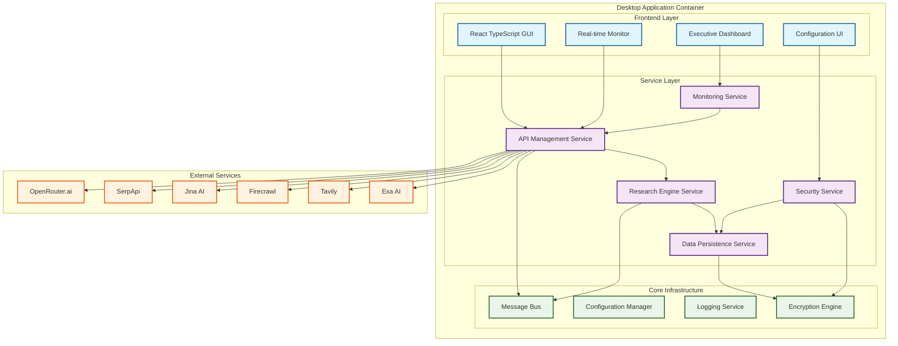
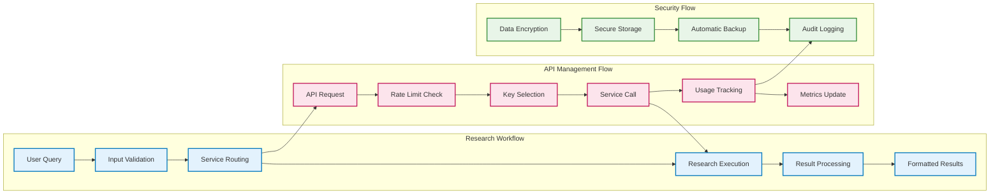

# Free Deep Research System

[](https://opensource.org/licenses/MIT)
[](https://www.rust-lang.org)
[](https://reactjs.org)
[](https://tauri.app)
[](https://www.typescriptlang.org)

> Enterprise-grade deep research system operating entirely on free service tiers while delivering professional-level reliability, security, and research quality.

---

## Table of Contents

- [Overview](#-overview)
- [Key Features](#-key-features)
- [Architecture](#-architecture)
- [Installation](#-installation)
- [Usage](#-usage)
- [API Documentation](#-api-documentation)
- [Configuration](#-configuration)
- [Development](#-development)
- [Contributing](#-contributing)
- [License](#-license)
- [Support](#-support)

---

## 🎯 Overview

The Free Deep Research System addresses the significant gap between expensive commercial research solutions ($200+ monthly) and basic free alternatives lacking enterprise features. By integrating proven research methodologies with advanced API management, we deliver a unified platform that democratizes access to sophisticated research capabilities.

This desktop application combines **Don Lim's cost-optimized methodology** (OpenRouter + SerpApi + Jina AI) with **Nick Scamara's professional interface approach** (Firecrawl + AI SDK) in a secure, cross-platform environment that operates entirely within free service tiers.

### 🎯 Key Benefits

- **Zero Operational Costs**: 100% free tier utilization with intelligent rate limiting
- **Enterprise Security**: AES-256 encryption, audit logging, and automatic backups
- **Professional Interface**: Executive dashboard with real-time monitoring and analytics
- **Cross-Platform**: Native desktop application for Windows, macOS, and Linux
- **Extensible Architecture**: Modular design supporting future service integrations

---

## ✨ Key Features

### 🔄 Unified Research Engine
- Combines multiple proven research methodologies in a single platform
- Intelligent fallback routing between services for maximum reliability
- Customizable research workflows with template support
- Real-time progress tracking and result processing

### 🔑 Enterprise API Management
- **Bulk Import**: CSV/JSON import with validation and error reporting
- **Intelligent Rotation**: Service-specific key rotation with optimal timing
- **Rate Limiting**: Granular tracking with 95% accuracy in limit prevention
- **Predictive Prevention**: Smart queue management with configurable buffer zones
- **Automatic Recovery**: Scheduled reactivation after service-specific reset periods

### 💻 Professional Desktop GUI
- Executive dashboard with comprehensive system overview
- Real-time monitoring with sub-second status updates
- Intuitive configuration management interface
- Advanced analytics with historical tracking and optimization recommendations

### 🛡️ Advanced Security
- AES-256 encryption for all API keys and sensitive data
- Comprehensive audit trail logging of all system actions
- Automatic incremental backups every 30 seconds
- Secure local-first data storage with SQLite

### 📊 Real-Time Analytics
- Live usage monitoring across all integrated services
- Performance metrics with trend analysis
- Cost optimization recommendations
- Emergency protocols with automatic service degradation

---

## 🏗️ Architecture

The system employs a **modular service-oriented architecture** within a unified desktop application framework, built with Tauri for optimal performance, security, and cross-platform compatibility.

### Technology Stack

| Layer | Technology | Purpose |
|-------|------------|---------|
| **Frontend** | React 18 + TypeScript | Professional user interface with type safety |
| **Styling** | Tailwind CSS + Headless UI | Rapid, consistent design system |
| **Backend** | Rust + Tauri | Core services, security, and performance |
| **Storage** | SQLite + Ring Crypto | Encrypted local data management |
| **HTTP** | Reqwest + Axios | Robust API communication |
| **State** | Zustand + TanStack Query | Efficient state management and caching |
| **Testing** | Vitest + Playwright + Cargo Test | Comprehensive testing strategy |

### System Architecture Diagram



### Data Flow Architecture



---

## 🚀 Installation

### Prerequisites

Before installing the Free Deep Research System, ensure you have the following prerequisites:

| Requirement | Version | Purpose |
|-------------|---------|---------|
| **Rust** | 1.75+ | Backend compilation and Tauri framework |
| **Node.js** | 20.x+ | Frontend development and build tools |
| **Git** | Latest | Version control and repository management |

### Platform-Specific Requirements

#### Windows
- Windows 10 version 1903+ or Windows 11
- Microsoft Visual C++ Redistributable
- WebView2 Runtime (usually pre-installed)

#### macOS
- macOS 10.15 (Catalina) or later
- Xcode Command Line Tools: `xcode-select --install`

#### Linux
- Ubuntu 18.04+, Debian 10+, or equivalent
- Required packages:
  ```bash
  sudo apt update
  sudo apt install libwebkit2gtk-4.0-dev \
    build-essential \
    curl \
    wget \
    libssl-dev \
    libgtk-3-dev \
    libayatana-appindicator3-dev \
    librsvg2-dev
  ```

### Installation Methods

#### Method 1: Development Setup (Recommended for Contributors)

```bash
# 1. Clone the repository
git clone https://github.com/usemanusai/free-deep-research.git
cd free-deep-research/bmad-agent/free-deep-research

# 2. Install Rust (if not already installed)
curl --proto '=https' --tlsv1.2 -sSf https://sh.rustup.rs | sh
source $HOME/.cargo/env

# 3. Install Tauri CLI
cargo install tauri-cli

# 4. Install frontend dependencies
npm install

# 5. Build Rust dependencies
cargo build

# 6. Start development server
npm run tauri dev
```

#### Method 2: Production Build

```bash
# Build for current platform
npm run tauri build

# The built application will be available in:
# - Windows: src-tauri/target/release/bundle/msi/
# - macOS: src-tauri/target/release/bundle/dmg/
# - Linux: src-tauri/target/release/bundle/deb/ or /appimage/
```

#### Method 3: Cross-Platform Builds

```bash
# Install cross-compilation targets
rustup target add x86_64-pc-windows-msvc
rustup target add x86_64-apple-darwin
rustup target add x86_64-unknown-linux-gnu

# Build for specific platforms
npm run build:windows    # Windows MSI installer
npm run build:macos      # macOS DMG package
npm run build:linux      # Linux DEB/AppImage
```

### Verification

After installation, verify the setup:

```bash
# Check Rust installation
rustc --version
cargo --version

# Check Node.js installation
node --version
npm --version

# Verify Tauri CLI
cargo tauri --version

# Run tests
npm test
cargo test
```

---

## 📖 Usage

### First-Time Setup

1. **Launch the Application**
   ```bash
   npm run tauri dev  # Development mode
   # OR
   ./target/release/free-deep-research-system  # Production build
   ```

2. **Configure API Keys**
   - Navigate to the **API Management** section
   - Import your free-tier API keys via CSV/JSON or add manually
   - Supported services: OpenRouter, SerpApi, Jina AI, Firecrawl, Tavily, Exa AI

3. **Set Security Preferences**
   - Configure master password for encryption
   - Set backup preferences and retention policies
   - Review audit logging settings

### Basic Research Workflow

#### Quick Research

```typescript
// Example: Basic research query
const researchQuery = {
  query: "Latest developments in AI safety research",
  methodology: "comprehensive",
  maxIterations: 5,
  outputFormat: "markdown"
};

// The system will automatically:
// 1. Route through available services
// 2. Manage rate limits intelligently
// 3. Aggregate and process results
// 4. Return formatted research output
```

#### Advanced Research Configuration

```typescript
// Example: Custom research workflow
const advancedWorkflow = {
  name: "Market Analysis Research",
  query: "Electric vehicle market trends 2024",
  parameters: {
    methodology: "multi_source",
    sources: ["web_search", "academic_papers", "news"],
    depth: "deep",
    timeRange: "last_6_months",
    regions: ["north_america", "europe", "asia"],
    outputFormat: "structured_report"
  },
  fallbackOptions: {
    enableServiceFallback: true,
    maxRetries: 3,
    timeoutSeconds: 300
  }
};
```

### API Management Features

#### Bulk Import API Keys

```bash
# CSV format example (api_keys.csv)
service,name,key,rate_limit,notes
openrouter,Primary Key,sk-or-...,200,Main research key
serpapi,Search Key,abc123...,100,Web search queries
jina,Content Key,jina_...,1000,Content processing
```

#### Monitor Usage in Real-Time

The dashboard provides:
- **Live Usage Meters**: Current usage vs. limits for each service
- **Rate Limit Predictions**: Estimated time until limit reset
- **Service Health**: Real-time status of all integrated services
- **Performance Metrics**: Response times and success rates

### Configuration Management

#### Environment Variables

```bash
# Optional: Set default configuration
export FDRS_CONFIG_PATH="/path/to/config"
export FDRS_LOG_LEVEL="info"
export FDRS_BACKUP_INTERVAL="30"  # seconds
export FDRS_MAX_CONCURRENT_REQUESTS="5"
```

#### Configuration File (config.toml)

```toml
[application]
name = "Free Deep Research System"
version = "1.0.0"
auto_start = true

[security]
encryption_algorithm = "AES256_GCM"
master_password_required = true
session_timeout_minutes = 60
auto_lock_enabled = true

[api_management]
default_rate_limit_buffer = 0.1  # 10% buffer
key_rotation_enabled = true
predictive_limiting = true
fallback_routing = true

[research]
default_methodology = "comprehensive"
max_concurrent_workflows = 3
result_caching_enabled = true
cache_retention_hours = 24

[monitoring]
metrics_collection = true
real_time_updates = true
performance_tracking = true
usage_analytics = true

[backup]
auto_backup_enabled = true
backup_interval_seconds = 30
retention_days = 30
compression_enabled = true
```

---

## 📚 API Documentation

### Core Services API

#### API Management Service

```rust
// Rust API (Backend)
use crate::services::api_manager::ApiManager;

impl ApiManager {
    // Add new API key
    pub async fn add_key(&mut self, request: CreateApiKeyRequest) -> AppResult<ApiKey>;

    // Update existing key
    pub async fn update_key(&mut self, id: Uuid, request: UpdateApiKeyRequest) -> AppResult<()>;

    // Delete API key
    pub async fn delete_key(&mut self, id: Uuid) -> AppResult<()>;

    // List all keys with filtering
    pub async fn list_keys(&self) -> AppResult<Vec<ApiKey>>;

    // Get key by ID
    pub async fn get_key(&self, id: Uuid) -> AppResult<ApiKey>;

    // Check rate limits
    pub async fn check_rate_limits(&self, service: ServiceProvider) -> AppResult<RateLimitStatus>;
}
```

```typescript
// TypeScript API (Frontend)
interface ApiManagementService {
  // API Key Management
  addApiKey(request: CreateApiKeyRequest): Promise<ApiKey>;
  updateApiKey(id: string, request: UpdateApiKeyRequest): Promise<void>;
  deleteApiKey(id: string): Promise<void>;
  listApiKeys(): Promise<ApiKey[]>;
  getApiKey(id: string): Promise<ApiKey>;

  // Rate Limiting
  checkRateLimits(service: ServiceProvider): Promise<RateLimitStatus>;
  getRateLimitHistory(service: ServiceProvider, timeRange: TimeRange): Promise<RateLimitHistory[]>;

  // Bulk Operations
  importApiKeys(file: File): Promise<ImportResult>;
  exportApiKeys(): Promise<Blob>;
}
```

#### Research Engine Service

```rust
// Research workflow execution
impl ResearchEngine {
    // Execute research workflow
    pub async fn execute_research(&self, request: ResearchRequest) -> AppResult<ResearchResult>;

    // Get workflow status
    pub async fn get_workflow_status(&self, workflow_id: Uuid) -> AppResult<WorkflowStatus>;

    // Cancel running workflow
    pub async fn cancel_workflow(&self, workflow_id: Uuid) -> AppResult<()>;

    // List available methodologies
    pub async fn list_methodologies(&self) -> AppResult<Vec<ResearchMethodology>>;
}
```

```typescript
// Frontend research interface
interface ResearchService {
  // Workflow Management
  executeResearch(request: ResearchRequest): Promise<ResearchResult>;
  getWorkflowStatus(workflowId: string): Promise<WorkflowStatus>;
  cancelWorkflow(workflowId: string): Promise<void>;

  // Templates and Methodologies
  listMethodologies(): Promise<ResearchMethodology[]>;
  getMethodology(id: string): Promise<ResearchMethodology>;
  saveCustomMethodology(methodology: ResearchMethodology): Promise<void>;

  // Results Management
  getResearchHistory(): Promise<ResearchResult[]>;
  exportResults(format: ExportFormat): Promise<Blob>;
}
```

### Data Models

#### API Key Model

```typescript
interface ApiKey {
  id: string;
  service: ServiceProvider;
  name: string;
  key: string;  // Encrypted in storage
  status: ApiKeyStatus;
  rateLimit: number;
  currentUsage: number;
  lastUsed?: Date;
  createdAt: Date;
  updatedAt: Date;
  metadata: Record<string, any>;
}

enum ServiceProvider {
  OPENROUTER = "openrouter",
  SERPAPI = "serpapi",
  JINA = "jina",
  FIRECRAWL = "firecrawl",
  TAVILY = "tavily",
  EXA = "exa"
}

enum ApiKeyStatus {
  ACTIVE = "active",
  INACTIVE = "inactive",
  RATE_LIMITED = "rate_limited",
  ERROR = "error"
}
```

#### Research Models

```typescript
interface ResearchRequest {
  query: string;
  methodology: ResearchMethodology;
  parameters: ResearchParameters;
  outputFormat: OutputFormat;
  maxIterations?: number;
  timeoutSeconds?: number;
}

interface ResearchResult {
  id: string;
  query: string;
  status: WorkflowStatus;
  results: ProcessedResult[];
  metadata: ResearchMetadata;
  createdAt: Date;
  completedAt?: Date;
  error?: string;
}

enum ResearchMethodology {
  COMPREHENSIVE = "comprehensive",
  FAST = "fast",
  ACADEMIC = "academic",
  NEWS_FOCUSED = "news_focused",
  CUSTOM = "custom"
}
```

---

## ⚙️ Configuration

### Application Configuration

The system uses a hierarchical configuration approach with the following precedence:

1. **Command Line Arguments** (highest priority)
2. **Environment Variables**
3. **Configuration File** (`config.toml`)
4. **Default Values** (lowest priority)

#### Complete Configuration Reference

```toml
[application]
name = "Free Deep Research System"
version = "1.0.0"
auto_start = true
log_level = "info"  # trace, debug, info, warn, error
data_directory = "~/.fdrs"

[security]
encryption_algorithm = "AES256_GCM"  # AES256_GCM, CHACHA20_POLY1305
key_derivation_iterations = 100000
master_password_required = true
session_timeout_minutes = 60
max_login_attempts = 5
auto_lock_enabled = true
auto_lock_timeout_minutes = 15
audit_log_retention_days = 365

[api_management]
default_rate_limit_buffer = 0.1  # 10% safety buffer
key_rotation_enabled = true
predictive_limiting = true
fallback_routing = true
max_concurrent_requests = 5
request_timeout_seconds = 30
retry_attempts = 3
retry_delay_seconds = 1

[research]
default_methodology = "comprehensive"
max_concurrent_workflows = 3
result_caching_enabled = true
cache_retention_hours = 24
max_query_length = 10000
default_timeout_seconds = 300

[monitoring]
metrics_collection = true
real_time_updates = true
performance_tracking = true
usage_analytics = true
health_check_interval_seconds = 30
alert_thresholds = { cpu = 80, memory = 85, disk = 90 }

[backup]
auto_backup_enabled = true
backup_interval_seconds = 30
retention_days = 30
compression_enabled = true
backup_location = "~/.fdrs/backups"
max_backup_size_mb = 100

[ui]
theme = "system"  # light, dark, system
language = "en"
startup_page = "dashboard"
enable_animations = true
compact_mode = false
```

### Environment Variables

```bash
# Application Settings
FDRS_CONFIG_PATH="/custom/path/to/config.toml"
FDRS_DATA_DIR="/custom/data/directory"
FDRS_LOG_LEVEL="debug"

# Security Settings
FDRS_MASTER_PASSWORD="your-secure-password"
FDRS_ENCRYPTION_KEY="base64-encoded-key"

# API Configuration
FDRS_OPENROUTER_KEY="sk-or-..."
FDRS_SERPAPI_KEY="abc123..."
FDRS_JINA_KEY="jina_..."
FDRS_FIRECRAWL_KEY="fc-..."
FDRS_TAVILY_KEY="tvly-..."
FDRS_EXA_KEY="exa_..."

# Performance Tuning
FDRS_MAX_CONCURRENT_REQUESTS="10"
FDRS_REQUEST_TIMEOUT="60"
FDRS_BACKUP_INTERVAL="60"

# Development Settings
FDRS_DEBUG_MODE="true"
FDRS_MOCK_SERVICES="false"
FDRS_DISABLE_ENCRYPTION="false"  # Only for development!
```

---

## 🎯 Success Metrics

- **Performance**: Application startup < 5 seconds, UI response < 200ms
- **Reliability**: 95% rate limit accuracy, automatic crash recovery < 5 seconds
- **Compatibility**: Windows 10+, macOS 10.15+, Linux (Ubuntu 18.04+)
- **Security**: AES-256 encryption, automated backups every 30 seconds
- **Cost**: 100% free tier operation with zero operational costs

## 🛠️ Technology Stack

| Category | Technology | Purpose |
|----------|------------|---------|
| **Backend** | Rust + Tauri | Core services, security, performance |
| **Frontend** | React + TypeScript | Professional user interface |
| **Styling** | Tailwind CSS | Rapid, consistent design system |
| **Storage** | SQLite + Ring | Encrypted local data management |
| **HTTP** | Reqwest + Axios | API communication and management |
| **Testing** | Cargo Test + Vitest + Playwright | Comprehensive testing strategy |

## 📊 Project Status

### Current Phase: Foundation & Planning ✅
- [x] Strategic analysis and research methodology integration
- [x] Comprehensive PRD and technical architecture design
- [x] Development roadmap and implementation checklist
- [x] Technology stack selection and justification

### Next Phase: Core Infrastructure 🚧
- [ ] Project setup and repository integration
- [ ] Core service architecture framework
- [ ] Desktop application framework
- [ ] Basic security implementation

---

## 🛠️ Development

### Development Environment Setup

```bash
# 1. Clone and setup
git clone https://github.com/usemanusai/free-deep-research.git
cd free-deep-research/bmad-agent/free-deep-research

# 2. Install development tools
cargo install tauri-cli
cargo install cargo-watch
npm install -g concurrently

# 3. Setup pre-commit hooks
npm install husky --save-dev
npx husky install
npx husky add .husky/pre-commit "npm run lint && cargo clippy"

# 4. Start development environment
npm run dev  # Starts both frontend and backend with hot reload
```

### Project Structure

```
free-deep-research/
├── src/                          # React frontend source
│   ├── components/              # Reusable UI components
│   ├── pages/                   # Application pages
│   ├── services/                # API service layer
│   ├── stores/                  # State management
│   ├── types/                   # TypeScript definitions
│   └── utils/                   # Utility functions
├── src-tauri/                   # Rust backend source
│   ├── src/
│   │   ├── commands/            # Tauri command handlers
│   │   ├── services/            # Core business logic
│   │   ├── models/              # Data models
│   │   ├── error/               # Error handling
│   │   └── utils/               # Utility functions
│   ├── Cargo.toml              # Rust dependencies
│   └── tauri.conf.json         # Tauri configuration
├── docs/                        # Documentation
├── tests/                       # Test suites
└── scripts/                     # Build and deployment scripts
```

### Testing Strategy

```bash
# Frontend tests
npm test                         # Unit tests with Vitest
npm run test:e2e                # End-to-end tests with Playwright
npm run test:coverage           # Coverage report

# Backend tests
cargo test                      # Unit and integration tests
cargo test --release           # Performance tests
cargo bench                    # Benchmarks

# Full test suite
npm run test:all               # Runs all tests
```

### Code Quality Tools

```bash
# Rust
cargo fmt                      # Code formatting
cargo clippy                   # Linting and suggestions
cargo audit                    # Security audit

# TypeScript/React
npm run lint                   # ESLint
npm run format                 # Prettier
npm run type-check            # TypeScript validation

# Pre-commit validation
npm run validate              # Runs all quality checks
```

### Build Scripts

```bash
# Development builds
npm run dev                    # Development server with hot reload
npm run build:dev             # Development build

# Production builds
npm run build                  # Production build for current platform
npm run build:all             # Cross-platform builds

# Platform-specific builds
npm run build:windows         # Windows MSI installer
npm run build:macos          # macOS DMG package
npm run build:linux          # Linux DEB/AppImage

# Release preparation
npm run release               # Version bump and changelog
npm run package              # Create distribution packages
```

---

## 🤝 Contributing

We welcome contributions from the community! Please read our [Contributing Guidelines](CONTRIBUTING.md) for details on our code of conduct and the process for submitting pull requests.

### Development Workflow

1. **Fork the repository**
   ```bash
   git clone https://github.com/YOUR_USERNAME/free-deep-research.git
   cd free-deep-research/bmad-agent/free-deep-research
   ```

2. **Create a feature branch**
   ```bash
   git checkout -b feature/amazing-feature
   ```

3. **Make your changes**
   - Follow the established code style and conventions
   - Add tests for new functionality
   - Update documentation as needed

4. **Validate your changes**
   ```bash
   npm run validate              # Run all quality checks
   npm test                      # Run test suite
   cargo test                    # Run Rust tests
   ```

5. **Commit your changes**
   ```bash
   git commit -m "feat: add amazing feature"
   # Use conventional commit format: feat|fix|docs|style|refactor|test|chore
   ```

6. **Push and create PR**
   ```bash
   git push origin feature/amazing-feature
   # Create pull request on GitHub
   ```

### Code Standards

#### Rust Guidelines
- Follow `rustfmt` formatting (enforced by CI)
- Address all `clippy` warnings and suggestions
- Maintain >90% test coverage for new code
- Use `#[derive(Debug)]` for all structs
- Implement proper error handling with custom error types
- Document public APIs with rustdoc comments

#### TypeScript Guidelines
- Use ESLint and Prettier configurations (enforced by CI)
- Maintain strict TypeScript settings
- Prefer functional components with hooks
- Use proper TypeScript types (avoid `any`)
- Follow React best practices and patterns
- Write comprehensive unit tests

#### Documentation Standards
- Update README for significant changes
- Maintain inline code documentation
- Update API documentation for interface changes
- Include examples in documentation
- Keep changelog updated

### Issue Reporting

When reporting issues, please include:

1. **Environment Information**
   - Operating system and version
   - Application version
   - Node.js and Rust versions

2. **Reproduction Steps**
   - Clear step-by-step instructions
   - Expected vs. actual behavior
   - Screenshots or logs if applicable

3. **Additional Context**
   - Configuration details
   - Error messages or stack traces
   - Any relevant system information

---

## 📄 License

This project is licensed under the **MIT License** - see the [LICENSE](LICENSE) file for details.

### License Summary

- ✅ **Commercial use** - Use in commercial projects
- ✅ **Modification** - Modify the source code
- ✅ **Distribution** - Distribute the software
- ✅ **Private use** - Use privately
- ❌ **Liability** - No warranty or liability
- ❌ **Warranty** - No warranty provided

---

## 🆘 Support

### Getting Help

- **📖 Documentation**: [Project Wiki](https://github.com/usemanusai/free-deep-research/wiki)
- **🐛 Bug Reports**: [GitHub Issues](https://github.com/usemanusai/free-deep-research/issues)
- **💬 Discussions**: [GitHub Discussions](https://github.com/usemanusai/free-deep-research/discussions)
- **📧 Email**: support@freedeepresearch.com

### Community Resources

- **🔗 Research Sources**:
  - [Don Lim's Free Deep Research Methodology](https://freedium.cfd/https://medium.com/@don-lim/how-to-set-up-your-own-free-deep-research-in-less-than-1-hour-7534a4a877b0)
  - [Nick Scamara's Open Deep Research](https://github.com/nickscamara/open-deep-research)

- **📚 Additional Documentation**:
  - [📄 Product Requirements Document](docs/prd.md)
  - [🏗️ Technical Architecture](docs/architecture.md)
  - [✅ Development Checklist](docs/checklist.md)

### Support Channels

| Channel | Purpose | Response Time |
|---------|---------|---------------|
| GitHub Issues | Bug reports, feature requests | 24-48 hours |
| GitHub Discussions | General questions, ideas | 1-3 days |
| Email | Security issues, partnerships | 3-5 days |
| Wiki | Documentation, guides | Self-service |

---

## 🚀 Roadmap

### Version 1.0.0 - Foundation (Current)
- [x] Core architecture design and documentation
- [x] Rust backend with Tauri integration
- [x] Basic security implementation
- [ ] Frontend React application
- [ ] API key management system
- [ ] Basic research workflows

### Version 1.1.0 - Enhanced Features
- [ ] Advanced rate limiting and predictive prevention
- [ ] Real-time monitoring dashboard
- [ ] Bulk API key import/export
- [ ] Custom research methodology templates
- [ ] Performance optimization

### Version 1.2.0 - Enterprise Features
- [ ] Advanced analytics and reporting
- [ ] Plugin system for custom integrations
- [ ] Team collaboration features
- [ ] Advanced backup and recovery
- [ ] Multi-language support

### Version 2.0.0 - Advanced Intelligence
- [ ] AI-powered research optimization
- [ ] Intelligent service selection
- [ ] Automated research workflows
- [ ] Advanced data visualization
- [ ] Cloud synchronization options

---

*Built with ❤️ by the BMAD AI Agent Team*

*Democratizing access to enterprise-grade research capabilities through innovative free-tier optimization*

## 🤝 Contributing

This project follows the BMAD (Business, Management, Architecture, Development) methodology for structured development. Contributions are welcome following our established patterns:

1. **Review Documentation**: Start with the Project Brief and PRD
2. **Follow Architecture**: Adhere to the technical architecture guidelines
3. **Use Checklist**: Reference the development checklist for implementation
4. **Maintain Quality**: Follow coding standards and testing requirements

## 📄 License

This project is licensed under the MIT License - see the [LICENSE](LICENSE) file for details.

## 🙏 Acknowledgments

- **Don Lim** for the cost-optimized deep research methodology
- **Nick Scamara** for the professional interface approach and open-source foundation
- **BMAD Methodology** for structured project development and AI agent orchestration

## 📞 Support

For questions, issues, or contributions:
- Create an issue in this repository
- Follow the BMAD methodology for structured development
- Reference the comprehensive documentation for guidance

---

**Built with ❤️ using the BMAD methodology and AI agent orchestration**
