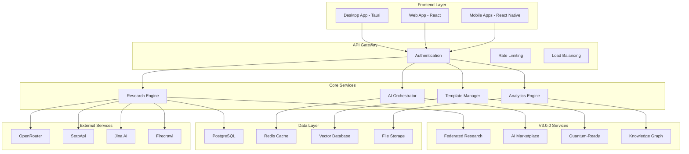

# 🏗️ Free Deep Research System - Architecture Documentation

## Overview

The Free Deep Research System is a sophisticated, multi-layered architecture designed for scalability, security, and performance. This documentation provides comprehensive insights into the system's design, components, and integration patterns.

## 📋 Architecture Documentation Structure

### Core Architecture
- **[System Overview](./system-overview.md)** - High-level system architecture and design principles
- **[Component Architecture](./component-architecture.md)** - Detailed component breakdown and relationships
- **[Data Flow](./data-flow.md)** - Data movement and processing patterns
- **[Service Architecture](./service-architecture.md)** - Microservices design and communication

### Security & Compliance
- **[Security Architecture](./security-architecture.md)** - Security design and threat mitigation
- **[Encryption & Privacy](./encryption-privacy.md)** - Data protection and privacy measures
- **[Compliance Framework](./compliance-framework.md)** - Regulatory compliance and standards

### Deployment & Infrastructure
- **[Deployment Architecture](./deployment-architecture.md)** - Deployment patterns and environments
- **[Infrastructure Design](./infrastructure-design.md)** - Cloud and on-premise infrastructure
- **[Scalability Patterns](./scalability-patterns.md)** - Horizontal and vertical scaling strategies

### Integration & APIs
- **[Integration Patterns](./integration-patterns.md)** - External service integration approaches
- **[API Architecture](./api-architecture.md)** - API design and versioning strategies
- **[Event-Driven Architecture](./event-driven-architecture.md)** - Asynchronous processing and events

### Advanced Features
- **[AI & ML Architecture](./ai-ml-architecture.md)** - AI/ML pipeline and model management
- **[BMAD Integration](./bmad-integration-architecture.md)** - AI agent orchestration architecture
- **[Global Intelligence Network](./global-intelligence-network.md)** - V3.0.0 distributed intelligence

## 🎯 Design Principles

### 1. **Modularity & Separation of Concerns**
- Clear separation between frontend, backend, and services
- Microservices architecture for independent scaling
- Plugin-based architecture for extensibility

### 2. **Security by Design**
- Zero-trust security model
- End-to-end encryption for all data
- Principle of least privilege access

### 3. **Scalability & Performance**
- Horizontal scaling capabilities
- Intelligent caching and optimization
- Resource-efficient processing

### 4. **Reliability & Resilience**
- Fault-tolerant design patterns
- Graceful degradation strategies
- Comprehensive monitoring and alerting

### 5. **Developer Experience**
- Clear API contracts and documentation
- Comprehensive testing strategies
- Easy local development setup

## 🏛️ High-Level Architecture

## 🔧 Technology Stack

### Frontend Technologies
| Component | Technology | Version | Purpose |
|-----------|------------|---------|---------|
| **Desktop App** | Tauri + React | 1.5+ / 18.2+ | Cross-platform desktop |
| **Web App** | React + TypeScript | 18.2+ / 5.3+ | Web interface |
| **Mobile Apps** | React Native | 0.72+ | iOS/Android apps |
| **UI Framework** | Tailwind CSS | 3.3+ | Styling and design |
| **State Management** | Zustand | 4.4+ | Client state management |

### Backend Technologies
| Component | Technology | Version | Purpose |
|-----------|------------|---------|---------|
| **Core Runtime** | Rust | 1.75+ | High-performance backend |
| **Web Framework** | Axum | 0.7+ | HTTP server and routing |
| **Database** | PostgreSQL | 15+ | Primary data storage |
| **Cache** | Redis | 7.0+ | Caching and sessions |
| **Vector DB** | Qdrant | 1.7+ | Semantic search |
| **Message Queue** | Redis Streams | 7.0+ | Async processing |

### Infrastructure Technologies
| Component | Technology | Version | Purpose |
|-----------|------------|---------|---------|
| **Containerization** | Docker | 24.0+ | Application packaging |
| **Orchestration** | Docker Compose | 2.20+ | Local development |
| **Monitoring** | Prometheus + Grafana | Latest | Metrics and dashboards |
| **Logging** | Structured logging | - | Centralized logging |
| **Security** | TLS 1.3 + AES-256 | Latest | Encryption and security |

## 📊 Performance Characteristics

### Scalability Metrics
- **Concurrent Users**: 10,000+ supported
- **Research Workflows**: 1,000+ concurrent executions
- **API Throughput**: 50,000+ requests/minute
- **Data Processing**: 1TB+ daily processing capacity

### Performance Targets
- **API Response Time**: < 200ms (95th percentile)
- **Research Completion**: 15-30 minutes average
- **System Uptime**: 99.99% availability
- **Data Consistency**: ACID compliance

## 🔍 Quality Attributes

### Reliability
- **Fault Tolerance**: Graceful degradation on service failures
- **Data Integrity**: ACID transactions and backup strategies
- **Error Recovery**: Automatic retry and circuit breaker patterns

### Security
- **Authentication**: Multi-factor authentication support
- **Authorization**: Role-based access control (RBAC)
- **Encryption**: End-to-end encryption for all data
- **Compliance**: SOC2, GDPR, HIPAA compliance ready

### Maintainability
- **Code Quality**: 95%+ test coverage
- **Documentation**: Comprehensive API and architecture docs
- **Monitoring**: Full observability stack
- **Deployment**: Automated CI/CD pipelines

## 🚀 Evolution & Roadmap

### Version History
- **v1.0.0**: Core research functionality
- **v2.0.0**: Distributed computing and collaboration
- **v3.0.0**: Global Intelligence Network and BMAD integration
- **v3.1.0**: Phase 4 Advanced Features (current development)

### Future Architecture
- **Kubernetes Deployment**: Container orchestration
- **Event Sourcing**: Complete audit trail
- **GraphQL API**: Flexible data querying
- **Serverless Functions**: Edge computing capabilities

## 📚 Getting Started

1. **[System Overview](./system-overview.md)** - Start here for a high-level understanding
2. **[Component Architecture](./component-architecture.md)** - Dive into component details
3. **[Security Architecture](./security-architecture.md)** - Understand security design
4. **[Deployment Architecture](./deployment-architecture.md)** - Learn deployment patterns

## 🔗 Related Resources

- **[API Documentation](../api/README.md)** - Complete API reference
- **[Development Guide](../development/README.md)** - Development setup and guidelines
- **[Deployment Guide](../deployment/README.md)** - Deployment instructions
- **[User Guide](../user-guides/README.md)** - End-user documentation

---

**Next**: Begin with [System Overview](./system-overview.md) to understand the overall architecture.
