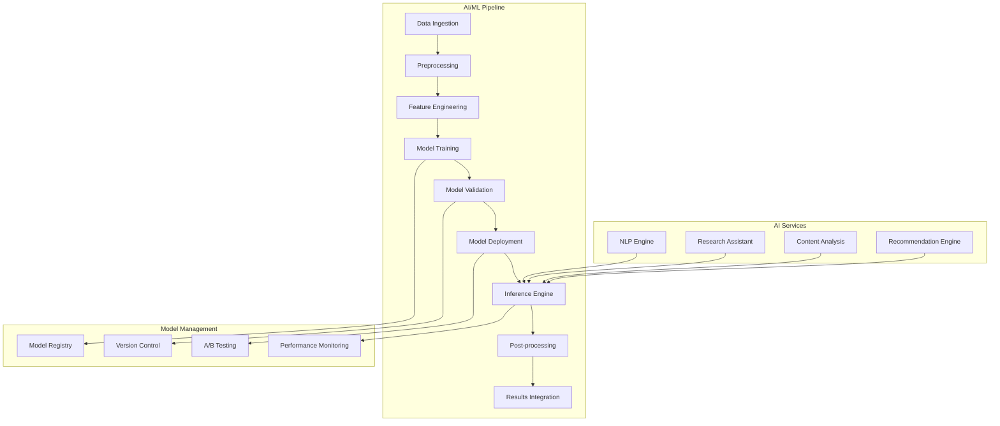

# 🤖 AI & ML Architecture

## Overview

The Free Deep Research System incorporates advanced AI and Machine Learning capabilities to enhance research quality, automate analysis, and provide intelligent insights. This document outlines the AI/ML architecture, pipeline design, and model management strategies.

## 🏗️ AI/ML System Architecture

### Core Components



## 🧠 AI Services

### Natural Language Processing Engine
- **Text Analysis**: Sentiment analysis, entity recognition, topic modeling
- **Language Understanding**: Query interpretation, intent classification
- **Content Generation**: Automated summaries, report generation
- **Translation**: Multi-language support for global research

### Research Assistant AI
- **Query Enhancement**: Intelligent query expansion and refinement
- **Source Recommendation**: AI-powered source discovery
- **Quality Assessment**: Automated content quality scoring
- **Research Guidance**: Methodology recommendations

### Content Analysis Engine
- **Document Classification**: Automatic categorization of research materials
- **Similarity Detection**: Duplicate and near-duplicate content identification
- **Trend Analysis**: Pattern recognition in research data
- **Citation Analysis**: Reference network analysis and validation

## 🔄 ML Pipeline Architecture

### Data Processing Pipeline
```python
# ML Pipeline Configuration
pipeline_config = {
    "data_ingestion": {
        "sources": ["research_db", "external_apis", "file_uploads"],
        "formats": ["json", "pdf", "html", "xml"],
        "preprocessing": ["cleaning", "normalization", "tokenization"]
    },
    "feature_engineering": {
        "text_features": ["tfidf", "word2vec", "bert_embeddings"],
        "metadata_features": ["publication_date", "author_metrics", "citation_count"],
        "graph_features": ["centrality", "clustering_coefficient", "pagerank"]
    },
    "model_training": {
        "algorithms": ["transformer", "random_forest", "gradient_boosting"],
        "validation": "cross_validation",
        "hyperparameter_tuning": "bayesian_optimization"
    }
}
```

### Model Training Infrastructure
- **Distributed Training**: Multi-GPU and multi-node training support
- **AutoML**: Automated model selection and hyperparameter optimization
- **Experiment Tracking**: MLflow integration for experiment management
- **Resource Management**: Dynamic resource allocation based on workload

## 🎯 AI Model Categories

### Research Enhancement Models
1. **Query Understanding Model**
   - Purpose: Interpret natural language research queries
   - Architecture: BERT-based transformer
   - Training Data: Research query datasets, academic search logs

2. **Content Quality Model**
   - Purpose: Assess research source credibility and relevance
   - Architecture: Multi-modal neural network
   - Features: Text content, metadata, citation patterns

3. **Recommendation Model**
   - Purpose: Suggest relevant sources and research directions
   - Architecture: Collaborative filtering + content-based hybrid
   - Training: User interaction data, content similarity

### Analysis and Insights Models
1. **Topic Modeling**
   - Purpose: Discover themes and trends in research data
   - Architecture: LDA, BERTopic, or custom transformer
   - Applications: Literature review automation, trend analysis

2. **Citation Network Analysis**
   - Purpose: Analyze research impact and relationships
   - Architecture: Graph neural networks
   - Features: Citation graphs, author networks, temporal patterns

3. **Sentiment and Opinion Mining**
   - Purpose: Extract opinions and sentiment from research content
   - Architecture: Fine-tuned language models
   - Applications: Review analysis, consensus detection

## 🚀 Deployment Architecture

### Model Serving Infrastructure
```yaml
# Model Serving Configuration
model_serving:
  inference_engine: "TensorFlow Serving"
  load_balancer: "NGINX"
  auto_scaling:
    min_replicas: 2
    max_replicas: 10
    target_cpu: 70%
  
  models:
    - name: "query_understanding"
      version: "v2.1.0"
      framework: "transformers"
      resources:
        cpu: "2"
        memory: "4Gi"
        gpu: "1"
    
    - name: "content_quality"
      version: "v1.3.0"
      framework: "scikit-learn"
      resources:
        cpu: "1"
        memory: "2Gi"
```

### Edge Computing Integration
- **Local Inference**: On-device models for privacy-sensitive operations
- **Federated Learning**: Distributed model training across research institutions
- **Edge Caching**: Intelligent caching of model predictions
- **Offline Capabilities**: Core AI features available without internet

## 📊 Model Performance Monitoring

### Metrics and KPIs
- **Accuracy Metrics**: Precision, recall, F1-score for classification tasks
- **Quality Metrics**: BLEU, ROUGE scores for text generation
- **Business Metrics**: User satisfaction, research efficiency improvements
- **System Metrics**: Latency, throughput, resource utilization

### Monitoring Dashboard
```javascript
// Model Performance Monitoring
const monitoring_config = {
  metrics: {
    accuracy: { threshold: 0.85, alert_below: true },
    latency: { threshold: 500, unit: "ms", alert_above: true },
    throughput: { threshold: 100, unit: "requests/min", alert_below: true }
  },
  alerts: {
    channels: ["slack", "email", "pagerduty"],
    escalation: "15_minutes"
  },
  dashboards: {
    grafana: "model_performance",
    custom: "ai_insights_dashboard"
  }
}
```

## 🔒 AI Ethics and Governance

### Responsible AI Principles
1. **Transparency**: Explainable AI models with clear decision rationales
2. **Fairness**: Bias detection and mitigation in model predictions
3. **Privacy**: Differential privacy and federated learning approaches
4. **Accountability**: Audit trails for all AI decisions and recommendations

### Model Governance Framework
- **Model Validation**: Rigorous testing before production deployment
- **Bias Auditing**: Regular assessment of model fairness across demographics
- **Performance Review**: Quarterly model performance and impact assessment
- **Ethical Review**: Ethics committee review for sensitive AI applications

## 🔧 Integration Points

### Research Workflow Integration
- **Query Processing**: AI-enhanced query understanding and expansion
- **Source Discovery**: ML-powered source recommendation and ranking
- **Content Analysis**: Automated content summarization and key insight extraction
- **Quality Assurance**: AI-driven quality scoring and validation

### External AI Services
- **OpenAI Integration**: GPT models for text generation and analysis
- **Hugging Face**: Pre-trained models and model hosting
- **Google AI**: Specialized models for specific research domains
- **Custom Models**: Proprietary models trained on research-specific data

## 📈 Future Roadmap

### Short-term (3-6 months)
- Enhanced query understanding with domain-specific fine-tuning
- Improved content quality assessment models
- Real-time recommendation system optimization

### Medium-term (6-12 months)
- Multimodal AI for image and video content analysis
- Advanced citation network analysis with temporal dynamics
- Federated learning implementation for privacy-preserving collaboration

### Long-term (12+ months)
- Quantum-enhanced machine learning algorithms
- AGI integration for autonomous research assistance
- Cross-domain knowledge transfer and meta-learning

---

**Related Documentation:**
- [BMAD Integration Architecture](./bmad-integration-architecture.md)
- [Global Intelligence Network](./global-intelligence-network.md)
- [API Architecture](./api-architecture.md)
- [Security Architecture](./security-architecture.md)
