# 🔌 API Architecture

## Overview

The Free Deep Research System implements a comprehensive API architecture that supports both desktop (Tauri commands) and web (REST APIs) interfaces. This document outlines the API design principles, versioning strategies, and integration patterns.

## 🎯 API Design Principles

### Core Principles
1. **API-First Design**: APIs are designed before implementation
2. **Consistency**: Uniform naming conventions and response formats
3. **Versioning**: Backward compatibility with clear versioning strategy
4. **Security**: Authentication and authorization built-in
5. **Documentation**: Comprehensive, auto-generated documentation
6. **Performance**: Optimized for speed and efficiency

### API Types

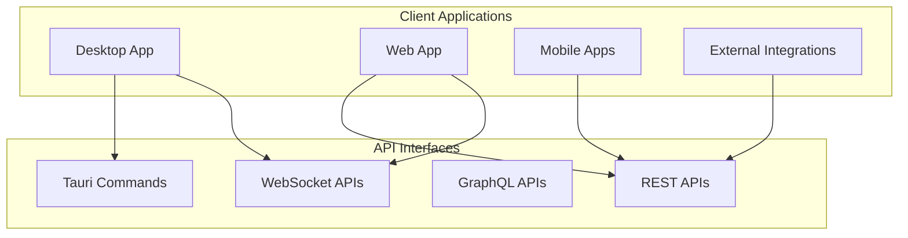

## 🏗️ API Architecture Layers

### 1. API Gateway Layer

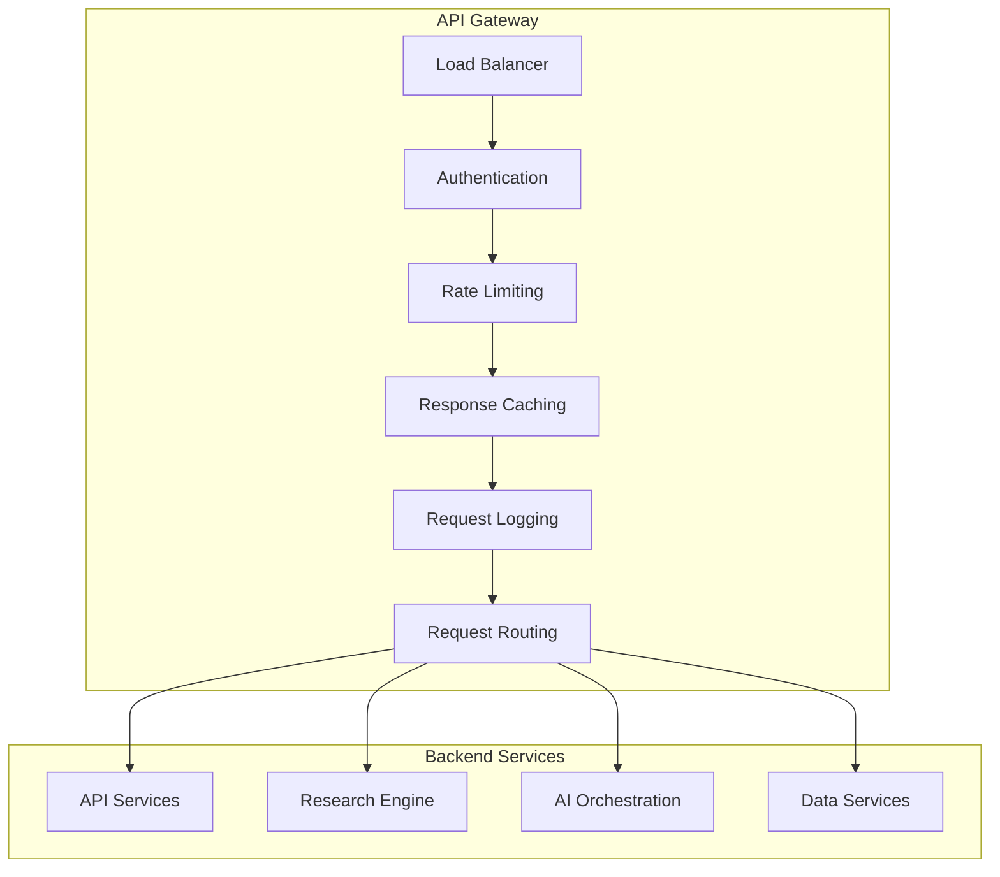

**Gateway Responsibilities:**
- **Authentication**: JWT token validation and user context
- **Rate Limiting**: Per-user and per-service rate limits
- **Caching**: Response caching for improved performance
- **Logging**: Comprehensive request/response logging
- **Routing**: Intelligent request routing to backend services

### 2. Tauri Command Architecture

```rust
// Tauri command structure
#[tauri::command]
pub async fn create_research_workflow(
    request: WorkflowRequest,
    service_manager: State<'_, ServiceManager>,
) -> Result<WorkflowResponse, String> {
    // Command implementation
}
```

**Tauri Command Categories:**

| Category | Commands | Purpose |
|----------|----------|---------|
| **Health** | `health_check`, `system_health_check` | System monitoring |
| **API Management** | `add_api_key`, `test_api_key`, `get_api_keys` | API key operations |
| **Research** | `create_workflow`, `execute_research`, `get_results` | Research operations |
| **AI Orchestration** | `register_agent`, `submit_task`, `start_collaboration` | AI agent management |
| **BMAD Integration** | `conduct_agent_research`, `execute_documentation_mode` | BMAD operations |

### 3. REST API Architecture

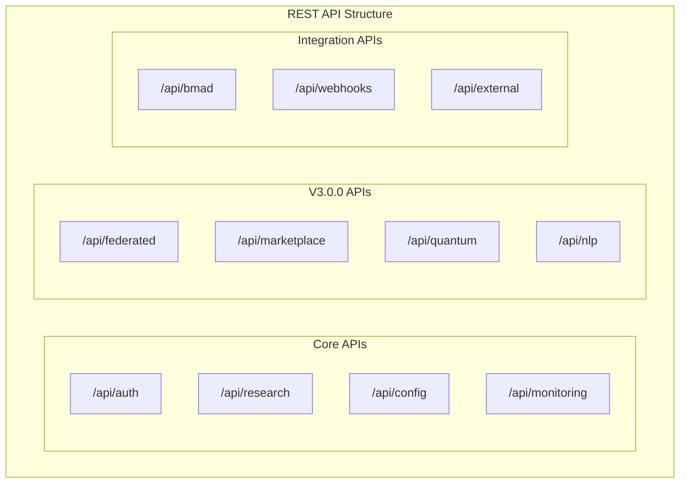

**REST API Endpoints:**

```yaml
# Core Authentication API
/api/auth:
  POST /login          # User authentication
  POST /logout         # User logout
  GET  /profile        # User profile
  PUT  /profile        # Update profile

# Research Workflow API
/api/research:
  POST /workflows      # Create workflow
  GET  /workflows      # List workflows
  GET  /workflows/{id} # Get workflow details
  PUT  /workflows/{id} # Update workflow
  DELETE /workflows/{id} # Delete workflow

# API Key Management
/api/keys:
  POST /              # Add API key
  GET  /              # List API keys
  PUT  /{id}          # Update API key
  DELETE /{id}        # Delete API key
  POST /{id}/test     # Test API key
```

## 📋 API Versioning Strategy

### Version Management

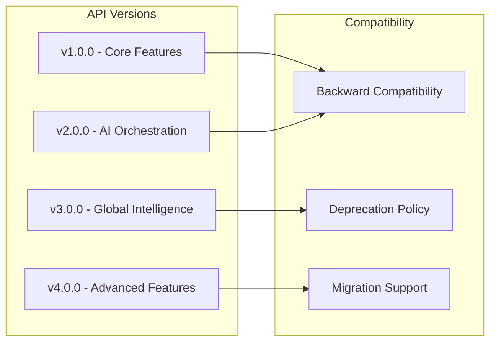

**Versioning Approach:**
- **URL Versioning**: `/api/v1/`, `/api/v2/`, `/api/v3/`
- **Header Versioning**: `API-Version: 3.0.0`
- **Backward Compatibility**: Maintain 2 previous versions
- **Deprecation Notice**: 6-month deprecation period

### API Evolution Timeline

| Version | Release Date | Features | Status |
|---------|-------------|----------|--------|
| **v1.0.0** | 2024-01 | Core research functionality | ✅ Stable |
| **v1.1.0** | 2024-03 | Enhanced AI models, analytics | ✅ Stable |
| **v1.2.0** | 2024-06 | Template management, batch processing | ✅ Stable |
| **v2.0.0** | 2024-09 | Distributed computing, collaboration | ✅ Stable |
| **v3.0.0** | 2024-12 | Global Intelligence Network | ✅ Current |
| **v3.1.0** | 2025-03 | Phase 4 Advanced Features | 🚧 Development |

## 🔐 API Security Architecture

### Authentication Flow

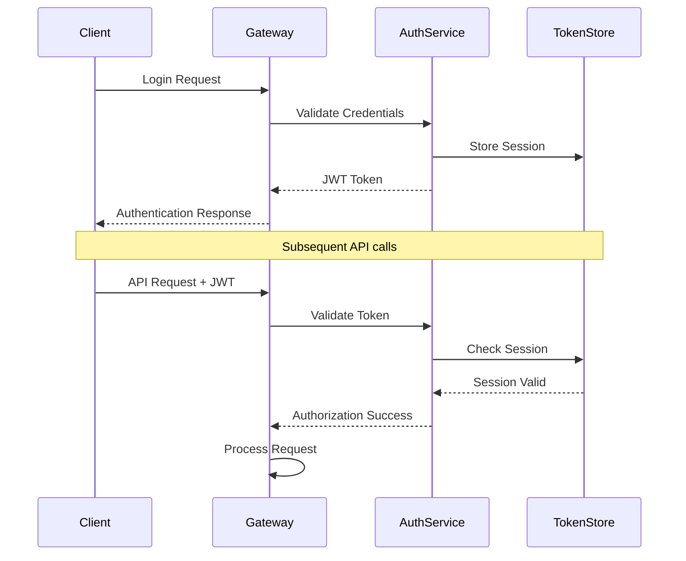

### Authorization Patterns

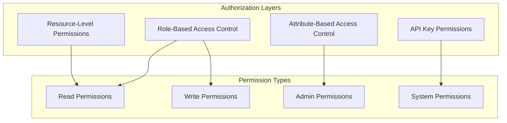

**Security Features:**
- **JWT Tokens**: Stateless authentication with configurable expiration
- **API Key Management**: Service-specific API keys with rate limiting
- **Role-Based Access**: User roles with granular permissions
- **Request Signing**: HMAC-SHA256 request signing for sensitive operations
- **Rate Limiting**: Per-user and per-endpoint rate limits

## 📊 API Performance & Monitoring

### Performance Metrics

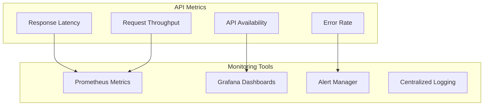

**Performance Targets:**

| Metric | Target | Measurement |
|--------|--------|-------------|
| **Response Time** | < 200ms | 95th percentile |
| **Throughput** | > 1000 RPS | Peak load |
| **Error Rate** | < 0.1% | 24-hour average |
| **Availability** | 99.99% | Monthly uptime |

### Caching Strategy

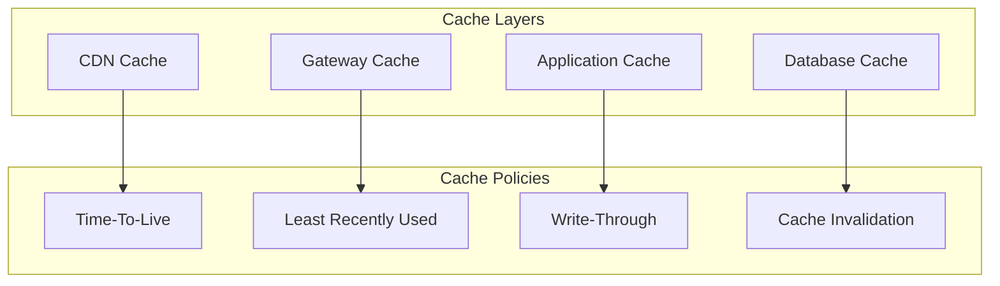

## 🔄 API Integration Patterns

### External API Integration

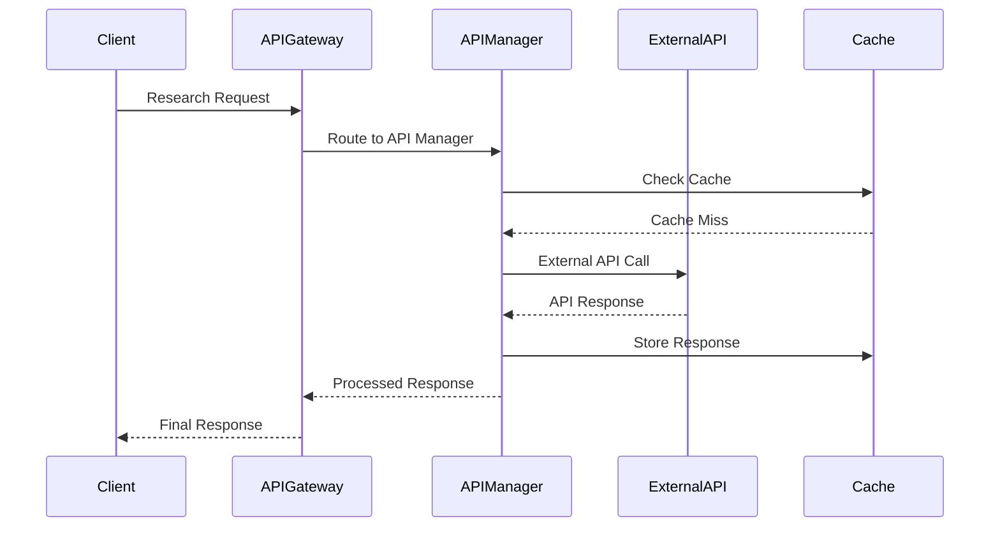

### Webhook Integration

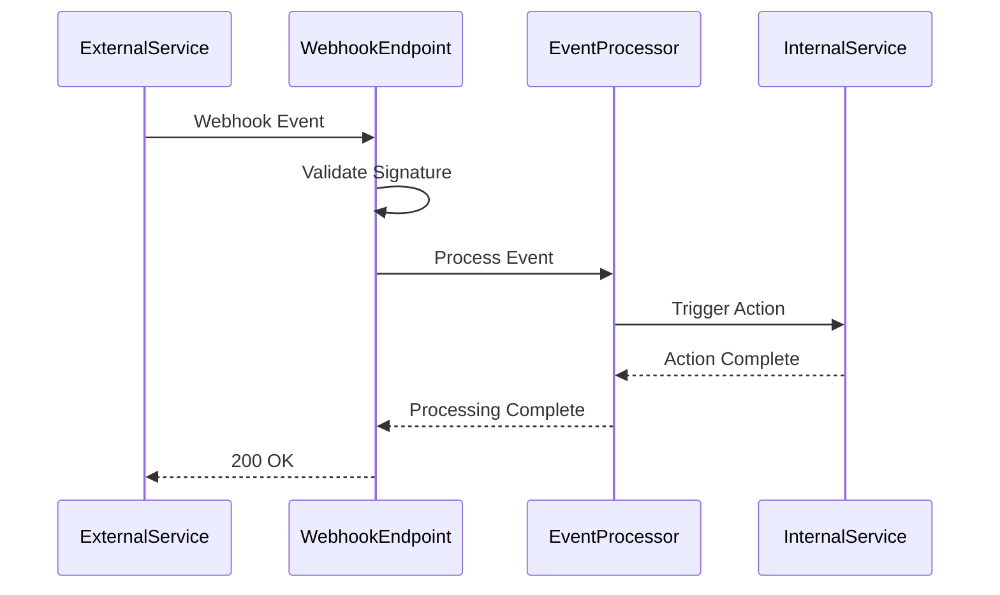

## 📝 API Documentation Strategy

### Documentation Generation

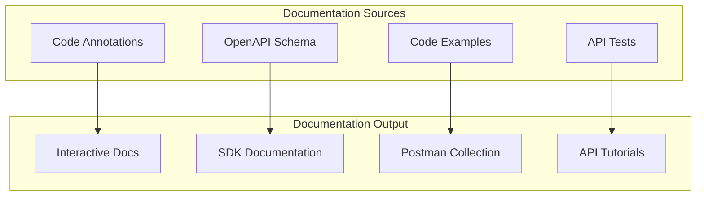

**Documentation Features:**
- **OpenAPI 3.0 Specification**: Machine-readable API definition
- **Interactive Documentation**: Swagger UI for API exploration
- **Code Examples**: Multi-language code samples
- **Postman Collections**: Ready-to-use API testing collections
- **SDK Generation**: Auto-generated client libraries

### API Testing Strategy

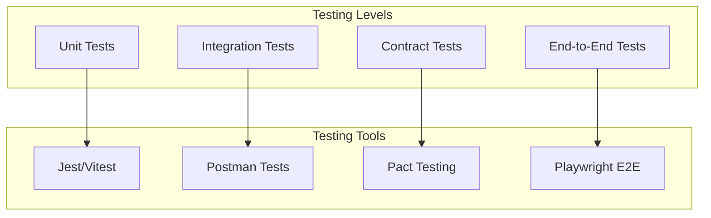

## 🔄 Advanced API Patterns

### GraphQL API Architecture

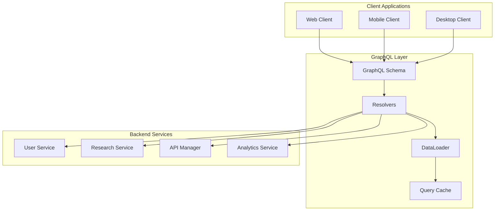

### API Gateway Advanced Features

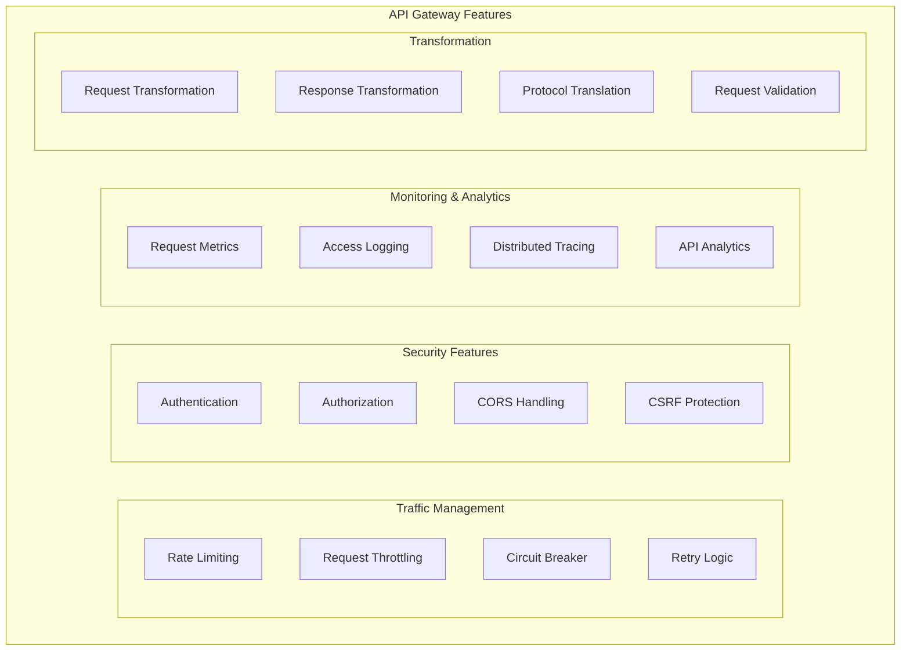

### API Composition Patterns

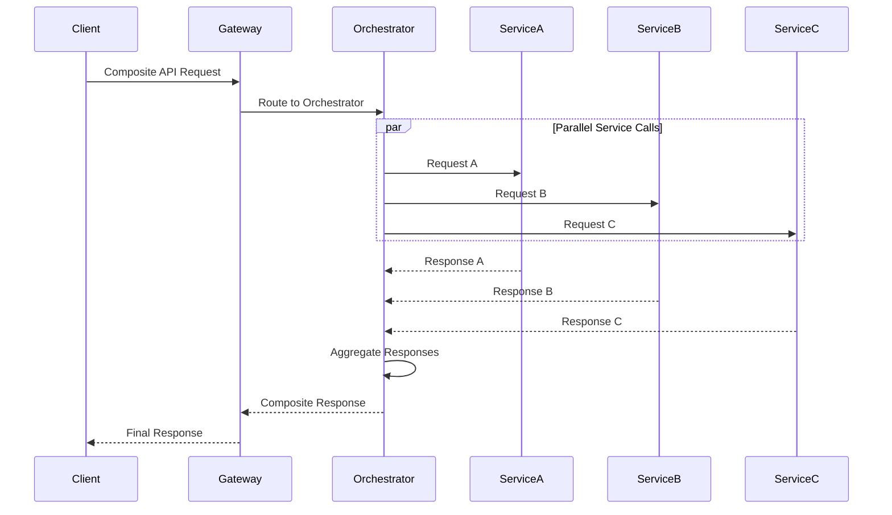

## 🔐 Advanced API Security

### OAuth 2.0 + PKCE Flow

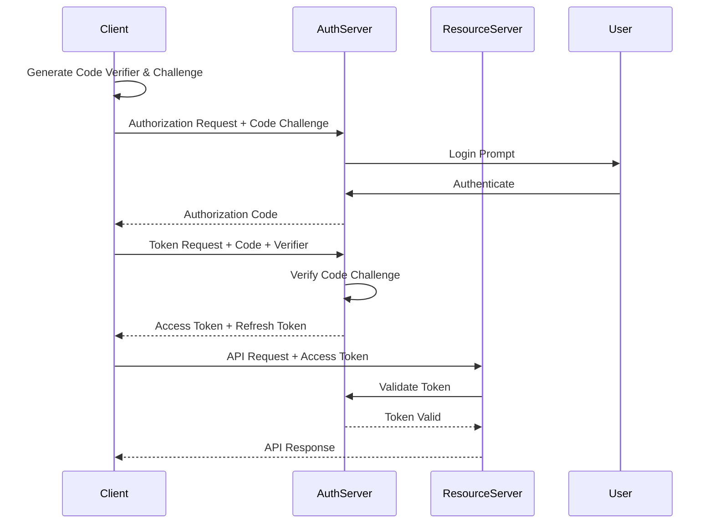

### API Key Security Model

```mermaid
graph TB
    subgraph "API Key Management"
        KEY_GEN[Key Generation]
        KEY_STORE[Secure Key Storage]
        KEY_ROTATION[Key Rotation]
        KEY_REVOCATION[Key Revocation]
    end

    subgraph "Key Validation"
        SIGNATURE[Request Signing]
        TIMESTAMP[Timestamp Validation]
        NONCE[Nonce Checking]
        RATE_CHECK[Rate Limit Check]
    end

    subgraph "Security Controls"
        IP_WHITELIST[IP Whitelisting]
        DOMAIN_RESTRICT[Domain Restrictions]
        SCOPE_LIMIT[Scope Limitations]
        AUDIT_LOG[Audit Logging]
    end

    KEY_GEN --> KEY_STORE
    KEY_STORE --> KEY_ROTATION
    KEY_ROTATION --> KEY_REVOCATION

    SIGNATURE --> TIMESTAMP
    TIMESTAMP --> NONCE
    NONCE --> RATE_CHECK

    IP_WHITELIST --> DOMAIN_RESTRICT
    DOMAIN_RESTRICT --> SCOPE_LIMIT
    SCOPE_LIMIT --> AUDIT_LOG
```

## 📊 API Performance & Optimization

### API Response Optimization

```mermaid
flowchart LR
    subgraph "Request Processing"
        A[Incoming Request]
        B[Request Validation]
        C[Cache Check]
        D[Business Logic]
    end

    subgraph "Response Optimization"
        E[Data Compression]
        F[Response Caching]
        G[Content Negotiation]
        H[Pagination]
    end

    subgraph "Delivery Optimization"
        I[CDN Distribution]
        J[Edge Caching]
        K[HTTP/2 Push]
        L[Response Streaming]
    end

    A --> B
    B --> C
    C --> D
    D --> E
    E --> F
    F --> G
    G --> H
    H --> I
    I --> J
    J --> K
    K --> L
```

### API Load Balancing Strategies

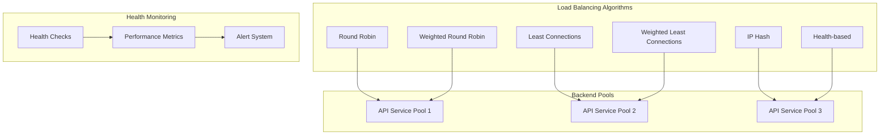

## 🔄 API Lifecycle Management

### API Development Lifecycle

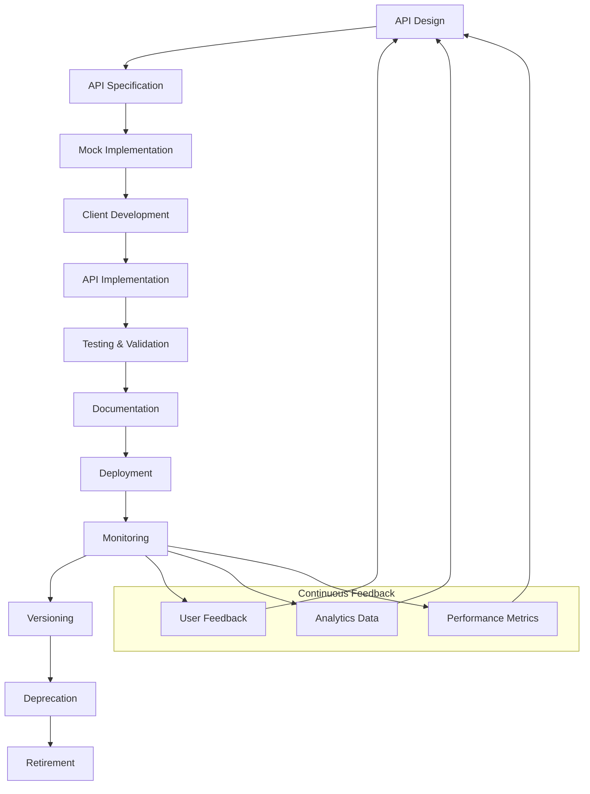

### API Deprecation Strategy

```mermaid
gantt
    title API Deprecation Timeline
    dateFormat  YYYY-MM-DD
    section API v1.0
    Active Support     :active, v1-active, 2024-01-01, 2024-12-31
    Maintenance Only   :v1-maint, 2025-01-01, 2025-06-30
    Deprecated         :crit, v1-dep, 2025-07-01, 2025-12-31

    section API v2.0
    Development        :v2-dev, 2024-06-01, 2024-11-30
    Active Support     :active, v2-active, 2024-12-01, 2025-12-31

    section API v3.0
    Development        :v3-dev, 2025-06-01, 2025-11-30
    Active Support     :active, v3-active, 2025-12-01, 2026-12-31
```

## 📝 API Documentation & Testing

### Documentation Generation Pipeline

```mermaid
flowchart LR
    subgraph "Source Code"
        A[API Annotations]
        B[OpenAPI Spec]
        C[Code Comments]
    end

    subgraph "Generation Tools"
        D[Swagger Codegen]
        E[Redoc Generator]
        F[Postman Generator]
    end

    subgraph "Documentation Outputs"
        G[Interactive Docs]
        H[SDK Documentation]
        I[API Collections]
        J[Code Examples]
    end

    A --> D
    B --> E
    C --> F

    D --> G
    E --> H
    F --> I
    D --> J
```

### API Testing Pyramid

```mermaid
graph TB
    subgraph "API Testing Pyramid"
        subgraph "E2E Tests"
            E2E[End-to-End API Tests]
        end

        subgraph "Integration Tests"
            INT1[Service Integration Tests]
            INT2[Database Integration Tests]
            INT3[External API Integration Tests]
        end

        subgraph "Unit Tests"
            UNIT1[Controller Unit Tests]
            UNIT2[Service Unit Tests]
            UNIT3[Model Unit Tests]
            UNIT4[Utility Unit Tests]
        end
    end

    style E2E fill:#ff6b6b
    style INT1 fill:#4ecdc4
    style INT2 fill:#4ecdc4
    style INT3 fill:#4ecdc4
    style UNIT1 fill:#95e1d3
    style UNIT2 fill:#95e1d3
    style UNIT3 fill:#95e1d3
    style UNIT4 fill:#95e1d3
```

## 🌐 API Integration Patterns

### Webhook Management System

```mermaid
sequenceDiagram
    participant External
    participant WebhookGateway
    participant Validator
    participant Queue
    participant Processor
    participant Storage

    External->>WebhookGateway: Webhook Event
    WebhookGateway->>Validator: Validate Signature
    Validator-->>WebhookGateway: Validation Result

    alt Valid Webhook
        WebhookGateway->>Queue: Queue Event
        Queue->>Processor: Process Event
        Processor->>Storage: Store Event Data
        Processor-->>Queue: Processing Complete
        Queue-->>WebhookGateway: Success
        WebhookGateway-->>External: 200 OK
    else Invalid Webhook
        WebhookGateway-->>External: 401 Unauthorized
    end
```

### API Federation Architecture

```mermaid
graph TB
    subgraph "API Federation Gateway"
        GATEWAY[Federation Gateway]
        SCHEMA[Unified Schema]
        RESOLVER[Schema Resolver]
    end

    subgraph "Federated APIs"
        API1[User API]
        API2[Research API]
        API3[Analytics API]
        API4[Billing API]
    end

    subgraph "Client Applications"
        WEB[Web Application]
        MOBILE[Mobile Application]
        PARTNER[Partner Integration]
    end

    WEB --> GATEWAY
    MOBILE --> GATEWAY
    PARTNER --> GATEWAY

    GATEWAY --> SCHEMA
    SCHEMA --> RESOLVER

    RESOLVER --> API1
    RESOLVER --> API2
    RESOLVER --> API3
    RESOLVER --> API4
```

## 🔗 Related Documentation

- **[Component Architecture](./component-architecture.md)** - System component breakdown
- **[Service Architecture](./service-architecture.md)** - Service design patterns
- **[Data Flow Architecture](./data-flow.md)** - Data movement patterns
- **[Security Architecture](./security-architecture.md)** - Security implementation
- **[API Reference](../api/README.md)** - Complete API documentation
- **[Authentication Guide](../api/authentication.md)** - API authentication details
- **[Integration Patterns](./integration-patterns.md)** - API integration strategies

---

**Phase 1 Complete**: Foundation architecture documentation fully established with comprehensive coverage of all architectural aspects. Ready for Phase 2: API Completion.
