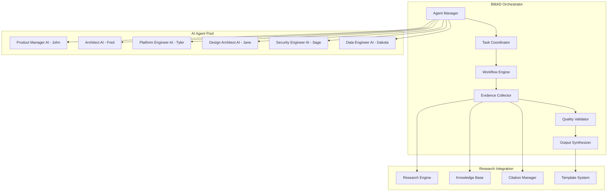

# 🤖 BMAD Integration Architecture

## Overview

The BMAD (Business Method for AI Development) integration provides sophisticated AI agent orchestration capabilities within the Free Deep Research System. This architecture enables multi-agent collaboration, intelligent task delegation, and evidence-based research enhancement.

## 🏗️ BMAD System Architecture

### Core Components



## 🎭 AI Agent Personas

### Product Manager AI (John)
- **Role**: Strategic planning and requirements gathering
- **Capabilities**: 
  - Market research analysis
  - User story creation
  - Roadmap planning
  - Stakeholder communication
- **Research Integration**: Evidence-based product decisions with research citations

### Architect AI (Fred)
- **Role**: Technical architecture and system design
- **Capabilities**:
  - System architecture design
  - Technology stack recommendations
  - Scalability planning
  - Integration pattern design
- **Research Integration**: Architecture decisions backed by industry research

### Platform Engineer AI (Tyler)
- **Role**: Infrastructure and deployment optimization
- **Capabilities**:
  - DevOps pipeline design
  - Infrastructure automation
  - Performance optimization
  - Security implementation
- **Research Integration**: Best practices research for platform engineering

### Design Architect AI (Jane)
- **Role**: User experience and interface design
- **Capabilities**:
  - UX/UI design principles
  - User journey mapping
  - Accessibility compliance
  - Design system creation
- **Research Integration**: UX research and design pattern analysis

### Security Engineer AI (Sage)
- **Role**: Security architecture and threat mitigation
- **Capabilities**:
  - Security assessment
  - Threat modeling
  - Compliance validation
  - Security policy creation
- **Research Integration**: Security research and vulnerability analysis

### Data Engineer AI (Dakota)
- **Role**: Data architecture and analytics
- **Capabilities**:
  - Data pipeline design
  - Analytics implementation
  - Data governance
  - Performance monitoring
- **Research Integration**: Data engineering best practices research

## 🔄 Agent Orchestration Workflow

### Task Delegation Process
```python
# BMAD Agent Orchestration
class BMADOrchestrator:
    def __init__(self):
        self.agents = {
            'product_manager': ProductManagerAI(),
            'architect': ArchitectAI(),
            'platform_engineer': PlatformEngineerAI(),
            'design_architect': DesignArchitectAI(),
            'security_engineer': SecurityEngineerAI(),
            'data_engineer': DataEngineerAI()
        }
        self.research_engine = ResearchEngine()
        
    def orchestrate_task(self, task_description, mode='collaborative'):
        # Analyze task requirements
        task_analysis = self.analyze_task(task_description)
        
        # Select appropriate agents
        selected_agents = self.select_agents(task_analysis)
        
        # Gather research evidence
        research_context = self.research_engine.gather_evidence(task_description)
        
        # Execute collaborative workflow
        if mode == 'collaborative':
            return self.collaborative_execution(selected_agents, research_context)
        elif mode == 'sequential':
            return self.sequential_execution(selected_agents, research_context)
        elif mode == 'parallel':
            return self.parallel_execution(selected_agents, research_context)
```

### Evidence-Based Decision Making
- **Research Integration**: All agent decisions backed by research evidence
- **Citation Management**: Automatic citation generation for recommendations
- **Quality Validation**: Multi-agent peer review of outputs
- **Traceability**: Complete audit trail of decision rationale

## 📋 Configuration Management

### Agent Configuration
```yaml
# BMAD Agent Configuration
agents:
  product_manager:
    name: "John"
    persona: "Strategic Product Manager"
    capabilities:
      - market_research
      - user_story_creation
      - roadmap_planning
    research_domains:
      - product_management
      - market_analysis
      - user_experience
    
  architect:
    name: "Fred"
    persona: "Senior Technical Architect"
    capabilities:
      - system_design
      - technology_selection
      - scalability_planning
    research_domains:
      - software_architecture
      - technology_trends
      - performance_optimization

  platform_engineer:
    name: "Tyler"
    persona: "DevOps Platform Engineer"
    capabilities:
      - infrastructure_design
      - automation_implementation
      - monitoring_setup
    research_domains:
      - devops_practices
      - infrastructure_patterns
      - security_best_practices
```

### Workflow Templates
```json
{
  "documentation_mode_workflow": {
    "description": "Generate comprehensive documentation with AI agent collaboration",
    "phases": [
      {
        "name": "requirements_analysis",
        "agents": ["product_manager"],
        "research_focus": "user_requirements",
        "deliverable": "prd.md"
      },
      {
        "name": "architecture_design",
        "agents": ["architect", "security_engineer"],
        "research_focus": "technical_architecture",
        "deliverable": "architecture.md"
      },
      {
        "name": "implementation_planning",
        "agents": ["platform_engineer", "data_engineer"],
        "research_focus": "implementation_best_practices",
        "deliverable": "checklist.md"
      }
    ]
  }
}
```

## 🔗 Research Integration Points

### Knowledge Base Integration
- **Dynamic Research**: Real-time research based on agent needs
- **Context Awareness**: Research tailored to specific agent personas
- **Evidence Synthesis**: Combining multiple research sources for comprehensive insights
- **Citation Management**: Automatic reference generation and validation

### Template System Integration
- **Agent-Specific Templates**: Customized templates for each agent type
- **Research-Enhanced Templates**: Templates with embedded research citations
- **Dynamic Content**: Templates that adapt based on research findings
- **Quality Assurance**: Template validation through multi-agent review

## 🎯 Collaboration Patterns

### Multi-Agent Collaboration
1. **Sequential Workflow**: Agents work in predefined sequence
2. **Parallel Processing**: Multiple agents work simultaneously
3. **Peer Review**: Agents review and validate each other's work
4. **Consensus Building**: Collaborative decision-making process

### Communication Protocols
```javascript
// Agent Communication Protocol
const communication_protocol = {
  message_types: {
    task_assignment: "Assign specific task to agent",
    research_request: "Request research on specific topic",
    peer_review: "Request review of work product",
    consensus_building: "Participate in group decision"
  },
  
  collaboration_modes: {
    synchronous: "Real-time collaboration",
    asynchronous: "Time-shifted collaboration",
    hybrid: "Mixed synchronous/asynchronous"
  },
  
  quality_gates: {
    research_validation: "Validate research sources and citations",
    peer_review: "Multi-agent review of outputs",
    consistency_check: "Ensure consistency across agent outputs"
  }
}
```

## 📊 Performance Monitoring

### Agent Performance Metrics
- **Task Completion Rate**: Percentage of successfully completed tasks
- **Quality Score**: Peer review ratings and user feedback
- **Research Integration**: Effectiveness of research evidence utilization
- **Collaboration Efficiency**: Success rate of multi-agent workflows

### System Health Monitoring
```yaml
# BMAD Monitoring Configuration
monitoring:
  agent_health:
    - response_time: "< 2 seconds"
    - availability: "> 99.5%"
    - error_rate: "< 1%"
  
  workflow_performance:
    - completion_rate: "> 95%"
    - quality_score: "> 4.0/5.0"
    - user_satisfaction: "> 90%"
  
  research_integration:
    - citation_accuracy: "> 98%"
    - source_quality: "> 4.0/5.0"
    - evidence_relevance: "> 90%"
```

## 🔒 Security and Privacy

### Agent Security
- **Secure Communication**: Encrypted agent-to-agent communication
- **Access Control**: Role-based access to research data and capabilities
- **Audit Logging**: Complete audit trail of agent actions and decisions
- **Privacy Protection**: Anonymization of sensitive research data

### Data Protection
- **Research Data Security**: Encryption of research data at rest and in transit
- **Citation Privacy**: Protection of proprietary research sources
- **User Privacy**: Anonymization of user interaction data
- **Compliance**: GDPR, CCPA, and other privacy regulation compliance

## 🚀 Deployment Architecture

### Container-Based Deployment
```dockerfile
# BMAD Agent Container
FROM node:18-alpine

WORKDIR /app

# Install dependencies
COPY package*.json ./
RUN npm ci --only=production

# Copy agent configurations
COPY bmad-agent/ ./bmad-agent/

# Copy application code
COPY src/ ./src/

# Set environment variables
ENV NODE_ENV=production
ENV BMAD_CONFIG_PATH=/app/bmad-agent/agent-config.txt

# Health check
HEALTHCHECK --interval=30s --timeout=3s --start-period=5s --retries=3 \
  CMD curl -f http://localhost:3000/health || exit 1

EXPOSE 3000

CMD ["npm", "start"]
```

### Kubernetes Integration
```yaml
# BMAD Agent Deployment
apiVersion: apps/v1
kind: Deployment
metadata:
  name: bmad-orchestrator
spec:
  replicas: 3
  selector:
    matchLabels:
      app: bmad-orchestrator
  template:
    metadata:
      labels:
        app: bmad-orchestrator
    spec:
      containers:
      - name: bmad-orchestrator
        image: free-deep-research/bmad:latest
        ports:
        - containerPort: 3000
        env:
        - name: RESEARCH_ENGINE_URL
          value: "http://research-engine:8080"
        resources:
          requests:
            memory: "512Mi"
            cpu: "250m"
          limits:
            memory: "1Gi"
            cpu: "500m"
```

## 🔧 Integration APIs

### Agent Management API
```typescript
// BMAD Agent Management API
interface BMADAgentAPI {
  // Agent lifecycle management
  activateAgent(agentId: string, persona: string): Promise<Agent>;
  deactivateAgent(agentId: string): Promise<void>;
  
  // Task management
  assignTask(agentId: string, task: Task): Promise<TaskResult>;
  getTaskStatus(taskId: string): Promise<TaskStatus>;
  
  // Collaboration
  initiateCollaboration(agents: string[], task: Task): Promise<CollaborationSession>;
  getPeerReview(workProductId: string): Promise<PeerReview>;
  
  // Research integration
  requestResearch(topic: string, context: ResearchContext): Promise<ResearchResults>;
  validateCitations(citations: Citation[]): Promise<ValidationResults>;
}
```

---

**Related Documentation:**
- [AI & ML Architecture](./ai-ml-architecture.md)
- [Global Intelligence Network](./global-intelligence-network.md)
- [API Architecture](./api-architecture.md)
- [Security Architecture](./security-architecture.md)
