# 📋 Compliance Framework

## Overview

This document outlines the comprehensive compliance framework implemented in the Free Deep Research System to meet regulatory requirements across multiple jurisdictions and industries. Our framework ensures adherence to data protection, privacy, security, and industry-specific regulations.

## 🌍 Regulatory Compliance Matrix

### Global Data Protection Regulations

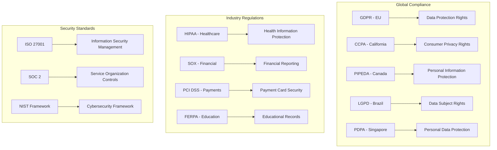

### Compliance Implementation Matrix

| Regulation | Scope | Implementation Status | Key Requirements |
|------------|-------|----------------------|------------------|
| **GDPR** | EU Data Subjects | ✅ Implemented | Consent, Data Rights, DPO, DPIA |
| **CCPA** | California Residents | ✅ Implemented | Consumer Rights, Opt-out, Disclosure |
| **HIPAA** | Healthcare Data | ✅ Implemented | PHI Protection, BAA, Audit Logs |
| **SOX** | Financial Reporting | ✅ Implemented | Internal Controls, Audit Trails |
| **ISO 27001** | Information Security | ✅ Implemented | ISMS, Risk Management, Controls |
| **SOC 2** | Service Controls | ✅ Implemented | Security, Availability, Confidentiality |

## 🔒 GDPR Compliance Implementation

### Data Protection Principles

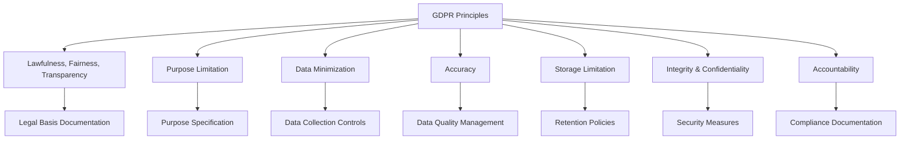

### Data Subject Rights Implementation

#### Right of Access (Article 15)

```rust
// GDPR Article 15 - Right of Access Implementation
pub struct DataAccessService {
    data_locator: Arc<RwLock<PersonalDataLocator>>,
    access_controller: Arc<RwLock<AccessController>>,
    audit_logger: Arc<RwLock<AuditLogger>>,
}

impl DataAccessService {
    pub async fn handle_access_request(
        &self,
        request: DataAccessRequest,
    ) -> Result<DataAccessResponse, ComplianceError> {
        // Verify data subject identity
        self.verify_identity(&request.subject_id).await?;
        
        // Locate all personal data
        let data_locations = self.data_locator
            .read().await
            .find_personal_data(&request.subject_id).await?;
        
        // Compile data access response
        let mut response_data = Vec::new();
        for location in data_locations {
            let data = self.extract_personal_data(&location).await?;
            response_data.push(data);
        }
        
        // Generate portable format
        let response = DataAccessResponse {
            subject_id: request.subject_id.clone(),
            data: response_data,
            format: DataFormat::JSON,
            processing_purposes: self.get_processing_purposes(&request.subject_id).await?,
            retention_periods: self.get_retention_periods(&request.subject_id).await?,
            third_party_recipients: self.get_third_party_recipients(&request.subject_id).await?,
            source_information: self.get_data_sources(&request.subject_id).await?,
        };
        
        // Log access request for audit
        self.audit_logger.write().await.log_data_access_request(&request).await?;
        
        Ok(response)
    }
}
```

#### Right to Erasure (Article 17)

```rust
// GDPR Article 17 - Right to Erasure Implementation
pub struct DataErasureService {
    erasure_engine: Arc<RwLock<ErasureEngine>>,
    legal_basis_checker: Arc<RwLock<LegalBasisChecker>>,
    audit_logger: Arc<RwLock<AuditLogger>>,
}

impl DataErasureService {
    pub async fn handle_erasure_request(
        &self,
        request: ErasureRequest,
    ) -> Result<ErasureResponse, ComplianceError> {
        // Check erasure conditions (Article 17.1)
        let erasure_grounds = self.verify_erasure_grounds(&request).await?;
        
        // Check for exceptions (Article 17.3)
        let exceptions = self.legal_basis_checker
            .read().await
            .check_erasure_exceptions(&request.subject_id).await?;
        
        if !exceptions.is_empty() {
            return Ok(ErasureResponse {
                status: ErasureStatus::Denied,
                reason: format!("Erasure denied due to: {:?}", exceptions),
                exceptions,
            });
        }
        
        // Perform secure erasure
        let erasure_results = self.erasure_engine
            .write().await
            .erase_personal_data(&request.subject_id).await?;
        
        // Verify complete erasure
        self.verify_complete_erasure(&request.subject_id).await?;
        
        // Generate compliance certificate
        let certificate = self.generate_erasure_certificate(&erasure_results).await?;
        
        Ok(ErasureResponse {
            status: ErasureStatus::Completed,
            certificate: Some(certificate),
            erasure_date: Utc::now(),
            verification_hash: self.generate_verification_hash(&erasure_results).await?,
        })
    }
}
```

### Data Protection Impact Assessment (DPIA)

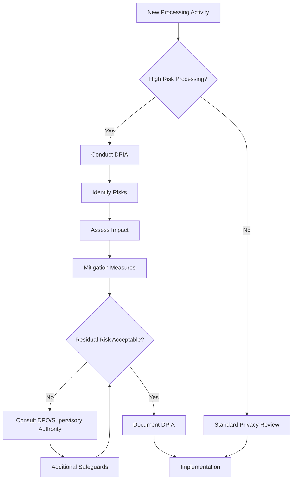

**DPIA Implementation:**
```rust
pub struct DataProtectionImpactAssessment {
    pub assessment_id: Uuid,
    pub processing_activity: ProcessingActivity,
    pub risk_assessment: RiskAssessment,
    pub mitigation_measures: Vec<MitigationMeasure>,
    pub residual_risk_level: RiskLevel,
    pub dpo_consultation: Option<DPOConsultation>,
    pub supervisory_authority_consultation: Option<SAConsultation>,
    pub approval_status: DPIAStatus,
    pub review_date: DateTime<Utc>,
}

pub enum RiskLevel {
    Low,
    Medium,
    High,
    VeryHigh,
}

pub enum DPIAStatus {
    InProgress,
    Approved,
    RequiresConsultation,
    Rejected,
}
```

## 🏥 HIPAA Compliance Implementation

### Protected Health Information (PHI) Safeguards

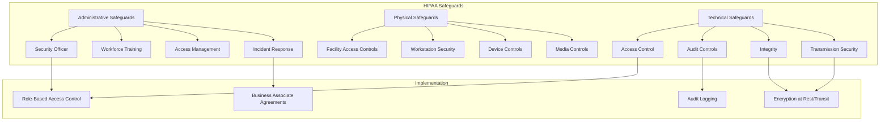

### Business Associate Agreement (BAA) Management

```rust
// HIPAA Business Associate Agreement Management
pub struct BusinessAssociateManager {
    agreements: HashMap<String, BusinessAssociateAgreement>,
    compliance_monitor: Arc<RwLock<ComplianceMonitor>>,
    audit_logger: Arc<RwLock<AuditLogger>>,
}

pub struct BusinessAssociateAgreement {
    pub ba_id: String,
    pub organization_name: String,
    pub agreement_date: DateTime<Utc>,
    pub expiry_date: DateTime<Utc>,
    pub permitted_uses: Vec<PermittedUse>,
    pub safeguards_required: Vec<Safeguard>,
    pub breach_notification_requirements: BreachNotificationRequirements,
    pub compliance_status: ComplianceStatus,
}

impl BusinessAssociateManager {
    pub async fn validate_phi_access(
        &self,
        ba_id: &str,
        access_request: PHIAccessRequest,
    ) -> Result<bool, ComplianceError> {
        let agreement = self.agreements.get(ba_id)
            .ok_or(ComplianceError::InvalidBusinessAssociate)?;
        
        // Check agreement validity
        if agreement.expiry_date < Utc::now() {
            return Err(ComplianceError::ExpiredAgreement);
        }
        
        // Validate permitted use
        let is_permitted = agreement.permitted_uses.iter()
            .any(|use_case| use_case.matches(&access_request.purpose));
        
        if !is_permitted {
            self.audit_logger.write().await
                .log_unauthorized_phi_access_attempt(&access_request).await?;
            return Ok(false);
        }
        
        // Log authorized access
        self.audit_logger.write().await
            .log_phi_access(&access_request).await?;
        
        Ok(true)
    }
}
```

## 💰 SOX Compliance Implementation

### Internal Controls Framework

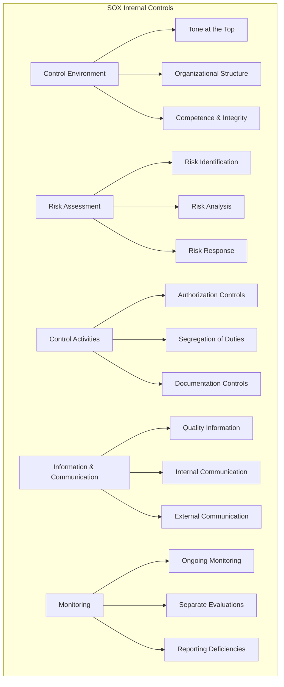

### Financial Data Controls

```rust
// SOX Financial Data Controls Implementation
pub struct FinancialDataController {
    access_controls: Arc<RwLock<AccessControlMatrix>>,
    audit_trail: Arc<RwLock<FinancialAuditTrail>>,
    segregation_enforcer: Arc<RwLock<SegregationEnforcer>>,
    change_control: Arc<RwLock<ChangeControlSystem>>,
}

impl FinancialDataController {
    pub async fn process_financial_transaction(
        &self,
        transaction: FinancialTransaction,
        user: &User,
    ) -> Result<TransactionResult, ComplianceError> {
        // Verify user authorization
        self.verify_transaction_authorization(user, &transaction).await?;
        
        // Check segregation of duties
        self.enforce_segregation_of_duties(user, &transaction).await?;
        
        // Create audit trail entry
        let audit_entry = AuditTrailEntry {
            transaction_id: transaction.id.clone(),
            user_id: user.id.clone(),
            timestamp: Utc::now(),
            action: AuditAction::FinancialTransaction,
            details: serde_json::to_value(&transaction)?,
            ip_address: user.ip_address.clone(),
            session_id: user.session_id.clone(),
        };
        
        self.audit_trail.write().await.record_entry(audit_entry).await?;
        
        // Process transaction with controls
        let result = self.execute_controlled_transaction(transaction).await?;
        
        Ok(result)
    }
    
    async fn enforce_segregation_of_duties(
        &self,
        user: &User,
        transaction: &FinancialTransaction,
    ) -> Result<(), ComplianceError> {
        let enforcer = self.segregation_enforcer.read().await;
        
        // Check if user has conflicting roles for this transaction
        let conflicts = enforcer.check_role_conflicts(user, transaction).await?;
        
        if !conflicts.is_empty() {
            return Err(ComplianceError::SegregationViolation {
                user_id: user.id.clone(),
                conflicts,
            });
        }
        
        Ok(())
    }
}
```

## 🔒 ISO 27001 & SOC 2 Compliance

### Information Security Management System (ISMS)

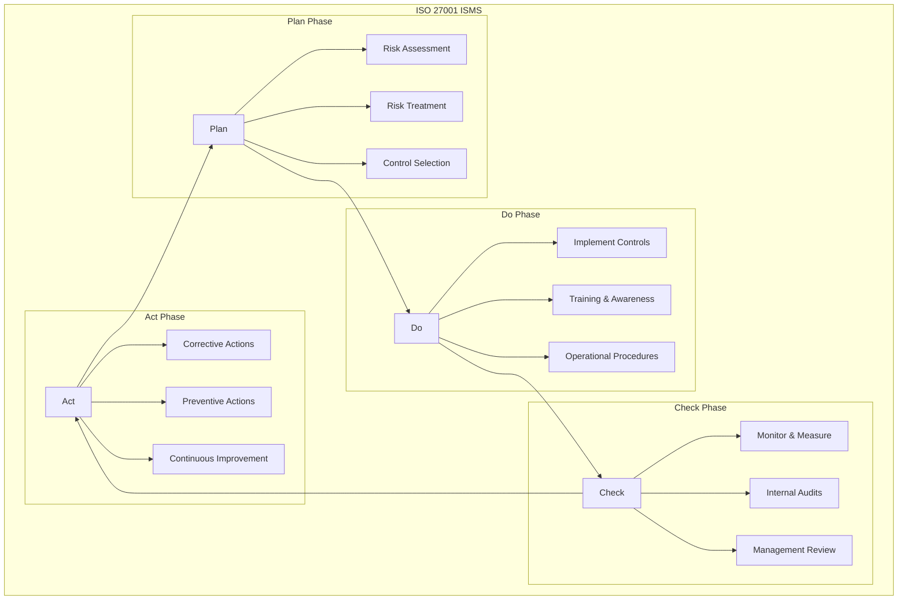

### SOC 2 Trust Service Criteria

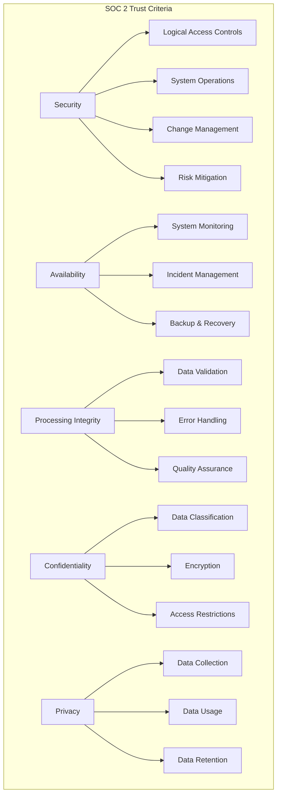

## 🌐 Cross-Border Data Transfer Compliance

### International Data Transfer Framework

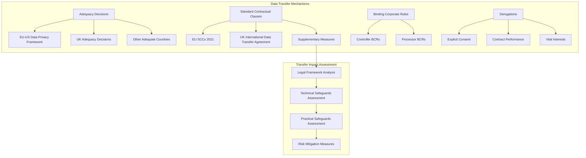

**Transfer Impact Assessment Implementation:**
```rust
pub struct TransferImpactAssessment {
    pub assessment_id: Uuid,
    pub destination_country: String,
    pub legal_framework_analysis: LegalFrameworkAnalysis,
    pub technical_safeguards: Vec<TechnicalSafeguard>,
    pub practical_safeguards: Vec<PracticalSafeguard>,
    pub risk_level: TransferRiskLevel,
    pub mitigation_measures: Vec<MitigationMeasure>,
    pub approval_status: TransferApprovalStatus,
}

pub struct LegalFrameworkAnalysis {
    pub surveillance_laws: SurveillanceLawsAssessment,
    pub data_protection_laws: DataProtectionLawsAssessment,
    pub enforcement_mechanisms: EnforcementMechanismsAssessment,
    pub judicial_redress: JudicialRedressAssessment,
}

impl TransferImpactAssessment {
    pub async fn assess_transfer_risk(
        &self,
        transfer_request: DataTransferRequest,
    ) -> Result<TransferRiskAssessment, ComplianceError> {
        // Analyze destination country legal framework
        let legal_risk = self.assess_legal_framework_risk(&transfer_request.destination).await?;

        // Evaluate technical safeguards
        let technical_risk = self.assess_technical_safeguards_adequacy(&transfer_request).await?;

        // Assess practical safeguards
        let practical_risk = self.assess_practical_safeguards_adequacy(&transfer_request).await?;

        // Calculate overall risk
        let overall_risk = self.calculate_overall_transfer_risk(
            legal_risk,
            technical_risk,
            practical_risk,
        ).await?;

        Ok(TransferRiskAssessment {
            overall_risk,
            legal_risk,
            technical_risk,
            practical_risk,
            recommendations: self.generate_risk_mitigation_recommendations(&overall_risk).await?,
        })
    }
}
```

## 📊 Compliance Monitoring & Reporting

### Automated Compliance Monitoring

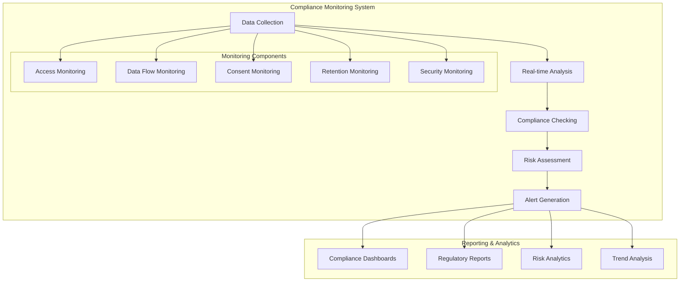

**Compliance Monitoring Implementation:**
```rust
pub struct ComplianceMonitoringSystem {
    monitors: HashMap<ComplianceRegulation, Box<dyn ComplianceMonitor>>,
    alert_manager: Arc<RwLock<AlertManager>>,
    report_generator: Arc<RwLock<ReportGenerator>>,
    analytics_engine: Arc<RwLock<ComplianceAnalyticsEngine>>,
}

pub trait ComplianceMonitor: Send + Sync {
    async fn check_compliance(&self, event: &ComplianceEvent) -> Result<ComplianceStatus, ComplianceError>;
    async fn generate_violations(&self) -> Result<Vec<ComplianceViolation>, ComplianceError>;
    fn get_regulation(&self) -> ComplianceRegulation;
}

pub struct GDPRComplianceMonitor {
    consent_checker: Arc<RwLock<ConsentChecker>>,
    retention_checker: Arc<RwLock<RetentionChecker>>,
    access_rights_checker: Arc<RwLock<AccessRightsChecker>>,
}

impl ComplianceMonitor for GDPRComplianceMonitor {
    async fn check_compliance(&self, event: &ComplianceEvent) -> Result<ComplianceStatus, ComplianceError> {
        match event.event_type {
            ComplianceEventType::DataProcessing => {
                // Check consent validity
                let consent_status = self.consent_checker
                    .read().await
                    .check_consent_validity(&event.subject_id, &event.processing_purpose).await?;

                if !consent_status.is_valid {
                    return Ok(ComplianceStatus::Violation {
                        regulation: ComplianceRegulation::GDPR,
                        article: "Article 6".to_string(),
                        description: "Processing without valid legal basis".to_string(),
                        severity: ViolationSeverity::High,
                    });
                }

                Ok(ComplianceStatus::Compliant)
            },
            ComplianceEventType::DataRetention => {
                // Check retention period compliance
                let retention_status = self.retention_checker
                    .read().await
                    .check_retention_compliance(&event.data_category).await?;

                if retention_status.is_expired {
                    return Ok(ComplianceStatus::Violation {
                        regulation: ComplianceRegulation::GDPR,
                        article: "Article 5(1)(e)".to_string(),
                        description: "Data retained beyond lawful period".to_string(),
                        severity: ViolationSeverity::Medium,
                    });
                }

                Ok(ComplianceStatus::Compliant)
            },
            _ => Ok(ComplianceStatus::NotApplicable),
        }
    }
}
```

### Regulatory Reporting Automation

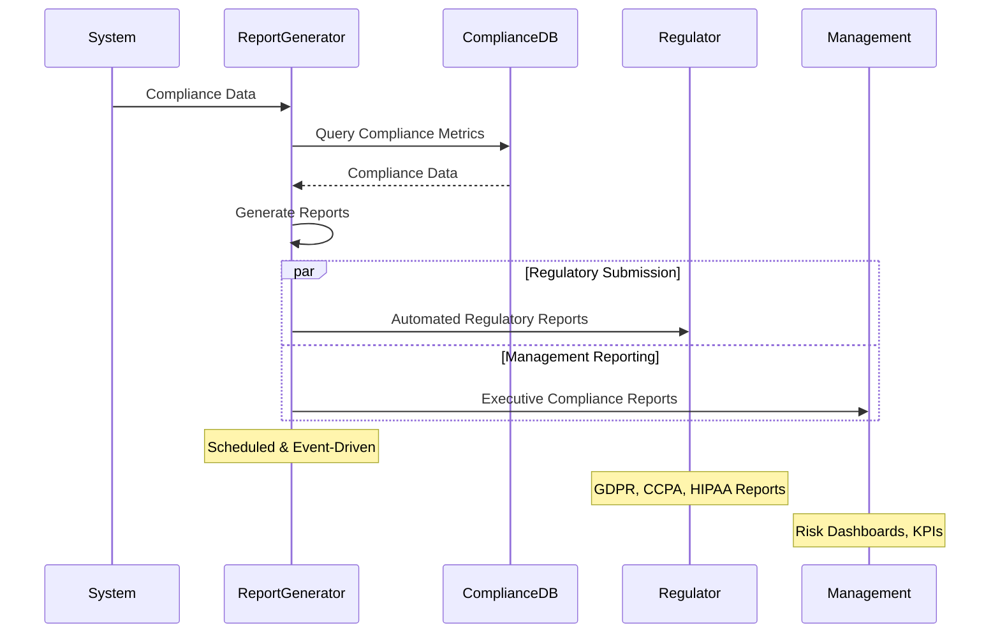

## 🔍 Compliance Audit Framework

### Internal Audit Program

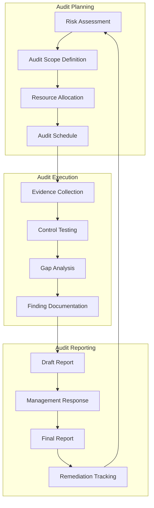

**Audit Framework Implementation:**
```rust
pub struct ComplianceAuditFramework {
    audit_scheduler: Arc<RwLock<AuditScheduler>>,
    evidence_collector: Arc<RwLock<EvidenceCollector>>,
    control_tester: Arc<RwLock<ControlTester>>,
    report_generator: Arc<RwLock<AuditReportGenerator>>,
}

pub struct ComplianceAudit {
    pub audit_id: Uuid,
    pub audit_type: AuditType,
    pub scope: AuditScope,
    pub regulations: Vec<ComplianceRegulation>,
    pub start_date: DateTime<Utc>,
    pub end_date: DateTime<Utc>,
    pub auditor: String,
    pub status: AuditStatus,
    pub findings: Vec<AuditFinding>,
}

pub enum AuditType {
    Internal,
    External,
    Regulatory,
    Certification,
}

impl ComplianceAuditFramework {
    pub async fn conduct_compliance_audit(
        &self,
        audit_request: AuditRequest,
    ) -> Result<AuditReport, ComplianceError> {
        // Create audit plan
        let audit_plan = self.create_audit_plan(&audit_request).await?;

        // Collect evidence
        let evidence = self.evidence_collector
            .read().await
            .collect_compliance_evidence(&audit_plan).await?;

        // Test controls
        let control_test_results = self.control_tester
            .read().await
            .test_compliance_controls(&audit_plan, &evidence).await?;

        // Generate findings
        let findings = self.analyze_control_test_results(&control_test_results).await?;

        // Generate audit report
        let report = self.report_generator
            .read().await
            .generate_audit_report(&audit_plan, &findings).await?;

        Ok(report)
    }
}
```

## 🚨 Incident Response & Breach Notification

### Data Breach Response Framework

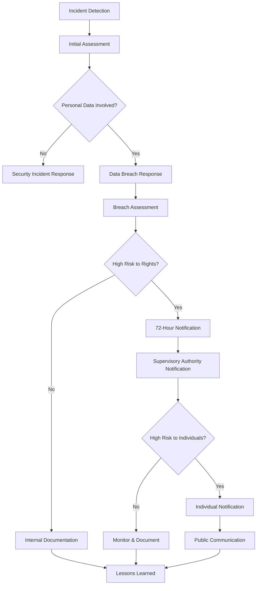

**Breach Response Implementation:**
```rust
pub struct DataBreachResponseSystem {
    incident_detector: Arc<RwLock<IncidentDetector>>,
    breach_assessor: Arc<RwLock<BreachAssessor>>,
    notification_manager: Arc<RwLock<NotificationManager>>,
    documentation_system: Arc<RwLock<BreachDocumentationSystem>>,
}

pub struct DataBreachIncident {
    pub incident_id: Uuid,
    pub detection_time: DateTime<Utc>,
    pub incident_type: IncidentType,
    pub affected_data_categories: Vec<DataCategory>,
    pub affected_individuals_count: Option<u32>,
    pub breach_circumstances: BreachCircumstances,
    pub risk_assessment: RiskAssessment,
    pub containment_measures: Vec<ContainmentMeasure>,
    pub notification_requirements: NotificationRequirements,
}

impl DataBreachResponseSystem {
    pub async fn handle_data_breach(
        &self,
        incident: DataBreachIncident,
    ) -> Result<BreachResponseResult, ComplianceError> {
        // Assess breach severity and risk
        let risk_assessment = self.breach_assessor
            .read().await
            .assess_breach_risk(&incident).await?;

        // Determine notification requirements
        let notification_requirements = self.determine_notification_requirements(
            &incident,
            &risk_assessment,
        ).await?;

        // Execute notifications if required
        if notification_requirements.supervisory_authority_required {
            self.notification_manager
                .read().await
                .notify_supervisory_authority(&incident, &risk_assessment).await?;
        }

        if notification_requirements.individual_notification_required {
            self.notification_manager
                .read().await
                .notify_affected_individuals(&incident).await?;
        }

        // Document breach for compliance
        self.documentation_system
            .write().await
            .document_breach_incident(&incident, &risk_assessment).await?;

        Ok(BreachResponseResult {
            incident_id: incident.incident_id,
            response_actions: notification_requirements.actions_taken,
            compliance_status: ComplianceStatus::Compliant,
        })
    }
}
```

## 📈 Compliance Metrics & KPIs

### Compliance Performance Dashboard

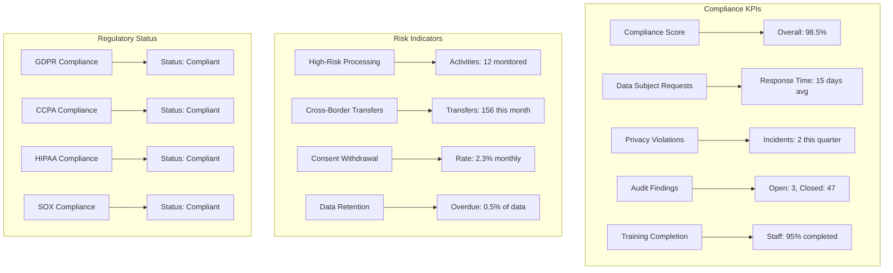

## 🔗 Related Documentation

- **[Security Architecture](./security-architecture.md)** - Security framework implementation
- **[Encryption & Privacy](./encryption-privacy.md)** - Data protection mechanisms
- **[Audit & Monitoring](../deployment/monitoring.md)** - Compliance monitoring
- **[Development Security](../development/security.md)** - Secure development practices
- **[Data Flow Architecture](./data-flow.md)** - Compliant data processing flows
- **[API Security](../api/authentication.md)** - API compliance controls

---

**Phase 3 Complete**: Security & Compliance documentation fully established. Ready for Phase 4: Deployment & Infrastructure.
