# 🧩 Component Architecture

## Overview

The Free Deep Research System follows a modular, layered architecture with clear separation of concerns. This document provides a detailed breakdown of all system components, their relationships, and interaction patterns.

## 🏗️ Architecture Layers

### 1. Presentation Layer

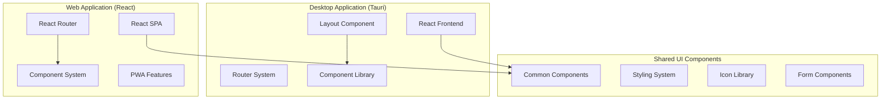

**Desktop Application Components:**
- **React Frontend**: TypeScript-based React application
- **Layout System**: Responsive layout with sidebar navigation
- **Routing**: React Router for SPA navigation
- **Component Library**: Reusable UI components with Tailwind CSS

**Web Application Components:**
- **React SPA**: Browser-based React application
- **PWA Features**: Service worker, offline capabilities
- **Responsive Design**: Mobile-first responsive layout

### 2. Backend Service Layer

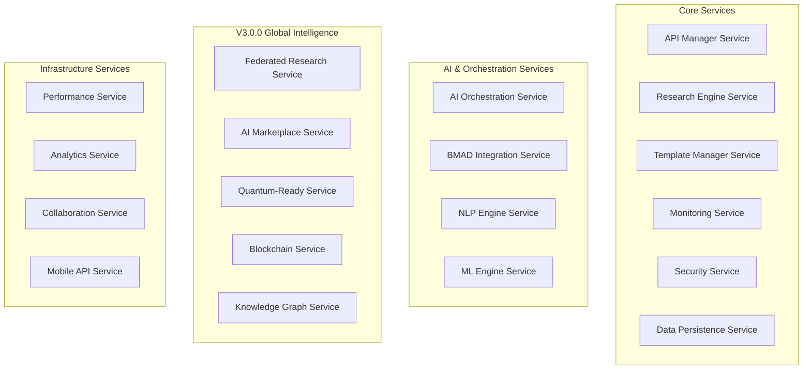

**Core Services:**
- **API Manager**: External API integration and rate limiting
- **Research Engine**: Research workflow orchestration
- **Template Manager**: Research template management and execution
- **Monitoring**: System health and performance monitoring
- **Security**: Authentication, authorization, and encryption
- **Data Persistence**: Database operations and data management

### 3. Service Manager Architecture

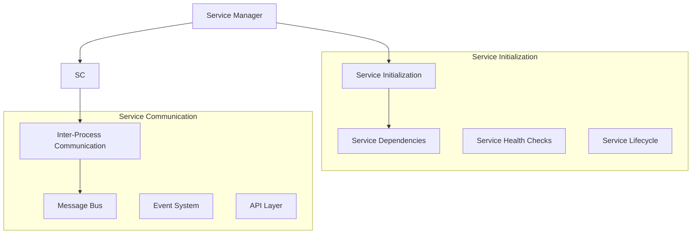

**Service Manager Responsibilities:**
- **Service Lifecycle**: Initialize, start, stop, and restart services
- **Dependency Management**: Ensure proper service initialization order
- **Health Monitoring**: Monitor service health and handle failures
- **Communication**: Facilitate inter-service communication

### 4. AI Orchestration Components

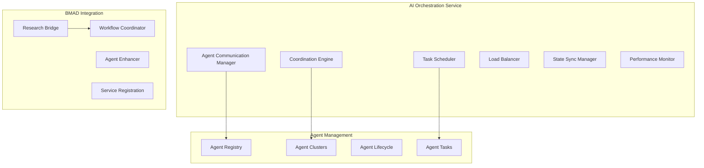

**AI Orchestration Components:**
- **Agent Communication**: Message passing between AI agents
- **Coordination Engine**: Multi-agent collaboration protocols
- **Task Scheduler**: AI task distribution and execution
- **Load Balancer**: Agent workload distribution
- **State Synchronization**: Agent state consistency management

### 5. Data Layer Components

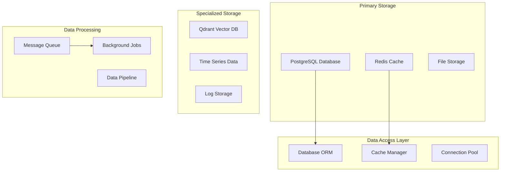

**Data Components:**
- **PostgreSQL**: Primary relational database for structured data
- **Redis**: High-performance caching and session storage
- **Qdrant**: Vector database for semantic search and AI operations
- **File Storage**: S3-compatible storage for documents and media

## 🔄 Component Interaction Patterns

### Request Flow Pattern

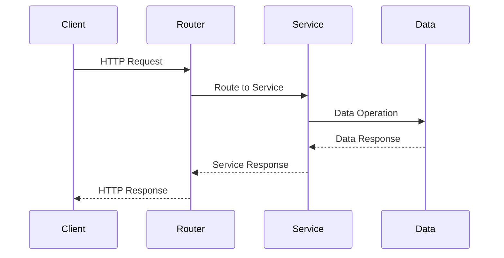

### Event-Driven Pattern

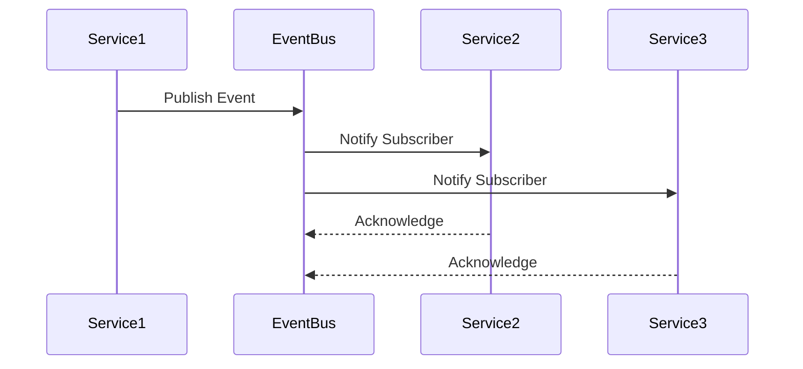

## 📦 Package Structure

### AI Orchestrator Package

```
packages/ai-orchestrator/
├── core/                    # Core orchestrator engine
├── config/                  # Configuration management
├── agents/                  # AI agent definitions
├── integration/             # Research system integration
├── workflows/               # Workflow management
└── resources/               # Shared resources
```

### BMAD Core Package

```
packages/bmad-core/
├── personas/                # Agent persona definitions
├── tasks/                   # Task specifications
├── templates/               # Document templates
├── checklists/              # Quality checklists
└── data/                    # Knowledge base data
```

## 🔧 Component Dependencies

### Service Dependency Graph

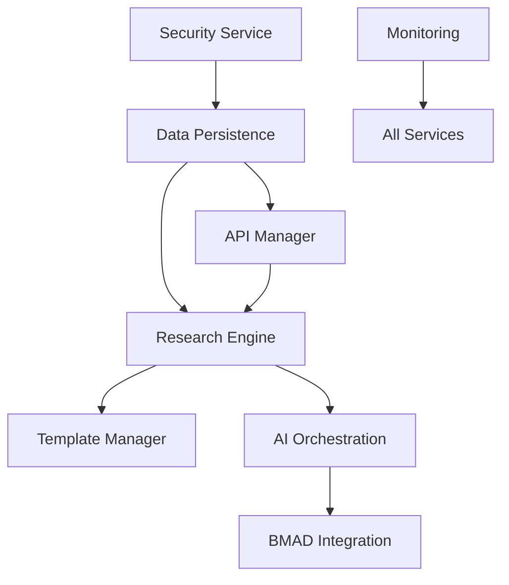

**Dependency Rules:**
1. **Security Service**: No dependencies (initialized first)
2. **Data Persistence**: Depends on Security Service
3. **API Manager**: Depends on Data Persistence
4. **Research Engine**: Depends on API Manager and Data Persistence
5. **AI Orchestration**: Depends on Research Engine
6. **BMAD Integration**: Depends on AI Orchestration

## 🚀 Component Lifecycle

### Service Initialization Sequence

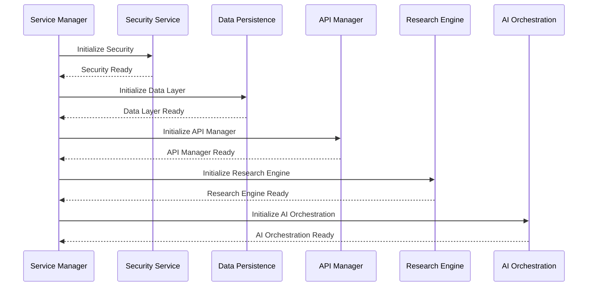

## 📊 Component Metrics

### Performance Characteristics

| Component | Startup Time | Memory Usage | CPU Usage | Scalability |
|-----------|-------------|--------------|-----------|-------------|
| API Manager | < 2s | 50-100MB | Low | High |
| Research Engine | < 5s | 100-200MB | Medium | High |
| AI Orchestration | < 3s | 150-300MB | Medium | High |
| Data Persistence | < 1s | 30-50MB | Low | High |
| Security Service | < 1s | 20-30MB | Low | High |

## 🔧 Component Configuration

### Service Configuration Management

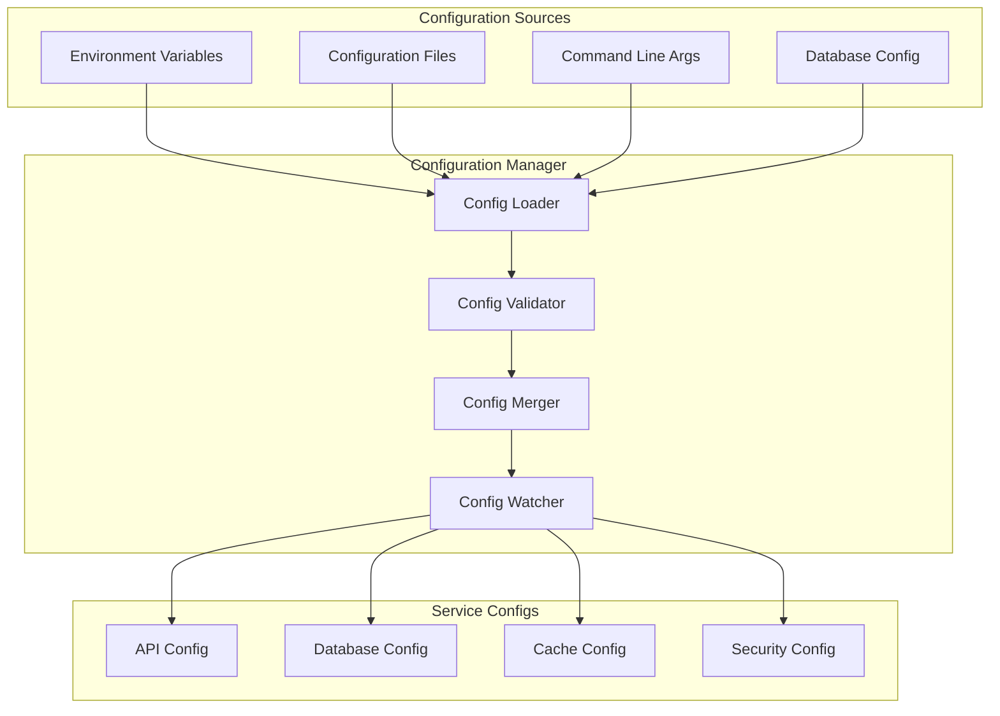

**Configuration Hierarchy:**
1. **Default Values**: Built-in sensible defaults
2. **Configuration Files**: YAML/TOML configuration files
3. **Environment Variables**: Runtime environment overrides
4. **Command Line Arguments**: Highest priority overrides

### Component Health Monitoring

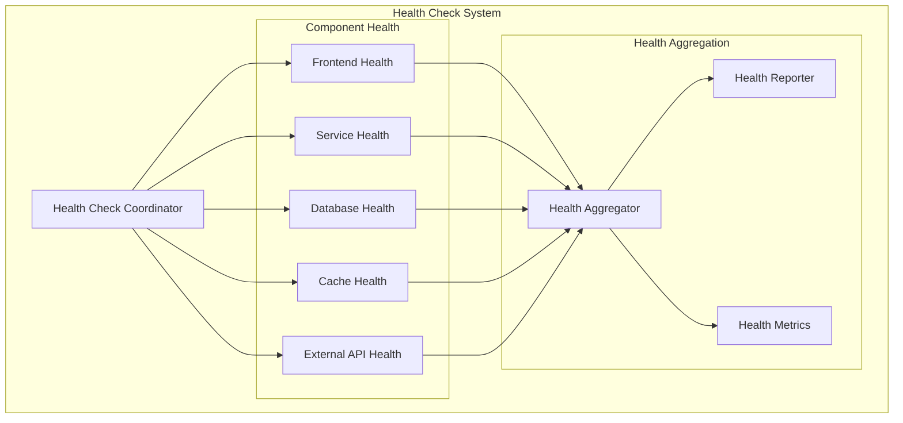

**Health Check Types:**
- **Liveness Checks**: Component is running and responsive
- **Readiness Checks**: Component is ready to handle requests
- **Dependency Checks**: External dependencies are available
- **Resource Checks**: System resources are within limits

## 🚀 Component Scaling Patterns

### Horizontal Scaling Architecture

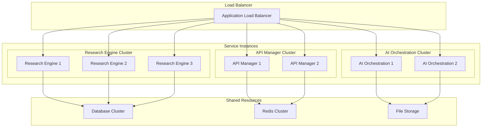

### Auto-Scaling Triggers

| Component | Scale Up Trigger | Scale Down Trigger | Min Instances | Max Instances |
|-----------|------------------|-------------------|---------------|---------------|
| **Research Engine** | CPU > 70% for 5min | CPU < 30% for 10min | 2 | 10 |
| **API Manager** | Request rate > 1000/s | Request rate < 200/s | 2 | 8 |
| **AI Orchestration** | Queue depth > 50 | Queue depth < 10 | 1 | 6 |
| **Data Persistence** | Connection pool > 80% | Connection pool < 40% | 2 | 4 |

## 🔒 Component Security Architecture

### Security Component Integration

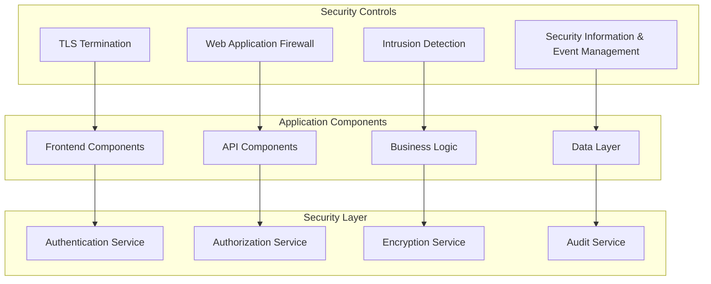

**Security Integration Points:**
- **Frontend Security**: CSP headers, XSS protection, secure cookies
- **API Security**: JWT validation, rate limiting, input sanitization
- **Business Logic Security**: Authorization checks, data validation
- **Data Security**: Encryption at rest, secure connections, audit logging

## 📊 Component Performance Optimization

### Performance Monitoring Stack

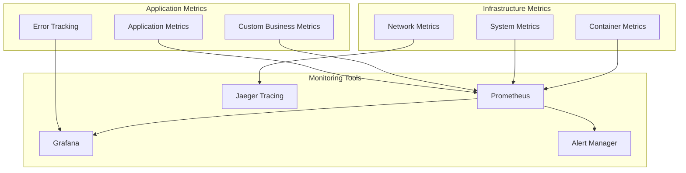

### Component Performance Targets

| Component | Latency Target | Throughput Target | Resource Limits |
|-----------|---------------|-------------------|-----------------|
| **Frontend** | < 100ms render | 60 FPS | 512MB RAM |
| **API Gateway** | < 50ms routing | 10,000 RPS | 1GB RAM |
| **Research Engine** | < 30s workflow | 100 concurrent | 2GB RAM |
| **AI Orchestration** | < 5s task dispatch | 1,000 tasks/min | 4GB RAM |
| **Data Layer** | < 10ms query | 10,000 QPS | 8GB RAM |

## 🔄 Component Update & Deployment

### Rolling Update Strategy

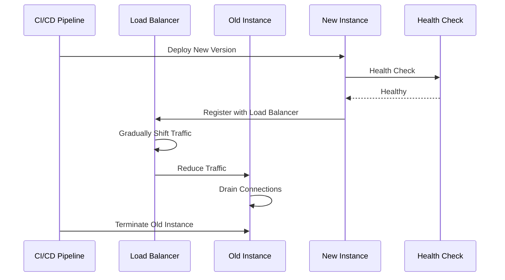

### Component Versioning Strategy

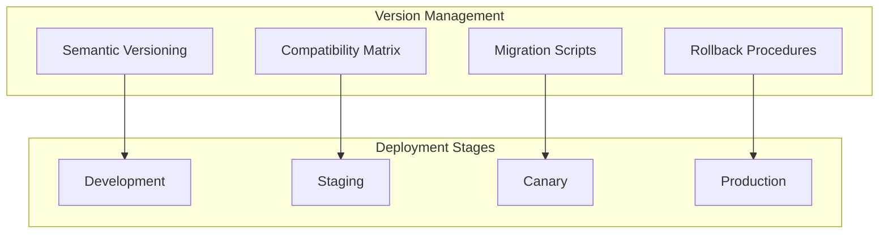

## 🔗 Related Documentation

- **[Data Flow Architecture](./data-flow.md)** - Data movement patterns
- **[Service Architecture](./service-architecture.md)** - Service design patterns
- **[API Architecture](./api-architecture.md)** - API design and integration
- **[System Overview](./system-overview.md)** - High-level architecture
- **[Security Architecture](./security-architecture.md)** - Security implementation
- **[Deployment Architecture](./deployment-architecture.md)** - Deployment strategies

---

**Next**: Explore [Data Flow Architecture](./data-flow.md) for detailed data movement patterns.
