# 🌊 Data Flow Architecture

## Overview

This document describes the data flow patterns, processing pipelines, and information movement throughout the Free Deep Research System. Understanding these flows is crucial for system optimization, debugging, and feature development.

## 🔄 Primary Data Flow Patterns

### 1. Research Workflow Data Flow

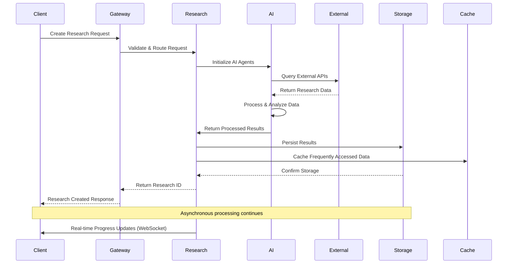

### 2. API Key Management Flow

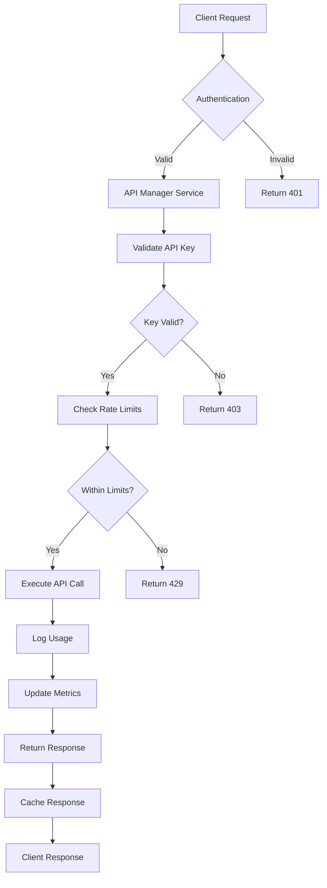

### 3. Real-time Data Synchronization

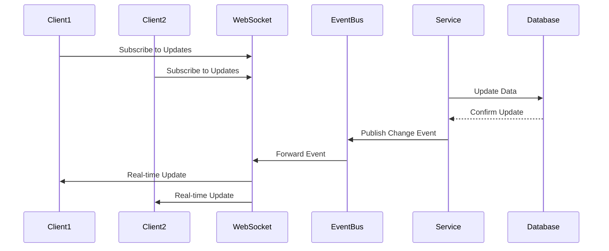

## 📊 Data Processing Pipelines

### Research Data Processing Pipeline

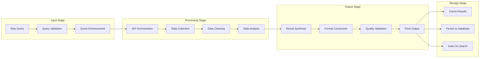

### AI Agent Communication Pipeline

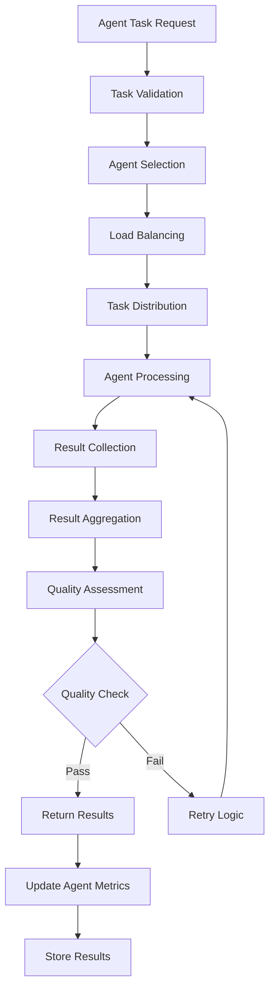

## 🗄️ Data Storage Patterns

### Database Write Patterns

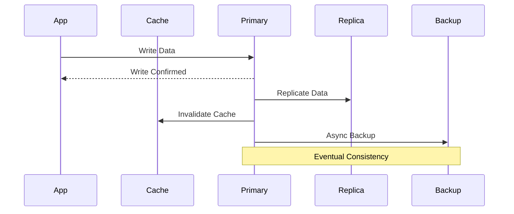

### Cache Management Flow

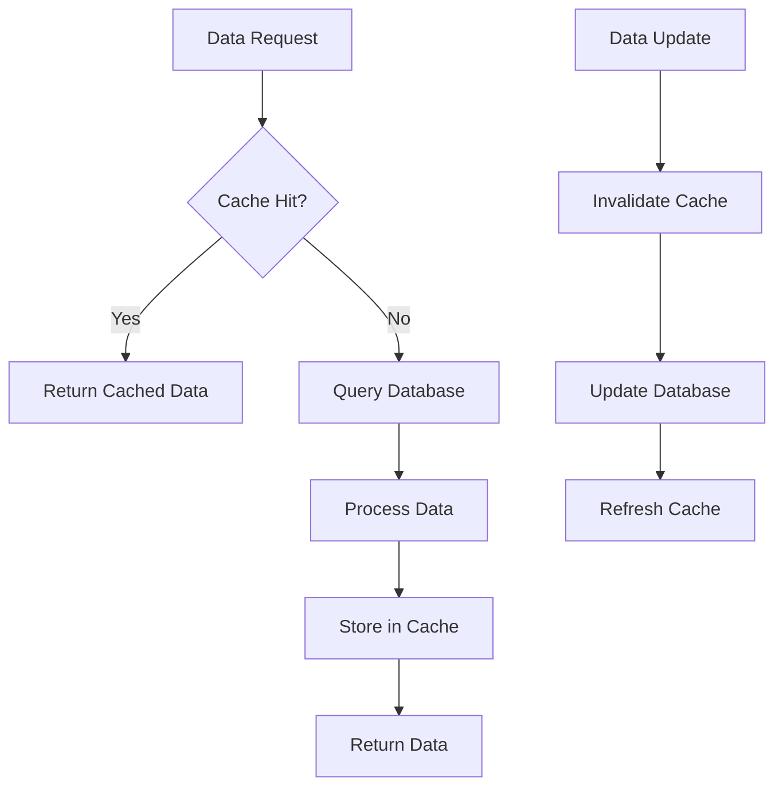

## 🔄 Event-Driven Data Flow

### Event Processing Architecture

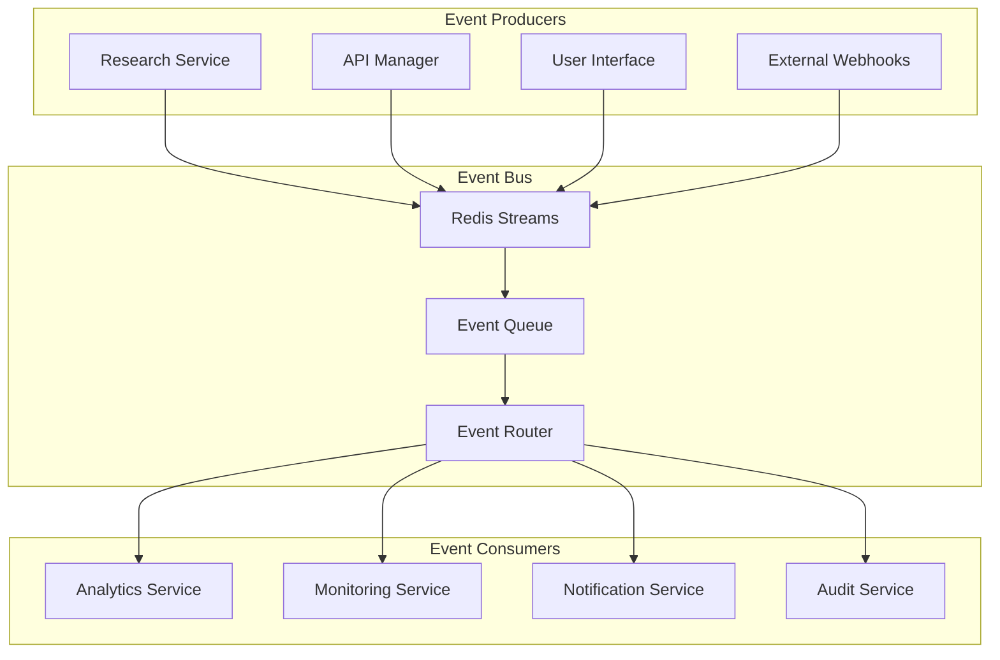

### Event Types and Routing

| Event Type | Producer | Consumers | Processing |
|------------|----------|-----------|------------|
| `research.started` | Research Engine | Analytics, Monitoring | Real-time |
| `research.completed` | Research Engine | Analytics, Notifications | Real-time |
| `api.rate_limit` | API Manager | Monitoring, Alerts | Real-time |
| `user.login` | Security Service | Analytics, Audit | Real-time |
| `system.error` | All Services | Monitoring, Alerts | Real-time |

## 📈 Data Transformation Flows

### Research Data Transformation

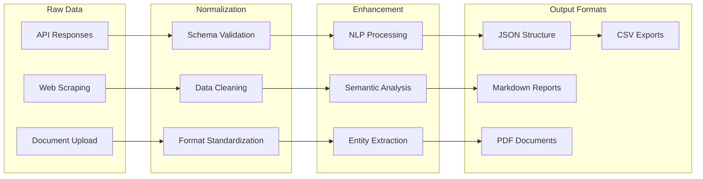

### Analytics Data Pipeline

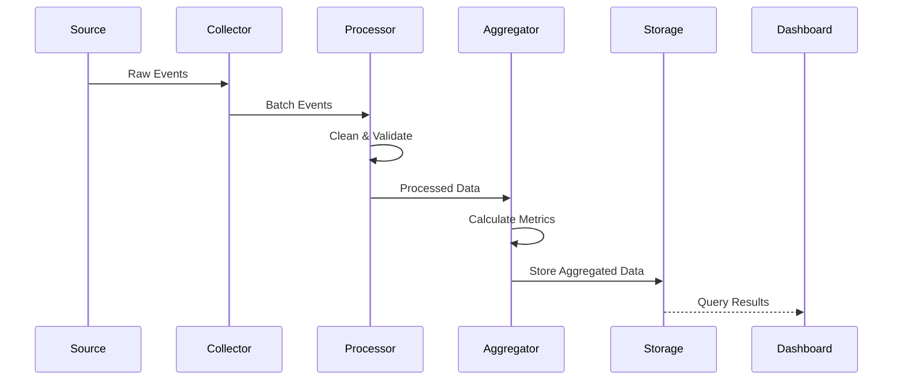

## 🔐 Secure Data Flow

### Authentication Data Flow

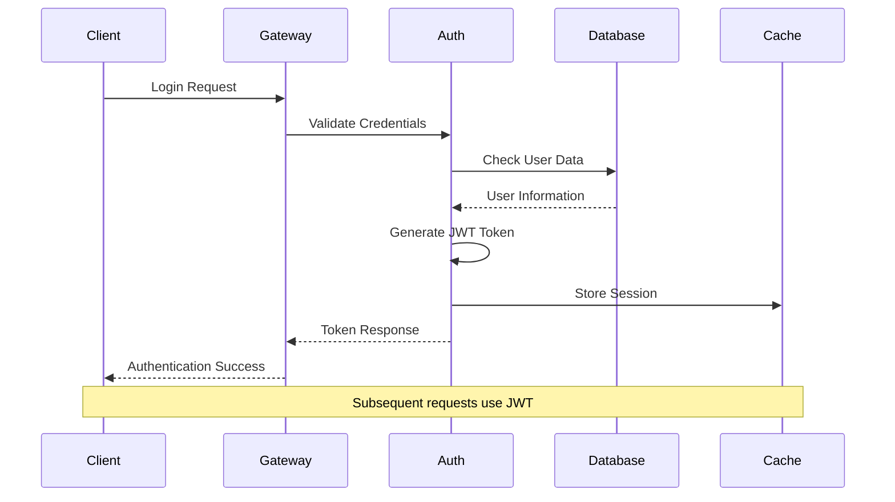

### Data Encryption Flow

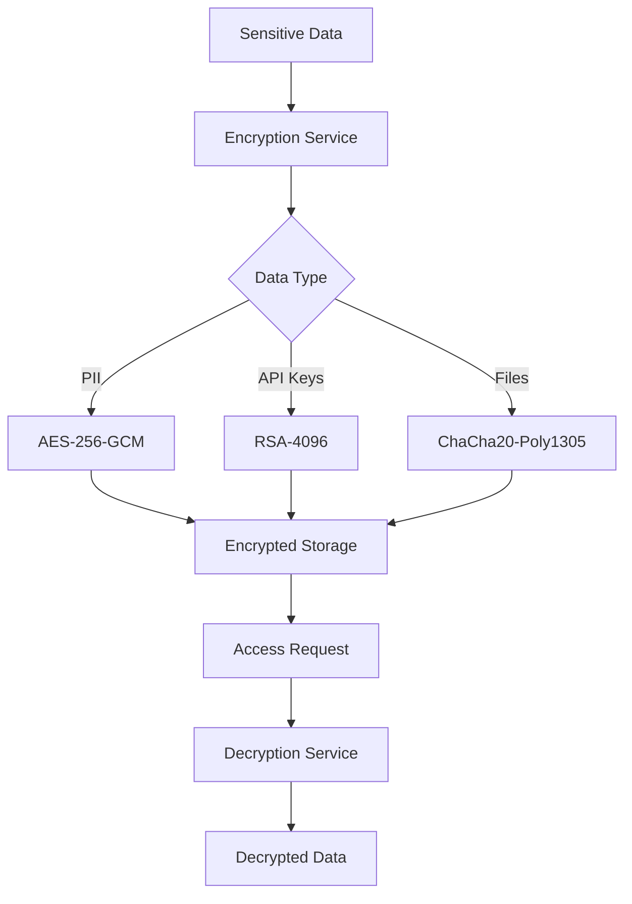

## 📊 Performance Optimization Flows

### Caching Strategy

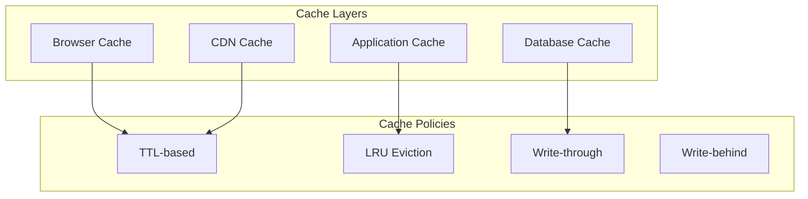

### Load Balancing Data Flow

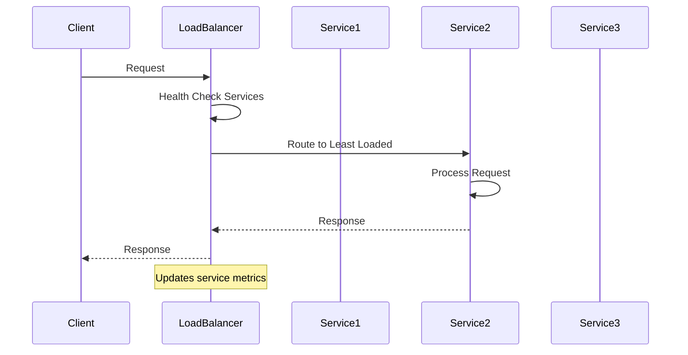

## 🔍 Monitoring Data Flow

### Metrics Collection Pipeline

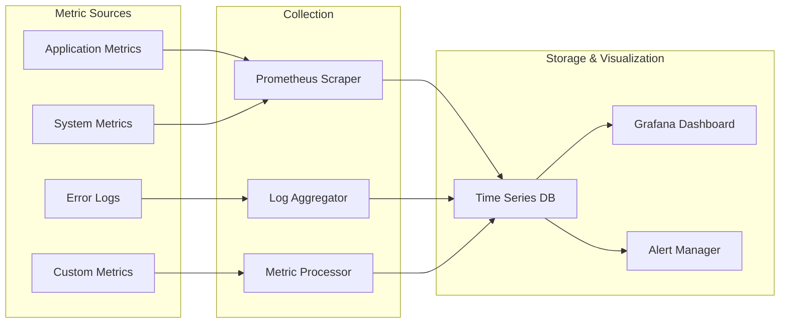

## 🔄 Advanced Data Flow Patterns

### Batch Processing Pipeline

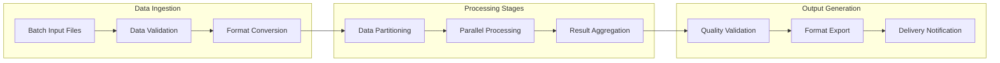

### Stream Processing Architecture

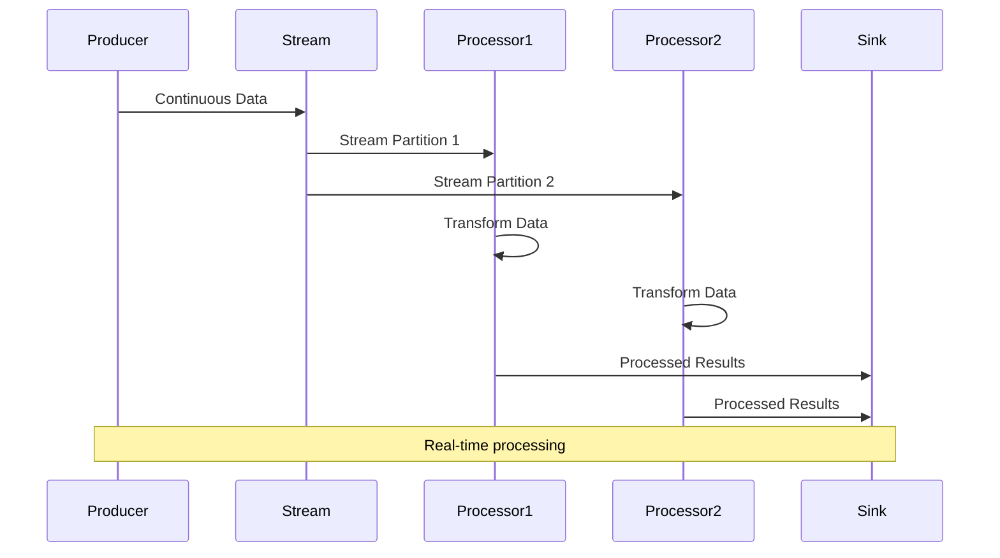

### Data Lineage Tracking

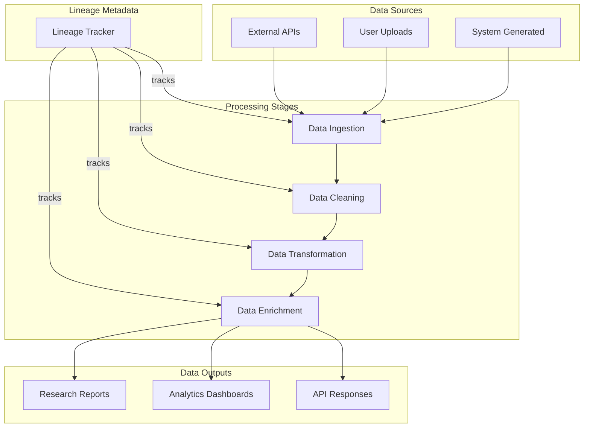

## 📊 Data Quality Management

### Data Quality Pipeline

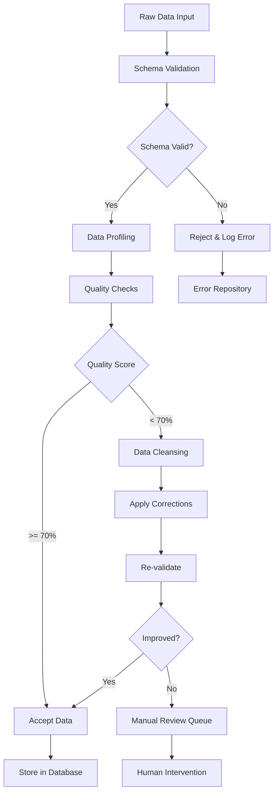

### Data Quality Metrics

| Quality Dimension | Measurement | Threshold | Action |
|------------------|-------------|-----------|--------|
| **Completeness** | % of non-null values | > 95% | Auto-accept |
| **Accuracy** | % of valid values | > 90% | Auto-accept |
| **Consistency** | % of consistent formats | > 98% | Auto-accept |
| **Timeliness** | Data freshness | < 1 hour | Auto-accept |
| **Uniqueness** | % of unique records | > 99% | Auto-accept |

## 🔐 Secure Data Flow Patterns

### Data Encryption Flow

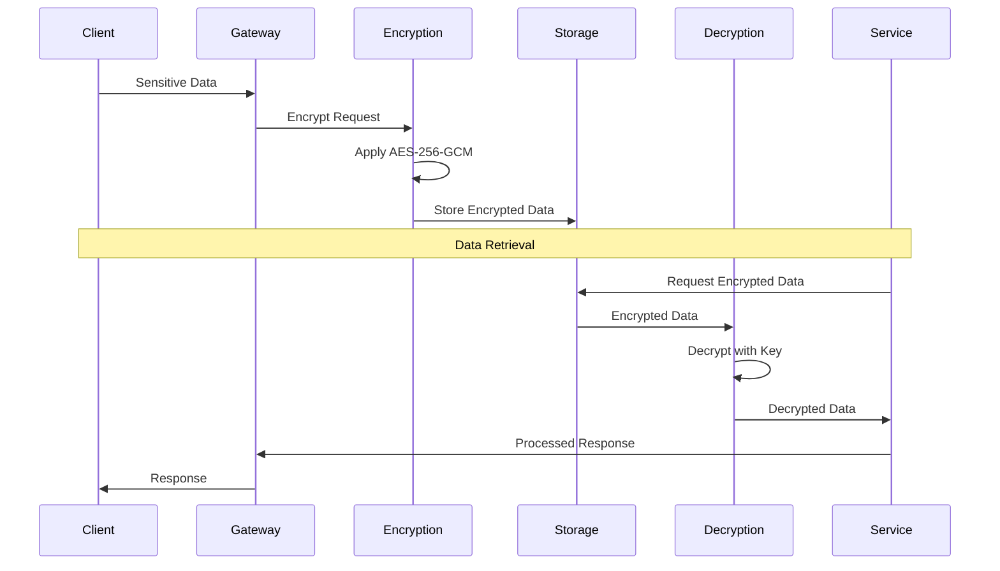

### Data Masking Pipeline

```mermaid
flowchart LR
    subgraph "Production Data"
        A[Customer PII]
        B[Financial Data]
        C[Health Records]
    end

    subgraph "Masking Engine"
        D[Data Classification]
        E[Masking Rules]
        F[Anonymization]
    end

    subgraph "Masked Data"
        G[Synthetic PII]
        H[Scrambled Financial]
        I[De-identified Health]
    end

    A --> D
    B --> D
    C --> D
    D --> E
    E --> F
    F --> G
    F --> H
    F --> I
```

## 📈 Performance Optimization Flows

### Query Optimization Pipeline

```mermaid
sequenceDiagram
    participant App
    participant QueryOptimizer
    participant Cache
    participant Database
    participant Index

    App->>QueryOptimizer: SQL Query
    QueryOptimizer->>Cache: Check Query Cache
    Cache-->>QueryOptimizer: Cache Miss

    QueryOptimizer->>QueryOptimizer: Analyze Query Plan
    QueryOptimizer->>Index: Check Index Usage
    Index-->>QueryOptimizer: Optimal Index Found

    QueryOptimizer->>Database: Optimized Query
    Database-->>QueryOptimizer: Query Results
    QueryOptimizer->>Cache: Store Results
    QueryOptimizer-->>App: Optimized Response
```

### Connection Pool Management

```mermaid
graph TB
    subgraph "Connection Pool"
        CP[Pool Manager]

        subgraph "Active Connections"
            AC1[Connection 1]
            AC2[Connection 2]
            AC3[Connection 3]
        end

        subgraph "Idle Connections"
            IC1[Connection 4]
            IC2[Connection 5]
        end
    end

    subgraph "Application Requests"
        AR1[Request 1]
        AR2[Request 2]
        AR3[Request 3]
        AR4[Request 4]
    end

    AR1 --> CP
    AR2 --> CP
    AR3 --> CP
    AR4 --> CP

    CP --> AC1
    CP --> AC2
    CP --> AC3
    CP --> IC1
```

## 🔄 Data Synchronization Patterns

### Multi-Region Data Sync

```mermaid
sequenceDiagram
    participant Region1
    participant SyncService
    participant Region2
    participant Region3
    participant ConflictResolver

    Region1->>SyncService: Data Update
    SyncService->>Region2: Replicate Update
    SyncService->>Region3: Replicate Update

    Region2->>SyncService: Concurrent Update
    SyncService->>ConflictResolver: Conflict Detected
    ConflictResolver->>ConflictResolver: Apply Resolution Strategy
    ConflictResolver->>SyncService: Resolved Update

    SyncService->>Region1: Apply Resolution
    SyncService->>Region3: Apply Resolution
```

### Event Sourcing Data Flow

```mermaid
flowchart TD
    A[Command] --> B[Command Handler]
    B --> C[Validate Command]
    C --> D{Valid?}
    D -->|No| E[Reject Command]
    D -->|Yes| F[Generate Events]

    F --> G[Event Store]
    G --> H[Event Stream]
    H --> I[Event Handlers]

    I --> J[Update Read Models]
    I --> K[Trigger Side Effects]
    I --> L[Send Notifications]

    J --> M[Query Database]
    K --> N[External Services]
    L --> O[Message Queue]
```

## 📊 Analytics Data Pipeline

### Real-time Analytics Flow

```mermaid
graph TB
    subgraph "Data Sources"
        A[User Events]
        B[System Metrics]
        C[Application Logs]
    end

    subgraph "Stream Processing"
        D[Event Ingestion]
        E[Stream Analytics]
        F[Aggregation Engine]
    end

    subgraph "Storage & Serving"
        G[Time Series DB]
        H[Analytics API]
        I[Dashboard Service]
    end

    A --> D
    B --> D
    C --> D
    D --> E
    E --> F
    F --> G
    G --> H
    H --> I
```

### Batch Analytics Pipeline

```mermaid
sequenceDiagram
    participant Scheduler
    participant DataLake
    participant ETL
    participant Warehouse
    participant Analytics
    participant Reports

    Scheduler->>DataLake: Extract Raw Data
    DataLake->>ETL: Batch Data Transfer
    ETL->>ETL: Transform & Clean
    ETL->>Warehouse: Load Processed Data
    Warehouse->>Analytics: Run Analytics Jobs
    Analytics->>Reports: Generate Reports
    Reports->>Scheduler: Job Complete
```

## 🔗 Related Documentation

- **[Component Architecture](./component-architecture.md)** - System component breakdown
- **[Service Architecture](./service-architecture.md)** - Service interaction patterns
- **[API Architecture](./api-architecture.md)** - API data flow patterns
- **[Security Architecture](./security-architecture.md)** - Security data flows
- **[Performance Optimization](../development/performance.md)** - Performance tuning
- **[Monitoring Guide](../deployment/monitoring.md)** - Data monitoring strategies

---

**Next**: Explore [Service Architecture](./service-architecture.md) for service design patterns.
