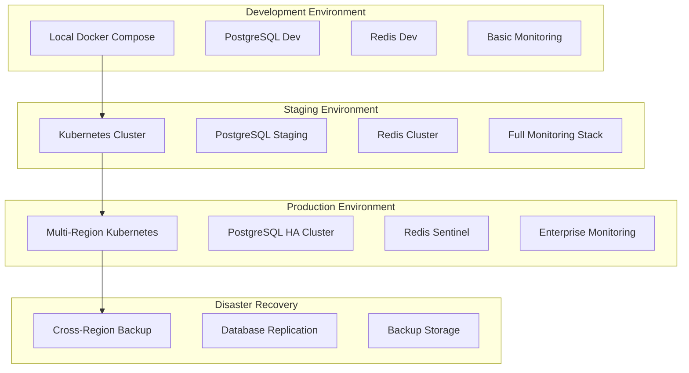
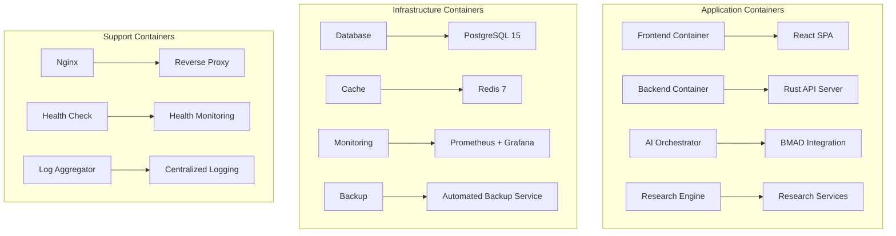
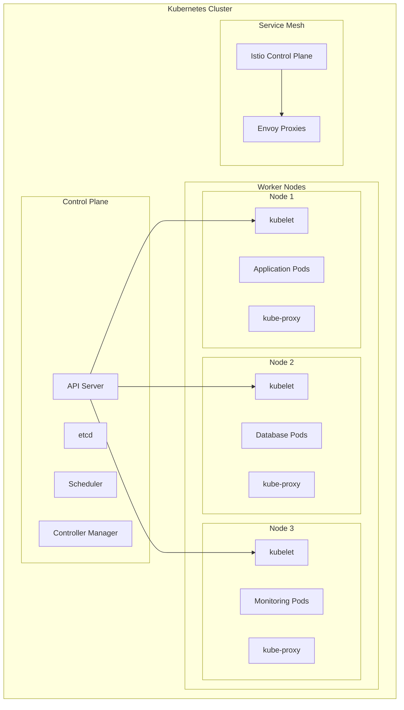
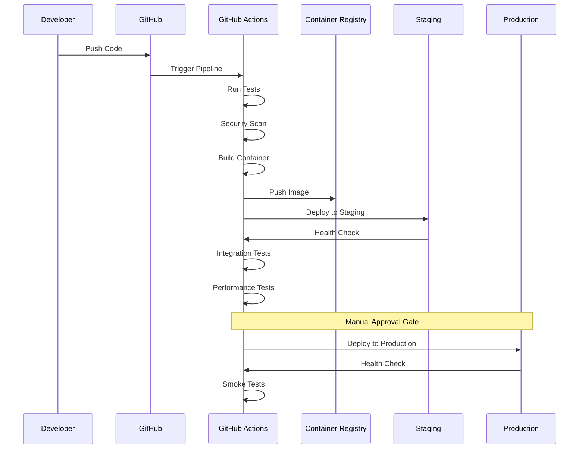
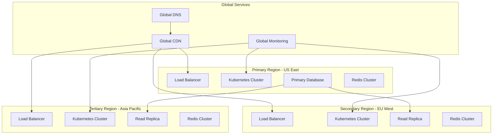
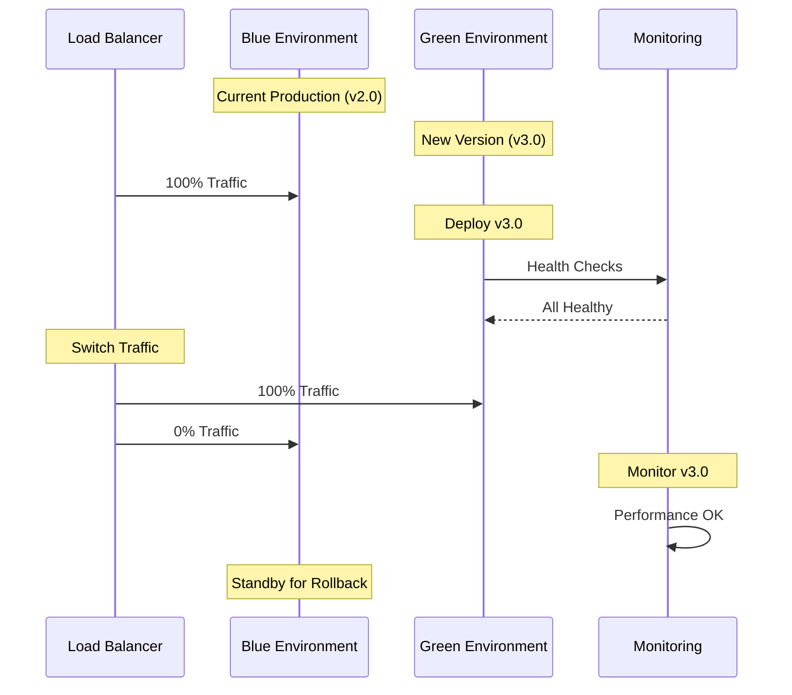
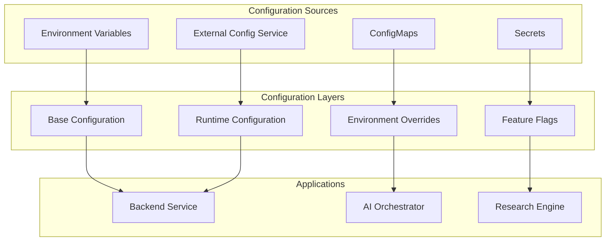
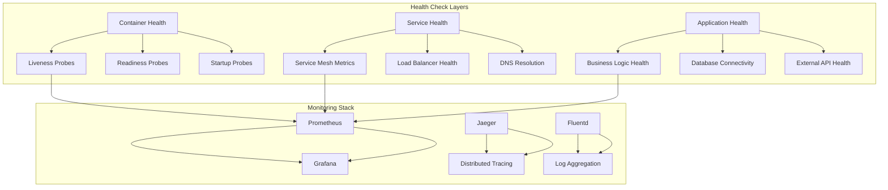
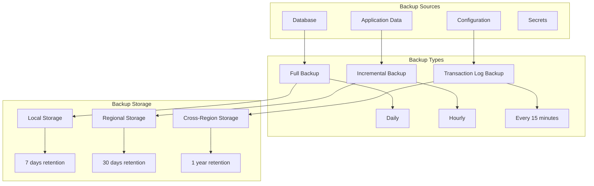

# 🚀 Deployment Architecture

## Overview

This document outlines the comprehensive deployment architecture for the Free Deep Research System, covering containerization strategies, orchestration patterns, environment management, and deployment pipelines across development, staging, and production environments.

## 🏗️ Deployment Strategy Overview

### Multi-Environment Architecture



### Deployment Patterns

| Environment | Pattern | Orchestration | Scalability | Availability |
|-------------|---------|---------------|-------------|--------------|
| **Development** | Single Node | Docker Compose | Manual | Basic |
| **Staging** | Multi-Node | Kubernetes | Auto-scaling | High |
| **Production** | Multi-Region | Kubernetes + Istio | Auto-scaling | 99.99% |
| **DR** | Cross-Region | Kubernetes | On-demand | Recovery |

## 🐳 Containerization Architecture

### Container Strategy



### Multi-Stage Docker Build

```dockerfile
# Production Dockerfile for Backend Service
FROM rust:1.75-slim as dependencies

# Install system dependencies
RUN apt-get update && apt-get install -y \
    pkg-config \
    libssl-dev \
    libpq-dev \
    libsqlite3-dev \
    curl \
    && rm -rf /var/lib/apt/lists/*

# Create app directory
WORKDIR /app

# Copy dependency files
COPY Cargo.toml Cargo.lock ./
COPY src-tauri/Cargo.toml ./src-tauri/

# Build dependencies (cached layer)
RUN mkdir src-tauri/src && \
    echo "fn main() {}" > src-tauri/src/main.rs && \
    cd src-tauri && \
    cargo build --release && \
    rm -rf src

# Stage 2: Build application
FROM dependencies AS builder

# Copy source code
COPY . .

# Build the application
WORKDIR /app/src-tauri
RUN cargo build --release

# Stage 3: Runtime image
FROM debian:bookworm-slim AS production

# Install runtime dependencies
RUN apt-get update && apt-get install -y \
    ca-certificates \
    libssl3 \
    libpq5 \
    curl \
    && rm -rf /var/lib/apt/lists/*

# Create non-root user
RUN useradd -m -u 1001 -s /bin/bash appuser

# Create app directory and set permissions
WORKDIR /app
RUN mkdir -p /app/logs /app/uploads /app/cache && \
    chown -R appuser:appuser /app

# Copy binary from builder stage
COPY --from=builder /app/src-tauri/target/release/free-deep-research /app/
COPY --from=builder /app/src-tauri/config/ /app/config/

# Switch to non-root user
USER appuser

# Health check
HEALTHCHECK --interval=30s --timeout=10s --start-period=60s --retries=3 \
    CMD curl -f http://localhost:8080/health || exit 1

# Expose port
EXPOSE 8080

# Start application
CMD ["./free-deep-research"]
```

### Container Resource Management

```yaml
# Resource allocation for production containers
resources:
  backend:
    requests:
      cpu: 500m
      memory: 1Gi
    limits:
      cpu: 2000m
      memory: 4Gi
  
  ai_orchestrator:
    requests:
      cpu: 1000m
      memory: 2Gi
    limits:
      cpu: 4000m
      memory: 8Gi
  
  research_engine:
    requests:
      cpu: 500m
      memory: 1Gi
    limits:
      cpu: 2000m
      memory: 4Gi
  
  database:
    requests:
      cpu: 1000m
      memory: 2Gi
    limits:
      cpu: 2000m
      memory: 8Gi
```

## ☸️ Kubernetes Orchestration

### Cluster Architecture



### Kubernetes Deployment Configuration

```yaml
# Backend Service Deployment
apiVersion: apps/v1
kind: Deployment
metadata:
  name: fdr-backend
  namespace: free-deep-research
  labels:
    app: fdr-backend
    version: v3.0.0
spec:
  replicas: 3
  strategy:
    type: RollingUpdate
    rollingUpdate:
      maxSurge: 1
      maxUnavailable: 0
  selector:
    matchLabels:
      app: fdr-backend
  template:
    metadata:
      labels:
        app: fdr-backend
        version: v3.0.0
      annotations:
        sidecar.istio.io/inject: "true"
    spec:
      serviceAccountName: fdr-backend
      securityContext:
        runAsNonRoot: true
        runAsUser: 1001
        fsGroup: 1001
      containers:
      - name: backend
        image: fdr/backend:3.0.0
        ports:
        - containerPort: 8080
          name: http
        env:
        - name: RUST_ENV
          value: "production"
        - name: DATABASE_URL
          valueFrom:
            secretKeyRef:
              name: fdr-secrets
              key: database-url
        - name: REDIS_URL
          valueFrom:
            secretKeyRef:
              name: fdr-secrets
              key: redis-url
        resources:
          requests:
            cpu: 500m
            memory: 1Gi
          limits:
            cpu: 2000m
            memory: 4Gi
        livenessProbe:
          httpGet:
            path: /health
            port: 8080
          initialDelaySeconds: 30
          periodSeconds: 10
        readinessProbe:
          httpGet:
            path: /ready
            port: 8080
          initialDelaySeconds: 5
          periodSeconds: 5
        volumeMounts:
        - name: config
          mountPath: /app/config
          readOnly: true
        - name: logs
          mountPath: /app/logs
      volumes:
      - name: config
        configMap:
          name: fdr-config
      - name: logs
        emptyDir: {}
```

### Service Mesh Configuration

```yaml
# Istio Gateway Configuration
apiVersion: networking.istio.io/v1beta1
kind: Gateway
metadata:
  name: fdr-gateway
  namespace: free-deep-research
spec:
  selector:
    istio: ingressgateway
  servers:
  - port:
      number: 443
      name: https
      protocol: HTTPS
    tls:
      mode: SIMPLE
      credentialName: fdr-tls-secret
    hosts:
    - api.freedeepresearch.org
  - port:
      number: 80
      name: http
      protocol: HTTP
    hosts:
    - api.freedeepresearch.org
    tls:
      httpsRedirect: true

---
# Virtual Service Configuration
apiVersion: networking.istio.io/v1beta1
kind: VirtualService
metadata:
  name: fdr-virtualservice
  namespace: free-deep-research
spec:
  hosts:
  - api.freedeepresearch.org
  gateways:
  - fdr-gateway
  http:
  - match:
    - uri:
        prefix: /api/v1/
    route:
    - destination:
        host: fdr-backend
        port:
          number: 8080
    fault:
      delay:
        percentage:
          value: 0.1
        fixedDelay: 5s
    retries:
      attempts: 3
      perTryTimeout: 10s
```

## 🔄 CI/CD Pipeline Architecture

### Deployment Pipeline



### GitHub Actions Workflow

```yaml
# .github/workflows/deploy.yml
name: Deploy to Production

on:
  push:
    branches: [main]
    tags: ['v*']

env:
  REGISTRY: ghcr.io
  IMAGE_NAME: ${{ github.repository }}

jobs:
  test:
    runs-on: ubuntu-latest
    steps:
    - uses: actions/checkout@v4
    
    - name: Setup Rust
      uses: actions-rs/toolchain@v1
      with:
        toolchain: stable
        
    - name: Run Tests
      run: cargo test --all
      
    - name: Security Audit
      run: cargo audit
      
  build:
    needs: test
    runs-on: ubuntu-latest
    outputs:
      image: ${{ steps.image.outputs.image }}
      digest: ${{ steps.build.outputs.digest }}
    steps:
    - uses: actions/checkout@v4
    
    - name: Setup Docker Buildx
      uses: docker/setup-buildx-action@v3
      
    - name: Login to Registry
      uses: docker/login-action@v3
      with:
        registry: ${{ env.REGISTRY }}
        username: ${{ github.actor }}
        password: ${{ secrets.GITHUB_TOKEN }}
        
    - name: Extract metadata
      id: meta
      uses: docker/metadata-action@v5
      with:
        images: ${{ env.REGISTRY }}/${{ env.IMAGE_NAME }}
        tags: |
          type=ref,event=branch
          type=ref,event=pr
          type=semver,pattern={{version}}
          type=semver,pattern={{major}}.{{minor}}
          
    - name: Build and push
      id: build
      uses: docker/build-push-action@v5
      with:
        context: .
        file: ./docker/backend/Dockerfile
        target: production
        push: true
        tags: ${{ steps.meta.outputs.tags }}
        labels: ${{ steps.meta.outputs.labels }}
        cache-from: type=gha
        cache-to: type=gha,mode=max
        
  deploy-staging:
    needs: build
    runs-on: ubuntu-latest
    environment: staging
    steps:
    - name: Deploy to Staging
      run: |
        kubectl set image deployment/fdr-backend \
          backend=${{ needs.build.outputs.image }}@${{ needs.build.outputs.digest }} \
          -n free-deep-research-staging
          
    - name: Wait for Rollout
      run: |
        kubectl rollout status deployment/fdr-backend \
          -n free-deep-research-staging --timeout=300s
          
    - name: Run Integration Tests
      run: |
        ./scripts/integration-tests.sh staging
        
  deploy-production:
    needs: [build, deploy-staging]
    runs-on: ubuntu-latest
    environment: production
    if: startsWith(github.ref, 'refs/tags/v')
    steps:
    - name: Deploy to Production
      run: |
        kubectl set image deployment/fdr-backend \
          backend=${{ needs.build.outputs.image }}@${{ needs.build.outputs.digest }} \
          -n free-deep-research
          
    - name: Wait for Rollout
      run: |
        kubectl rollout status deployment/fdr-backend \
          -n free-deep-research --timeout=600s
          
    - name: Run Smoke Tests
      run: |
        ./scripts/smoke-tests.sh production
```

## 🌐 Multi-Region Deployment

### Global Deployment Architecture



### Region-Specific Configuration

```yaml
# Multi-region deployment configuration
regions:
  us-east-1:
    primary: true
    kubernetes:
      cluster_name: fdr-us-east-1
      node_groups:
        - name: application
          instance_type: m5.xlarge
          min_size: 3
          max_size: 10
        - name: database
          instance_type: r5.2xlarge
          min_size: 2
          max_size: 4
    database:
      engine: postgresql
      version: "15.4"
      instance_class: db.r5.2xlarge
      multi_az: true
      backup_retention: 30

  eu-west-1:
    primary: false
    kubernetes:
      cluster_name: fdr-eu-west-1
      node_groups:
        - name: application
          instance_type: m5.large
          min_size: 2
          max_size: 6
    database:
      read_replica: true
      source_region: us-east-1
      instance_class: db.r5.xlarge

  ap-southeast-1:
    primary: false
    kubernetes:
      cluster_name: fdr-ap-southeast-1
      node_groups:
        - name: application
          instance_type: m5.large
          min_size: 2
          max_size: 6
    database:
      read_replica: true
      source_region: us-east-1
      instance_class: db.r5.xlarge
```

## 🔄 Blue-Green Deployment Strategy

### Blue-Green Architecture



### Blue-Green Implementation

```yaml
# Blue-Green deployment configuration
apiVersion: argoproj.io/v1alpha1
kind: Rollout
metadata:
  name: fdr-backend-rollout
  namespace: free-deep-research
spec:
  replicas: 5
  strategy:
    blueGreen:
      activeService: fdr-backend-active
      previewService: fdr-backend-preview
      autoPromotionEnabled: false
      scaleDownDelaySeconds: 30
      prePromotionAnalysis:
        templates:
        - templateName: success-rate
        args:
        - name: service-name
          value: fdr-backend-preview
      postPromotionAnalysis:
        templates:
        - templateName: success-rate
        args:
        - name: service-name
          value: fdr-backend-active
  selector:
    matchLabels:
      app: fdr-backend
  template:
    metadata:
      labels:
        app: fdr-backend
    spec:
      containers:
      - name: backend
        image: fdr/backend:3.0.0
        ports:
        - containerPort: 8080
        resources:
          requests:
            cpu: 500m
            memory: 1Gi
          limits:
            cpu: 2000m
            memory: 4Gi
```

## 🔧 Configuration Management

### Environment-Specific Configuration



### Configuration Hierarchy

```yaml
# Base configuration (config/base.yaml)
database:
  pool_size: 10
  timeout: 30s
  ssl_mode: require

redis:
  pool_size: 20
  timeout: 5s
  cluster_mode: false

api:
  rate_limit: 1000
  timeout: 30s
  cors_origins: []

---
# Development overrides (config/development.yaml)
database:
  pool_size: 5
  ssl_mode: disable

redis:
  cluster_mode: false

api:
  rate_limit: 100
  cors_origins: ["http://localhost:3000"]

---
# Production overrides (config/production.yaml)
database:
  pool_size: 50
  ssl_mode: require
  read_replicas: 3

redis:
  cluster_mode: true
  sentinel_enabled: true

api:
  rate_limit: 10000
  cors_origins: ["https://app.freedeepresearch.org"]
```

## 📊 Deployment Monitoring & Observability

### Deployment Health Monitoring



### Deployment Metrics

```yaml
# Deployment monitoring configuration
apiVersion: v1
kind: ServiceMonitor
metadata:
  name: fdr-backend-monitor
  namespace: free-deep-research
spec:
  selector:
    matchLabels:
      app: fdr-backend
  endpoints:
  - port: metrics
    interval: 30s
    path: /metrics

---
# Deployment alerts
apiVersion: monitoring.coreos.com/v1
kind: PrometheusRule
metadata:
  name: fdr-deployment-alerts
  namespace: free-deep-research
spec:
  groups:
  - name: deployment.rules
    rules:
    - alert: DeploymentReplicasMismatch
      expr: |
        kube_deployment_spec_replicas{namespace="free-deep-research"}
        !=
        kube_deployment_status_replicas_available{namespace="free-deep-research"}
      for: 15m
      labels:
        severity: warning
      annotations:
        summary: "Deployment has mismatched replicas"
        description: "Deployment {{ $labels.deployment }} in namespace {{ $labels.namespace }} has {{ $value }} available replicas, expected {{ $labels.spec_replicas }}"

    - alert: PodCrashLooping
      expr: |
        rate(kube_pod_container_status_restarts_total{namespace="free-deep-research"}[15m]) > 0
      for: 5m
      labels:
        severity: critical
      annotations:
        summary: "Pod is crash looping"
        description: "Pod {{ $labels.pod }} in namespace {{ $labels.namespace }} is crash looping"
```

## 🚨 Disaster Recovery & Backup

### Backup Strategy



### Disaster Recovery Implementation

```yaml
# Disaster recovery configuration
apiVersion: v1
kind: ConfigMap
metadata:
  name: disaster-recovery-config
  namespace: free-deep-research
data:
  recovery-plan.yaml: |
    disaster_recovery:
      rto: 4h  # Recovery Time Objective
      rpo: 1h  # Recovery Point Objective

      backup_schedule:
        database:
          full: "0 2 * * *"      # Daily at 2 AM
          incremental: "0 */6 * * *"  # Every 6 hours
          transaction_log: "*/15 * * * *"  # Every 15 minutes

        application_data:
          full: "0 3 * * *"      # Daily at 3 AM
          incremental: "0 */12 * * *"  # Every 12 hours

      recovery_procedures:
        - name: database_recovery
          steps:
            - restore_from_backup
            - verify_data_integrity
            - update_connection_strings
            - restart_applications

        - name: application_recovery
          steps:
            - deploy_to_dr_region
            - restore_application_data
            - update_dns_records
            - verify_functionality

      failover_triggers:
        - primary_region_unavailable
        - database_corruption
        - security_incident
        - planned_maintenance
```

## 🔗 Related Documentation

- **[Infrastructure Design](./infrastructure-design.md)** - Infrastructure components and design
- **[Scalability Patterns](./scalability-patterns.md)** - Scaling strategies and patterns
- **[Security Architecture](./security-architecture.md)** - Security deployment considerations
- **[Monitoring Guide](../deployment/monitoring.md)** - Deployment monitoring
- **[CI/CD Pipeline](../development/ci-cd.md)** - Continuous integration and deployment
- **[Configuration Management](../deployment/configuration.md)** - Environment configuration

---

**Next**: Explore [Infrastructure Design](./infrastructure-design.md) for detailed infrastructure architecture.
