# 🔐 Encryption & Privacy Architecture

## Overview

This document details the comprehensive encryption and privacy protection mechanisms implemented in the Free Deep Research System. Our approach ensures data confidentiality, integrity, and privacy compliance across all system components.

## 🛡️ Encryption Framework

### Encryption Standards & Algorithms

#### Data at Rest Encryption

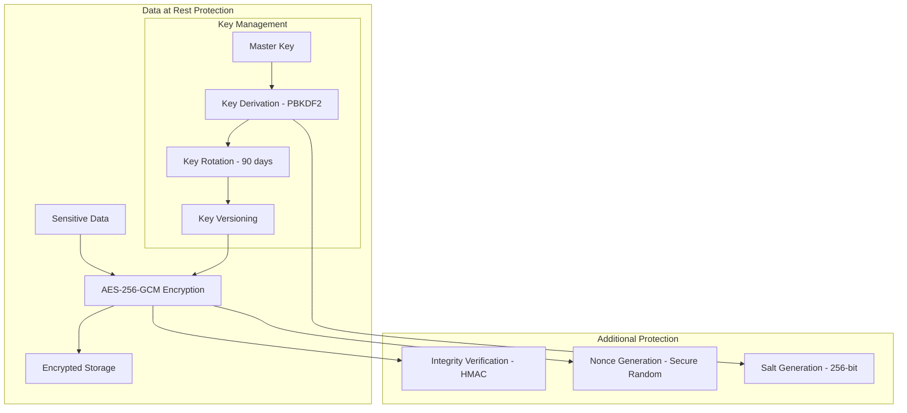

**Implementation Details:**
- **Algorithm**: AES-256-GCM (Galois/Counter Mode)
- **Key Derivation**: PBKDF2-HMAC-SHA256 with 100,000 iterations
- **Nonce**: 96-bit cryptographically secure random nonces
- **Authentication Tag**: 128-bit for integrity verification
- **Salt**: 256-bit random salt for key derivation

```rust
// Core encryption configuration
pub struct EncryptionConfig {
    pub algorithm: EncryptionAlgorithm::AES256GCM,
    pub key_derivation: KeyDerivation::PBKDF2,
    pub key_length: usize = 256,        // 256-bit keys
    pub iv_length: usize = 96,          // 96-bit nonces
    pub tag_length: usize = 128,        // 128-bit auth tags
    pub iterations: u32 = 100_000,      // PBKDF2 iterations
}
```

#### Data in Transit Encryption

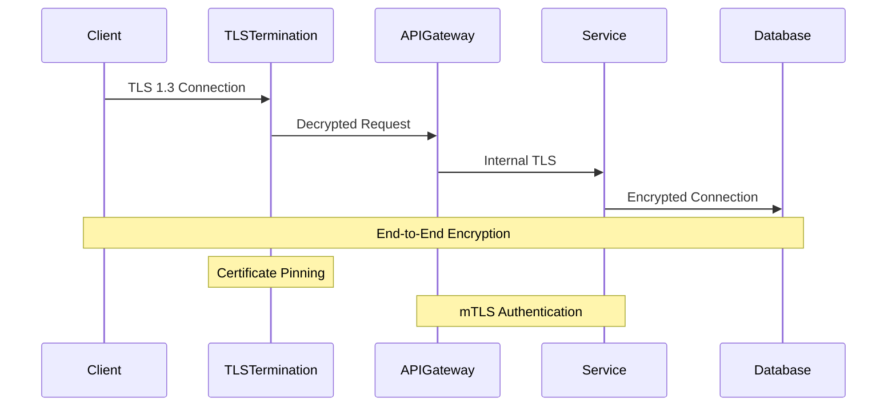

**Transport Security Standards:**
- **Protocol**: TLS 1.3 minimum (TLS 1.2 deprecated)
- **Cipher Suites**: AEAD ciphers only (ChaCha20-Poly1305, AES-GCM)
- **Key Exchange**: ECDHE with P-256, P-384, or X25519
- **Certificate Validation**: Certificate pinning for critical connections
- **Perfect Forward Secrecy**: Ephemeral key exchange mandatory

### Advanced Encryption Features

#### Key Management & Rotation

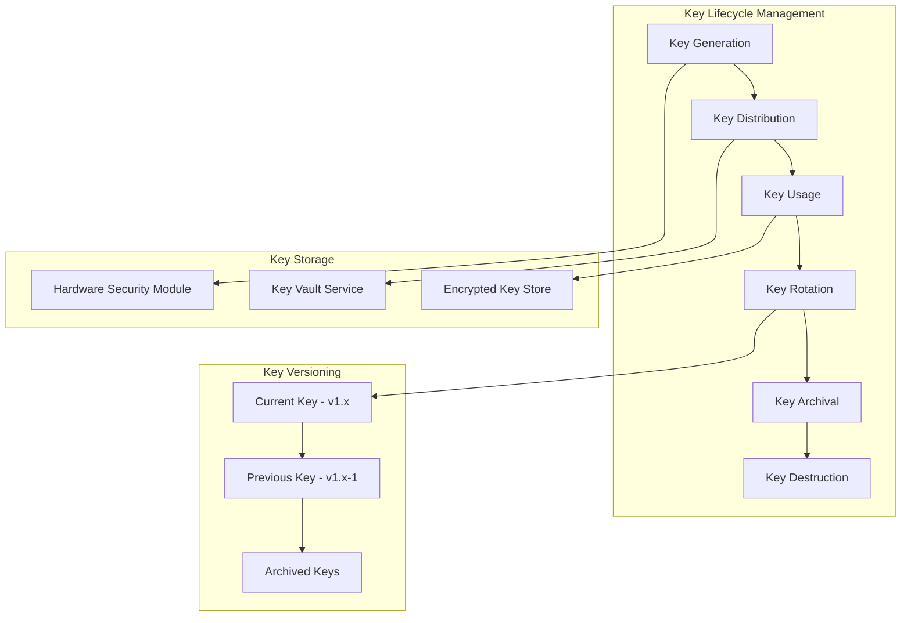

**Key Management Features:**
- **Automatic Rotation**: Keys rotated every 90 days
- **Version Management**: Support for multiple key versions
- **Backward Compatibility**: Decrypt data encrypted with previous keys
- **Secure Storage**: Keys stored in Hardware Security Modules (HSM)
- **Key Escrow**: Secure key backup for disaster recovery

#### Multi-Layer Encryption

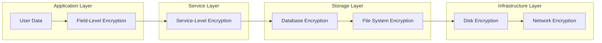

**Encryption Layers:**
1. **Field-Level**: Sensitive fields encrypted individually
2. **Service-Level**: Inter-service communication encryption
3. **Database**: Transparent Data Encryption (TDE)
4. **File System**: Full disk encryption
5. **Network**: All network traffic encrypted

## 🔒 Privacy Protection Framework

### Data Classification & Protection

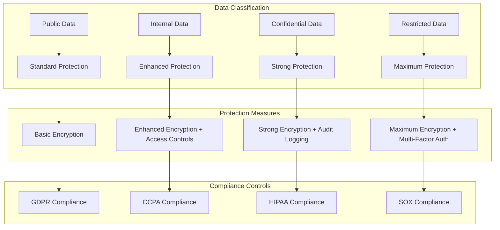

**Data Classification Levels:**

| Level | Description | Examples | Protection Measures |
|-------|-------------|----------|-------------------|
| **Public** | Non-sensitive information | Documentation, public APIs | Standard encryption, basic access controls |
| **Internal** | Internal business data | Research templates, system configs | Enhanced encryption, role-based access |
| **Confidential** | Sensitive research data | API keys, research results | Strong encryption, audit logging, MFA |
| **Restricted** | Highly sensitive data | Personal data, financial info | Maximum encryption, strict access controls |

### Personal Data Protection (GDPR/CCPA)

#### Data Minimization & Purpose Limitation

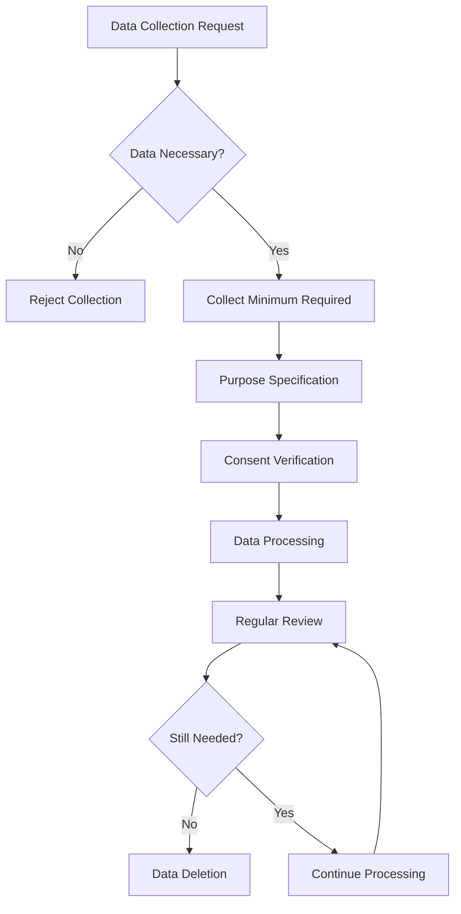

**Privacy Principles:**
- **Data Minimization**: Collect only necessary data
- **Purpose Limitation**: Use data only for specified purposes
- **Storage Limitation**: Retain data only as long as necessary
- **Accuracy**: Ensure data accuracy and completeness
- **Transparency**: Clear privacy notices and consent

#### Privacy-Preserving Technologies

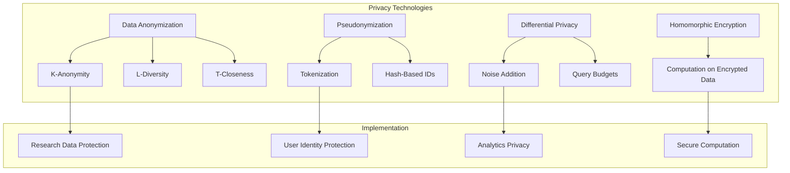

### Data Subject Rights Implementation

#### Right to Access (Article 15)

```rust
// Data access implementation
pub async fn handle_data_access_request(
    subject_id: &str,
    request: DataAccessRequest,
) -> Result<DataAccessResponse, PrivacyError> {
    // Verify identity
    let identity = verify_data_subject_identity(subject_id).await?;
    
    // Collect all personal data
    let personal_data = collect_personal_data(&identity).await?;
    
    // Apply data minimization
    let filtered_data = apply_access_filters(personal_data, &request).await?;
    
    // Generate portable format
    let response = DataAccessResponse {
        data: filtered_data,
        format: request.format.unwrap_or(DataFormat::JSON),
        metadata: generate_metadata(&identity).await?,
    };
    
    // Log access request
    audit_log_access_request(&identity, &request).await?;
    
    Ok(response)
}
```

#### Right to Erasure (Article 17)

```rust
// Data erasure implementation
pub async fn handle_erasure_request(
    subject_id: &str,
    request: ErasureRequest,
) -> Result<ErasureResponse, PrivacyError> {
    // Verify erasure conditions
    verify_erasure_conditions(&request).await?;
    
    // Identify all data to be erased
    let data_locations = identify_personal_data_locations(subject_id).await?;
    
    // Perform secure deletion
    let mut erasure_results = Vec::new();
    for location in data_locations {
        let result = secure_delete_data(&location).await?;
        erasure_results.push(result);
    }
    
    // Verify complete erasure
    verify_complete_erasure(subject_id).await?;
    
    // Generate compliance certificate
    let certificate = generate_erasure_certificate(&erasure_results).await?;
    
    Ok(ErasureResponse {
        status: ErasureStatus::Completed,
        certificate,
        timestamp: Utc::now(),
    })
}
```

## 🔐 Advanced Security Features

### Zero-Knowledge Architecture

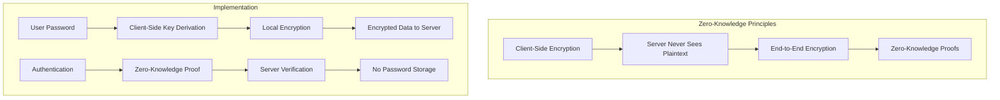

**Zero-Knowledge Features:**
- **Client-Side Encryption**: All sensitive data encrypted before transmission
- **Password-Free Authentication**: Zero-knowledge password proofs
- **Minimal Server Knowledge**: Server cannot access user data
- **Verifiable Security**: Cryptographic proofs of security properties

### Quantum-Resistant Cryptography

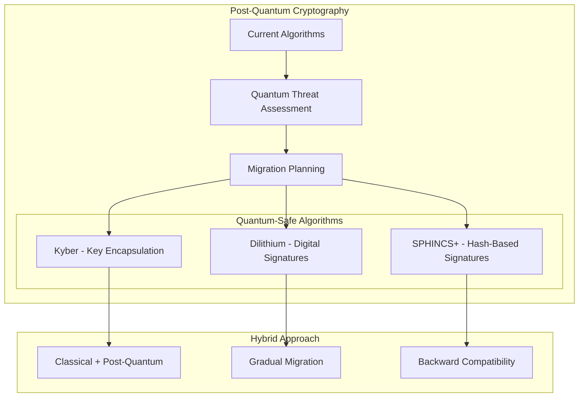

**Quantum Readiness:**
- **Algorithm Assessment**: Regular evaluation of quantum threats
- **Hybrid Implementation**: Classical + post-quantum algorithms
- **Migration Strategy**: Gradual transition to quantum-safe cryptography
- **Future-Proofing**: Designed for easy algorithm updates

## 🔍 Privacy Monitoring & Compliance

### Privacy Impact Assessment

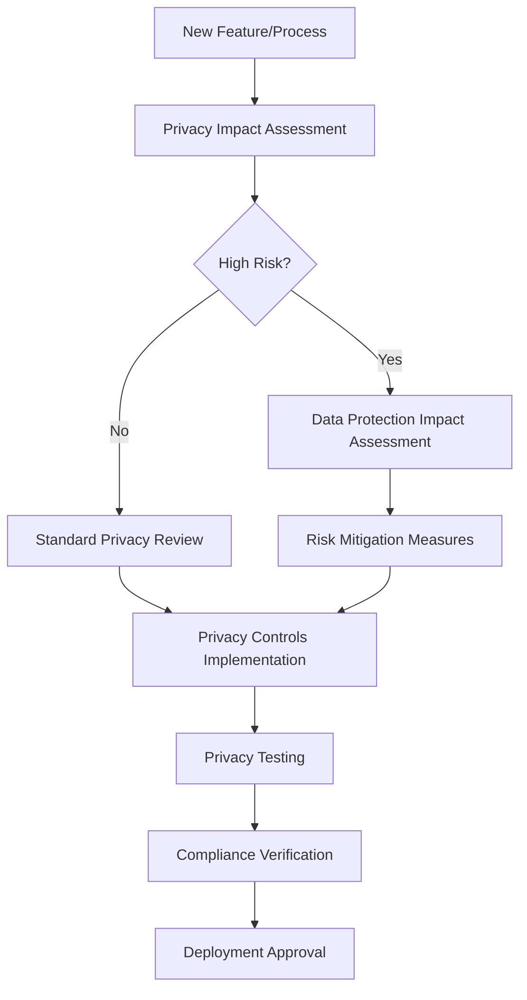

### Continuous Privacy Monitoring

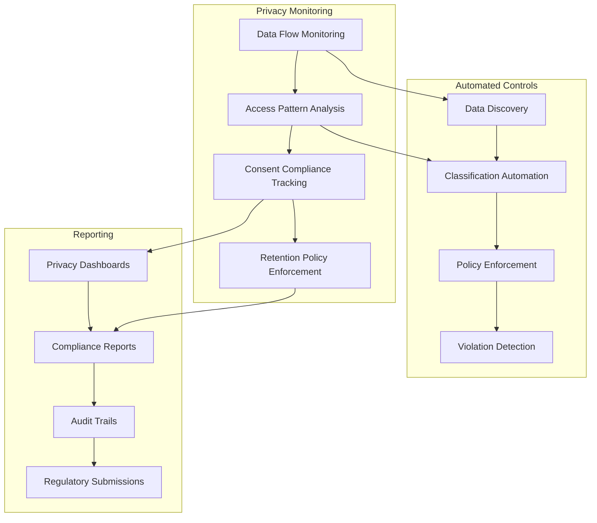

## 🔧 Implementation Details

### Encryption Service Architecture

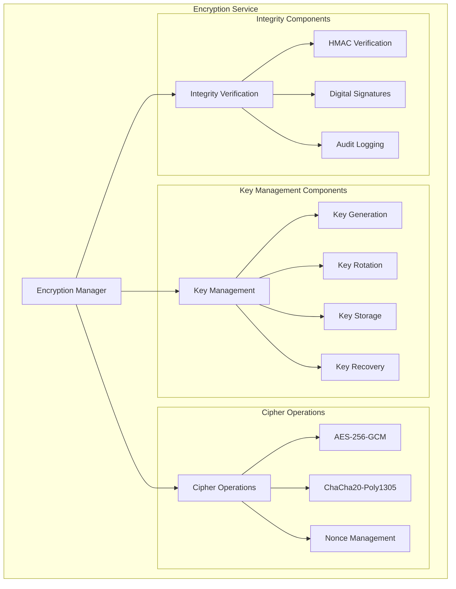

**Service Implementation:**
```rust
pub struct EncryptionService {
    encryption_manager: Arc<RwLock<EncryptionManager>>,
    key_vault: Arc<RwLock<KeyVault>>,
    audit_logger: Arc<RwLock<AuditLogger>>,
    session_manager: Arc<RwLock<SessionManager>>,
}

impl EncryptionService {
    /// Initialize encryption service with master password
    pub async fn initialize(&mut self, master_password: &str) -> Result<(), SecurityError> {
        // Derive master key from password
        let master_key = self.derive_master_key(master_password).await?;

        // Initialize encryption manager
        let mut encryption_manager = self.encryption_manager.write().await;
        encryption_manager.initialize_with_key(master_key).await?;

        // Start key rotation scheduler
        self.start_key_rotation_scheduler().await?;

        // Initialize audit logging
        let mut audit_logger = self.audit_logger.write().await;
        audit_logger.log_security_event(SecurityEvent::EncryptionInitialized).await?;

        Ok(())
    }
}
```

### Privacy-Preserving Data Processing

#### Differential Privacy Implementation

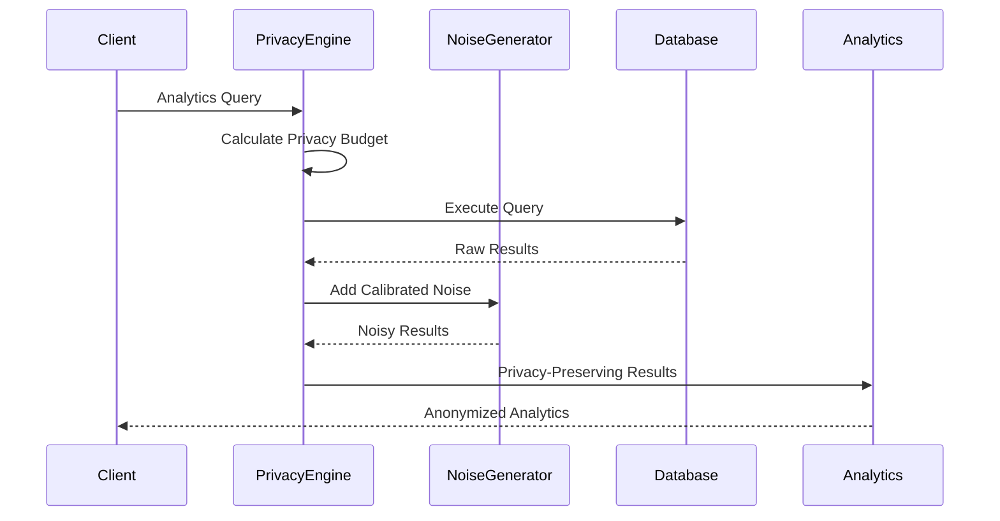

**Differential Privacy Configuration:**
```rust
pub struct DifferentialPrivacyConfig {
    pub epsilon: f64,           // Privacy budget (0.1 - 10.0)
    pub delta: f64,             // Failure probability (< 1/n)
    pub sensitivity: f64,       // Query sensitivity
    pub noise_mechanism: NoiseMechanism,
    pub budget_tracking: bool,
}

pub enum NoiseMechanism {
    Laplace,    // For numeric queries
    Gaussian,   // For approximate queries
    Exponential, // For categorical queries
}
```

#### Homomorphic Encryption for Secure Computation

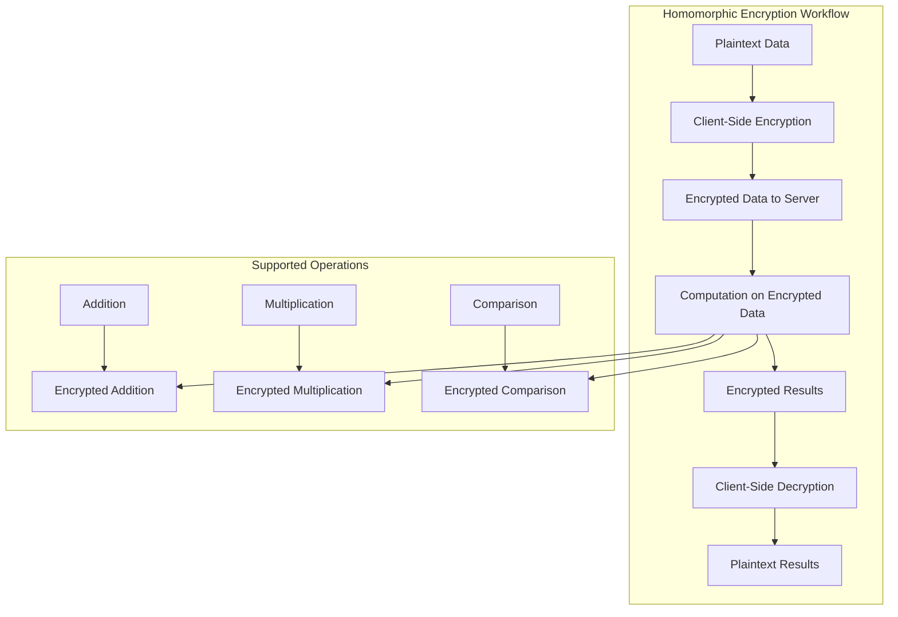

### Secure Multi-Party Computation

#### Research Collaboration Privacy

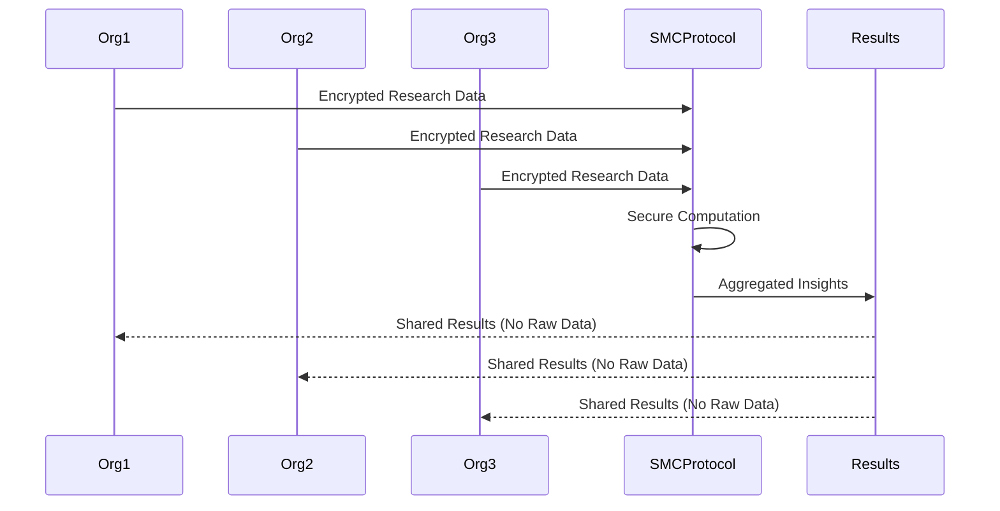

**SMC Implementation:**
```rust
pub struct SecureMultiPartyComputation {
    participants: Vec<ParticipantId>,
    protocol: SMCProtocol,
    privacy_threshold: u32,
    computation_type: ComputationType,
}

pub enum ComputationType {
    PrivateSetIntersection,
    SecureAggregation,
    PrivateInformationRetrieval,
    SecureComparison,
}
```

## 🛡️ Advanced Privacy Controls

### Consent Management System

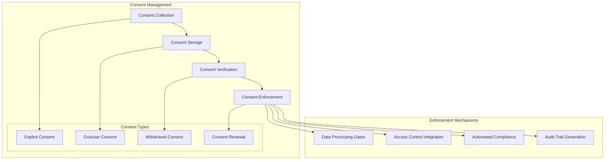

**Consent Management Implementation:**
```rust
pub struct ConsentManager {
    consent_store: Arc<RwLock<ConsentStore>>,
    policy_engine: Arc<RwLock<PolicyEngine>>,
    audit_logger: Arc<RwLock<AuditLogger>>,
}

pub struct ConsentRecord {
    pub subject_id: String,
    pub purpose: ProcessingPurpose,
    pub consent_given: bool,
    pub timestamp: DateTime<Utc>,
    pub expiry: Option<DateTime<Utc>>,
    pub withdrawal_date: Option<DateTime<Utc>>,
    pub legal_basis: LegalBasis,
    pub granular_permissions: HashMap<String, bool>,
}
```

### Data Retention & Deletion

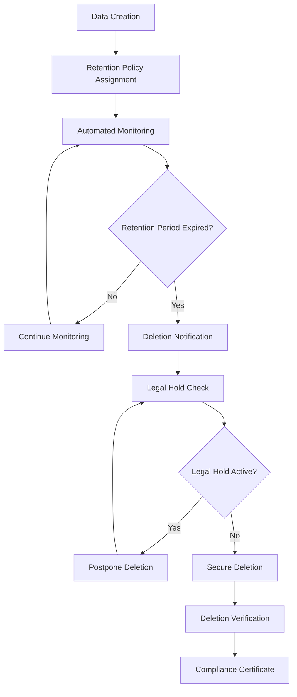

**Retention Policy Engine:**
```rust
pub struct RetentionPolicyEngine {
    policies: HashMap<DataCategory, RetentionPolicy>,
    deletion_scheduler: Arc<RwLock<DeletionScheduler>>,
    legal_hold_manager: Arc<RwLock<LegalHoldManager>>,
}

pub struct RetentionPolicy {
    pub data_category: DataCategory,
    pub retention_period: Duration,
    pub deletion_method: DeletionMethod,
    pub verification_required: bool,
    pub legal_basis: LegalBasis,
}

pub enum DeletionMethod {
    SecureOverwrite,    // Multiple pass overwrite
    Cryptographic,      // Key destruction
    Physical,           // Physical destruction
}
```

## 🔍 Privacy Monitoring & Auditing

### Real-Time Privacy Monitoring

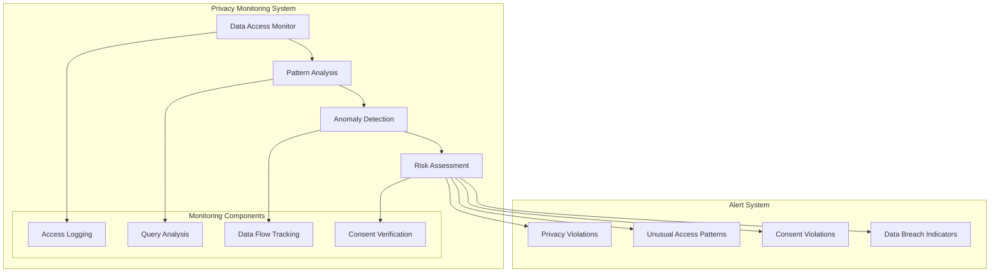

### Privacy Audit Framework

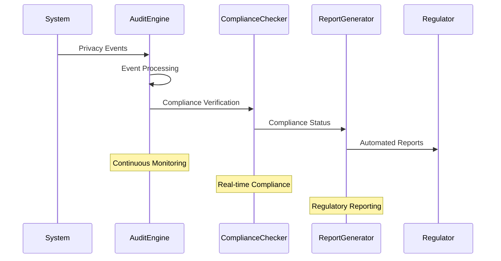

**Audit Implementation:**
```rust
pub struct PrivacyAuditEngine {
    event_collector: Arc<RwLock<EventCollector>>,
    compliance_checker: Arc<RwLock<ComplianceChecker>>,
    report_generator: Arc<RwLock<ReportGenerator>>,
    alert_manager: Arc<RwLock<AlertManager>>,
}

pub struct PrivacyEvent {
    pub event_id: Uuid,
    pub event_type: PrivacyEventType,
    pub subject_id: Option<String>,
    pub data_category: DataCategory,
    pub processing_purpose: ProcessingPurpose,
    pub legal_basis: LegalBasis,
    pub timestamp: DateTime<Utc>,
    pub metadata: HashMap<String, String>,
}
```

## 🔗 Related Documentation

- **[Security Architecture](./security-architecture.md)** - Overall security framework
- **[Compliance Framework](./compliance-framework.md)** - Regulatory compliance
- **[Data Flow Architecture](./data-flow.md)** - Secure data flows
- **[API Security](../api/authentication.md)** - API security implementation
- **[Monitoring Guide](../deployment/monitoring.md)** - Security monitoring
- **[Development Security](../development/security.md)** - Secure development practices

---

**Next**: Explore [Compliance Framework](./compliance-framework.md) for regulatory compliance details.
