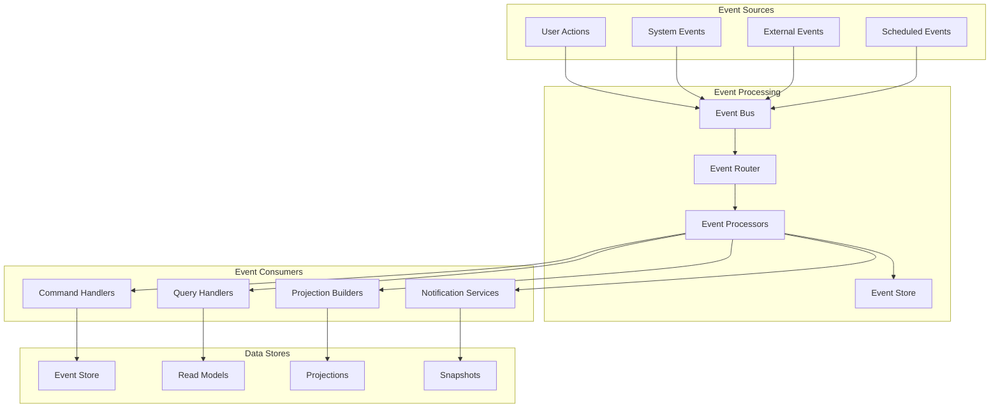
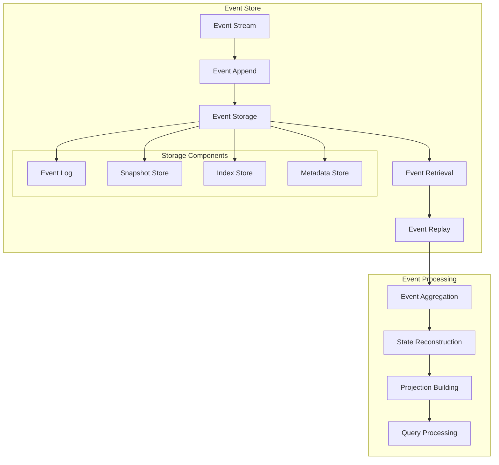
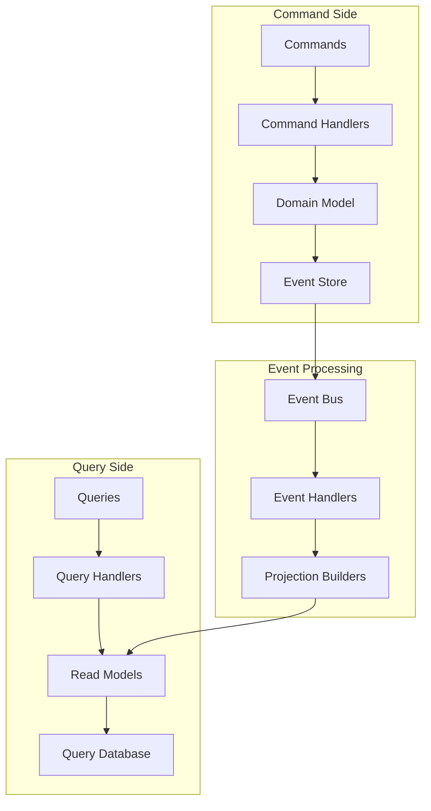
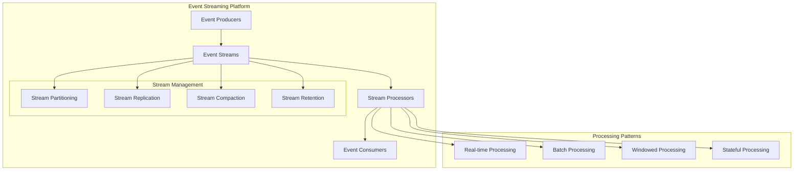
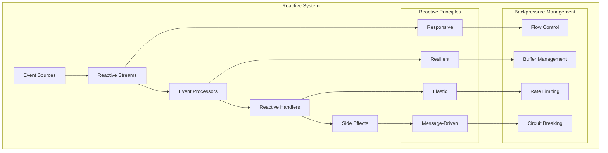
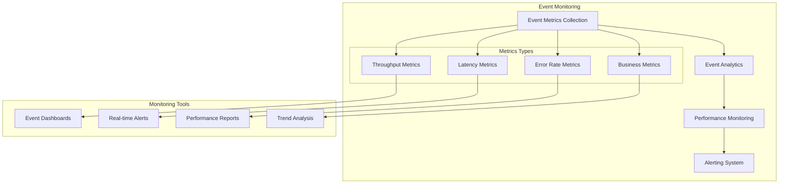

# ⚡ Event-Driven Architecture

## Overview

This document details the comprehensive event-driven architecture implemented in the Free Deep Research System, covering event sourcing, CQRS patterns, event streaming, and reactive system design for scalable, resilient, and responsive applications.

## 🎯 Event-Driven Architecture Overview

### Event Architecture Layers



### Event Types & Categories

| Event Category | Examples | Processing Pattern | Storage Strategy |
|----------------|----------|-------------------|------------------|
| **Domain Events** | ResearchStarted, AgentTaskCompleted | Event Sourcing | Permanent Store |
| **Integration Events** | APICallMade, WebhookReceived | Message Queue | Temporary Store |
| **System Events** | ServiceStarted, HealthCheckFailed | Reactive Processing | Log Store |
| **User Events** | UserLoggedIn, ConfigurationChanged | CQRS | Read Model Update |

## 📊 Event Sourcing Pattern

### Event Store Architecture



### Event Store Implementation

```rust
// Event store service for event sourcing
pub struct EventStore {
    storage_backend: Arc<dyn EventStorageBackend>,
    event_serializer: Arc<dyn EventSerializer>,
    snapshot_store: Arc<RwLock<SnapshotStore>>,
    event_bus: Arc<RwLock<EventBus>>,
    metadata_store: Arc<RwLock<MetadataStore>>,
}

impl EventStore {
    pub async fn append_events(
        &self,
        stream_id: StreamId,
        events: Vec<DomainEvent>,
        expected_version: Option<u64>,
    ) -> Result<u64, EventStoreError> {
        // Validate expected version for optimistic concurrency
        if let Some(expected) = expected_version {
            let current_version = self.get_stream_version(&stream_id).await?;
            if current_version != expected {
                return Err(EventStoreError::ConcurrencyConflict {
                    expected,
                    actual: current_version,
                });
            }
        }
        
        // Serialize events
        let mut serialized_events = Vec::new();
        for (index, event) in events.iter().enumerate() {
            let event_metadata = EventMetadata {
                event_id: Uuid::new_v4(),
                stream_id: stream_id.clone(),
                event_type: event.event_type().to_string(),
                event_version: 1,
                sequence_number: expected_version.unwrap_or(0) + index as u64 + 1,
                timestamp: Utc::now(),
                correlation_id: event.correlation_id(),
                causation_id: event.causation_id(),
            };
            
            let serialized_event = SerializedEvent {
                metadata: event_metadata,
                data: self.event_serializer.serialize(event)?,
            };
            
            serialized_events.push(serialized_event);
        }
        
        // Append to storage
        let new_version = self.storage_backend
            .append_events(stream_id.clone(), serialized_events.clone()).await?;
        
        // Publish events to event bus
        for serialized_event in serialized_events {
            self.event_bus
                .write().await
                .publish(serialized_event).await?;
        }
        
        Ok(new_version)
    }
    
    pub async fn read_events(
        &self,
        stream_id: StreamId,
        from_version: Option<u64>,
        max_count: Option<usize>,
    ) -> Result<Vec<DomainEvent>, EventStoreError> {
        let serialized_events = self.storage_backend
            .read_events(stream_id, from_version, max_count).await?;
        
        let mut events = Vec::new();
        for serialized_event in serialized_events {
            let event = self.event_serializer
                .deserialize(&serialized_event.data, &serialized_event.metadata.event_type)?;
            events.push(event);
        }
        
        Ok(events)
    }
    
    pub async fn create_snapshot(
        &self,
        stream_id: StreamId,
        aggregate_state: AggregateState,
        version: u64,
    ) -> Result<(), EventStoreError> {
        let snapshot = Snapshot {
            stream_id,
            version,
            timestamp: Utc::now(),
            data: serde_json::to_value(aggregate_state)?,
        };
        
        self.snapshot_store
            .write().await
            .save_snapshot(snapshot).await?;
        
        Ok(())
    }
}
```

### Aggregate Root Pattern

```rust
// Aggregate root with event sourcing
pub trait AggregateRoot: Send + Sync {
    type Event: DomainEvent;
    type State: Clone + Send + Sync;
    
    fn apply_event(&mut self, event: &Self::Event);
    fn get_uncommitted_events(&self) -> &[Self::Event];
    fn mark_events_as_committed(&mut self);
    fn get_version(&self) -> u64;
    fn get_id(&self) -> AggregateId;
}

// Research workflow aggregate
pub struct ResearchWorkflowAggregate {
    id: AggregateId,
    version: u64,
    state: ResearchWorkflowState,
    uncommitted_events: Vec<ResearchWorkflowEvent>,
}

impl ResearchWorkflowAggregate {
    pub fn create_workflow(
        id: AggregateId,
        name: String,
        query: String,
        methodology: ResearchMethodology,
    ) -> Self {
        let mut aggregate = Self {
            id,
            version: 0,
            state: ResearchWorkflowState::default(),
            uncommitted_events: Vec::new(),
        };
        
        let event = ResearchWorkflowEvent::WorkflowCreated {
            workflow_id: id,
            name,
            query,
            methodology,
            created_at: Utc::now(),
        };
        
        aggregate.apply_event(&event);
        aggregate.uncommitted_events.push(event);
        
        aggregate
    }
    
    pub fn start_execution(&mut self) -> Result<(), DomainError> {
        if self.state.status != WorkflowStatus::Created {
            return Err(DomainError::InvalidStateTransition {
                from: self.state.status.clone(),
                to: WorkflowStatus::Running,
            });
        }
        
        let event = ResearchWorkflowEvent::ExecutionStarted {
            workflow_id: self.id,
            started_at: Utc::now(),
        };
        
        self.apply_event(&event);
        self.uncommitted_events.push(event);
        
        Ok(())
    }
    
    pub fn complete_execution(
        &mut self,
        results: ResearchResults,
    ) -> Result<(), DomainError> {
        if self.state.status != WorkflowStatus::Running {
            return Err(DomainError::InvalidStateTransition {
                from: self.state.status.clone(),
                to: WorkflowStatus::Completed,
            });
        }
        
        let event = ResearchWorkflowEvent::ExecutionCompleted {
            workflow_id: self.id,
            results,
            completed_at: Utc::now(),
        };
        
        self.apply_event(&event);
        self.uncommitted_events.push(event);
        
        Ok(())
    }
}

impl AggregateRoot for ResearchWorkflowAggregate {
    type Event = ResearchWorkflowEvent;
    type State = ResearchWorkflowState;
    
    fn apply_event(&mut self, event: &Self::Event) {
        match event {
            ResearchWorkflowEvent::WorkflowCreated { workflow_id, name, query, methodology, created_at } => {
                self.state.id = *workflow_id;
                self.state.name = name.clone();
                self.state.query = query.clone();
                self.state.methodology = methodology.clone();
                self.state.status = WorkflowStatus::Created;
                self.state.created_at = *created_at;
            }
            ResearchWorkflowEvent::ExecutionStarted { started_at, .. } => {
                self.state.status = WorkflowStatus::Running;
                self.state.started_at = Some(*started_at);
            }
            ResearchWorkflowEvent::ExecutionCompleted { results, completed_at, .. } => {
                self.state.status = WorkflowStatus::Completed;
                self.state.results = Some(results.clone());
                self.state.completed_at = Some(*completed_at);
            }
        }
        
        self.version += 1;
    }
    
    fn get_uncommitted_events(&self) -> &[Self::Event] {
        &self.uncommitted_events
    }
    
    fn mark_events_as_committed(&mut self) {
        self.uncommitted_events.clear();
    }
    
    fn get_version(&self) -> u64 {
        self.version
    }
    
    fn get_id(&self) -> AggregateId {
        self.id
    }
}
```

## 🔄 CQRS (Command Query Responsibility Segregation)

### CQRS Architecture



### CQRS Implementation

```rust
// Command and Query separation
pub struct CQRSService {
    command_bus: Arc<RwLock<CommandBus>>,
    query_bus: Arc<RwLock<QueryBus>>,
    event_store: Arc<RwLock<EventStore>>,
    projection_manager: Arc<RwLock<ProjectionManager>>,
}

// Command handling
#[async_trait]
pub trait CommandHandler<C: Command>: Send + Sync {
    async fn handle(&self, command: C) -> Result<CommandResult, CommandError>;
}

pub struct CreateResearchWorkflowHandler {
    event_store: Arc<RwLock<EventStore>>,
    repository: Arc<RwLock<ResearchWorkflowRepository>>,
}

#[async_trait]
impl CommandHandler<CreateResearchWorkflowCommand> for CreateResearchWorkflowHandler {
    async fn handle(&self, command: CreateResearchWorkflowCommand) -> Result<CommandResult, CommandError> {
        // Create aggregate
        let aggregate = ResearchWorkflowAggregate::create_workflow(
            command.workflow_id,
            command.name,
            command.query,
            command.methodology,
        );
        
        // Save to repository (which uses event store)
        self.repository
            .write().await
            .save(aggregate).await?;
        
        Ok(CommandResult::Success {
            aggregate_id: command.workflow_id,
        })
    }
}

// Query handling
#[async_trait]
pub trait QueryHandler<Q: Query>: Send + Sync {
    type Result: Send + Sync;
    
    async fn handle(&self, query: Q) -> Result<Self::Result, QueryError>;
}

pub struct GetResearchWorkflowHandler {
    read_model_store: Arc<RwLock<ReadModelStore>>,
}

#[async_trait]
impl QueryHandler<GetResearchWorkflowQuery> for GetResearchWorkflowHandler {
    type Result = ResearchWorkflowReadModel;
    
    async fn handle(&self, query: GetResearchWorkflowQuery) -> Result<Self::Result, QueryError> {
        let read_model = self.read_model_store
            .read().await
            .get_research_workflow(query.workflow_id).await?;
        
        Ok(read_model)
    }
}
```

## 📡 Event Streaming & Processing

### Event Stream Architecture



### Stream Processing Implementation

```rust
// Event streaming service
pub struct EventStreamingService {
    stream_manager: Arc<RwLock<StreamManager>>,
    stream_processors: HashMap<String, Box<dyn StreamProcessor>>,
    consumer_groups: Arc<RwLock<ConsumerGroupManager>>,
    offset_manager: Arc<RwLock<OffsetManager>>,
}

impl EventStreamingService {
    pub async fn create_stream(
        &self,
        stream_config: StreamConfig,
    ) -> Result<StreamId, StreamError> {
        let stream = EventStream {
            id: Uuid::new_v4(),
            name: stream_config.name,
            partitions: stream_config.partitions,
            replication_factor: stream_config.replication_factor,
            retention_policy: stream_config.retention_policy,
            compaction_policy: stream_config.compaction_policy,
            created_at: Utc::now(),
        };

        self.stream_manager
            .write().await
            .create_stream(stream.clone()).await?;

        Ok(stream.id)
    }

    pub async fn publish_event(
        &self,
        stream_id: StreamId,
        event: StreamEvent,
    ) -> Result<EventOffset, StreamError> {
        // Determine partition
        let partition = self.calculate_partition(&event, stream_id).await?;

        // Serialize event
        let serialized_event = SerializedStreamEvent {
            key: event.key,
            value: serde_json::to_vec(&event.payload)?,
            headers: event.headers,
            timestamp: Utc::now(),
            partition,
        };

        // Publish to stream
        let offset = self.stream_manager
            .write().await
            .append_to_stream(stream_id, serialized_event).await?;

        Ok(offset)
    }

    pub async fn consume_events(
        &self,
        stream_id: StreamId,
        consumer_group: String,
        handler: Box<dyn EventHandler>,
    ) -> Result<(), StreamError> {
        // Register consumer group
        let consumer_id = self.consumer_groups
            .write().await
            .register_consumer(stream_id, consumer_group.clone()).await?;

        // Start consuming
        loop {
            // Get next batch of events
            let events = self.stream_manager
                .read().await
                .read_events(stream_id, consumer_id, 100).await?;

            if events.is_empty() {
                tokio::time::sleep(Duration::from_millis(100)).await;
                continue;
            }

            // Process events
            for event in events {
                match handler.handle(event.clone()).await {
                    Ok(()) => {
                        // Commit offset
                        self.offset_manager
                            .write().await
                            .commit_offset(consumer_id, event.offset).await?;
                    }
                    Err(error) => {
                        eprintln!("Error processing event: {}", error);
                        // Handle error (retry, dead letter queue, etc.)
                        self.handle_processing_error(event, error).await?;
                    }
                }
            }
        }
    }
}

// Stream processor for complex event processing
#[async_trait]
pub trait StreamProcessor: Send + Sync {
    async fn process(&self, events: Vec<StreamEvent>) -> Result<Vec<StreamEvent>, ProcessingError>;
}

pub struct ResearchEventProcessor {
    research_service: Arc<RwLock<ResearchService>>,
    ai_orchestrator: Arc<RwLock<AIOrchestrationService>>,
}

#[async_trait]
impl StreamProcessor for ResearchEventProcessor {
    async fn process(&self, events: Vec<StreamEvent>) -> Result<Vec<StreamEvent>, ProcessingError> {
        let mut processed_events = Vec::new();

        for event in events {
            match event.event_type.as_str() {
                "research.workflow.started" => {
                    let workflow_event = self.process_workflow_started(event).await?;
                    processed_events.push(workflow_event);
                }
                "research.task.completed" => {
                    let task_events = self.process_task_completed(event).await?;
                    processed_events.extend(task_events);
                }
                "ai.agent.response" => {
                    let response_event = self.process_agent_response(event).await?;
                    processed_events.push(response_event);
                }
                _ => {
                    // Pass through unknown events
                    processed_events.push(event);
                }
            }
        }

        Ok(processed_events)
    }
}
```

## 🔄 Reactive Systems Pattern

### Reactive Architecture



### Reactive Implementation

```rust
// Reactive event processing system
pub struct ReactiveEventSystem {
    event_streams: HashMap<String, ReactiveStream>,
    processors: Vec<Box<dyn ReactiveProcessor>>,
    backpressure_manager: Arc<RwLock<BackpressureManager>>,
    circuit_breaker: Arc<RwLock<CircuitBreaker>>,
}

impl ReactiveEventSystem {
    pub async fn create_reactive_stream(
        &mut self,
        stream_name: String,
        config: ReactiveStreamConfig,
    ) -> Result<(), ReactiveError> {
        let stream = ReactiveStream::new(stream_name.clone(), config).await?;
        self.event_streams.insert(stream_name, stream);
        Ok(())
    }

    pub async fn process_events_reactively(
        &self,
        stream_name: &str,
    ) -> Result<(), ReactiveError> {
        let stream = self.event_streams.get(stream_name)
            .ok_or(ReactiveError::StreamNotFound(stream_name.to_string()))?;

        // Create reactive pipeline
        let event_source = stream.create_source().await?;

        let processed_stream = event_source
            .map(|event| self.transform_event(event))
            .filter(|event| self.should_process_event(event))
            .buffer_unordered(100) // Parallel processing with backpressure
            .map(|event| self.enrich_event(event))
            .try_for_each(|event| self.handle_event(event));

        processed_stream.await?;
        Ok(())
    }

    async fn transform_event(&self, event: RawEvent) -> ProcessedEvent {
        // Apply transformations
        ProcessedEvent {
            id: event.id,
            event_type: event.event_type,
            payload: self.normalize_payload(event.payload).await,
            metadata: self.extract_metadata(&event).await,
            timestamp: event.timestamp,
        }
    }

    async fn handle_event(&self, event: ProcessedEvent) -> Result<(), ReactiveError> {
        // Check circuit breaker
        if self.circuit_breaker.read().await.is_open() {
            return Err(ReactiveError::CircuitBreakerOpen);
        }

        // Apply backpressure if needed
        self.backpressure_manager
            .read().await
            .apply_backpressure().await?;

        // Process event
        for processor in &self.processors {
            processor.process_reactive_event(&event).await?;
        }

        Ok(())
    }
}

#[async_trait]
pub trait ReactiveProcessor: Send + Sync {
    async fn process_reactive_event(&self, event: &ProcessedEvent) -> Result<(), ProcessingError>;
}

// Research workflow reactive processor
pub struct ResearchWorkflowReactiveProcessor {
    workflow_manager: Arc<RwLock<WorkflowManager>>,
    notification_service: Arc<RwLock<NotificationService>>,
}

#[async_trait]
impl ReactiveProcessor for ResearchWorkflowReactiveProcessor {
    async fn process_reactive_event(&self, event: &ProcessedEvent) -> Result<(), ProcessingError> {
        match event.event_type.as_str() {
            "research.workflow.progress" => {
                // Update workflow progress reactively
                let progress_data: WorkflowProgress = serde_json::from_value(event.payload.clone())?;

                self.workflow_manager
                    .write().await
                    .update_progress(progress_data.workflow_id, progress_data.progress).await?;

                // Send real-time notification
                self.notification_service
                    .write().await
                    .send_progress_notification(progress_data).await?;
            }
            "research.workflow.error" => {
                // Handle workflow errors reactively
                let error_data: WorkflowError = serde_json::from_value(event.payload.clone())?;

                self.workflow_manager
                    .write().await
                    .handle_workflow_error(error_data.workflow_id, error_data.error).await?;

                // Send error notification
                self.notification_service
                    .write().await
                    .send_error_notification(error_data).await?;
            }
            _ => {
                // Ignore unknown events
            }
        }

        Ok(())
    }
}
```

## 📊 Event Analytics & Monitoring

### Event Monitoring Architecture



### Event Monitoring Implementation

```rust
// Event monitoring and analytics service
pub struct EventMonitoringService {
    metrics_collector: Arc<RwLock<EventMetricsCollector>>,
    analytics_engine: Arc<RwLock<EventAnalyticsEngine>>,
    alert_manager: Arc<RwLock<AlertManager>>,
    dashboard_service: Arc<RwLock<DashboardService>>,
}

impl EventMonitoringService {
    pub async fn collect_event_metrics(
        &self,
        event: &ProcessedEvent,
        processing_time: Duration,
    ) -> Result<(), MonitoringError> {
        let metrics = EventMetrics {
            event_id: event.id,
            event_type: event.event_type.clone(),
            timestamp: event.timestamp,
            processing_time,
            payload_size: serde_json::to_vec(&event.payload)?.len(),
            source: event.metadata.get("source").cloned(),
        };

        self.metrics_collector
            .write().await
            .record_metrics(metrics).await?;

        Ok(())
    }

    pub async fn analyze_event_patterns(
        &self,
        time_window: Duration,
    ) -> Result<EventAnalysisReport, MonitoringError> {
        let metrics = self.metrics_collector
            .read().await
            .get_metrics_for_window(time_window).await?;

        let analysis = self.analytics_engine
            .read().await
            .analyze_patterns(metrics).await?;

        // Check for anomalies
        if analysis.anomaly_score > 0.8 {
            self.alert_manager
                .write().await
                .send_anomaly_alert(analysis.clone()).await?;
        }

        Ok(analysis)
    }

    pub async fn generate_event_dashboard(
        &self,
    ) -> Result<EventDashboard, MonitoringError> {
        let dashboard = self.dashboard_service
            .read().await
            .generate_real_time_dashboard().await?;

        Ok(dashboard)
    }
}

// Event analytics for business intelligence
pub struct EventAnalyticsEngine {
    pattern_detector: Arc<RwLock<PatternDetector>>,
    anomaly_detector: Arc<RwLock<AnomalyDetector>>,
    trend_analyzer: Arc<RwLock<TrendAnalyzer>>,
}

impl EventAnalyticsEngine {
    pub async fn analyze_patterns(
        &self,
        metrics: Vec<EventMetrics>,
    ) -> Result<EventAnalysisReport, AnalyticsError> {
        // Detect patterns
        let patterns = self.pattern_detector
            .read().await
            .detect_patterns(&metrics).await?;

        // Detect anomalies
        let anomalies = self.anomaly_detector
            .read().await
            .detect_anomalies(&metrics).await?;

        // Analyze trends
        let trends = self.trend_analyzer
            .read().await
            .analyze_trends(&metrics).await?;

        let report = EventAnalysisReport {
            analysis_timestamp: Utc::now(),
            metrics_analyzed: metrics.len(),
            patterns_detected: patterns,
            anomalies_detected: anomalies,
            trends_identified: trends,
            anomaly_score: self.calculate_anomaly_score(&anomalies),
            recommendations: self.generate_recommendations(&patterns, &trends).await?,
        };

        Ok(report)
    }
}
```

## 🔗 Related Documentation

- **[Integration Patterns](./integration-patterns.md)** - Integration architecture patterns
- **[Service Architecture](./service-architecture.md)** - Service communication patterns
- **[Data Flow Architecture](./data-flow.md)** - Data processing flows
- **[Scalability Patterns](./scalability-patterns.md)** - Event-driven scaling
- **[Monitoring Guide](../deployment/monitoring.md)** - Event monitoring strategies
- **[Performance Optimization](../development/performance.md)** - Event processing optimization

---

**Phase 5 Complete**: Integration & Tools documentation fully established with comprehensive event-driven architecture and integration patterns.
