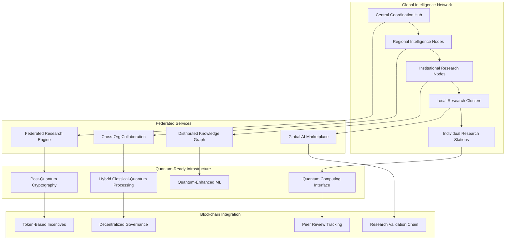

# 🌐 Global Intelligence Network Architecture

## Overview

The Global Intelligence Network represents the next evolution of the Free Deep Research System (V3.0.0), enabling distributed intelligence, cross-organizational collaboration, and quantum-ready research capabilities. This architecture supports federated research, AI marketplace integration, and global knowledge sharing.

## 🏗️ Network Architecture

### Distributed Intelligence Framework



## 🌍 Federated Research System

### Cross-Organization Collaboration
- **Secure Data Sharing**: Privacy-preserving research collaboration protocols
- **Federated Learning**: Distributed model training across institutions
- **Research Coordination**: Global research project management and coordination
- **Knowledge Synthesis**: Automated synthesis of distributed research findings

### Privacy-Preserving Architecture
```python
# Federated Research Configuration
federated_config = {
    "privacy_framework": {
        "differential_privacy": {
            "epsilon": 1.0,
            "delta": 1e-5,
            "mechanism": "gaussian"
        },
        "secure_aggregation": {
            "protocol": "secure_multiparty_computation",
            "threshold": 3,
            "encryption": "homomorphic"
        },
        "data_minimization": {
            "feature_selection": "privacy_aware",
            "dimensionality_reduction": "private_pca",
            "anonymization": "k_anonymity"
        }
    },
    
    "collaboration_protocols": {
        "research_sharing": {
            "access_control": "attribute_based",
            "audit_logging": "immutable_ledger",
            "consent_management": "granular_permissions"
        },
        "federated_learning": {
            "aggregation_method": "federated_averaging",
            "communication_rounds": 100,
            "client_selection": "random_sampling"
        }
    }
}
```

### Research Coordination Framework
- **Global Research Registry**: Centralized registry of ongoing research projects
- **Collaboration Matching**: AI-powered matching of complementary research efforts
- **Resource Sharing**: Shared computational and data resources across institutions
- **Quality Assurance**: Distributed peer review and validation processes

## 🤖 AI Research Marketplace

### Community AI Agents
- **Agent Marketplace**: Platform for sharing and discovering AI research agents
- **Agent Validation**: Community-driven validation and rating system
- **Agent Composition**: Ability to combine multiple agents for complex research tasks
- **Agent Evolution**: Continuous improvement through community feedback

### Marketplace Architecture
```yaml
# AI Marketplace Configuration
marketplace:
  agent_registry:
    storage: "distributed_ipfs"
    indexing: "elasticsearch"
    search: "semantic_similarity"
    
  validation_system:
    peer_review: "community_driven"
    automated_testing: "continuous_integration"
    performance_benchmarks: "standardized_metrics"
    
  economic_model:
    pricing: "dynamic_auction"
    payments: "cryptocurrency_tokens"
    incentives: "reputation_based"
    
  governance:
    decision_making: "dao_voting"
    dispute_resolution: "arbitration_protocol"
    standards_committee: "expert_panel"
```

### Agent Ecosystem
1. **Research Specialists**: Domain-specific research agents
2. **Analysis Experts**: Statistical and data analysis agents
3. **Writing Assistants**: Documentation and report generation agents
4. **Quality Validators**: Peer review and validation agents
5. **Integration Facilitators**: Cross-platform integration agents

## ⚛️ Quantum-Ready Architecture

### Quantum Computing Integration
- **Hybrid Processing**: Classical-quantum hybrid algorithms for research optimization
- **Quantum Advantage**: Leveraging quantum speedup for specific research problems
- **Quantum Simulation**: Molecular and material science research applications
- **Quantum Machine Learning**: Enhanced pattern recognition and optimization

### Post-Quantum Cryptography
```typescript
// Quantum-Safe Security Implementation
interface QuantumSafeSecurity {
  // Post-quantum cryptographic algorithms
  keyExchange: 'CRYSTALS-Kyber' | 'SIKE' | 'NewHope';
  digitalSignature: 'CRYSTALS-Dilithium' | 'FALCON' | 'SPHINCS+';
  encryption: 'AES-256-GCM' | 'ChaCha20-Poly1305';
  
  // Quantum-resistant protocols
  protocols: {
    tls: 'TLS-1.3-PQ';
    vpn: 'WireGuard-PQ';
    messaging: 'Signal-PQ';
  };
  
  // Hybrid security approach
  hybridMode: {
    classical: boolean;
    postQuantum: boolean;
    quantumKeyDistribution: boolean;
  };
}
```

### Quantum-Enhanced Research
- **Optimization Problems**: Quantum algorithms for research optimization
- **Pattern Recognition**: Quantum machine learning for complex pattern detection
- **Simulation**: Quantum simulation for scientific research applications
- **Cryptanalysis**: Quantum-safe security for research data protection

## 🔗 Blockchain Integration

### Research Validation Chain
- **Immutable Records**: Blockchain-based research record keeping
- **Peer Review Tracking**: Transparent and auditable peer review process
- **Research Provenance**: Complete traceability of research data and findings
- **Consensus Mechanisms**: Distributed consensus for research validation

### Decentralized Governance
```solidity
// Research Governance Smart Contract
contract ResearchGovernance {
    struct Proposal {
        uint256 id;
        string description;
        uint256 votingDeadline;
        uint256 yesVotes;
        uint256 noVotes;
        bool executed;
        mapping(address => bool) hasVoted;
    }
    
    mapping(uint256 => Proposal) public proposals;
    mapping(address => uint256) public researcherTokens;
    
    function submitProposal(string memory description) external {
        require(researcherTokens[msg.sender] >= MIN_TOKENS_TO_PROPOSE);
        // Implementation for proposal submission
    }
    
    function vote(uint256 proposalId, bool support) external {
        require(researcherTokens[msg.sender] > 0);
        // Implementation for voting
    }
    
    function executeProposal(uint256 proposalId) external {
        // Implementation for proposal execution
    }
}
```

### Token-Based Incentives
- **Research Tokens**: Cryptocurrency rewards for quality research contributions
- **Peer Review Rewards**: Incentives for thorough and helpful peer reviews
- **Data Sharing Incentives**: Rewards for sharing valuable research data
- **Community Governance**: Token-based voting for platform governance decisions

## 🧠 Advanced NLP Engine

### Natural Language Processing Capabilities
- **Multi-Language Support**: Research in 100+ languages with real-time translation
- **Domain-Specific Understanding**: Specialized NLP models for different research domains
- **Semantic Search**: Advanced semantic understanding for research query processing
- **Automated Summarization**: AI-powered research synthesis and summarization

### NLP Architecture
```python
# Advanced NLP Engine Configuration
nlp_engine = {
    "language_models": {
        "general": "GPT-4-Turbo",
        "scientific": "SciBERT",
        "medical": "BioBERT",
        "legal": "LegalBERT",
        "financial": "FinBERT"
    },
    
    "processing_pipeline": {
        "tokenization": "sentencepiece",
        "named_entity_recognition": "spacy_transformer",
        "relation_extraction": "rebel_model",
        "sentiment_analysis": "roberta_sentiment",
        "topic_modeling": "bertopic"
    },
    
    "multilingual_support": {
        "translation": "marian_mt",
        "cross_lingual_embeddings": "laser",
        "language_detection": "fasttext",
        "code_switching": "xlm_roberta"
    }
}
```

## 📊 Global Knowledge Graph

### Interconnected Knowledge Management
- **Entity Linking**: Automatic linking of research entities across sources
- **Relationship Mapping**: Discovery and mapping of knowledge relationships
- **Temporal Dynamics**: Tracking knowledge evolution over time
- **Cross-Domain Connections**: Identifying connections across research domains

### Knowledge Graph Architecture
```cypher
// Knowledge Graph Schema (Neo4j)
CREATE CONSTRAINT ON (r:Researcher) ASSERT r.id IS UNIQUE;
CREATE CONSTRAINT ON (p:Paper) ASSERT p.doi IS UNIQUE;
CREATE CONSTRAINT ON (c:Concept) ASSERT c.id IS UNIQUE;
CREATE CONSTRAINT ON (i:Institution) ASSERT i.id IS UNIQUE;

// Relationships
(:Researcher)-[:AUTHORED]->(:Paper)
(:Paper)-[:CITES]->(:Paper)
(:Paper)-[:DISCUSSES]->(:Concept)
(:Researcher)-[:AFFILIATED_WITH]->(:Institution)
(:Concept)-[:RELATED_TO]->(:Concept)
(:Paper)-[:PUBLISHED_IN]->(:Journal)
```

## 🔧 Integration Architecture

### API Gateway and Service Mesh
```yaml
# Global Intelligence Network API Gateway
apiVersion: networking.istio.io/v1alpha3
kind: Gateway
metadata:
  name: global-intelligence-gateway
spec:
  selector:
    istio: ingressgateway
  servers:
  - port:
      number: 443
      name: https
      protocol: HTTPS
    tls:
      mode: SIMPLE
      credentialName: gin-tls-secret
    hosts:
    - api.globalintelligence.research
    
  - port:
      number: 80
      name: http
      protocol: HTTP
    hosts:
    - api.globalintelligence.research
    redirect:
      httpsRedirect: true
```

### Microservices Architecture
- **Federated Research Service**: Cross-organizational research coordination
- **AI Marketplace Service**: Agent discovery and management
- **Quantum Interface Service**: Quantum computing resource management
- **Blockchain Service**: Decentralized validation and governance
- **NLP Service**: Advanced natural language processing
- **Knowledge Graph Service**: Global knowledge management

## 📈 Performance and Scalability

### Global Load Distribution
- **Geographic Distribution**: Research nodes distributed globally for low latency
- **Intelligent Routing**: AI-powered request routing for optimal performance
- **Auto-Scaling**: Dynamic scaling based on research workload patterns
- **Edge Computing**: Local processing for privacy-sensitive operations

### Performance Metrics
```yaml
# Global Intelligence Network SLAs
performance_targets:
  availability: 99.99%
  response_time:
    federated_search: "< 2 seconds"
    ai_marketplace: "< 1 second"
    quantum_processing: "< 10 seconds"
    blockchain_validation: "< 30 seconds"
  
  throughput:
    concurrent_researchers: 100000
    research_queries_per_second: 10000
    ai_agent_invocations_per_minute: 50000
  
  scalability:
    horizontal_scaling: "automatic"
    geographic_distribution: "global"
    quantum_resource_allocation: "dynamic"
```

## 🔒 Security and Privacy

### Multi-Layer Security
- **Zero-Trust Architecture**: Comprehensive security model with continuous verification
- **End-to-End Encryption**: All data encrypted in transit and at rest
- **Quantum-Safe Cryptography**: Protection against quantum computing threats
- **Privacy-Preserving Analytics**: Research insights without compromising privacy

### Compliance Framework
- **Global Privacy Regulations**: GDPR, CCPA, PIPEDA compliance
- **Research Ethics**: IRB and ethics committee integration
- **Data Sovereignty**: Respect for national data sovereignty requirements
- **Audit and Transparency**: Complete audit trails and transparency reports

---

**Related Documentation:**
- [AI & ML Architecture](./ai-ml-architecture.md)
- [BMAD Integration Architecture](./bmad-integration-architecture.md)
- [Security Architecture](./security-architecture.md)
- [API Architecture](./api-architecture.md)
