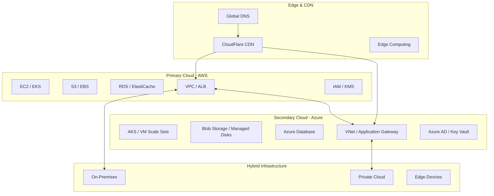
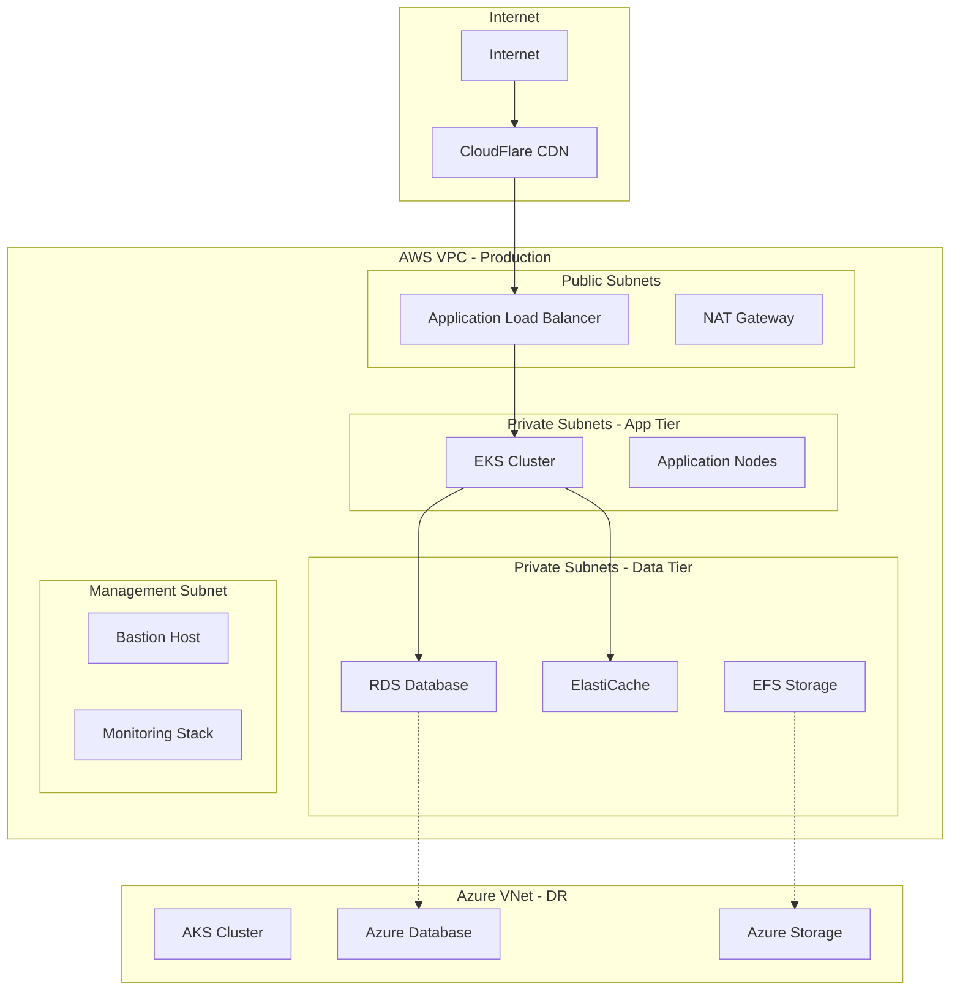
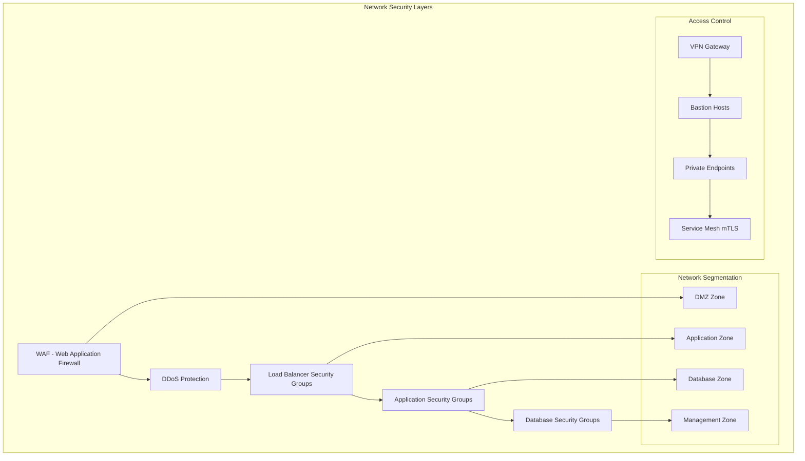
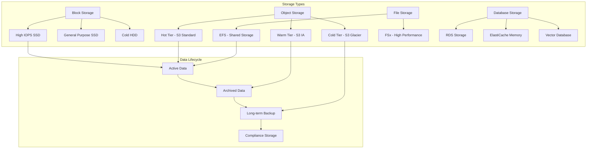
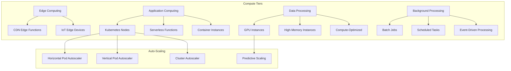
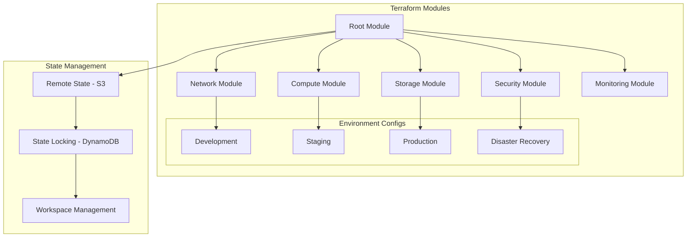
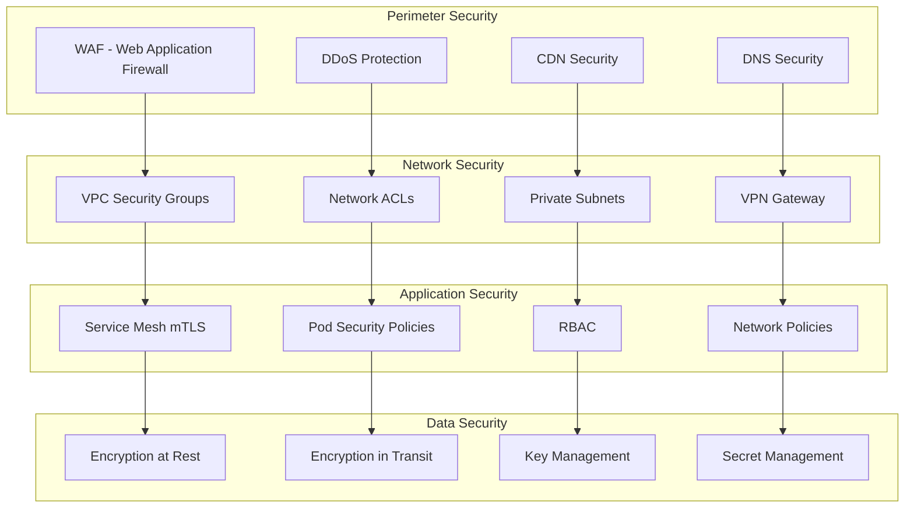
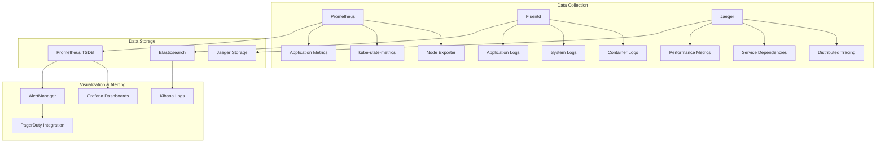
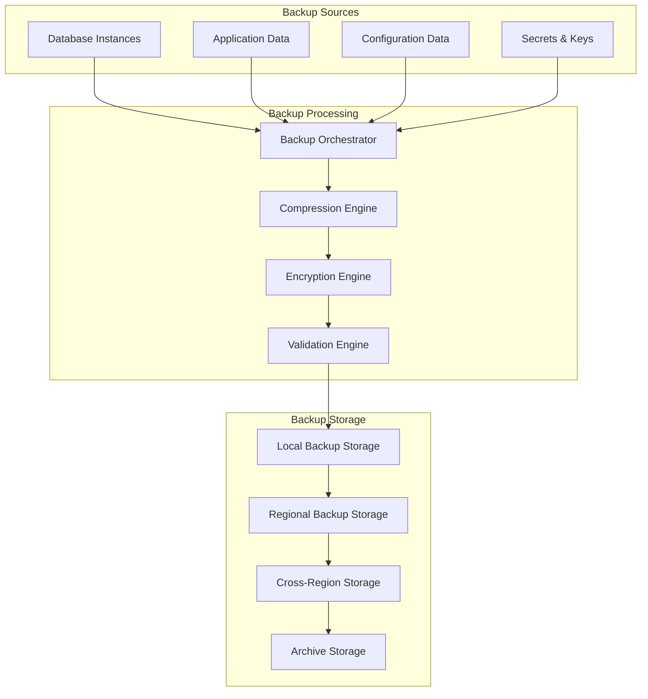
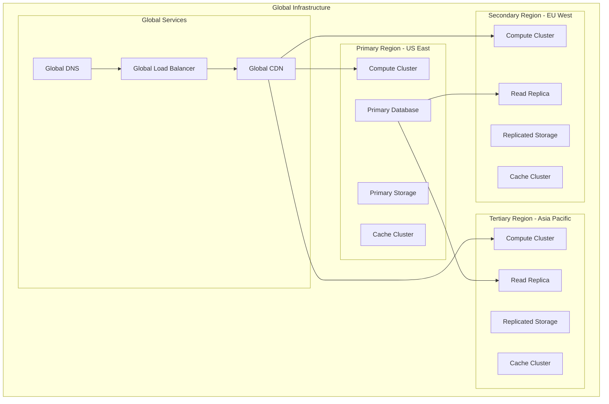

# 🏗️ Infrastructure Design

## Overview

This document details the comprehensive infrastructure design for the Free Deep Research System, covering cloud architecture, networking, storage, compute resources, and infrastructure as code (IaC) implementations across multiple cloud providers and deployment scenarios.

## ☁️ Cloud Architecture Overview

### Multi-Cloud Strategy



### Infrastructure Tiers

| Tier | Purpose | Components | Availability | Scalability |
|------|---------|------------|--------------|-------------|
| **Edge** | Content Delivery | CDN, Edge Compute | 99.99% | Global |
| **Application** | Business Logic | Kubernetes, Microservices | 99.95% | Auto-scaling |
| **Data** | Data Storage | Databases, Caches | 99.99% | Horizontal |
| **Infrastructure** | Foundation | Networking, Security | 99.99% | Elastic |

## 🌐 Network Architecture

### Network Topology



### Network Security



**Network Security Configuration:**
```yaml
# AWS VPC Security Groups
security_groups:
  web_tier:
    ingress:
      - protocol: tcp
        port: 443
        source: 0.0.0.0/0
      - protocol: tcp
        port: 80
        source: 0.0.0.0/0
    egress:
      - protocol: tcp
        port: 8080
        destination: app_tier_sg
  
  app_tier:
    ingress:
      - protocol: tcp
        port: 8080
        source: web_tier_sg
      - protocol: tcp
        port: 9090
        source: monitoring_sg
    egress:
      - protocol: tcp
        port: 5432
        destination: db_tier_sg
      - protocol: tcp
        port: 6379
        destination: cache_tier_sg
  
  db_tier:
    ingress:
      - protocol: tcp
        port: 5432
        source: app_tier_sg
      - protocol: tcp
        port: 5432
        source: bastion_sg
    egress: []
```

## 💾 Storage Architecture

### Storage Strategy



### Storage Configuration

```yaml
# Storage class definitions
storage_classes:
  high_performance:
    type: gp3
    iops: 16000
    throughput: 1000
    encryption: true
    backup_retention: 30
    use_cases:
      - database_storage
      - application_logs
      - temporary_processing
  
  standard:
    type: gp3
    iops: 3000
    throughput: 125
    encryption: true
    backup_retention: 7
    use_cases:
      - application_data
      - configuration_files
      - user_uploads
  
  archive:
    type: s3_glacier
    encryption: true
    backup_retention: 2555  # 7 years
    use_cases:
      - compliance_data
      - audit_logs
      - historical_backups

# Database storage configuration
database_storage:
  postgresql:
    storage_type: gp3
    allocated_storage: 1000  # GB
    max_allocated_storage: 10000  # GB
    iops: 12000
    storage_encrypted: true
    backup_retention_period: 30
    backup_window: "03:00-04:00"
    maintenance_window: "sun:04:00-sun:05:00"
  
  redis:
    node_type: cache.r6g.2xlarge
    num_cache_nodes: 3
    engine_version: "7.0"
    parameter_group: default.redis7
    subnet_group: cache-subnet-group
    security_groups: [cache-sg]
```

## 🖥️ Compute Architecture

### Compute Resource Strategy



### Kubernetes Node Configuration

```yaml
# EKS Node Groups Configuration
node_groups:
  application_nodes:
    instance_types:
      - m5.xlarge
      - m5.2xlarge
      - m5a.xlarge
    scaling_config:
      desired_size: 6
      max_size: 20
      min_size: 3
    update_config:
      max_unavailable_percentage: 25
    labels:
      node-type: application
      workload: general
    taints: []
    
  ai_processing_nodes:
    instance_types:
      - c5.4xlarge
      - c5.9xlarge
      - g4dn.xlarge  # GPU instances
    scaling_config:
      desired_size: 3
      max_size: 10
      min_size: 1
    labels:
      node-type: ai-processing
      workload: compute-intensive
    taints:
      - key: workload
        value: ai-processing
        effect: NoSchedule
        
  database_nodes:
    instance_types:
      - r5.2xlarge
      - r5.4xlarge
    scaling_config:
      desired_size: 2
      max_size: 4
      min_size: 2
    labels:
      node-type: database
      workload: memory-intensive
    taints:
      - key: workload
        value: database
        effect: NoSchedule
```

## 🔧 Infrastructure as Code

### Terraform Configuration Structure



### Core Infrastructure Module

```hcl
# terraform/modules/infrastructure/main.tf
terraform {
  required_version = ">= 1.5"
  required_providers {
    aws = {
      source  = "hashicorp/aws"
      version = "~> 5.0"
    }
    kubernetes = {
      source  = "hashicorp/kubernetes"
      version = "~> 2.20"
    }
    helm = {
      source  = "hashicorp/helm"
      version = "~> 2.10"
    }
  }
}

# VPC Configuration
module "vpc" {
  source = "terraform-aws-modules/vpc/aws"
  version = "~> 5.0"

  name = "${var.environment}-fdr-vpc"
  cidr = var.vpc_cidr

  azs             = var.availability_zones
  private_subnets = var.private_subnet_cidrs
  public_subnets  = var.public_subnet_cidrs
  database_subnets = var.database_subnet_cidrs

  enable_nat_gateway = true
  enable_vpn_gateway = false
  enable_dns_hostnames = true
  enable_dns_support = true

  # Enable VPC Flow Logs
  enable_flow_log = true
  create_flow_log_cloudwatch_log_group = true
  create_flow_log_cloudwatch_iam_role = true

  tags = local.common_tags
}

# EKS Cluster
module "eks" {
  source = "terraform-aws-modules/eks/aws"
  version = "~> 19.0"

  cluster_name    = "${var.environment}-fdr-cluster"
  cluster_version = var.kubernetes_version

  vpc_id     = module.vpc.vpc_id
  subnet_ids = module.vpc.private_subnets

  # Cluster endpoint configuration
  cluster_endpoint_private_access = true
  cluster_endpoint_public_access  = true
  cluster_endpoint_public_access_cidrs = var.cluster_endpoint_public_access_cidrs

  # Cluster encryption
  cluster_encryption_config = [
    {
      provider_key_arn = aws_kms_key.eks.arn
      resources        = ["secrets"]
    }
  ]

  # EKS Managed Node Groups
  eks_managed_node_groups = {
    application = {
      name = "application-nodes"
      
      instance_types = ["m5.xlarge", "m5.2xlarge"]
      capacity_type  = "ON_DEMAND"
      
      min_size     = 3
      max_size     = 20
      desired_size = 6
      
      labels = {
        node-type = "application"
        workload  = "general"
      }
      
      update_config = {
        max_unavailable_percentage = 25
      }
    }
    
    ai_processing = {
      name = "ai-processing-nodes"
      
      instance_types = ["c5.4xlarge", "g4dn.xlarge"]
      capacity_type  = "SPOT"
      
      min_size     = 1
      max_size     = 10
      desired_size = 3
      
      labels = {
        node-type = "ai-processing"
        workload  = "compute-intensive"
      }
      
      taints = [
        {
          key    = "workload"
          value  = "ai-processing"
          effect = "NO_SCHEDULE"
        }
      ]
    }
  }

  tags = local.common_tags
}

# RDS Database
resource "aws_db_instance" "postgresql" {
  identifier = "${var.environment}-fdr-postgresql"
  
  engine         = "postgres"
  engine_version = var.postgresql_version
  instance_class = var.db_instance_class
  
  allocated_storage     = var.db_allocated_storage
  max_allocated_storage = var.db_max_allocated_storage
  storage_type          = "gp3"
  storage_encrypted     = true
  kms_key_id           = aws_kms_key.rds.arn
  
  db_name  = var.database_name
  username = var.database_username
  password = var.database_password
  
  vpc_security_group_ids = [aws_security_group.database.id]
  db_subnet_group_name   = aws_db_subnet_group.database.name
  
  backup_retention_period = var.backup_retention_period
  backup_window          = var.backup_window
  maintenance_window     = var.maintenance_window
  
  skip_final_snapshot = var.environment != "production"
  deletion_protection = var.environment == "production"
  
  performance_insights_enabled = true
  monitoring_interval         = 60
  monitoring_role_arn        = aws_iam_role.rds_monitoring.arn
  
  tags = local.common_tags
}

# ElastiCache Redis Cluster
resource "aws_elasticache_replication_group" "redis" {
  replication_group_id       = "${var.environment}-fdr-redis"
  description                = "Redis cluster for Free Deep Research System"
  
  node_type                  = var.redis_node_type
  port                       = 6379
  parameter_group_name       = aws_elasticache_parameter_group.redis.name
  
  num_cache_clusters         = var.redis_num_cache_clusters
  automatic_failover_enabled = var.redis_num_cache_clusters > 1
  multi_az_enabled          = var.redis_num_cache_clusters > 1
  
  subnet_group_name = aws_elasticache_subnet_group.redis.name
  security_group_ids = [aws_security_group.redis.id]
  
  at_rest_encryption_enabled = true
  transit_encryption_enabled = true
  auth_token                 = var.redis_auth_token
  
  log_delivery_configuration {
    destination      = aws_cloudwatch_log_group.redis_slow.name
    destination_type = "cloudwatch-logs"
    log_format       = "text"
    log_type         = "slow-log"
  }
  
  tags = local.common_tags
}
```

## 🔐 Security Infrastructure

### Security Architecture Layers



### Infrastructure Security Configuration

```yaml
# Security infrastructure configuration
security:
  encryption:
    at_rest:
      kms_keys:
        - alias: fdr-database-key
          description: "Encryption key for database storage"
          key_usage: ENCRYPT_DECRYPT
          key_spec: SYMMETRIC_DEFAULT
        - alias: fdr-storage-key
          description: "Encryption key for object storage"
          key_usage: ENCRYPT_DECRYPT
          key_spec: SYMMETRIC_DEFAULT

    in_transit:
      tls_version: "1.3"
      cipher_suites:
        - TLS_AES_256_GCM_SHA384
        - TLS_CHACHA20_POLY1305_SHA256
        - TLS_AES_128_GCM_SHA256
      certificate_management:
        provider: aws_acm
        auto_renewal: true
        validation_method: DNS

  access_control:
    iam_policies:
      - name: fdr-eks-cluster-policy
        policy_document: |
          {
            "Version": "2012-10-17",
            "Statement": [
              {
                "Effect": "Allow",
                "Action": [
                  "eks:DescribeCluster",
                  "eks:ListClusters"
                ],
                "Resource": "*"
              }
            ]
          }

    rbac:
      cluster_roles:
        - name: fdr-admin
          rules:
            - apiGroups: ["*"]
              resources: ["*"]
              verbs: ["*"]
        - name: fdr-developer
          rules:
            - apiGroups: ["apps", ""]
              resources: ["deployments", "services", "pods"]
              verbs: ["get", "list", "create", "update", "patch"]
```

## 📊 Monitoring & Observability Infrastructure

### Monitoring Stack Architecture



### Monitoring Infrastructure Configuration

```yaml
# Monitoring infrastructure setup
monitoring:
  prometheus:
    retention: 30d
    storage_size: 100Gi
    storage_class: gp3
    resources:
      requests:
        cpu: 1000m
        memory: 2Gi
      limits:
        cpu: 2000m
        memory: 4Gi

    scrape_configs:
      - job_name: kubernetes-nodes
        kubernetes_sd_configs:
          - role: node
        relabel_configs:
          - source_labels: [__address__]
            regex: '(.*):10250'
            target_label: __address__
            replacement: '${1}:9100'

      - job_name: kubernetes-pods
        kubernetes_sd_configs:
          - role: pod
        relabel_configs:
          - source_labels: [__meta_kubernetes_pod_annotation_prometheus_io_scrape]
            action: keep
            regex: true

  grafana:
    admin_password: ${GRAFANA_ADMIN_PASSWORD}
    persistence:
      enabled: true
      size: 10Gi
      storage_class: gp3

    datasources:
      - name: Prometheus
        type: prometheus
        url: http://prometheus:9090
        access: proxy
        isDefault: true

      - name: Jaeger
        type: jaeger
        url: http://jaeger-query:16686
        access: proxy

    dashboards:
      - name: kubernetes-cluster
        dashboard_id: 7249
      - name: node-exporter
        dashboard_id: 1860
      - name: application-metrics
        path: /var/lib/grafana/dashboards/application.json
```

## 🔄 Backup & Disaster Recovery Infrastructure

### Backup Infrastructure



### Disaster Recovery Configuration

```yaml
# Disaster recovery infrastructure
disaster_recovery:
  backup_strategy:
    database:
      automated_backups:
        enabled: true
        retention_period: 30
        backup_window: "03:00-04:00"
        copy_tags_to_snapshot: true

      manual_snapshots:
        retention_period: 365
        encryption: true
        cross_region_copy:
          enabled: true
          destination_region: us-west-2
          kms_key_id: alias/fdr-backup-key

    application_data:
      s3_backup:
        versioning: true
        lifecycle_policy:
          - id: transition_to_ia
            status: Enabled
            transition:
              days: 30
              storage_class: STANDARD_IA
          - id: transition_to_glacier
            status: Enabled
            transition:
              days: 90
              storage_class: GLACIER
          - id: expire_old_versions
            status: Enabled
            expiration:
              days: 2555  # 7 years

  recovery_procedures:
    rto: 4h  # Recovery Time Objective
    rpo: 1h  # Recovery Point Objective

    automated_failover:
      enabled: true
      health_check_grace_period: 300
      failover_routing_policy:
        type: FAILOVER
        primary_region: us-east-1
        secondary_region: us-west-2

    manual_procedures:
      - name: database_recovery
        steps:
          - restore_from_snapshot
          - update_connection_strings
          - verify_data_integrity
          - restart_applications

      - name: application_recovery
        steps:
          - deploy_to_dr_region
          - restore_application_data
          - update_dns_records
          - run_smoke_tests
```

## 🌍 Global Infrastructure Distribution

### Multi-Region Architecture



### Regional Configuration

```yaml
# Multi-region infrastructure configuration
regions:
  primary:
    name: us-east-1
    role: primary
    services:
      compute:
        kubernetes:
          cluster_name: fdr-primary-cluster
          node_groups:
            - name: application
              instance_types: [m5.xlarge, m5.2xlarge]
              min_size: 6
              max_size: 20
              desired_size: 10

      database:
        engine: postgresql
        instance_class: db.r5.2xlarge
        multi_az: true
        read_replicas:
          - region: eu-west-1
            instance_class: db.r5.xlarge
          - region: ap-southeast-1
            instance_class: db.r5.xlarge

      storage:
        s3_buckets:
          - name: fdr-primary-data
            versioning: true
            cross_region_replication:
              - destination: fdr-eu-data
                storage_class: STANDARD_IA
              - destination: fdr-ap-data
                storage_class: STANDARD_IA

  secondary:
    name: eu-west-1
    role: secondary
    services:
      compute:
        kubernetes:
          cluster_name: fdr-eu-cluster
          node_groups:
            - name: application
              instance_types: [m5.large, m5.xlarge]
              min_size: 3
              max_size: 10
              desired_size: 5

      database:
        read_replica: true
        source_region: us-east-1
        instance_class: db.r5.xlarge

      storage:
        s3_buckets:
          - name: fdr-eu-data
            versioning: true
            source_bucket: fdr-primary-data
```

## 🔗 Related Documentation

- **[Deployment Architecture](./deployment-architecture.md)** - Deployment patterns and strategies
- **[Scalability Patterns](./scalability-patterns.md)** - Infrastructure scaling approaches
- **[Security Architecture](./security-architecture.md)** - Infrastructure security design
- **[Monitoring Guide](../deployment/monitoring.md)** - Infrastructure monitoring
- **[Network Architecture](./network-architecture.md)** - Detailed network design
- **[Storage Architecture](./storage-architecture.md)** - Storage design patterns

---

**Next**: Explore [Scalability Patterns](./scalability-patterns.md) for scaling strategies and patterns.
