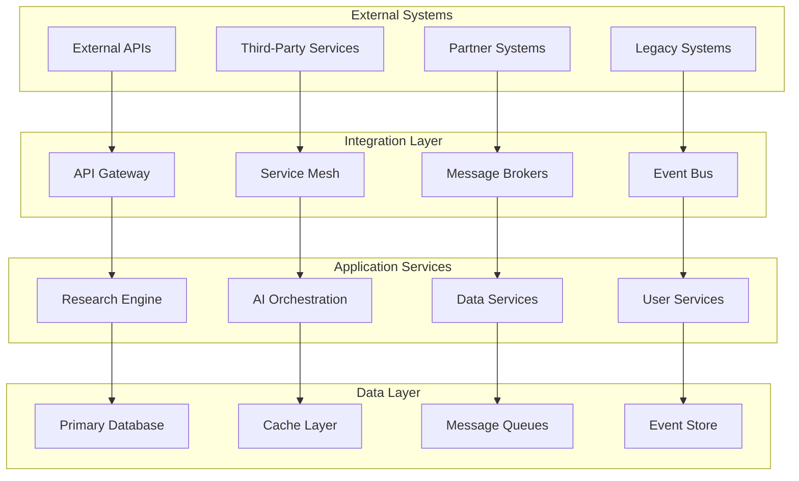
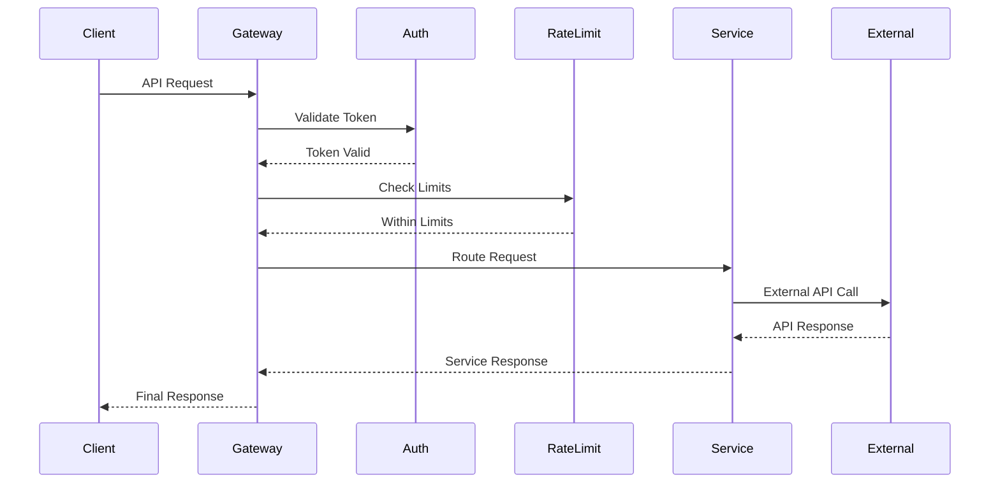
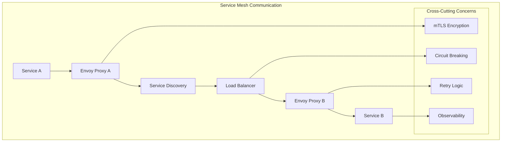
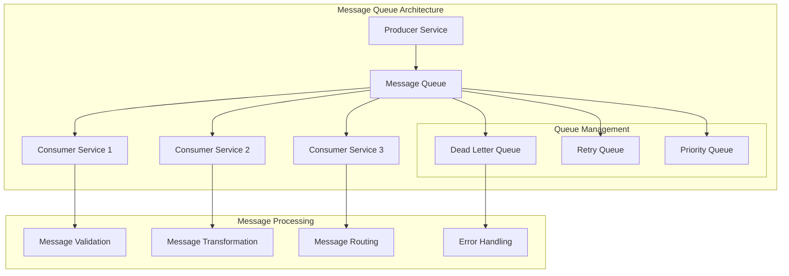
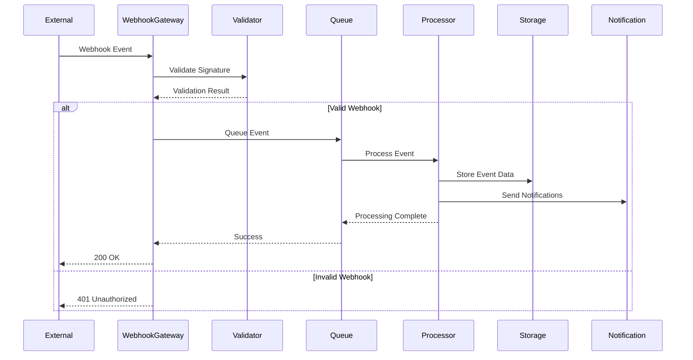
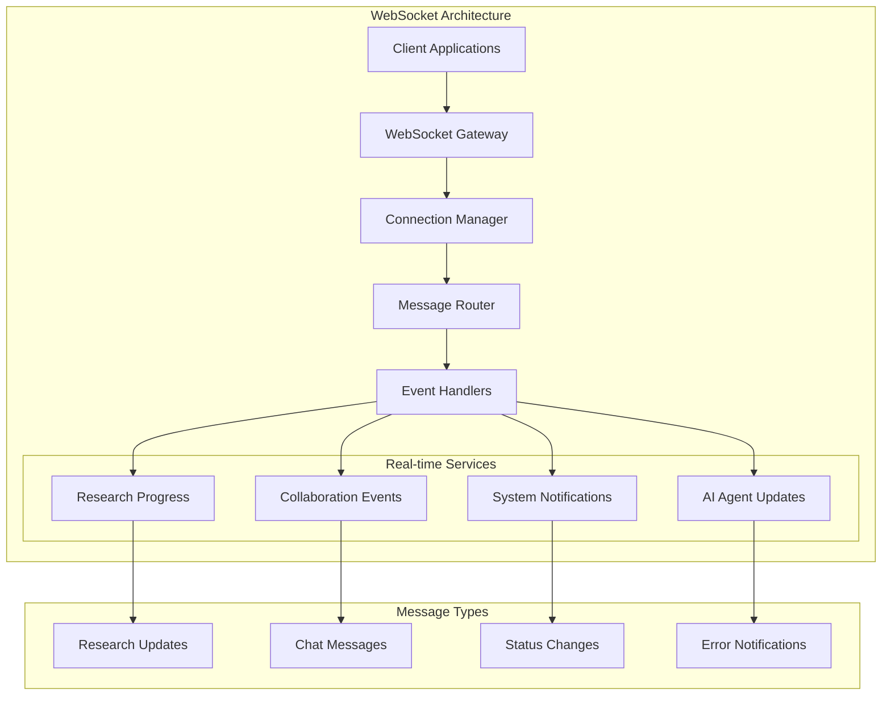
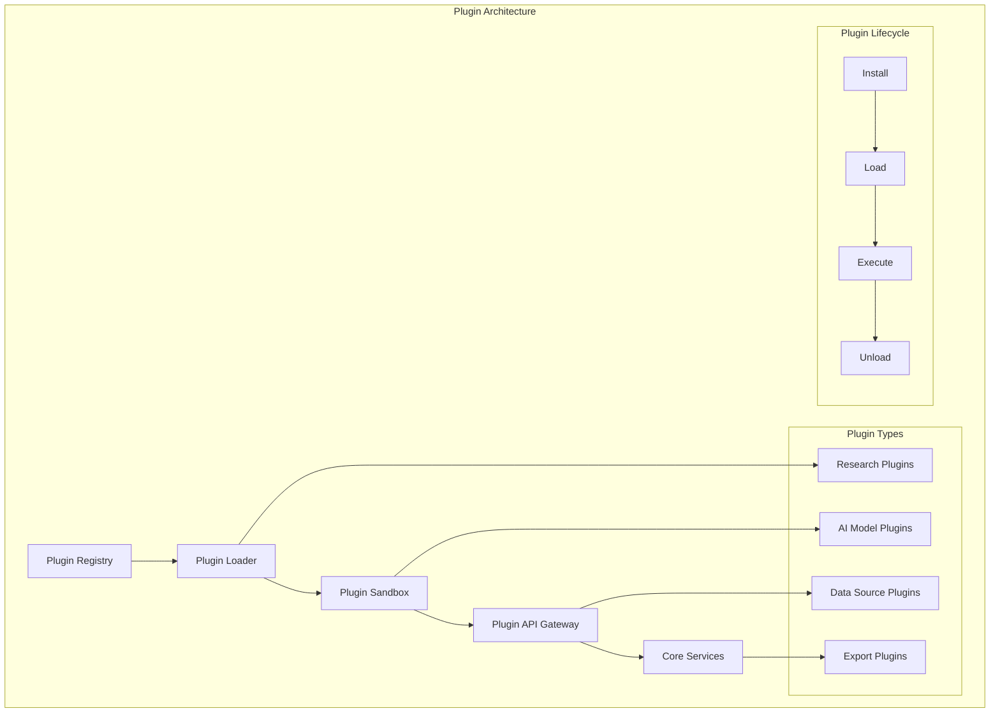
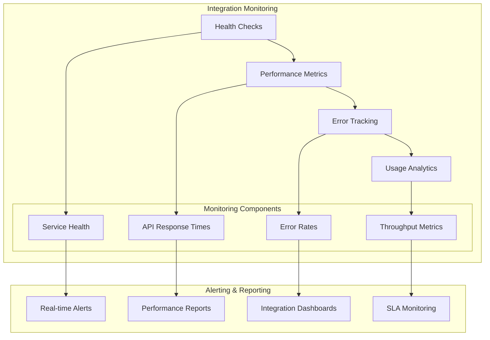

# 🔗 Integration Patterns

## Overview

This document outlines the comprehensive integration patterns implemented in the Free Deep Research System for connecting with external services, APIs, and systems. It covers synchronous and asynchronous integration patterns, service mesh communication, and enterprise integration strategies.

## 🎯 Integration Architecture Overview

### Integration Layers



### Integration Patterns Matrix

| Pattern | Use Case | Coupling | Reliability | Performance | Complexity |
|---------|----------|----------|-------------|-------------|------------|
| **Synchronous API** | Real-time queries | High | Medium | High | Low |
| **Asynchronous Messaging** | Background processing | Low | High | Medium | Medium |
| **Event-Driven** | Reactive systems | Low | High | High | High |
| **Webhook** | External notifications | Medium | Medium | Medium | Low |
| **Service Mesh** | Microservice communication | Low | High | High | High |
| **Message Queue** | Reliable processing | Low | High | Medium | Medium |

## 🔄 Synchronous Integration Patterns

### API Gateway Pattern



### External API Integration

```rust
// External API integration service
pub struct ExternalApiIntegration {
    client: reqwest::Client,
    rate_limiter: Arc<RwLock<RateLimiter>>,
    circuit_breaker: Arc<RwLock<CircuitBreaker>>,
    retry_policy: RetryPolicy,
    auth_manager: Arc<RwLock<AuthManager>>,
}

impl ExternalApiIntegration {
    pub async fn call_external_api<T, R>(
        &self,
        request: ApiRequest<T>,
    ) -> Result<ApiResponse<R>, IntegrationError>
    where
        T: Serialize,
        R: DeserializeOwned,
    {
        // Check circuit breaker
        if self.circuit_breaker.read().await.is_open() {
            return Err(IntegrationError::CircuitBreakerOpen);
        }
        
        // Apply rate limiting
        self.rate_limiter.write().await.acquire().await?;
        
        // Get authentication token
        let auth_token = self.auth_manager
            .read().await
            .get_token(&request.service).await?;
        
        // Execute request with retry policy
        let response = self.execute_with_retry(request, auth_token).await?;
        
        // Update circuit breaker
        self.circuit_breaker.write().await.record_success();
        
        Ok(response)
    }
    
    async fn execute_with_retry<T, R>(
        &self,
        request: ApiRequest<T>,
        auth_token: String,
    ) -> Result<ApiResponse<R>, IntegrationError>
    where
        T: Serialize,
        R: DeserializeOwned,
    {
        let mut attempts = 0;
        let max_attempts = self.retry_policy.max_attempts;
        
        loop {
            attempts += 1;
            
            match self.execute_request(&request, &auth_token).await {
                Ok(response) => return Ok(response),
                Err(error) if attempts >= max_attempts => return Err(error),
                Err(error) if error.is_retryable() => {
                    let delay = self.retry_policy.calculate_delay(attempts);
                    tokio::time::sleep(delay).await;
                    continue;
                }
                Err(error) => return Err(error),
            }
        }
    }
}
```

### Service-to-Service Communication



### Service Integration Manager

```rust
// Service integration manager
pub struct ServiceIntegrationManager {
    integrations: HashMap<ServiceProvider, Box<dyn ServiceIntegration>>,
    health_monitor: Arc<RwLock<HealthMonitor>>,
    metrics_collector: Arc<RwLock<MetricsCollector>>,
    config_manager: Arc<RwLock<ConfigManager>>,
}

#[async_trait]
pub trait ServiceIntegration: Send + Sync {
    async fn health_check(&self) -> Result<HealthStatus, IntegrationError>;
    async fn execute_request(&self, request: IntegrationRequest) -> Result<IntegrationResponse, IntegrationError>;
    async fn get_rate_limits(&self) -> Result<RateLimitInfo, IntegrationError>;
    fn get_service_info(&self) -> ServiceInfo;
}

// OpenRouter integration implementation
pub struct OpenRouterIntegration {
    client: reqwest::Client,
    api_key: String,
    base_url: String,
    rate_limiter: RateLimiter,
}

#[async_trait]
impl ServiceIntegration for OpenRouterIntegration {
    async fn health_check(&self) -> Result<HealthStatus, IntegrationError> {
        let response = self.client
            .get(&format!("{}/models", self.base_url))
            .header("Authorization", format!("Bearer {}", self.api_key))
            .send()
            .await?;
        
        if response.status().is_success() {
            Ok(HealthStatus::Healthy)
        } else {
            Ok(HealthStatus::Unhealthy {
                reason: format!("HTTP {}", response.status()),
            })
        }
    }
    
    async fn execute_request(&self, request: IntegrationRequest) -> Result<IntegrationResponse, IntegrationError> {
        // Rate limiting
        self.rate_limiter.acquire().await?;
        
        // Execute OpenRouter API call
        let response = self.client
            .post(&format!("{}/chat/completions", self.base_url))
            .header("Authorization", format!("Bearer {}", self.api_key))
            .header("Content-Type", "application/json")
            .json(&request.payload)
            .send()
            .await?;
        
        let response_body = response.json().await?;
        
        Ok(IntegrationResponse {
            status: ResponseStatus::Success,
            data: response_body,
            metadata: ResponseMetadata {
                response_time: request.start_time.elapsed(),
                tokens_used: self.extract_token_usage(&response_body),
                cost: self.calculate_cost(&response_body),
            },
        })
    }
}
```

## 📨 Asynchronous Integration Patterns

### Message Queue Integration



### Message Queue Implementation

```rust
// Message queue service
pub struct MessageQueueService {
    redis_client: redis::Client,
    queue_config: QueueConfig,
    message_serializer: Arc<dyn MessageSerializer>,
    dead_letter_handler: Arc<dyn DeadLetterHandler>,
}

impl MessageQueueService {
    pub async fn publish_message<T>(
        &self,
        queue_name: &str,
        message: T,
    ) -> Result<MessageId, QueueError>
    where
        T: Serialize,
    {
        let serialized_message = self.message_serializer.serialize(&message)?;
        
        let message_envelope = MessageEnvelope {
            id: Uuid::new_v4(),
            queue_name: queue_name.to_string(),
            payload: serialized_message,
            timestamp: Utc::now(),
            retry_count: 0,
            max_retries: self.queue_config.max_retries,
            ttl: self.queue_config.message_ttl,
            priority: MessagePriority::Normal,
        };
        
        let mut conn = self.redis_client.get_async_connection().await?;
        
        // Add to queue with priority support
        let queue_key = format!("queue:{}", queue_name);
        let message_data = serde_json::to_string(&message_envelope)?;
        
        redis::cmd("ZADD")
            .arg(&queue_key)
            .arg(message_envelope.priority as i32)
            .arg(&message_data)
            .query_async(&mut conn)
            .await?;
        
        // Set TTL for message
        redis::cmd("EXPIRE")
            .arg(&queue_key)
            .arg(self.queue_config.message_ttl.num_seconds())
            .query_async(&mut conn)
            .await?;
        
        Ok(message_envelope.id)
    }
    
    pub async fn consume_messages<T, F>(
        &self,
        queue_name: &str,
        handler: F,
    ) -> Result<(), QueueError>
    where
        T: DeserializeOwned,
        F: Fn(T) -> BoxFuture<'static, Result<(), ProcessingError>> + Send + Sync + 'static,
    {
        let mut conn = self.redis_client.get_async_connection().await?;
        let queue_key = format!("queue:{}", queue_name);
        
        loop {
            // Pop message with highest priority
            let result: Option<(String, String)> = redis::cmd("ZPOPMAX")
                .arg(&queue_key)
                .query_async(&mut conn)
                .await?;
            
            if let Some((message_data, _score)) = result {
                let message_envelope: MessageEnvelope = serde_json::from_str(&message_data)?;
                let message: T = self.message_serializer.deserialize(&message_envelope.payload)?;
                
                match handler(message).await {
                    Ok(()) => {
                        // Message processed successfully
                        self.acknowledge_message(&message_envelope).await?;
                    }
                    Err(error) => {
                        // Handle processing error
                        self.handle_processing_error(message_envelope, error).await?;
                    }
                }
            } else {
                // No messages available, wait before polling again
                tokio::time::sleep(Duration::from_millis(100)).await;
            }
        }
    }
}
```

## 🌐 Webhook Integration Patterns

### Webhook Management System



### Webhook Implementation

```rust
// Webhook management service
pub struct WebhookService {
    webhook_registry: Arc<RwLock<WebhookRegistry>>,
    signature_validator: Arc<dyn SignatureValidator>,
    event_processor: Arc<RwLock<EventProcessor>>,
    retry_manager: Arc<RwLock<RetryManager>>,
}

impl WebhookService {
    pub async fn register_webhook(
        &self,
        webhook_config: WebhookConfig,
    ) -> Result<WebhookId, WebhookError> {
        let webhook = Webhook {
            id: Uuid::new_v4(),
            url: webhook_config.url,
            secret: webhook_config.secret,
            events: webhook_config.events,
            headers: webhook_config.headers,
            retry_policy: webhook_config.retry_policy,
            status: WebhookStatus::Active,
            created_at: Utc::now(),
        };

        self.webhook_registry
            .write().await
            .register(webhook.clone()).await?;

        Ok(webhook.id)
    }

    pub async fn handle_incoming_webhook(
        &self,
        request: WebhookRequest,
    ) -> Result<WebhookResponse, WebhookError> {
        // Validate webhook signature
        let is_valid = self.signature_validator
            .validate(&request.headers, &request.body, &request.secret).await?;

        if !is_valid {
            return Ok(WebhookResponse {
                status: 401,
                message: "Invalid signature".to_string(),
            });
        }

        // Parse webhook event
        let event: WebhookEvent = serde_json::from_slice(&request.body)?;

        // Process event asynchronously
        self.event_processor
            .write().await
            .process_event(event).await?;

        Ok(WebhookResponse {
            status: 200,
            message: "Event processed successfully".to_string(),
        })
    }

    pub async fn send_webhook(
        &self,
        webhook_id: WebhookId,
        event: WebhookEvent,
    ) -> Result<(), WebhookError> {
        let webhook = self.webhook_registry
            .read().await
            .get_webhook(webhook_id).await?;

        let payload = WebhookPayload {
            event: event.event_type.clone(),
            timestamp: Utc::now(),
            data: event.data,
            signature: self.generate_signature(&event, &webhook.secret).await?,
        };

        self.send_webhook_with_retry(webhook, payload).await
    }

    async fn send_webhook_with_retry(
        &self,
        webhook: Webhook,
        payload: WebhookPayload,
    ) -> Result<(), WebhookError> {
        let mut attempts = 0;
        let max_attempts = webhook.retry_policy.max_attempts;

        loop {
            attempts += 1;

            match self.execute_webhook_request(&webhook, &payload).await {
                Ok(_) => return Ok(()),
                Err(error) if attempts >= max_attempts => {
                    // Move to dead letter queue
                    self.retry_manager
                        .write().await
                        .add_to_dead_letter_queue(webhook.id, payload).await?;
                    return Err(error);
                }
                Err(_) => {
                    let delay = webhook.retry_policy.calculate_delay(attempts);
                    tokio::time::sleep(delay).await;
                }
            }
        }
    }
}
```

## 🔄 Real-time Integration Patterns

### WebSocket Integration



### WebSocket Implementation

```rust
// WebSocket service for real-time communication
pub struct WebSocketService {
    connection_manager: Arc<RwLock<ConnectionManager>>,
    message_router: Arc<RwLock<MessageRouter>>,
    event_handlers: HashMap<String, Box<dyn EventHandler>>,
    subscription_manager: Arc<RwLock<SubscriptionManager>>,
}

impl WebSocketService {
    pub async fn handle_connection(
        &self,
        websocket: WebSocket,
        user_id: String,
    ) -> Result<(), WebSocketError> {
        let connection_id = Uuid::new_v4();

        // Register connection
        self.connection_manager
            .write().await
            .add_connection(connection_id, user_id.clone(), websocket.clone()).await?;

        // Handle incoming messages
        let (mut sender, mut receiver) = websocket.split();

        // Spawn message handling task
        let connection_manager = self.connection_manager.clone();
        let message_router = self.message_router.clone();

        tokio::spawn(async move {
            while let Some(message) = receiver.next().await {
                match message {
                    Ok(Message::Text(text)) => {
                        if let Ok(ws_message) = serde_json::from_str::<WebSocketMessage>(&text) {
                            message_router
                                .write().await
                                .route_message(connection_id, ws_message).await;
                        }
                    }
                    Ok(Message::Close(_)) => {
                        connection_manager
                            .write().await
                            .remove_connection(connection_id).await;
                        break;
                    }
                    Err(error) => {
                        eprintln!("WebSocket error: {}", error);
                        break;
                    }
                    _ => {}
                }
            }
        });

        Ok(())
    }

    pub async fn broadcast_message(
        &self,
        message: BroadcastMessage,
    ) -> Result<(), WebSocketError> {
        let connections = self.connection_manager
            .read().await
            .get_connections_for_broadcast(&message.target).await?;

        let ws_message = WebSocketMessage {
            id: Uuid::new_v4(),
            message_type: message.message_type,
            payload: message.payload,
            timestamp: Utc::now(),
        };

        let serialized = serde_json::to_string(&ws_message)?;

        for connection in connections {
            if let Err(error) = connection.send(Message::Text(serialized.clone())).await {
                eprintln!("Failed to send message to connection {}: {}", connection.id, error);
                // Remove failed connection
                self.connection_manager
                    .write().await
                    .remove_connection(connection.id).await;
            }
        }

        Ok(())
    }
}
```

## 🔌 Plugin Integration Architecture

### Plugin System



### Plugin Integration Implementation

```rust
// Plugin system for extensible integrations
pub struct PluginSystem {
    plugin_registry: Arc<RwLock<PluginRegistry>>,
    plugin_loader: Arc<RwLock<PluginLoader>>,
    plugin_sandbox: Arc<RwLock<PluginSandbox>>,
    api_gateway: Arc<RwLock<PluginApiGateway>>,
    security_manager: Arc<RwLock<SecurityManager>>,
}

impl PluginSystem {
    pub async fn install_plugin(
        &self,
        plugin_package: PluginPackage,
    ) -> Result<PluginId, PluginError> {
        // Validate plugin security
        self.security_manager
            .read().await
            .validate_plugin(&plugin_package).await?;

        // Extract plugin metadata
        let metadata = self.extract_plugin_metadata(&plugin_package).await?;

        // Register plugin
        let plugin_id = self.plugin_registry
            .write().await
            .register_plugin(metadata).await?;

        // Load plugin into sandbox
        self.plugin_loader
            .write().await
            .load_plugin(plugin_id, plugin_package).await?;

        Ok(plugin_id)
    }

    pub async fn execute_plugin(
        &self,
        plugin_id: PluginId,
        request: PluginRequest,
    ) -> Result<PluginResponse, PluginError> {
        // Get plugin instance
        let plugin = self.plugin_registry
            .read().await
            .get_plugin(plugin_id).await?;

        // Execute in sandbox
        let response = self.plugin_sandbox
            .write().await
            .execute_plugin(plugin, request).await?;

        Ok(response)
    }
}

#[async_trait]
pub trait Plugin: Send + Sync {
    async fn initialize(&mut self, config: PluginConfig) -> Result<(), PluginError>;
    async fn execute(&self, request: PluginRequest) -> Result<PluginResponse, PluginError>;
    async fn cleanup(&mut self) -> Result<(), PluginError>;
    fn get_metadata(&self) -> PluginMetadata;
}

// Example research plugin
pub struct CustomResearchPlugin {
    config: PluginConfig,
    http_client: reqwest::Client,
}

#[async_trait]
impl Plugin for CustomResearchPlugin {
    async fn initialize(&mut self, config: PluginConfig) -> Result<(), PluginError> {
        self.config = config;
        self.http_client = reqwest::Client::new();
        Ok(())
    }

    async fn execute(&self, request: PluginRequest) -> Result<PluginResponse, PluginError> {
        match request.action.as_str() {
            "search" => self.perform_search(request.parameters).await,
            "analyze" => self.analyze_data(request.parameters).await,
            _ => Err(PluginError::UnsupportedAction(request.action)),
        }
    }

    async fn cleanup(&mut self) -> Result<(), PluginError> {
        // Cleanup resources
        Ok(())
    }

    fn get_metadata(&self) -> PluginMetadata {
        PluginMetadata {
            name: "Custom Research Plugin".to_string(),
            version: "1.0.0".to_string(),
            description: "Custom research data source integration".to_string(),
            author: "Research Team".to_string(),
            capabilities: vec![
                "search".to_string(),
                "analyze".to_string(),
            ],
        }
    }
}
```

## 📊 Integration Monitoring & Analytics

### Integration Health Monitoring



### Integration Metrics Collection

```rust
// Integration monitoring service
pub struct IntegrationMonitoringService {
    metrics_collector: Arc<RwLock<MetricsCollector>>,
    health_checker: Arc<RwLock<HealthChecker>>,
    alert_manager: Arc<RwLock<AlertManager>>,
    dashboard_service: Arc<RwLock<DashboardService>>,
}

impl IntegrationMonitoringService {
    pub async fn collect_integration_metrics(
        &self,
        integration_id: IntegrationId,
    ) -> Result<IntegrationMetrics, MonitoringError> {
        let metrics = IntegrationMetrics {
            integration_id,
            timestamp: Utc::now(),
            response_time: self.measure_response_time(integration_id).await?,
            error_rate: self.calculate_error_rate(integration_id).await?,
            throughput: self.measure_throughput(integration_id).await?,
            availability: self.check_availability(integration_id).await?,
            cost: self.calculate_cost(integration_id).await?,
        };

        // Store metrics
        self.metrics_collector
            .write().await
            .store_metrics(metrics.clone()).await?;

        // Check for alerts
        self.check_alert_conditions(&metrics).await?;

        Ok(metrics)
    }

    pub async fn generate_integration_report(
        &self,
        time_range: TimeRange,
    ) -> Result<IntegrationReport, MonitoringError> {
        let metrics = self.metrics_collector
            .read().await
            .get_metrics_for_range(time_range).await?;

        let report = IntegrationReport {
            time_range,
            total_requests: metrics.iter().map(|m| m.throughput).sum(),
            average_response_time: self.calculate_average_response_time(&metrics),
            error_rate: self.calculate_overall_error_rate(&metrics),
            availability: self.calculate_overall_availability(&metrics),
            cost_breakdown: self.generate_cost_breakdown(&metrics),
            performance_trends: self.analyze_performance_trends(&metrics),
            recommendations: self.generate_recommendations(&metrics),
        };

        Ok(report)
    }
}
```

## 🔗 Related Documentation

- **[Event-Driven Architecture](./event-driven-architecture.md)** - Event processing patterns
- **[API Architecture](./api-architecture.md)** - API design and integration
- **[Service Architecture](./service-architecture.md)** - Service communication patterns
- **[Security Architecture](./security-architecture.md)** - Secure integration practices
- **[Monitoring Guide](../deployment/monitoring.md)** - Integration monitoring strategies
- **[Plugin Development](../development/plugins.md)** - Plugin development guide

---

**Next**: Explore [Event-Driven Architecture](./event-driven-architecture.md) for event processing patterns.
