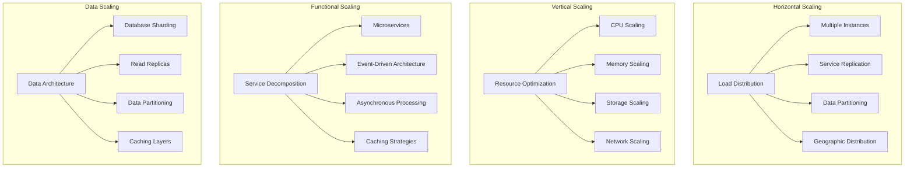
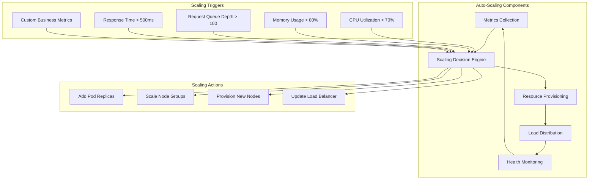
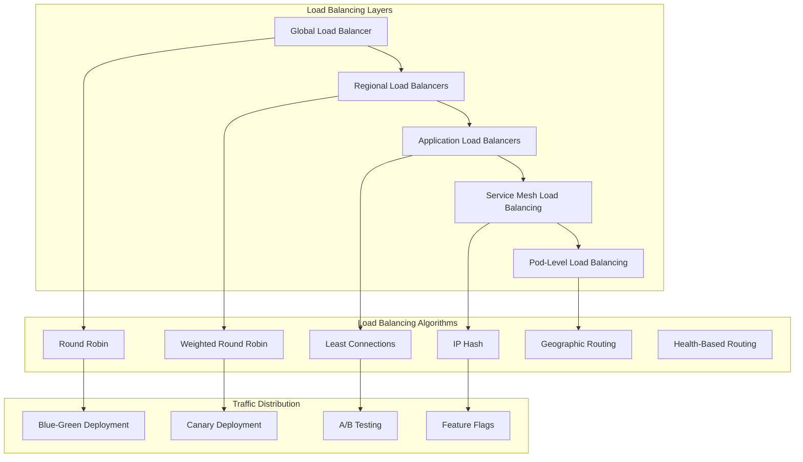
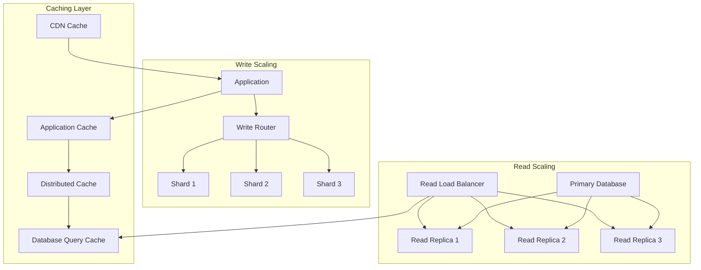
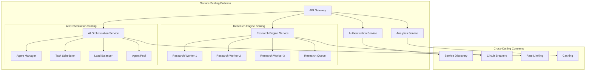
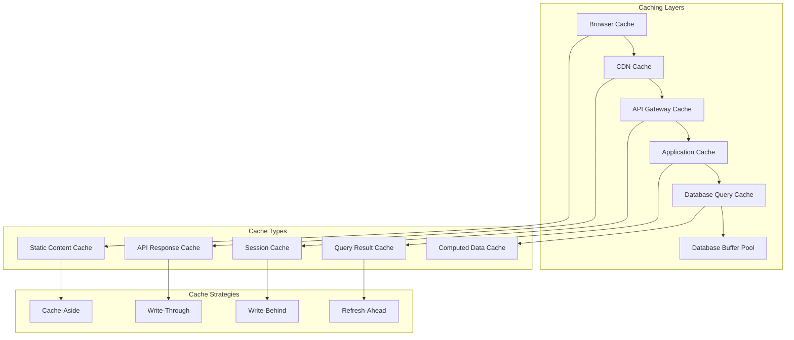
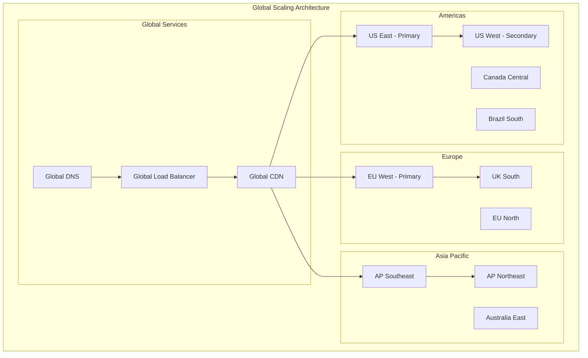
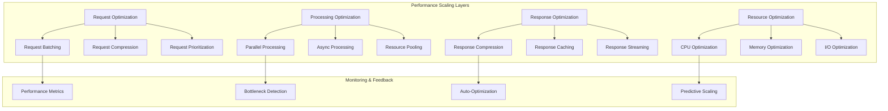
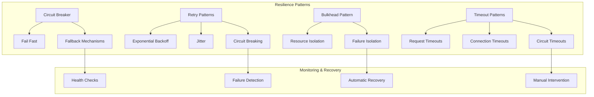
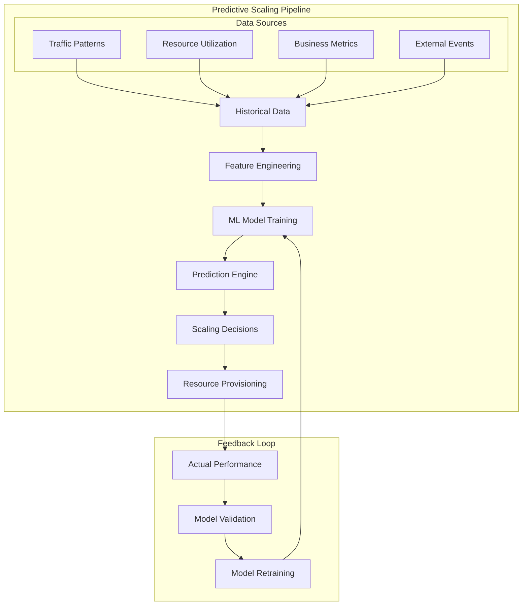

# 📈 Scalability Patterns

## Overview

This document outlines comprehensive scalability patterns and strategies implemented in the Free Deep Research System to handle varying loads, ensure high availability, and maintain performance across different scales of operation from single-user deployments to enterprise-scale implementations.

## 🎯 Scalability Strategy Overview

### Scaling Dimensions



### Scalability Targets

| Component | Current Capacity | Target Capacity | Scaling Method | Timeline |
|-----------|------------------|-----------------|----------------|----------|
| **API Gateway** | 1K RPS | 100K RPS | Horizontal + CDN | Q2 2025 |
| **Research Engine** | 100 concurrent | 10K concurrent | Horizontal + Queue | Q3 2025 |
| **AI Orchestration** | 50 agents | 5K agents | Horizontal + Clustering | Q4 2025 |
| **Database** | 10K QPS | 1M QPS | Sharding + Replicas | Q1 2026 |
| **Storage** | 1TB | 100TB | Distributed + Tiering | Q2 2026 |

## 🔄 Horizontal Scaling Patterns

### Auto-Scaling Architecture



### Kubernetes Auto-Scaling Configuration

```yaml
# Horizontal Pod Autoscaler (HPA)
apiVersion: autoscaling/v2
kind: HorizontalPodAutoscaler
metadata:
  name: fdr-backend-hpa
  namespace: free-deep-research
spec:
  scaleTargetRef:
    apiVersion: apps/v1
    kind: Deployment
    name: fdr-backend
  minReplicas: 3
  maxReplicas: 50
  metrics:
  - type: Resource
    resource:
      name: cpu
      target:
        type: Utilization
        averageUtilization: 70
  - type: Resource
    resource:
      name: memory
      target:
        type: Utilization
        averageUtilization: 80
  - type: Pods
    pods:
      metric:
        name: http_requests_per_second
      target:
        type: AverageValue
        averageValue: "100"
  behavior:
    scaleUp:
      stabilizationWindowSeconds: 60
      policies:
      - type: Percent
        value: 100
        periodSeconds: 15
      - type: Pods
        value: 4
        periodSeconds: 15
      selectPolicy: Max
    scaleDown:
      stabilizationWindowSeconds: 300
      policies:
      - type: Percent
        value: 10
        periodSeconds: 60

---
# Vertical Pod Autoscaler (VPA)
apiVersion: autoscaling.k8s.io/v1
kind: VerticalPodAutoscaler
metadata:
  name: fdr-backend-vpa
  namespace: free-deep-research
spec:
  targetRef:
    apiVersion: apps/v1
    kind: Deployment
    name: fdr-backend
  updatePolicy:
    updateMode: "Auto"
  resourcePolicy:
    containerPolicies:
    - containerName: backend
      minAllowed:
        cpu: 100m
        memory: 128Mi
      maxAllowed:
        cpu: 4000m
        memory: 8Gi
      controlledResources: ["cpu", "memory"]

---
# Cluster Autoscaler Configuration
apiVersion: v1
kind: ConfigMap
metadata:
  name: cluster-autoscaler-status
  namespace: kube-system
data:
  nodes.max: "100"
  nodes.min: "3"
  scale-down-delay-after-add: "10m"
  scale-down-unneeded-time: "10m"
  scale-down-utilization-threshold: "0.5"
  skip-nodes-with-local-storage: "false"
  skip-nodes-with-system-pods: "false"
```

### Load Balancing Strategies



## 📊 Database Scaling Patterns

### Database Scaling Architecture



### Database Sharding Strategy

```yaml
# Database sharding configuration
database_sharding:
  strategy: hash_based
  shard_key: user_id
  num_shards: 16
  
  shards:
    shard_0:
      host: db-shard-0.cluster.local
      range: "0000-0fff"
      replicas: 2
      
    shard_1:
      host: db-shard-1.cluster.local
      range: "1000-1fff"
      replicas: 2
      
    # ... additional shards
    
  routing_rules:
    - table: users
      shard_key: user_id
      strategy: hash
      
    - table: research_sessions
      shard_key: user_id
      strategy: hash
      
    - table: api_keys
      shard_key: user_id
      strategy: hash
      
    - table: audit_logs
      shard_key: timestamp
      strategy: time_based
      retention: 90d

# Read replica configuration
read_replicas:
  primary_region: us-east-1
  replicas:
    - region: us-east-1
      instance_class: db.r5.2xlarge
      lag_threshold: 100ms
      
    - region: us-west-2
      instance_class: db.r5.xlarge
      lag_threshold: 500ms
      
    - region: eu-west-1
      instance_class: db.r5.xlarge
      lag_threshold: 1000ms

# Connection pooling
connection_pooling:
  max_connections: 1000
  min_connections: 10
  connection_timeout: 30s
  idle_timeout: 600s
  max_lifetime: 3600s
  
  read_pool:
    max_connections: 800
    target_utilization: 70%
    
  write_pool:
    max_connections: 200
    target_utilization: 80%
```

## 🚀 Application Scaling Patterns

### Microservices Scaling



### Event-Driven Scaling

```yaml
# Event-driven scaling configuration
event_driven_scaling:
  message_queues:
    research_queue:
      type: redis_streams
      max_length: 10000
      consumer_groups:
        - name: research_workers
          consumers: 5
          max_pending: 100
          
    ai_task_queue:
      type: redis_streams
      max_length: 50000
      consumer_groups:
        - name: ai_workers
          consumers: 10
          max_pending: 500
          
  scaling_rules:
    - queue: research_queue
      metric: queue_depth
      thresholds:
        scale_up: 100
        scale_down: 10
      actions:
        scale_up:
          add_consumers: 2
          max_consumers: 20
        scale_down:
          remove_consumers: 1
          min_consumers: 2
          
    - queue: ai_task_queue
      metric: processing_time
      thresholds:
        scale_up: 30s
        scale_down: 5s
      actions:
        scale_up:
          add_consumers: 5
          max_consumers: 50
        scale_down:
          remove_consumers: 2
          min_consumers: 5

# Async processing patterns
async_processing:
  patterns:
    - name: research_workflow
      type: saga_pattern
      steps:
        - validate_request
        - allocate_resources
        - execute_research
        - process_results
        - notify_completion
      compensation:
        - cleanup_resources
        - rollback_changes
        - notify_failure
        
    - name: ai_agent_coordination
      type: choreography
      events:
        - agent_task_assigned
        - agent_task_started
        - agent_task_completed
        - agent_task_failed
      handlers:
        - task_monitor
        - resource_manager
        - result_aggregator
```

## 🔄 Caching Strategies

### Multi-Layer Caching Architecture



### Cache Configuration

```yaml
# Redis caching configuration
redis_caching:
  clusters:
    session_cache:
      nodes: 3
      memory_per_node: 4GB
      eviction_policy: allkeys-lru
      ttl_default: 3600s
      
    api_cache:
      nodes: 6
      memory_per_node: 8GB
      eviction_policy: allkeys-lfu
      ttl_default: 300s
      
    research_cache:
      nodes: 9
      memory_per_node: 16GB
      eviction_policy: volatile-ttl
      ttl_default: 7200s

# Application-level caching
application_caching:
  strategies:
    - cache_type: api_responses
      pattern: cache_aside
      ttl: 300s
      invalidation: time_based
      
    - cache_type: research_results
      pattern: write_through
      ttl: 3600s
      invalidation: event_based
      
    - cache_type: user_sessions
      pattern: write_behind
      ttl: 1800s
      invalidation: manual
      
    - cache_type: static_data
      pattern: refresh_ahead
      ttl: 86400s
      invalidation: version_based

# CDN configuration
cdn_caching:
  provider: cloudflare
  cache_rules:
    - path: "/static/*"
      ttl: 31536000s  # 1 year
      cache_level: aggressive
      
    - path: "/api/v*/public/*"
      ttl: 300s
      cache_level: standard
      
    - path: "/api/v*/research/results/*"
      ttl: 3600s
      cache_level: standard
      vary: ["Authorization"]
```

## 🌐 Geographic Scaling Patterns

### Global Distribution Strategy



### Regional Scaling Configuration

```yaml
# Global scaling configuration
global_scaling:
  regions:
    primary_regions:
      - name: us-east-1
        capacity: 100%
        traffic_allocation: 40%
        services: [all]

      - name: eu-west-1
        capacity: 80%
        traffic_allocation: 35%
        services: [all]

      - name: ap-southeast-1
        capacity: 60%
        traffic_allocation: 25%
        services: [core, api]

    secondary_regions:
      - name: us-west-2
        capacity: 50%
        traffic_allocation: 0%  # Failover only
        services: [core, api]

      - name: eu-north-1
        capacity: 40%
        traffic_allocation: 0%  # Failover only
        services: [core]

  traffic_routing:
    strategy: latency_based
    health_check_interval: 30s
    failover_threshold: 3

    routing_rules:
      - source_region: americas
        primary_target: us-east-1
        secondary_target: us-west-2

      - source_region: europe
        primary_target: eu-west-1
        secondary_target: eu-north-1

      - source_region: asia_pacific
        primary_target: ap-southeast-1
        secondary_target: ap-northeast-1

# Data replication strategy
data_replication:
  strategy: multi_master
  consistency: eventual

  replication_rules:
    - data_type: user_data
      replication: synchronous
      regions: [primary_region, nearest_secondary]

    - data_type: research_results
      replication: asynchronous
      regions: [all_regions]
      delay_tolerance: 5m

    - data_type: cache_data
      replication: none
      local_only: true

    - data_type: audit_logs
      replication: asynchronous
      regions: [primary_region, compliance_region]
      retention: 7y
```

## 📊 Performance Scaling Patterns

### Performance Optimization Architecture



### Performance Scaling Configuration

```yaml
# Performance scaling configuration
performance_scaling:
  request_optimization:
    batching:
      enabled: true
      batch_size: 100
      batch_timeout: 100ms

    compression:
      enabled: true
      algorithm: gzip
      min_size: 1024

    prioritization:
      enabled: true
      priority_levels:
        - name: critical
          weight: 100
          max_queue_time: 1s
        - name: high
          weight: 75
          max_queue_time: 5s
        - name: normal
          weight: 50
          max_queue_time: 30s
        - name: low
          weight: 25
          max_queue_time: 300s

  processing_optimization:
    parallel_processing:
      enabled: true
      max_workers: 100
      worker_pool_size: 20

    async_processing:
      enabled: true
      queue_size: 10000
      consumer_count: 50

    resource_pooling:
      connection_pools:
        database:
          max_connections: 100
          min_connections: 10
          idle_timeout: 300s
        redis:
          max_connections: 200
          min_connections: 20
          idle_timeout: 60s

  response_optimization:
    compression:
      enabled: true
      algorithms: [gzip, brotli]
      quality: 6

    streaming:
      enabled: true
      chunk_size: 8192
      buffer_size: 65536

    caching:
      enabled: true
      default_ttl: 300s
      max_size: 1GB

# Auto-scaling based on performance metrics
performance_based_scaling:
  metrics:
    - name: response_time_p95
      threshold: 500ms
      action: scale_up
      cooldown: 300s

    - name: cpu_utilization
      threshold: 70%
      action: scale_up
      cooldown: 180s

    - name: memory_utilization
      threshold: 80%
      action: scale_up
      cooldown: 180s

    - name: queue_depth
      threshold: 1000
      action: scale_up
      cooldown: 60s

  scaling_policies:
    scale_up:
      increment: 2
      max_instances: 100
      evaluation_periods: 2

    scale_down:
      decrement: 1
      min_instances: 3
      evaluation_periods: 5
      stabilization_window: 300s
```

## 🔄 Resilience & Fault Tolerance Patterns

### Resilience Architecture



### Resilience Configuration

```yaml
# Resilience patterns configuration
resilience:
  circuit_breaker:
    failure_threshold: 5
    recovery_timeout: 30s
    half_open_max_calls: 3

    services:
      - name: external_api
        failure_threshold: 3
        recovery_timeout: 60s

      - name: database
        failure_threshold: 2
        recovery_timeout: 10s

      - name: cache
        failure_threshold: 5
        recovery_timeout: 5s

  retry_policy:
    max_attempts: 3
    base_delay: 100ms
    max_delay: 5s
    backoff_multiplier: 2.0
    jitter: true

    retryable_errors:
      - connection_timeout
      - service_unavailable
      - rate_limit_exceeded

    non_retryable_errors:
      - authentication_failed
      - authorization_denied
      - invalid_request

  timeout_configuration:
    request_timeout: 30s
    connection_timeout: 5s
    read_timeout: 10s
    write_timeout: 10s

    service_timeouts:
      - service: research_engine
        timeout: 300s
      - service: ai_orchestration
        timeout: 120s
      - service: database
        timeout: 5s

  bulkhead_isolation:
    thread_pools:
      - name: critical_operations
        core_size: 10
        max_size: 20
        queue_size: 100

      - name: background_tasks
        core_size: 5
        max_size: 10
        queue_size: 1000

      - name: external_api_calls
        core_size: 20
        max_size: 50
        queue_size: 500

# Health check configuration
health_checks:
  endpoints:
    - path: /health/live
      interval: 10s
      timeout: 5s
      failure_threshold: 3

    - path: /health/ready
      interval: 5s
      timeout: 3s
      failure_threshold: 2

    - path: /health/startup
      interval: 30s
      timeout: 10s
      failure_threshold: 5

  dependencies:
    - name: database
      check: connection_test
      timeout: 2s

    - name: redis
      check: ping_test
      timeout: 1s

    - name: external_apis
      check: health_endpoint
      timeout: 5s
```

## 📈 Predictive Scaling

### Machine Learning-Based Scaling



### Predictive Scaling Configuration

```yaml
# Predictive scaling configuration
predictive_scaling:
  models:
    - name: traffic_prediction
      algorithm: lstm
      features:
        - historical_traffic
        - time_of_day
        - day_of_week
        - seasonal_patterns
        - business_events
      prediction_horizon: 1h
      confidence_threshold: 0.8

    - name: resource_prediction
      algorithm: random_forest
      features:
        - cpu_utilization_history
        - memory_usage_history
        - request_patterns
        - response_times
      prediction_horizon: 30m
      confidence_threshold: 0.85

  scaling_rules:
    - trigger: predicted_traffic_increase
      threshold: 50%
      lead_time: 15m
      action: preemptive_scale_up

    - trigger: predicted_resource_shortage
      threshold: 80%
      lead_time: 10m
      action: resource_optimization

    - trigger: predicted_traffic_decrease
      threshold: 30%
      lead_time: 20m
      action: gradual_scale_down

  training_schedule:
    frequency: daily
    data_retention: 90d
    validation_split: 0.2
    retraining_threshold: 0.1  # Accuracy drop
```

## 🔗 Related Documentation

- **[Deployment Architecture](./deployment-architecture.md)** - Deployment scaling strategies
- **[Infrastructure Design](./infrastructure-design.md)** - Infrastructure scaling components
- **[Performance Optimization](../development/performance.md)** - Application performance tuning
- **[Monitoring Guide](../deployment/monitoring.md)** - Scaling metrics and monitoring
- **[Load Testing](../development/testing.md)** - Performance and scalability testing
- **[Capacity Planning](../deployment/capacity-planning.md)** - Resource capacity planning

---

**Phase 4 Complete**: Deployment & Infrastructure documentation fully established with comprehensive scalability patterns. Ready for Phase 5: Integration & Tools.
