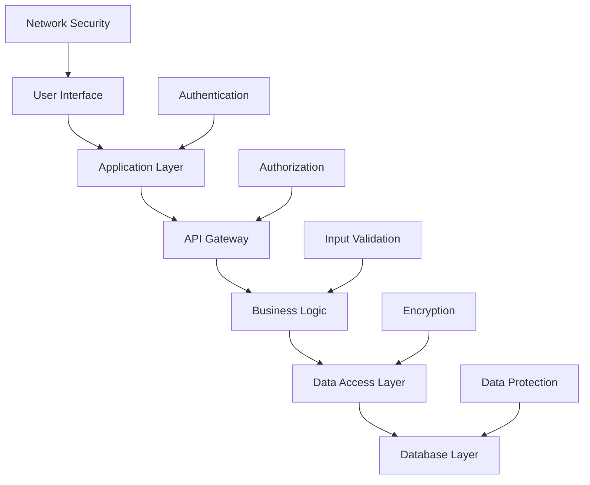
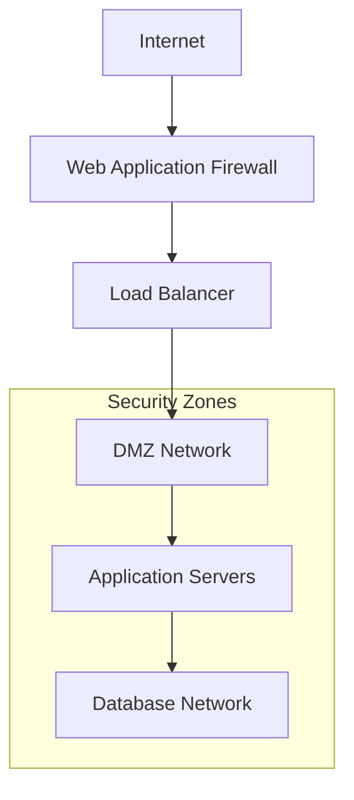
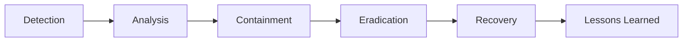
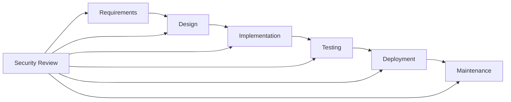

# 🔒 Security Architecture

## Overview

This document outlines the comprehensive security architecture of the Free Deep Research System, detailing security controls, threat models, and protection mechanisms across all system components.

## 🛡️ Security Framework

### Defense in Depth Strategy

Our security architecture implements multiple layers of protection:



### Security Principles

1. **Zero Trust Architecture**: Never trust, always verify
2. **Least Privilege Access**: Minimum necessary permissions
3. **Defense in Depth**: Multiple security layers
4. **Fail Secure**: Secure defaults and failure modes
5. **Security by Design**: Built-in security from the ground up

## 🔐 Authentication Architecture

### Multi-Factor Authentication (MFA)

```typescript
interface AuthenticationFlow {
  primary: {
    method: 'password' | 'oauth' | 'saml';
    strength: 'weak' | 'medium' | 'strong';
  };
  secondary: {
    method: 'totp' | 'sms' | 'email' | 'hardware_key';
    required: boolean;
  };
  risk_assessment: {
    device_trust: number;
    location_trust: number;
    behavior_trust: number;
  };
}
```

### Identity Providers

- **Internal**: Native username/password with bcrypt hashing
- **OAuth 2.0**: Google, Microsoft, GitHub integration
- **SAML 2.0**: Enterprise SSO integration
- **LDAP/AD**: Corporate directory integration

### Session Management

```rust
pub struct SessionConfig {
    pub max_age: Duration,           // 24 hours default
    pub idle_timeout: Duration,      // 2 hours default
    pub secure_only: bool,           // HTTPS only
    pub same_site: SameSite,         // Strict
    pub http_only: bool,             // Prevent XSS
    pub rotation_interval: Duration, // 1 hour
}
```

## 🔑 Authorization Model

### Role-Based Access Control (RBAC)

```yaml
roles:
  admin:
    permissions:
      - system:manage
      - users:manage
      - research:all
      - analytics:all
  
  researcher:
    permissions:
      - research:create
      - research:read_own
      - templates:use
      - export:basic
  
  viewer:
    permissions:
      - research:read_shared
      - templates:view
      - export:none
```

### Attribute-Based Access Control (ABAC)

```typescript
interface AccessPolicy {
  subject: {
    user_id: string;
    roles: string[];
    organization: string;
    clearance_level: number;
  };
  resource: {
    type: 'research' | 'template' | 'data';
    classification: 'public' | 'internal' | 'confidential' | 'restricted';
    owner: string;
    tags: string[];
  };
  action: 'create' | 'read' | 'update' | 'delete' | 'share';
  context: {
    time: Date;
    location: string;
    device_trust: number;
  };
}
```

## 🔒 Data Protection

### Encryption Standards

#### Data at Rest
- **Algorithm**: AES-256-GCM
- **Key Management**: Hardware Security Modules (HSM)
- **Key Rotation**: Automatic every 90 days
- **Backup Encryption**: Separate encryption keys

```rust
pub struct EncryptionConfig {
    pub algorithm: EncryptionAlgorithm::AES256GCM,
    pub key_derivation: KeyDerivation::PBKDF2,
    pub key_length: usize = 256,
    pub iv_length: usize = 96,
    pub tag_length: usize = 128,
}
```

#### Data in Transit
- **Protocol**: TLS 1.3 minimum
- **Cipher Suites**: AEAD ciphers only
- **Certificate Pinning**: Critical connections
- **Perfect Forward Secrecy**: Ephemeral key exchange

### Data Classification

| Level | Description | Protection |
|-------|-------------|------------|
| **Public** | Non-sensitive information | Standard encryption |
| **Internal** | Internal business data | Enhanced encryption + access controls |
| **Confidential** | Sensitive research data | Strong encryption + strict access controls |
| **Restricted** | Highly sensitive data | Maximum encryption + audit logging |

### Personal Data Protection

```typescript
interface PersonalDataProtection {
  collection: {
    lawful_basis: 'consent' | 'contract' | 'legal_obligation' | 'legitimate_interest';
    purpose_limitation: string[];
    data_minimization: boolean;
  };
  processing: {
    pseudonymization: boolean;
    anonymization: boolean;
    retention_period: Duration;
  };
  rights: {
    access: boolean;
    rectification: boolean;
    erasure: boolean;
    portability: boolean;
    objection: boolean;
  };
}
```

## 🌐 Network Security

### Network Architecture



### Security Controls

#### Web Application Firewall (WAF)
- **OWASP Top 10 Protection**: Automated threat detection
- **Rate Limiting**: API and request throttling
- **Geo-blocking**: Country-based access control
- **Bot Protection**: Automated bot detection and mitigation

#### Network Segmentation
```yaml
network_zones:
  dmz:
    cidr: "10.0.1.0/24"
    access: "internet_facing"
    services: ["load_balancer", "waf"]
  
  application:
    cidr: "10.0.2.0/24"
    access: "internal_only"
    services: ["api_servers", "web_servers"]
  
  database:
    cidr: "10.0.3.0/24"
    access: "application_only"
    services: ["postgresql", "redis"]
```

## 🔍 Security Monitoring

### Security Information and Event Management (SIEM)

```typescript
interface SecurityEvent {
  timestamp: Date;
  event_type: 'authentication' | 'authorization' | 'data_access' | 'system';
  severity: 'low' | 'medium' | 'high' | 'critical';
  source: {
    ip_address: string;
    user_agent: string;
    user_id?: string;
  };
  details: {
    action: string;
    resource: string;
    outcome: 'success' | 'failure';
    risk_score: number;
  };
}
```

### Threat Detection

#### Behavioral Analytics
- **User Behavior Analytics (UBA)**: Detect anomalous user activities
- **Entity Behavior Analytics (EBA)**: Monitor system and application behavior
- **Machine Learning**: AI-powered threat detection

#### Indicators of Compromise (IoC)
```yaml
threat_indicators:
  authentication:
    - multiple_failed_logins
    - unusual_login_times
    - new_device_access
    - impossible_travel
  
  data_access:
    - bulk_data_downloads
    - unusual_query_patterns
    - privilege_escalation_attempts
    - data_exfiltration_patterns
```

### Incident Response



#### Response Procedures
1. **Immediate Response** (< 1 hour)
   - Threat assessment
   - Initial containment
   - Stakeholder notification

2. **Investigation** (< 24 hours)
   - Forensic analysis
   - Impact assessment
   - Evidence collection

3. **Recovery** (< 72 hours)
   - System restoration
   - Security improvements
   - Monitoring enhancement

## 🔐 API Security

### API Gateway Security

```typescript
interface APISecurityConfig {
  authentication: {
    methods: ['api_key', 'oauth2', 'jwt'];
    token_validation: 'strict';
    rate_limiting: {
      requests_per_minute: 100;
      burst_limit: 20;
    };
  };
  authorization: {
    model: 'rbac' | 'abac';
    policy_enforcement: 'strict';
  };
  input_validation: {
    schema_validation: boolean;
    sanitization: boolean;
    size_limits: {
      request_body: '10MB';
      query_params: '2KB';
    };
  };
}
```

### API Security Controls

#### Input Validation
```rust
pub fn validate_research_query(query: &ResearchQuery) -> Result<(), ValidationError> {
    // Length validation
    if query.text.len() > MAX_QUERY_LENGTH {
        return Err(ValidationError::QueryTooLong);
    }
    
    // Content validation
    if contains_malicious_patterns(&query.text) {
        return Err(ValidationError::MaliciousContent);
    }
    
    // Parameter validation
    validate_parameters(&query.parameters)?;
    
    Ok(())
}
```

#### Rate Limiting
```yaml
rate_limits:
  global:
    requests_per_second: 1000
    burst_capacity: 2000
  
  per_user:
    requests_per_minute: 100
    research_sessions_per_hour: 10
  
  per_api_key:
    requests_per_minute: 1000
    concurrent_requests: 50
```

## 🛡️ Application Security

### Secure Development Lifecycle (SDLC)



### Security Testing

#### Static Application Security Testing (SAST)
- **Code Analysis**: Automated vulnerability scanning
- **Dependency Scanning**: Third-party library vulnerabilities
- **Secret Detection**: Hardcoded credentials and keys

#### Dynamic Application Security Testing (DAST)
- **Penetration Testing**: Simulated attacks
- **Vulnerability Scanning**: Runtime security testing
- **Fuzzing**: Input validation testing

#### Interactive Application Security Testing (IAST)
- **Runtime Analysis**: Real-time vulnerability detection
- **Code Coverage**: Security test coverage metrics
- **False Positive Reduction**: Accurate vulnerability reporting

## 🔒 Infrastructure Security

### Container Security

```dockerfile
# Security-hardened container
FROM node:18-alpine AS base

# Create non-root user
RUN addgroup -g 1001 -S appgroup && \
    adduser -S appuser -u 1001 -G appgroup

# Security updates
RUN apk update && apk upgrade && \
    apk add --no-cache dumb-init

# Set security headers
ENV NODE_ENV=production
ENV SECURE_HEADERS=true

USER appuser
WORKDIR /app

# Health check
HEALTHCHECK --interval=30s --timeout=3s --start-period=5s --retries=3 \
  CMD curl -f http://localhost:3000/health || exit 1
```

### Kubernetes Security

```yaml
apiVersion: v1
kind: Pod
metadata:
  name: free-deep-research
spec:
  securityContext:
    runAsNonRoot: true
    runAsUser: 1001
    fsGroup: 1001
  containers:
  - name: app
    image: free-deep-research:latest
    securityContext:
      allowPrivilegeEscalation: false
      readOnlyRootFilesystem: true
      capabilities:
        drop:
        - ALL
    resources:
      limits:
        memory: "1Gi"
        cpu: "500m"
      requests:
        memory: "512Mi"
        cpu: "250m"
```

## 📊 Compliance & Governance

### Regulatory Compliance

#### GDPR (General Data Protection Regulation)
- **Data Protection by Design**: Built-in privacy protection
- **Data Subject Rights**: Access, rectification, erasure, portability
- **Consent Management**: Granular consent controls
- **Data Processing Records**: Comprehensive audit trails

#### CCPA (California Consumer Privacy Act)
- **Consumer Rights**: Know, delete, opt-out, non-discrimination
- **Data Categories**: Personal information classification
- **Third-Party Sharing**: Disclosure and opt-out mechanisms

#### SOC 2 Type II
- **Security**: Information security policies and procedures
- **Availability**: System availability and performance
- **Processing Integrity**: System processing completeness and accuracy
- **Confidentiality**: Information designated as confidential
- **Privacy**: Personal information collection, use, retention, and disposal

### Security Governance

```yaml
governance_framework:
  policies:
    - information_security_policy
    - data_protection_policy
    - incident_response_policy
    - access_control_policy
  
  procedures:
    - vulnerability_management
    - change_management
    - backup_and_recovery
    - business_continuity
  
  standards:
    - encryption_standards
    - authentication_standards
    - development_standards
    - operational_standards
```

## 🚨 Risk Management

### Risk Assessment Matrix

| Risk Level | Probability | Impact | Response |
|------------|-------------|--------|----------|
| **Critical** | High | High | Immediate mitigation |
| **High** | High | Medium | Priority mitigation |
| **Medium** | Medium | Medium | Planned mitigation |
| **Low** | Low | Low | Monitor and review |

### Security Metrics

```typescript
interface SecurityMetrics {
  vulnerabilities: {
    critical: number;
    high: number;
    medium: number;
    low: number;
    mean_time_to_remediation: Duration;
  };
  incidents: {
    total_incidents: number;
    security_incidents: number;
    mean_time_to_detection: Duration;
    mean_time_to_response: Duration;
  };
  compliance: {
    policy_compliance_rate: number;
    audit_findings: number;
    remediation_rate: number;
  };
}
```

---

**Security is everyone's responsibility.** For security concerns or to report vulnerabilities, contact our security team at [security@freedeepresearch.org](mailto:security@freedeepresearch.org).
