# 🏛️ Service Architecture

## Overview

The Free Deep Research System implements a microservices architecture with clear service boundaries, well-defined interfaces, and robust communication patterns. This document details the service design, interaction patterns, and architectural decisions.

## 🎯 Service Design Principles

### Core Principles
1. **Single Responsibility**: Each service has a focused, well-defined purpose
2. **Loose Coupling**: Services interact through well-defined APIs
3. **High Cohesion**: Related functionality is grouped within services
4. **Autonomous**: Services can be developed, deployed, and scaled independently
5. **Resilient**: Services handle failures gracefully with circuit breakers

### Service Boundaries

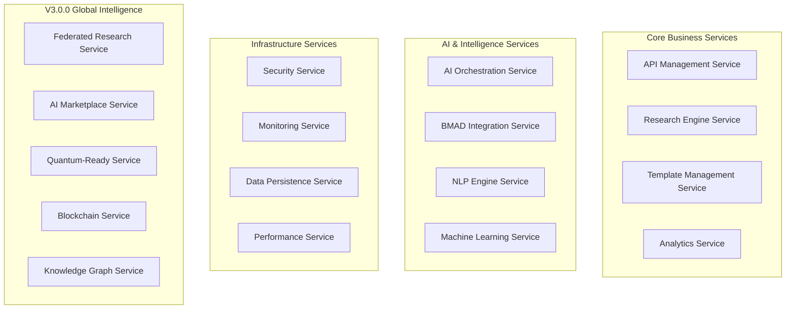
```mermaid
graph TB
    subgraph "Core Business Services"
        API[API Management Service]
        RES[Research Engine Service]
        TMP[Template Management Service]
        ANA[Analytics Service]
    end
    
    subgraph "AI & Intelligence Services"
        AIO[AI Orchestration Service]
        BMAD[BMAD Integration Service]
        NLP[NLP Engine Service]
        ML[Machine Learning Service]
    end
    
    subgraph "Infrastructure Services"
        SEC[Security Service]
        MON[Monitoring Service]
        DATA[Data Persistence Service]
        PERF[Performance Service]
    end
    
    subgraph "V3.0.0 Global Intelligence"
        FED[Federated Research Service]
        MARK[AI Marketplace Service]
        QUAN[Quantum-Ready Service]
        BLOCK[Blockchain Service]
        KNOW[Knowledge Graph Service]
    end
```

## 🔧 Service Catalog

### Core Business Services

#### API Management Service
```rust
pub struct ApiManagerService {
    api_keys: Arc<RwLock<HashMap<Uuid, ApiKey>>>,
    rate_limiters: Arc<RwLock<HashMap<String, RateLimiter>>>,
    usage_tracker: Arc<RwLock<UsageTracker>>,
    health_monitor: Arc<RwLock<HealthMonitor>>,
}
```

**Responsibilities:**
- External API integration and management
- Rate limiting and quota enforcement
- API key lifecycle management
- Usage tracking and analytics
- Health monitoring of external services

**Key Interfaces:**
- `add_api_key(key: ApiKey) -> Result<Uuid>`
- `execute_api_call(request: ApiRequest) -> Result<ApiResponse>`
- `check_rate_limit(service: String) -> Result<bool>`
- `get_usage_stats(period: TimePeriod) -> Result<UsageStats>`

#### Research Engine Service
```rust
pub struct ResearchEngineService {
    workflow_executor: Arc<RwLock<WorkflowExecutor>>,
    methodology_manager: Arc<RwLock<MethodologyManager>>,
    result_processor: Arc<RwLock<ResultProcessor>>,
    quality_assessor: Arc<RwLock<QualityAssessor>>,
}
```

**Responsibilities:**
- Research workflow orchestration
- Methodology execution and management
- Result processing and quality assessment
- Research progress tracking
- Output generation and formatting

**Key Interfaces:**
- `create_workflow(request: WorkflowRequest) -> Result<Uuid>`
- `execute_research(workflow_id: Uuid) -> Result<ResearchResults>`
- `get_research_status(workflow_id: Uuid) -> Result<WorkflowStatus>`
- `cancel_research(workflow_id: Uuid) -> Result<()>`

### AI & Intelligence Services

#### AI Orchestration Service
```rust
pub struct AIOrchestrationService {
    communication_manager: Arc<RwLock<AgentCommunicationManager>>,
    coordination_engine: Arc<RwLock<CoordinationEngine>>,
    task_scheduler: Arc<RwLock<AITaskScheduler>>,
    load_balancer: Arc<RwLock<AILoadBalancer>>,
}
```

**Responsibilities:**
- Multi-agent coordination and communication
- Task scheduling and load balancing
- Agent lifecycle management
- Performance monitoring and optimization
- Consensus protocols and leader election

**Key Interfaces:**
- `register_agent(agent: AIAgent) -> Result<()>`
- `submit_task(task: AITask) -> Result<Uuid>`
- `start_collaboration(request: CollaborationRequest) -> Result<Uuid>`
- `get_agent_status(agent_id: Uuid) -> Result<AgentStatus>`

#### BMAD Integration Service
```rust
pub struct BMadIntegrationService {
    research_engine: Arc<RwLock<ResearchEngineService>>,
    ai_orchestration: Arc<RwLock<AIOrchestrationService>>,
    integration_config: BMadIntegrationConfig,
}
```

**Responsibilities:**
- Bridge between BMAD agents and research capabilities
- Research-enhanced documentation generation
- Agent research coordination
- Integration health monitoring
- Cost optimization and tracking

**Key Interfaces:**
- `conduct_agent_research(request: BMadResearchRequest) -> Result<BMadResearchResponse>`
- `execute_documentation_mode(request: DocumentationModeRequest) -> Result<DocumentationResponse>`
- `health_check() -> Result<IntegrationHealthStatus>`

### Infrastructure Services

#### Security Service
```rust
pub struct SecurityService {
    encryption_engine: Arc<RwLock<EncryptionEngine>>,
    auth_manager: Arc<RwLock<AuthenticationManager>>,
    audit_logger: Arc<RwLock<AuditLogger>>,
    access_controller: Arc<RwLock<AccessController>>,
}
```

**Responsibilities:**
- Data encryption and decryption
- Authentication and authorization
- Security audit logging
- Access control and permissions
- Security policy enforcement

**Key Interfaces:**
- `encrypt_data(data: Vec<u8>) -> Result<EncryptedData>`
- `authenticate_user(credentials: Credentials) -> Result<AuthToken>`
- `authorize_action(token: AuthToken, action: Action) -> Result<bool>`
- `log_security_event(event: SecurityEvent) -> Result<()>`

#### Data Persistence Service
```rust
pub struct DataPersistenceService {
    database_manager: Arc<RwLock<DatabaseManager>>,
    cache_manager: Arc<RwLock<CacheManager>>,
    backup_manager: Arc<RwLock<BackupManager>>,
    migration_manager: Arc<RwLock<MigrationManager>>,
}
```

**Responsibilities:**
- Database operations and management
- Caching strategy implementation
- Data backup and recovery
- Schema migrations and versioning
- Data consistency and integrity

**Key Interfaces:**
- `store_data<T>(data: T) -> Result<Uuid>`
- `retrieve_data<T>(id: Uuid) -> Result<T>`
- `query_data<T>(query: Query) -> Result<Vec<T>>`
- `backup_data(backup_config: BackupConfig) -> Result<()>`

## 🔄 Service Communication Patterns

### Synchronous Communication

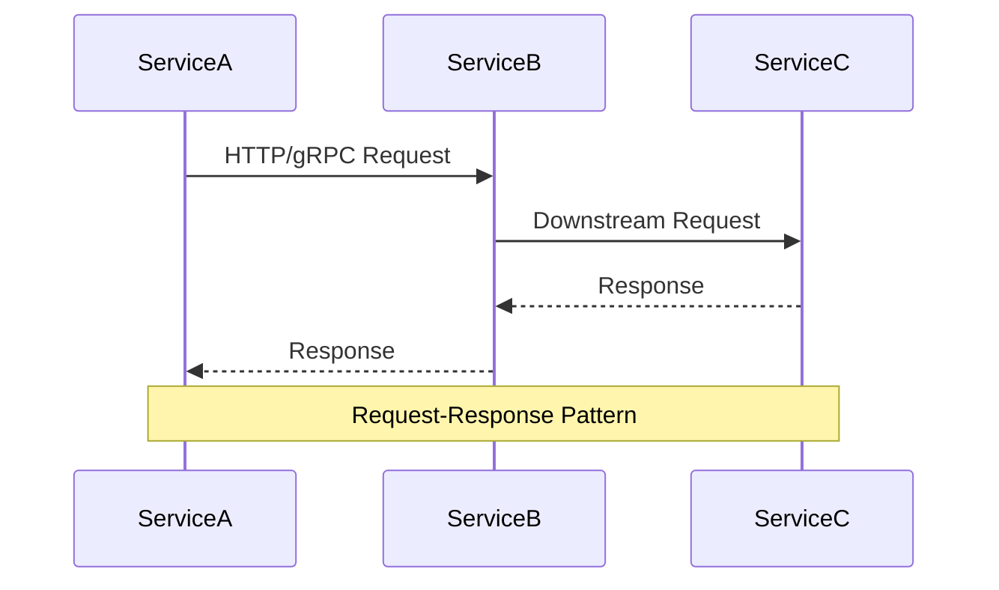
```mermaid
sequenceDiagram
    participant ServiceA
    participant ServiceB
    participant ServiceC
    
    ServiceA->>ServiceB: HTTP/gRPC Request
    ServiceB->>ServiceC: Downstream Request
    ServiceC-->>ServiceB: Response
    ServiceB-->>ServiceA: Response
    
    Note over ServiceA,ServiceC: Request-Response Pattern
```

**Use Cases:**
- Real-time data queries
- User-facing operations
- Critical business operations
- Data validation requests

### Asynchronous Communication

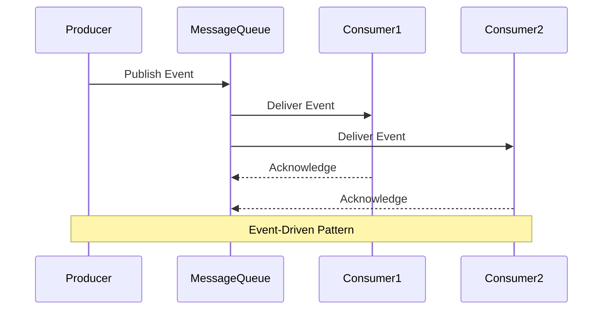
```mermaid
sequenceDiagram
    participant Producer
    participant MessageQueue
    participant Consumer1
    participant Consumer2
    
    Producer->>MessageQueue: Publish Event
    MessageQueue->>Consumer1: Deliver Event
    MessageQueue->>Consumer2: Deliver Event
    Consumer1-->>MessageQueue: Acknowledge
    Consumer2-->>MessageQueue: Acknowledge
    
    Note over Producer,Consumer2: Event-Driven Pattern
```

**Use Cases:**
- Background processing
- Event notifications
- Data synchronization
- Audit logging

### Service Mesh Communication

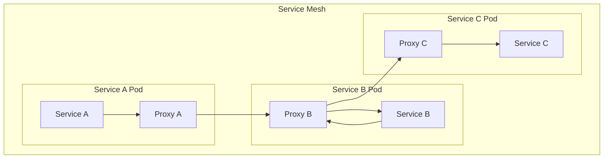
```mermaid
graph TB
    subgraph "Service Mesh"
        subgraph "Service A Pod"
            SA[Service A]
            PA[Proxy A]
        end
        
        subgraph "Service B Pod"
            SB[Service B]
            PB[Proxy B]
        end
        
        subgraph "Service C Pod"
            SC[Service C]
            PC[Proxy C]
        end
    end
    
    SA --> PA
    PA --> PB
    PB --> SB
    SB --> PB
    PB --> PC
    PC --> SC
```

## 🛡️ Service Resilience Patterns

### Circuit Breaker Pattern

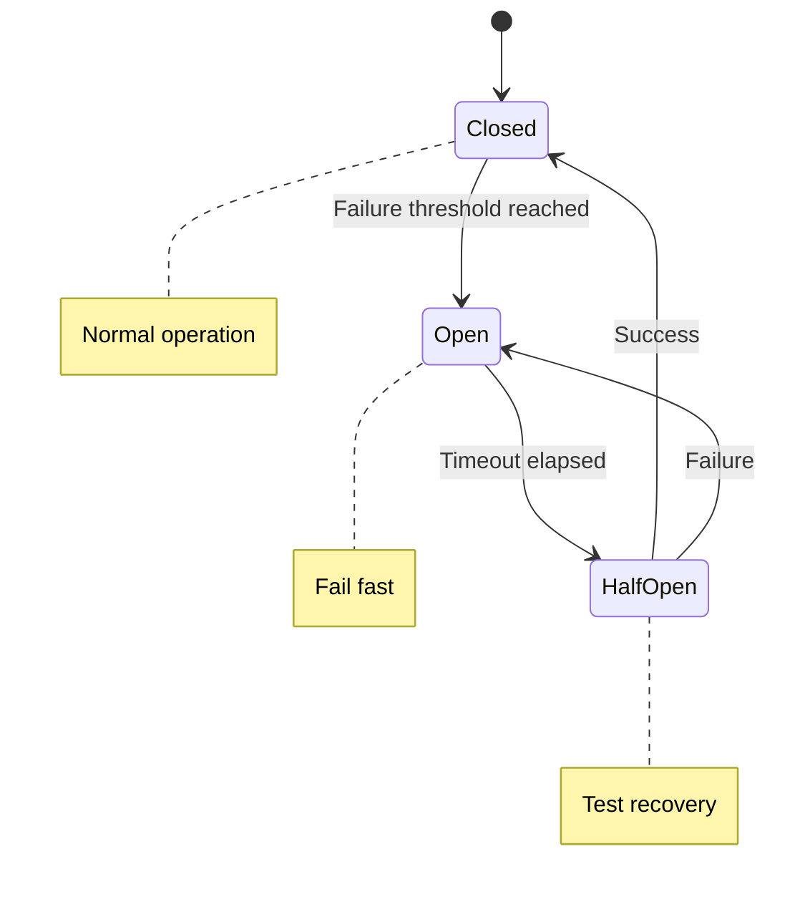
```mermaid
stateDiagram-v2
    [*] --> Closed
    Closed --> Open : Failure threshold reached
    Open --> HalfOpen : Timeout elapsed
    HalfOpen --> Closed : Success
    HalfOpen --> Open : Failure
    
    note right of Closed : Normal operation
    note right of Open : Fail fast
    note right of HalfOpen : Test recovery
```

**Implementation:**
```rust
pub struct CircuitBreaker {
    state: CircuitBreakerState,
    failure_count: u32,
    failure_threshold: u32,
    timeout: Duration,
    last_failure_time: Option<Instant>,
}
```

### Retry Pattern with Exponential Backoff

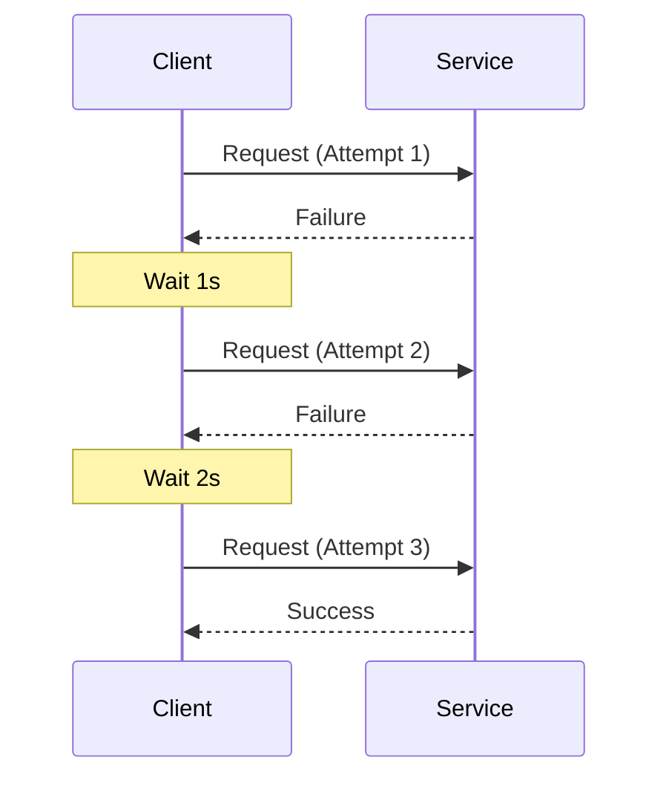
```mermaid
sequenceDiagram
    participant Client
    participant Service
    
    Client->>Service: Request (Attempt 1)
    Service-->>Client: Failure
    
    Note over Client: Wait 1s
    Client->>Service: Request (Attempt 2)
    Service-->>Client: Failure
    
    Note over Client: Wait 2s
    Client->>Service: Request (Attempt 3)
    Service-->>Client: Success
```

### Bulkhead Pattern

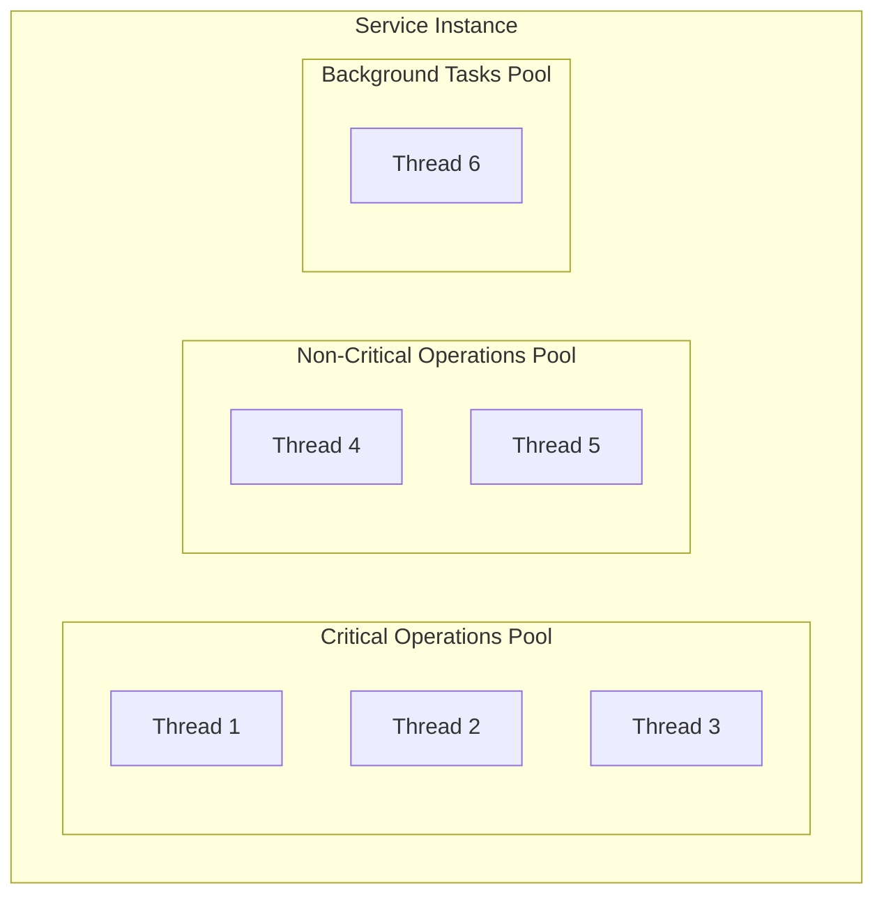
```mermaid
graph TB
    subgraph "Service Instance"
        subgraph "Critical Operations Pool"
            T1[Thread 1]
            T2[Thread 2]
            T3[Thread 3]
        end
        
        subgraph "Non-Critical Operations Pool"
            T4[Thread 4]
            T5[Thread 5]
        end
        
        subgraph "Background Tasks Pool"
            T6[Thread 6]
        end
    end
```

## 📊 Service Monitoring & Observability

### Health Check Architecture

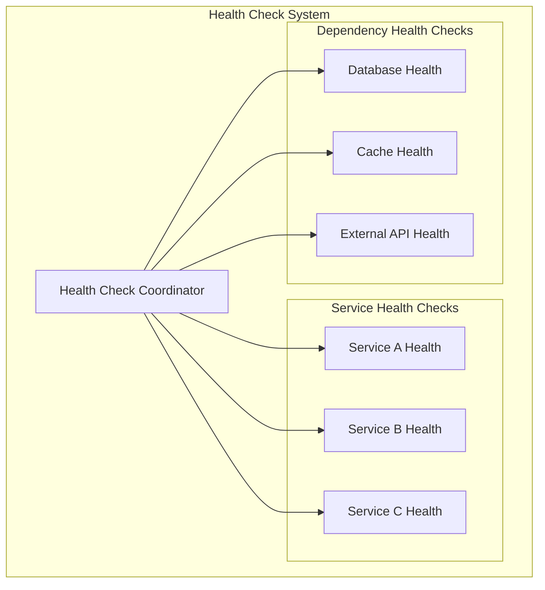
```mermaid
graph TB
    subgraph "Health Check System"
        HC[Health Check Coordinator]
        
        subgraph "Service Health Checks"
            SH1[Service A Health]
            SH2[Service B Health]
            SH3[Service C Health]
        end
        
        subgraph "Dependency Health Checks"
            DH1[Database Health]
            DH2[Cache Health]
            DH3[External API Health]
        end
    end
    
    HC --> SH1
    HC --> SH2
    HC --> SH3
    HC --> DH1
    HC --> DH2
    HC --> DH3
```

### Service Metrics

| Metric Type | Examples | Collection Method |
|-------------|----------|-------------------|
| **Business Metrics** | Research completion rate, API usage | Application instrumentation |
| **Technical Metrics** | Response time, error rate, throughput | Prometheus metrics |
| **Infrastructure Metrics** | CPU, memory, disk usage | System monitoring |
| **Security Metrics** | Failed auth attempts, access violations | Security event logging |

### Distributed Tracing

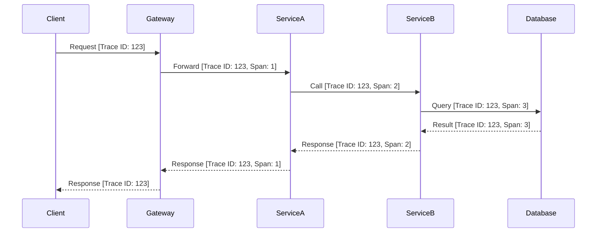
```mermaid
sequenceDiagram
    participant Client
    participant Gateway
    participant ServiceA
    participant ServiceB
    participant Database
    
    Client->>Gateway: Request [Trace ID: 123]
    Gateway->>ServiceA: Forward [Trace ID: 123, Span: 1]
    ServiceA->>ServiceB: Call [Trace ID: 123, Span: 2]
    ServiceB->>Database: Query [Trace ID: 123, Span: 3]
    Database-->>ServiceB: Result [Trace ID: 123, Span: 3]
    ServiceB-->>ServiceA: Response [Trace ID: 123, Span: 2]
    ServiceA-->>Gateway: Response [Trace ID: 123, Span: 1]
    Gateway-->>Client: Response [Trace ID: 123]
```

## 🚀 Service Deployment Patterns

### Blue-Green Deployment

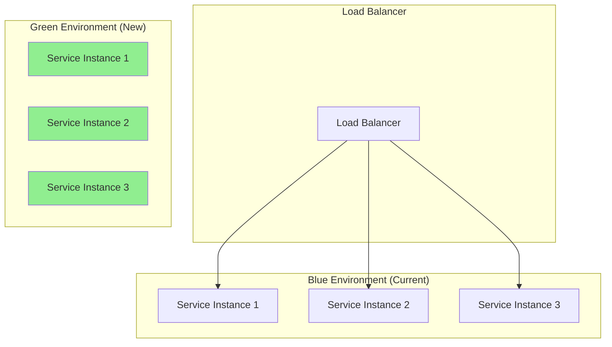
```mermaid
graph TB
    subgraph "Load Balancer"
        LB[Load Balancer]
    end
    
    subgraph "Blue Environment (Current)"
        B1[Service Instance 1]
        B2[Service Instance 2]
        B3[Service Instance 3]
    end
    
    subgraph "Green Environment (New)"
        G1[Service Instance 1]
        G2[Service Instance 2]
        G3[Service Instance 3]
    end
    
    LB --> B1
    LB --> B2
    LB --> B3
    
    style G1 fill:#90EE90
    style G2 fill:#90EE90
    style G3 fill:#90EE90
```

### Canary Deployment

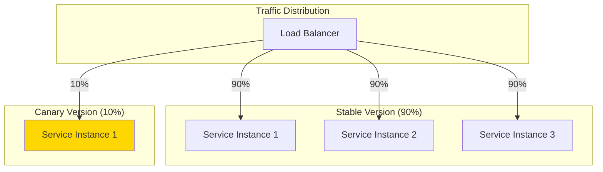
```mermaid
graph TB
    subgraph "Traffic Distribution"
        LB[Load Balancer]
    end
    
    subgraph "Stable Version (90%)"
        S1[Service Instance 1]
        S2[Service Instance 2]
        S3[Service Instance 3]
    end
    
    subgraph "Canary Version (10%)"
        C1[Service Instance 1]
    end
    
    LB -->|90%| S1
    LB -->|90%| S2
    LB -->|90%| S3
    LB -->|10%| C1
    
    style C1 fill:#FFD700
```

## 🔧 Service Configuration Management

### Configuration Service Architecture

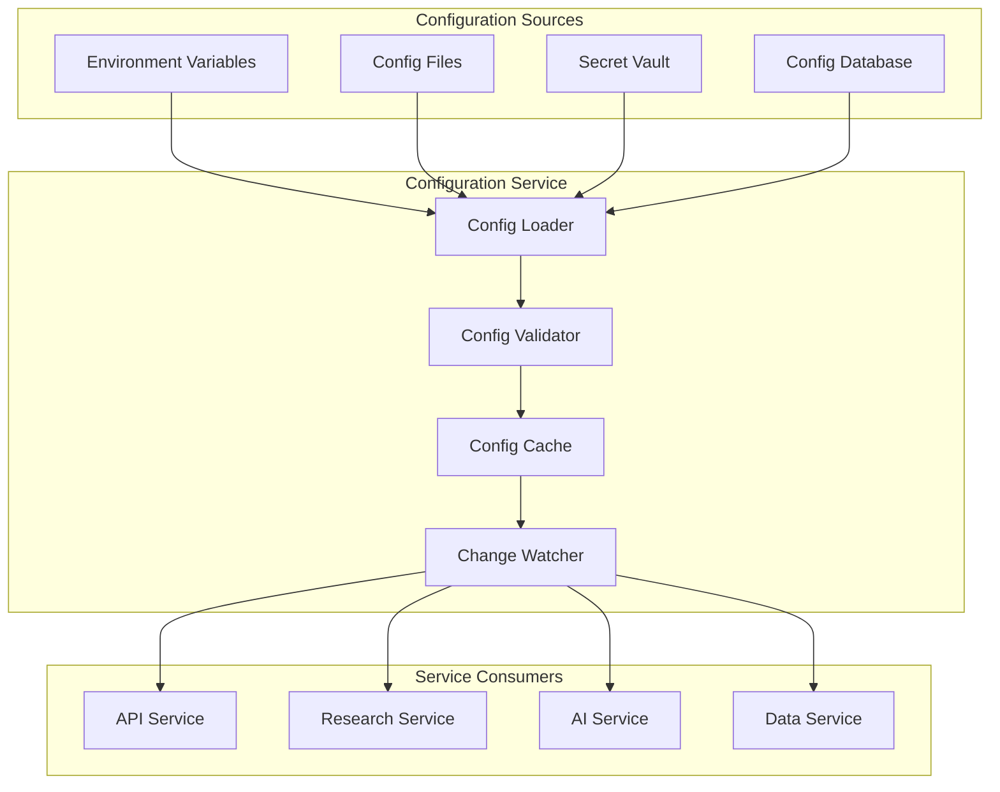
```mermaid
graph TB
    subgraph "Configuration Sources"
        ENV[Environment Variables]
        FILES[Config Files]
        VAULT[Secret Vault]
        DB[Config Database]
    end

    subgraph "Configuration Service"
        LOADER[Config Loader]
        VALIDATOR[Config Validator]
        CACHE[Config Cache]
        WATCHER[Change Watcher]
    end

    subgraph "Service Consumers"
        API[API Service]
        RESEARCH[Research Service]
        AI[AI Service]
        DATA[Data Service]
    end

    ENV --> LOADER
    FILES --> LOADER
    VAULT --> LOADER
    DB --> LOADER

    LOADER --> VALIDATOR
    VALIDATOR --> CACHE
    CACHE --> WATCHER

    WATCHER --> API
    WATCHER --> RESEARCH
    WATCHER --> AI
    WATCHER --> DATA
```

### Dynamic Configuration Updates

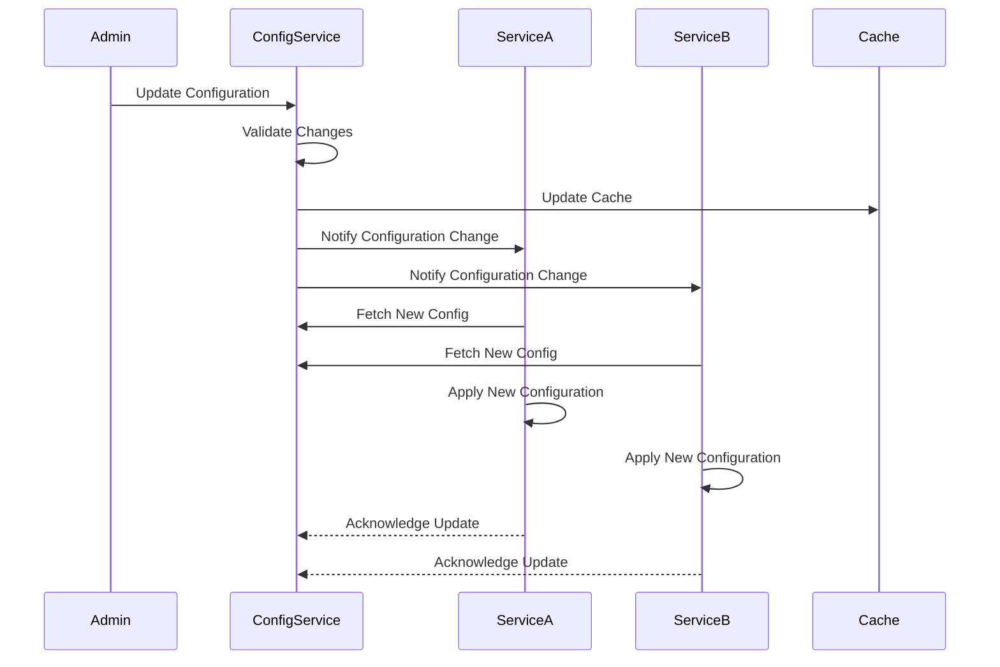
```mermaid
sequenceDiagram
    participant Admin
    participant ConfigService
    participant ServiceA
    participant ServiceB
    participant Cache

    Admin->>ConfigService: Update Configuration
    ConfigService->>ConfigService: Validate Changes
    ConfigService->>Cache: Update Cache
    ConfigService->>ServiceA: Notify Configuration Change
    ConfigService->>ServiceB: Notify Configuration Change

    ServiceA->>ConfigService: Fetch New Config
    ServiceB->>ConfigService: Fetch New Config

    ServiceA->>ServiceA: Apply New Configuration
    ServiceB->>ServiceB: Apply New Configuration

    ServiceA-->>ConfigService: Acknowledge Update
    ServiceB-->>ConfigService: Acknowledge Update
```

## 🔄 Service Discovery & Registration

### Service Registry Architecture

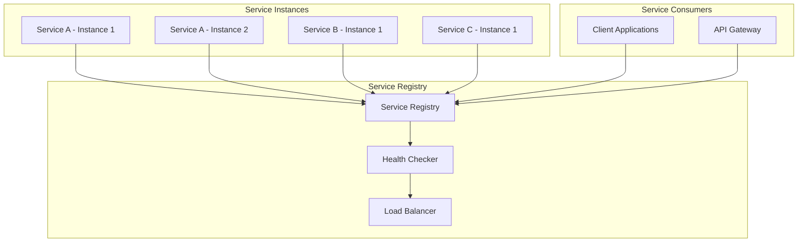
```mermaid
graph TB
    subgraph "Service Registry"
        REGISTRY[Service Registry]
        HEALTH[Health Checker]
        LB[Load Balancer]
    end

    subgraph "Service Instances"
        S1[Service A - Instance 1]
        S2[Service A - Instance 2]
        S3[Service B - Instance 1]
        S4[Service C - Instance 1]
    end

    subgraph "Service Consumers"
        CLIENT[Client Applications]
        GATEWAY[API Gateway]
    end

    S1 --> REGISTRY
    S2 --> REGISTRY
    S3 --> REGISTRY
    S4 --> REGISTRY

    REGISTRY --> HEALTH
    HEALTH --> LB

    CLIENT --> REGISTRY
    GATEWAY --> REGISTRY
```

### Service Registration Flow

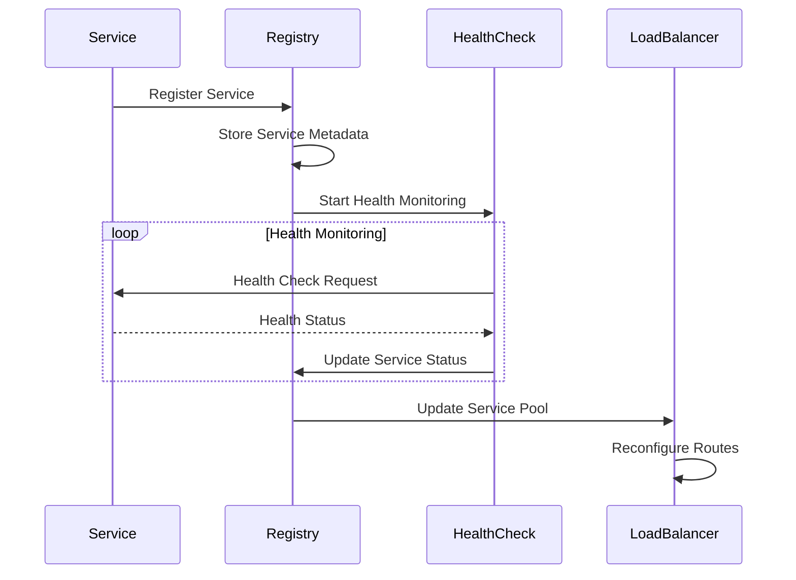
```mermaid
sequenceDiagram
    participant Service
    participant Registry
    participant HealthCheck
    participant LoadBalancer

    Service->>Registry: Register Service
    Registry->>Registry: Store Service Metadata
    Registry->>HealthCheck: Start Health Monitoring

    loop Health Monitoring
        HealthCheck->>Service: Health Check Request
        Service-->>HealthCheck: Health Status
        HealthCheck->>Registry: Update Service Status
    end

    Registry->>LoadBalancer: Update Service Pool
    LoadBalancer->>LoadBalancer: Reconfigure Routes
```

## 🛡️ Advanced Security Patterns

### Zero Trust Service Architecture

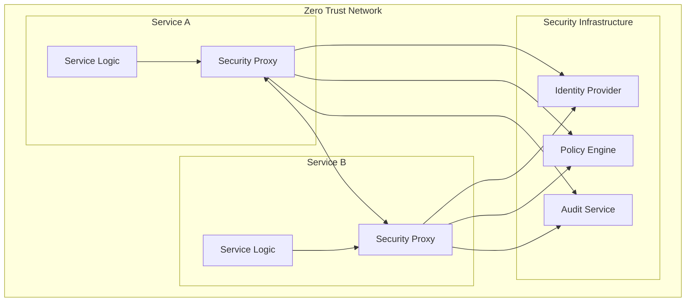
```mermaid
graph TB
    subgraph "Zero Trust Network"
        subgraph "Service A"
            SA[Service Logic]
            SA_PROXY[Security Proxy]
        end

        subgraph "Service B"
            SB[Service Logic]
            SB_PROXY[Security Proxy]
        end

        subgraph "Security Infrastructure"
            IDENTITY[Identity Provider]
            POLICY[Policy Engine]
            AUDIT[Audit Service]
        end
    end

    SA --> SA_PROXY
    SB --> SB_PROXY

    SA_PROXY --> IDENTITY
    SB_PROXY --> IDENTITY
    SA_PROXY --> POLICY
    SB_PROXY --> POLICY

    SA_PROXY --> AUDIT
    SB_PROXY --> AUDIT

    SA_PROXY <--> SB_PROXY
```

### Service-to-Service Authentication

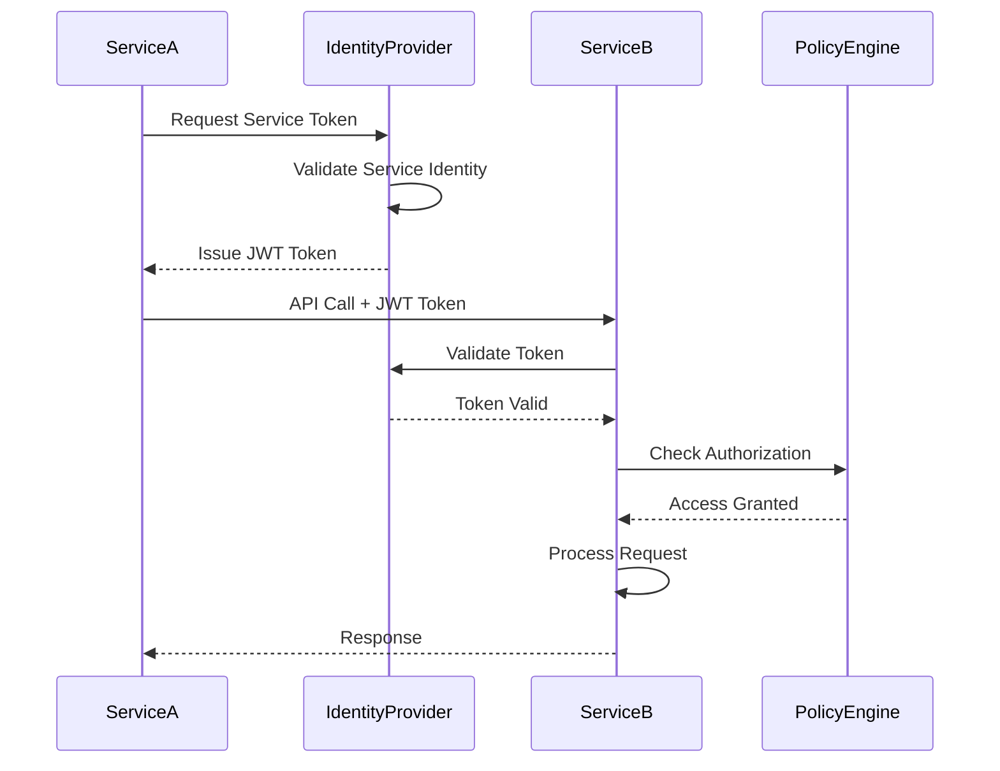
```mermaid
sequenceDiagram
    participant ServiceA
    participant IdentityProvider
    participant ServiceB
    participant PolicyEngine

    ServiceA->>IdentityProvider: Request Service Token
    IdentityProvider->>IdentityProvider: Validate Service Identity
    IdentityProvider-->>ServiceA: Issue JWT Token

    ServiceA->>ServiceB: API Call + JWT Token
    ServiceB->>IdentityProvider: Validate Token
    IdentityProvider-->>ServiceB: Token Valid

    ServiceB->>PolicyEngine: Check Authorization
    PolicyEngine-->>ServiceB: Access Granted

    ServiceB->>ServiceB: Process Request
    ServiceB-->>ServiceA: Response
```

## 📊 Service Performance Optimization

### Service Caching Strategies

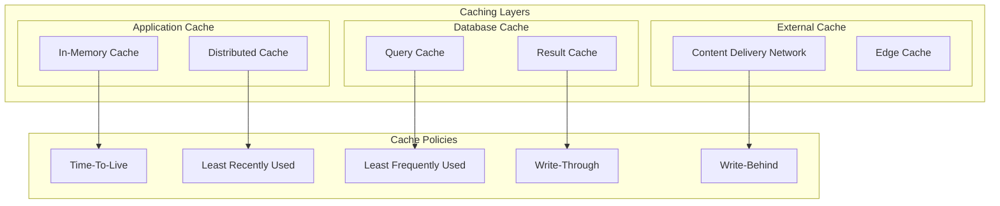
```mermaid
graph TB
    subgraph "Caching Layers"
        subgraph "Application Cache"
            AC[In-Memory Cache]
            DC[Distributed Cache]
        end

        subgraph "Database Cache"
            QC[Query Cache]
            RC[Result Cache]
        end

        subgraph "External Cache"
            CDN[Content Delivery Network]
            EDGE[Edge Cache]
        end
    end

    subgraph "Cache Policies"
        TTL[Time-To-Live]
        LRU[Least Recently Used]
        LFU[Least Frequently Used]
        WRITE_THROUGH[Write-Through]
        WRITE_BEHIND[Write-Behind]
    end

    AC --> TTL
    DC --> LRU
    QC --> LFU
    RC --> WRITE_THROUGH
    CDN --> WRITE_BEHIND
```

### Service Resource Management

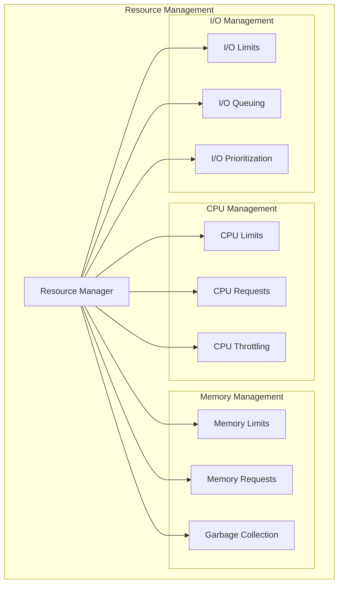
```mermaid
graph TB
    subgraph "Resource Management"
        RM[Resource Manager]

        subgraph "CPU Management"
            CPU_LIMIT[CPU Limits]
            CPU_REQUEST[CPU Requests]
            CPU_THROTTLE[CPU Throttling]
        end

        subgraph "Memory Management"
            MEM_LIMIT[Memory Limits]
            MEM_REQUEST[Memory Requests]
            MEM_GC[Garbage Collection]
        end

        subgraph "I/O Management"
            IO_LIMIT[I/O Limits]
            IO_QUEUE[I/O Queuing]
            IO_PRIORITY[I/O Prioritization]
        end
    end

    RM --> CPU_LIMIT
    RM --> CPU_REQUEST
    RM --> CPU_THROTTLE
    RM --> MEM_LIMIT
    RM --> MEM_REQUEST
    RM --> MEM_GC
    RM --> IO_LIMIT
    RM --> IO_QUEUE
    RM --> IO_PRIORITY
```

## 🔄 Service Lifecycle Management

### Service Deployment Pipeline


```mermaid
flowchart LR
    subgraph "Development"
        A[Code Commit]
        B[Unit Tests]
        C[Integration Tests]
    end

    subgraph "Build & Package"
        D[Build Service]
        E[Container Image]
        F[Security Scan]
    end

    subgraph "Deployment"
        G[Staging Deploy]
        H[Smoke Tests]
        I[Production Deploy]
    end

    subgraph "Monitoring"
        J[Health Checks]
        K[Performance Monitoring]
        L[Error Tracking]
    end

    A --> B
    B --> C
    C --> D
    D --> E
    E --> F
    F --> G
    G --> H
    H --> I
    I --> J
    J --> K
    K --> L
```

### Service Versioning Strategy

```mermaid
graph TB
    subgraph "Version Management"
        SEMANTIC[Semantic Versioning]

        subgraph "Version Types"
            MAJOR[Major Version]
            MINOR[Minor Version]
            PATCH[Patch Version]
        end

        subgraph "Deployment Strategy"
            BLUE_GREEN[Blue-Green]
            CANARY[Canary]
            ROLLING[Rolling Update]
        end
    end

    SEMANTIC --> MAJOR
    SEMANTIC --> MINOR
    SEMANTIC --> PATCH

    MAJOR --> BLUE_GREEN
    MINOR --> CANARY
    PATCH --> ROLLING
```

## 🔍 Service Observability

### Distributed Tracing Architecture

```mermaid
sequenceDiagram
    participant Client
    participant Gateway
    participant ServiceA
    participant ServiceB
    participant Database
    participant Tracer

    Client->>Gateway: Request [Trace-ID: 123]
    Gateway->>Tracer: Start Span [Gateway]
    Gateway->>ServiceA: Forward [Trace-ID: 123]
    ServiceA->>Tracer: Start Span [ServiceA]
    ServiceA->>ServiceB: Call [Trace-ID: 123]
    ServiceB->>Tracer: Start Span [ServiceB]
    ServiceB->>Database: Query [Trace-ID: 123]
    Database-->>ServiceB: Result
    ServiceB->>Tracer: End Span [ServiceB]
    ServiceB-->>ServiceA: Response
    ServiceA->>Tracer: End Span [ServiceA]
    ServiceA-->>Gateway: Response
    Gateway->>Tracer: End Span [Gateway]
    Gateway-->>Client: Response
```

### Service Metrics Collection

```mermaid
graph TB
    subgraph "Metrics Sources"
        APP[Application Metrics]
        SYS[System Metrics]
        CUSTOM[Custom Metrics]
        BUSINESS[Business Metrics]
    end

    subgraph "Collection & Processing"
        AGENT[Metrics Agent]
        AGGREGATOR[Metrics Aggregator]
        PROCESSOR[Metrics Processor]
    end

    subgraph "Storage & Visualization"
        TSDB[Time Series Database]
        DASHBOARD[Metrics Dashboard]
        ALERTS[Alert Manager]
    end

    APP --> AGENT
    SYS --> AGENT
    CUSTOM --> AGGREGATOR
    BUSINESS --> AGGREGATOR

    AGENT --> PROCESSOR
    AGGREGATOR --> PROCESSOR

    PROCESSOR --> TSDB
    TSDB --> DASHBOARD
    TSDB --> ALERTS
```

## 🔗 Related Documentation

- **[Component Architecture](./component-architecture.md)** - Component breakdown and relationships
- **[Data Flow Architecture](./data-flow.md)** - Data movement patterns
- **[API Architecture](./api-architecture.md)** - API design and versioning
- **[Security Architecture](./security-architecture.md)** - Security service design
- **[Deployment Architecture](./deployment-architecture.md)** - Deployment patterns
- **[Monitoring Guide](../deployment/monitoring.md)** - Service monitoring

---

**Next**: Explore [API Architecture](./api-architecture.md) for API design patterns and versioning strategies.
