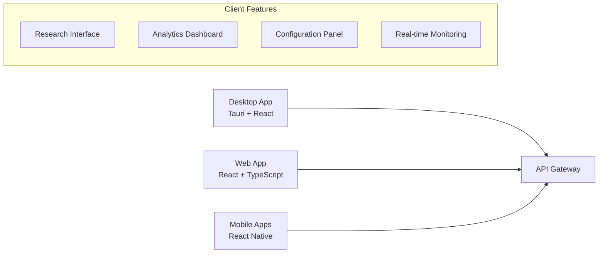
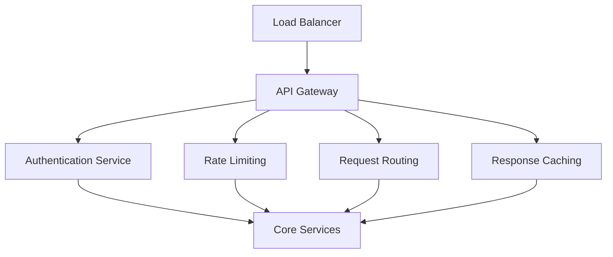
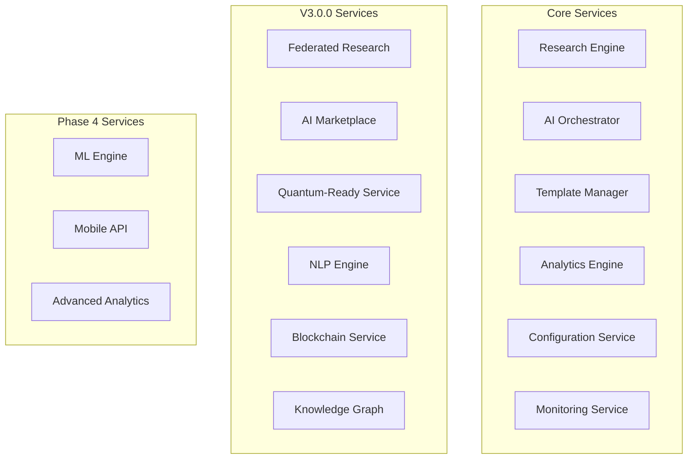
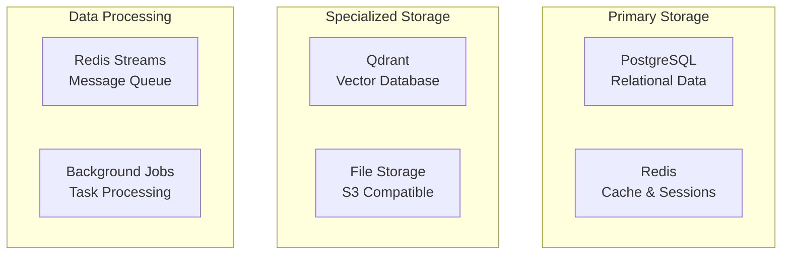
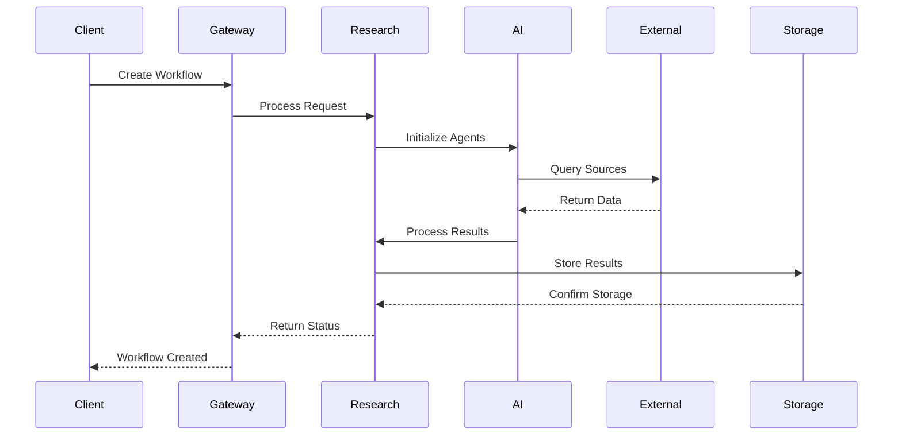
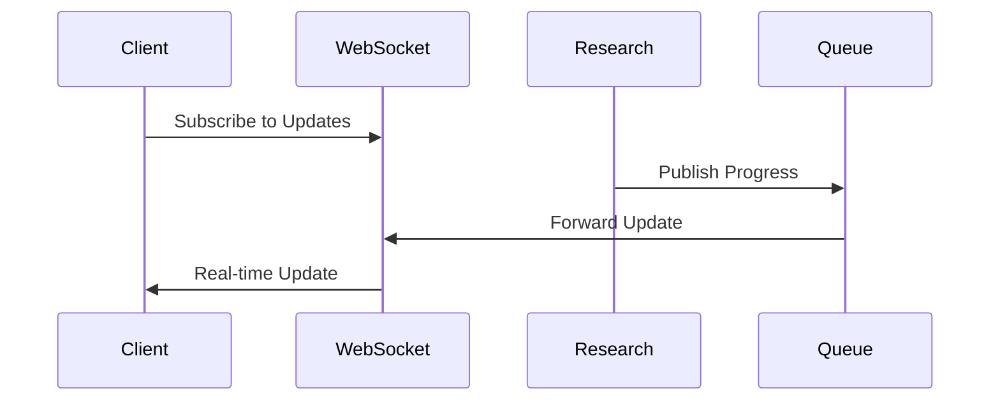
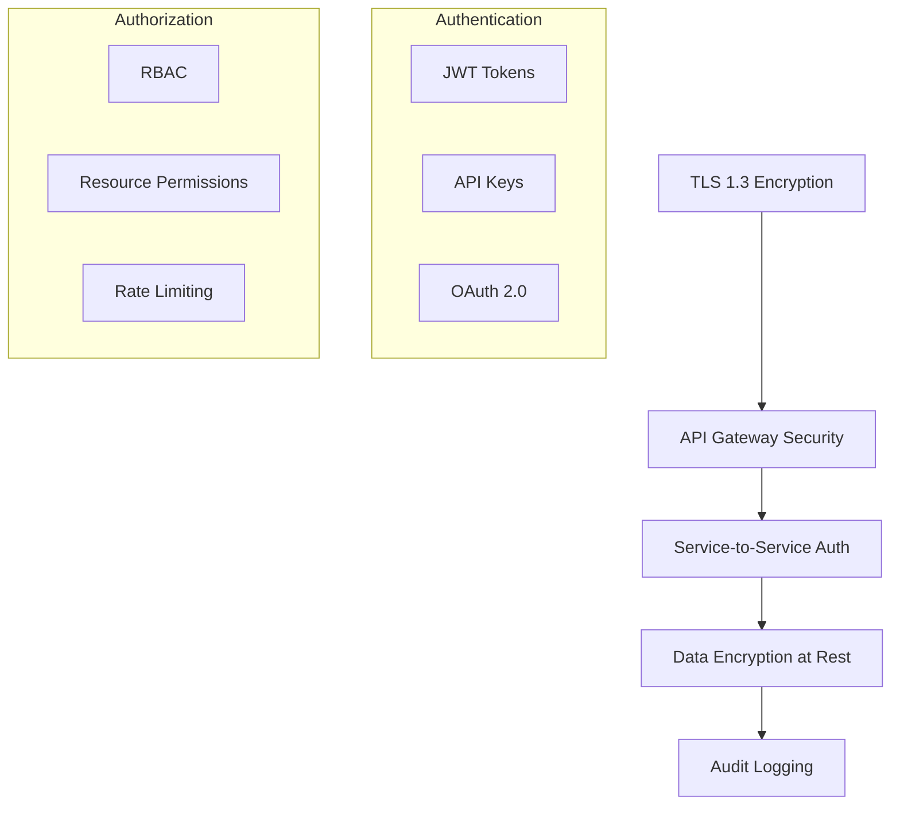
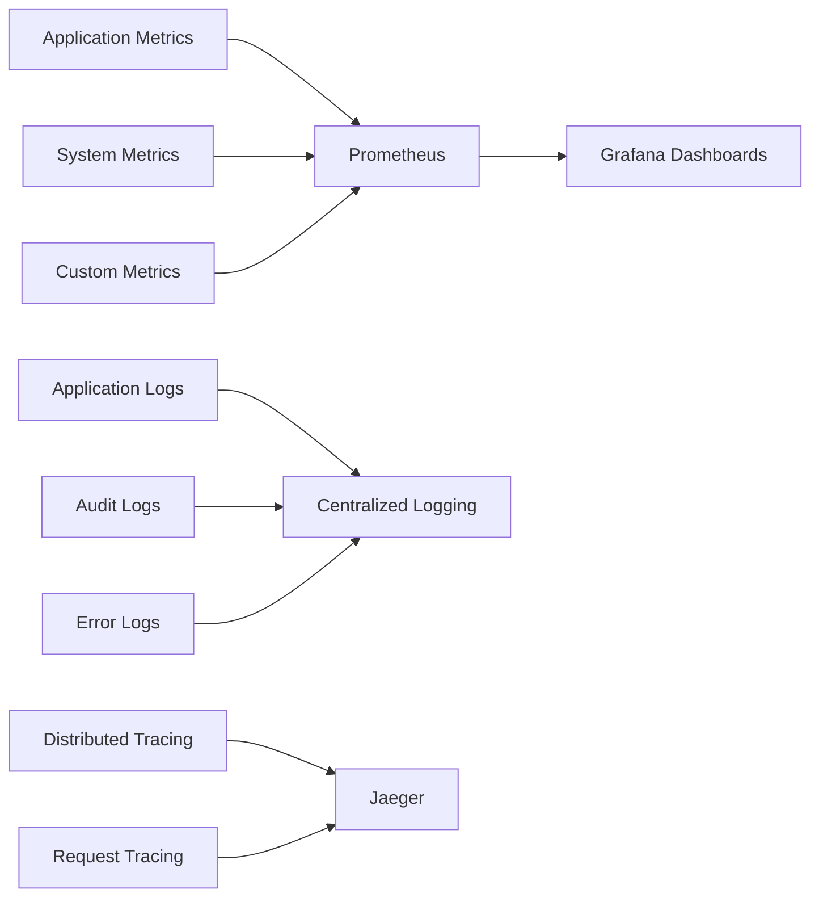

# 🏛️ System Overview Architecture

## Introduction

The Free Deep Research System is a comprehensive, enterprise-grade research automation platform built on modern architectural principles. This document provides a high-level overview of the system's architecture, design decisions, and core components.

## 🎯 Architectural Goals

### Primary Objectives
1. **Scalability**: Support 10,000+ concurrent users and 1,000+ simultaneous research workflows
2. **Security**: Enterprise-grade security with zero-trust architecture
3. **Performance**: Sub-200ms API response times and 15-30 minute research completion
4. **Reliability**: 99.99% uptime with graceful degradation
5. **Extensibility**: Plugin-based architecture for easy feature additions

### Design Principles
- **Microservices Architecture**: Independent, scalable services
- **Event-Driven Design**: Asynchronous processing and loose coupling
- **API-First Approach**: Well-defined contracts between components
- **Security by Design**: Built-in security at every layer
- **Cloud-Native**: Designed for modern cloud deployment

## 🏗️ System Architecture Layers

### 1. Presentation Layer

**Components:**
- **Desktop Application**: Cross-platform Tauri app with React frontend
- **Web Application**: Progressive web app with React and TypeScript
- **Mobile Applications**: React Native apps for iOS and Android
- **Admin Dashboard**: Management interface for system administrators

**Key Features:**
- Responsive design for all screen sizes
- Real-time updates via WebSocket connections
- Offline capability with intelligent sync
- Accessibility compliance (WCAG 2.1 AA)

### 2. API Gateway Layer

**Responsibilities:**
- **Authentication & Authorization**: JWT-based auth with RBAC
- **Rate Limiting**: Configurable limits per user/service
- **Load Balancing**: Intelligent request distribution
- **Caching**: Response caching for improved performance
- **Monitoring**: Request/response logging and metrics

### 3. Core Services Layer

**Core Services:**
- **Research Engine**: Orchestrates research workflows and methodologies
- **AI Orchestrator**: Manages AI agent coordination and BMAD integration
- **Template Manager**: Handles research templates and configurations
- **Analytics Engine**: Processes usage data and generates insights
- **Configuration Service**: Manages system and user configurations
- **Monitoring Service**: Health checks and performance monitoring

### 4. Data Layer

**Storage Systems:**
- **PostgreSQL**: Primary relational database for structured data
- **Redis**: High-performance caching and session storage
- **Qdrant**: Vector database for semantic search and AI operations
- **File Storage**: S3-compatible storage for documents and media
- **Message Queue**: Redis Streams for asynchronous processing

## 🔄 Data Flow Architecture

### Research Workflow Data Flow

### Real-time Updates Flow

## 🔧 Service Communication Patterns

### Synchronous Communication
- **HTTP/REST APIs**: For request-response operations
- **GraphQL**: For flexible data querying (future)
- **gRPC**: For high-performance service-to-service communication

### Asynchronous Communication
- **Message Queues**: Redis Streams for background processing
- **Event Streaming**: For real-time updates and notifications
- **WebSockets**: For real-time client communication

### Data Consistency Patterns
- **ACID Transactions**: For critical data operations
- **Eventual Consistency**: For distributed operations
- **Saga Pattern**: For complex multi-service transactions

## 🛡️ Security Architecture Overview

### Security Layers

**Security Features:**
- **Transport Security**: TLS 1.3 for all communications
- **Authentication**: Multi-factor authentication support
- **Authorization**: Role-based access control (RBAC)
- **Data Protection**: AES-256-GCM encryption at rest
- **Audit Trail**: Comprehensive security event logging

## 📊 Performance & Scalability

### Horizontal Scaling
- **Stateless Services**: All services designed for horizontal scaling
- **Load Balancing**: Intelligent request distribution
- **Auto-scaling**: Dynamic scaling based on demand
- **Database Sharding**: Horizontal database partitioning

### Performance Optimization
- **Caching Strategy**: Multi-level caching (Redis, CDN, browser)
- **Connection Pooling**: Efficient database connection management
- **Async Processing**: Non-blocking operations for better throughput
- **Resource Optimization**: Efficient memory and CPU usage

### Monitoring & Observability

## 🚀 Deployment Architecture

### Environment Strategy
- **Development**: Local Docker Compose setup
- **Staging**: Kubernetes cluster with production-like configuration
- **Production**: Multi-region Kubernetes deployment
- **DR (Disaster Recovery)**: Cross-region backup and failover

### Infrastructure Components
- **Container Orchestration**: Kubernetes for production deployments
- **Service Mesh**: Istio for advanced traffic management
- **CI/CD Pipeline**: GitHub Actions for automated deployment
- **Infrastructure as Code**: Terraform for infrastructure management

## 🔮 Future Architecture Evolution

### Planned Enhancements
1. **Event Sourcing**: Complete audit trail and replay capabilities
2. **CQRS Pattern**: Separate read/write models for better performance
3. **Serverless Functions**: Edge computing for global performance
4. **GraphQL Federation**: Unified API across all services

### Technology Roadmap
- **Kubernetes Migration**: Full container orchestration
- **Service Mesh**: Advanced traffic management and security
- **Edge Computing**: Global content delivery and processing
- **AI/ML Pipeline**: Automated model training and deployment

## 📚 Related Documentation

- **[Component Architecture](./component-architecture.md)** - Detailed component breakdown
- **[Security Architecture](./security-architecture.md)** - Comprehensive security design
- **[Deployment Architecture](./deployment-architecture.md)** - Deployment patterns and strategies
- **[API Architecture](./api-architecture.md)** - API design and versioning

---

**Next**: Explore [Component Architecture](./component-architecture.md) for detailed component analysis.
