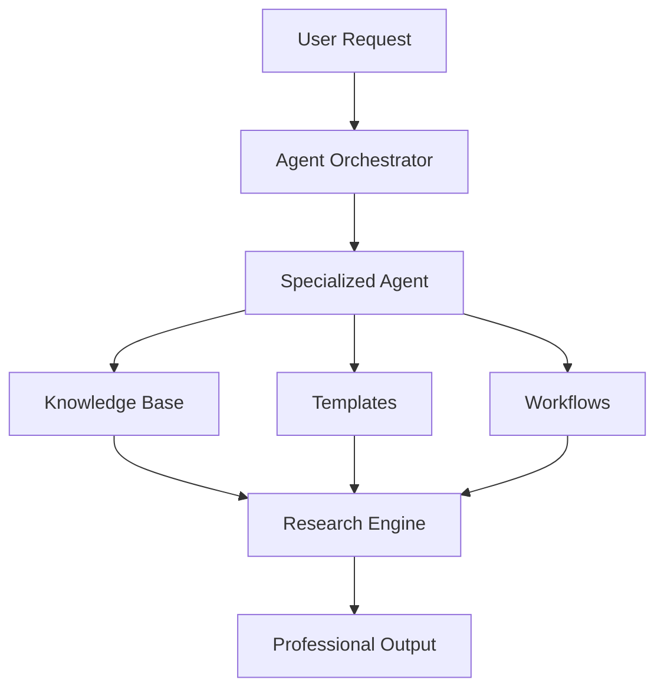
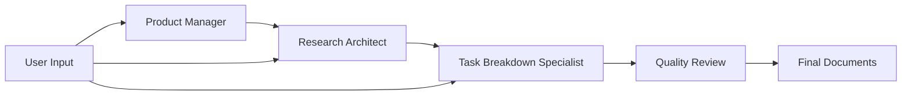

# 🤖 BMAD AI Agents Guide

## Overview

BMAD (Business, Management, Analysis, Development) AI Agents are specialized AI assistants that enhance your research with expert knowledge and structured workflows. This guide covers how to effectively use and collaborate with AI agents for professional research outcomes.

## 🎯 What are BMAD AI Agents?

### Core Concept
BMAD AI Agents are specialized AI personas that embody specific professional roles and expertise. Each agent has:
- **Specialized Knowledge**: Domain-specific expertise and best practices
- **Structured Workflows**: Proven methodologies for their area of expertise
- **Professional Templates**: Industry-standard document formats
- **Quality Assurance**: Built-in validation and review processes

### Agent Architecture


## 👥 Available AI Agents

### 📊 Product Manager AI (John)
**Expertise**: Product strategy, requirements gathering, market analysis
**Best For**: PRDs, feature specifications, market research, user stories

**Capabilities**:
- Product Requirements Documents (PRDs)
- Market analysis and competitive research
- User story creation and prioritization
- Feature roadmap development
- Stakeholder communication

**Sample Workflow**:
```
1. Gather product requirements
2. Analyze market landscape
3. Define user personas and use cases
4. Create comprehensive PRD
5. Validate with stakeholders
```

### 🏗️ Research Architect AI (Fred)
**Expertise**: Technical architecture, system design, research methodology
**Best For**: Technical specifications, architecture documents, research design

**Capabilities**:
- System architecture documentation
- Technical research methodology
- Technology stack recommendations
- Integration planning
- Performance and scalability analysis

**Sample Workflow**:
```
1. Analyze technical requirements
2. Research technology options
3. Design system architecture
4. Document technical specifications
5. Create implementation roadmap
```

### 📈 Data Analyst AI (Dakota)
**Expertise**: Data analysis, statistical research, metrics interpretation
**Best For**: Data-driven research, statistical analysis, performance metrics

**Capabilities**:
- Statistical analysis and interpretation
- Data visualization recommendations
- Research methodology validation
- Performance metrics analysis
- Trend identification and forecasting

### 🎨 Design Architect AI (Jane)
**Expertise**: UX/UI design, user research, design systems
**Best For**: User experience research, design specifications, usability analysis

**Capabilities**:
- User experience research
- Design system documentation
- Usability analysis and recommendations
- Interface design specifications
- Accessibility compliance review

### 🔒 Security Engineer AI (Sage)
**Expertise**: Security analysis, compliance, risk assessment
**Best For**: Security research, compliance documentation, risk analysis

**Capabilities**:
- Security vulnerability assessment
- Compliance framework analysis
- Risk assessment and mitigation
- Security architecture review
- Privacy impact analysis

### 📋 Task Breakdown Specialist AI (Tyler)
**Expertise**: Project management, task decomposition, workflow optimization
**Best For**: Project planning, task breakdown, workflow design

**Capabilities**:
- Complex task decomposition
- Project timeline development
- Resource allocation planning
- Workflow optimization
- Risk and dependency analysis

## 🚀 Getting Started with AI Agents

### Activating an AI Agent

#### Method 1: Agent Selection Interface
1. Navigate to **AI Agents** section
2. Browse available agents by expertise
3. Select agent that matches your research needs
4. Choose specific task or workflow
5. Follow guided setup process

#### Method 2: Command Interface
```
/agent product-manager
/agent research-architect
/agent data-analyst
```

#### Method 3: Automatic Recommendation
The system can automatically recommend agents based on your research query:
```
Query: "Create product requirements for mobile app"
→ Recommended: Product Manager AI (John)

Query: "Analyze system performance metrics"
→ Recommended: Data Analyst AI (Dakota)
```

### Working with Agents

#### Interactive Mode (Default)
- **Collaborative Approach**: Agent asks clarifying questions
- **Iterative Refinement**: Multiple rounds of feedback and improvement
- **Quality Gates**: Agent validates work at each stage
- **User Control**: You guide the process and make final decisions

#### YOLO Mode (Advanced)
- **Autonomous Operation**: Agent makes decisions independently
- **Rapid Execution**: Faster completion with minimal user input
- **Expert Assumptions**: Agent uses professional best practices
- **Final Review**: User reviews completed work

## 📋 Agent Workflows

### Documentation Mode Workflow

#### Three-Document Deliverable
When using Documentation Mode, agents collaborate to produce:

1. **PRD (Product Requirements Document)**
   - Complete product specifications
   - User stories and acceptance criteria
   - Technical requirements
   - Success metrics

2. **Architecture Document**
   - System design and components
   - Technology stack recommendations
   - Integration specifications
   - Implementation approach

3. **Checklist Document**
   - Development acceptance criteria
   - Implementation steps
   - Quality assurance checkpoints
   - Definition of done

#### Collaborative Process


### Full Development Mode Workflow

#### Complete Project Development
- **Requirements Analysis**: Deep dive into project needs
- **Architecture Design**: Comprehensive system design
- **Implementation Planning**: Detailed development roadmap
- **Quality Assurance**: Testing and validation strategies
- **Deployment Planning**: Production deployment strategy

#### Agent Coordination
- **Lead Agent**: Primary agent for the project type
- **Supporting Agents**: Specialized agents for specific aspects
- **Cross-Validation**: Agents review each other's work
- **Consensus Building**: Collaborative decision making

## 🎯 Maximizing Agent Effectiveness

### Providing Context

#### Effective Context Examples
```
❌ Poor Context:
"Create a PRD for an app"

✅ Rich Context:
"Create a PRD for a mobile fitness tracking app targeting busy professionals aged 25-40. The app should integrate with wearable devices and provide personalized workout recommendations. Key competitors include MyFitnessPal and Strava."
```

#### Context Categories
- **Business Context**: Industry, market, competition
- **Technical Context**: Existing systems, constraints, requirements
- **User Context**: Target audience, use cases, pain points
- **Project Context**: Timeline, budget, resources, goals

### Iterative Collaboration

#### Feedback Loop Process
1. **Initial Output**: Agent provides first draft
2. **Review & Feedback**: You review and provide specific feedback
3. **Refinement**: Agent incorporates feedback and improves output
4. **Validation**: Verify improvements meet your needs
5. **Iteration**: Repeat until satisfied with quality

#### Effective Feedback Guidelines
- **Be Specific**: Point out exact areas for improvement
- **Provide Examples**: Show what you want to see
- **Explain Reasoning**: Help agent understand your perspective
- **Prioritize Changes**: Indicate most important modifications

### Quality Assurance

#### Agent Quality Checks
- **Completeness**: All required sections included
- **Accuracy**: Information is correct and current
- **Consistency**: Consistent terminology and approach
- **Professional Standards**: Meets industry best practices
- **Actionability**: Provides clear next steps

#### User Validation
- **Content Review**: Verify accuracy and relevance
- **Format Check**: Ensure proper document structure
- **Stakeholder Alignment**: Confirm meets stakeholder needs
- **Implementation Feasibility**: Validate practical applicability

## 🔧 Advanced Agent Features

### Custom Agent Configuration

#### Personalizing Agent Behavior
```typescript
interface AgentConfiguration {
  communicationStyle: 'formal' | 'casual' | 'technical';
  detailLevel: 'high' | 'medium' | 'low';
  industryFocus: string[];
  templatePreferences: string[];
  qualityThresholds: {
    completeness: number;
    accuracy: number;
    professionalism: number;
  };
}
```

#### Saving Agent Preferences
- **Communication Style**: Formal, casual, or technical tone
- **Detail Level**: Comprehensive, standard, or concise output
- **Industry Focus**: Specialized knowledge areas
- **Template Preferences**: Preferred document formats
- **Quality Standards**: Minimum quality thresholds

### Multi-Agent Collaboration

#### Agent Team Composition
```
Project Type: Enterprise Software Development
├── Lead: Research Architect AI (Fred)
├── Support: Product Manager AI (John)
├── Support: Security Engineer AI (Sage)
└── Review: Task Breakdown Specialist AI (Tyler)
```

#### Collaboration Patterns
- **Sequential**: Agents work in order, building on previous work
- **Parallel**: Multiple agents work simultaneously on different aspects
- **Review**: Agents cross-validate each other's outputs
- **Consensus**: Agents collaborate to reach agreement on decisions

### Agent Learning & Adaptation

#### Feedback Integration
- **Performance Tracking**: Monitor agent effectiveness
- **User Preferences**: Learn from user feedback patterns
- **Quality Improvement**: Continuously improve output quality
- **Workflow Optimization**: Refine processes based on usage

#### Customization Options
- **Industry Templates**: Specialized templates for your industry
- **Workflow Modifications**: Adapt processes to your needs
- **Quality Criteria**: Custom quality standards
- **Integration Preferences**: Preferred tools and formats

## 📊 Agent Performance Metrics

### Effectiveness Indicators
```typescript
interface AgentMetrics {
  taskCompletion: number;      // 0-1 (completion rate)
  userSatisfaction: number;    // 0-1 (user ratings)
  outputQuality: number;       // 0-1 (quality scores)
  timeEfficiency: number;      // 0-1 (speed vs. quality)
  iterationCount: number;      // Average iterations needed
  expertiseAccuracy: number;   // 0-1 (domain knowledge accuracy)
}
```

### Quality Benchmarks
- **Professional Standards**: Meets industry best practices
- **Completeness**: All required elements included
- **Accuracy**: Information is correct and current
- **Usability**: Output is actionable and practical
- **Consistency**: Maintains consistent quality across tasks

## 🎓 Best Practices

### Agent Selection
1. **Match Expertise to Need**: Choose agent with relevant domain knowledge
2. **Consider Workflow Type**: Select based on desired output format
3. **Evaluate Complexity**: Use appropriate agent for task complexity
4. **Plan Collaboration**: Consider multi-agent workflows for complex projects

### Effective Collaboration
1. **Provide Rich Context**: Give agents comprehensive background information
2. **Set Clear Expectations**: Define desired outcomes and quality standards
3. **Engage Iteratively**: Participate in the refinement process
4. **Validate Outputs**: Review and verify agent work
5. **Learn from Experience**: Improve collaboration over time

### Quality Optimization
1. **Use Quality Gates**: Implement checkpoints throughout the process
2. **Cross-Validate**: Use multiple agents for critical decisions
3. **Maintain Standards**: Consistently apply quality criteria
4. **Document Learnings**: Capture insights for future projects

---

**Ready to work with AI agents?** Start with our [Quick Start Guide](./quick-start.md) or explore [Advanced Workflows](./research-workflows.md) for complex projects.
