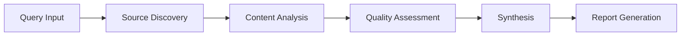

# 🔬 Research Workflows Guide

## Overview

This comprehensive guide covers all aspects of creating, managing, and optimizing research workflows in the Free Deep Research System. Learn how to conduct effective research from basic queries to advanced multi-source analysis.

## 🎯 Research Workflow Basics

### What is a Research Workflow?

A research workflow is an automated process that:
1. **Analyzes your research query** to understand intent and scope
2. **Searches multiple sources** using advanced AI-powered techniques
3. **Evaluates and filters content** for quality and relevance
4. **Synthesizes findings** into comprehensive, actionable insights
5. **Generates reports** with citations, analysis, and recommendations

### Workflow Components



## 🚀 Creating Your First Workflow

### Step 1: Craft an Effective Query

#### Query Best Practices
```
❌ Bad: "AI"
✅ Good: "Latest developments in AI for medical diagnosis in 2024"

❌ Bad: "Marketing stuff"
✅ Good: "Digital marketing trends for B2B SaaS companies in 2024"

❌ Bad: "How to code"
✅ Good: "Best practices for React performance optimization in large applications"
```

#### Query Structure Guidelines
- **Be Specific**: Include domain, timeframe, and context
- **Use Keywords**: Include relevant technical terms
- **Set Scope**: Define the breadth of research needed
- **Include Intent**: Specify what you want to achieve

### Step 2: Select Research Methodology

#### Available Methodologies

**Hybrid (Recommended for Most Users)**
- Balanced approach combining multiple search strategies
- Good for general research topics
- Optimal balance of speed and comprehensiveness

**Don Lim Methodology**
- Academic and research-focused approach
- Emphasizes peer-reviewed sources and scholarly content
- Best for: Literature reviews, academic research, scientific analysis

**Nick Scamara Methodology**
- Business and market-focused approach
- Emphasizes industry reports, market data, and business insights
- Best for: Market research, competitive analysis, business strategy

**Custom Methodology**
- User-defined parameters and source preferences
- Advanced users can fine-tune search strategies
- Best for: Specialized domains or specific requirements

### Step 3: Configure Parameters

#### Essential Parameters
```typescript
interface ResearchParameters {
  maxSources: number;        // 10-100 sources
  timeframe: string;         // 'last_year', 'last_2_years', etc.
  domains: string[];         // ['academic', 'news', 'industry']
  language: string;          // 'en', 'es', 'fr', etc.
  budget: number;            // Cost limit for paid APIs
  priority: 'speed' | 'quality' | 'comprehensive';
}
```

#### Parameter Optimization Guide

| Research Type | Max Sources | Timeframe | Priority |
|---------------|-------------|-----------|----------|
| **Quick Overview** | 15-25 | Last 6 months | Speed |
| **Standard Research** | 25-50 | Last 1-2 years | Quality |
| **Comprehensive Analysis** | 50-100 | Last 3-5 years | Comprehensive |
| **Literature Review** | 75-150 | Last 5-10 years | Comprehensive |

## 📊 Advanced Workflow Features

### Multi-Source Research

#### Source Types and Quality
```typescript
interface SourceQuality {
  academic: {
    weight: 0.9;
    sources: ['pubmed', 'arxiv', 'scholar'];
    credibility: 'high';
  };
  industry: {
    weight: 0.8;
    sources: ['reports', 'whitepapers', 'case_studies'];
    credibility: 'medium-high';
  };
  news: {
    weight: 0.6;
    sources: ['reuters', 'bloomberg', 'tech_news'];
    credibility: 'medium';
  };
  social: {
    weight: 0.4;
    sources: ['twitter', 'reddit', 'forums'];
    credibility: 'low-medium';
  };
}
```

#### Source Filtering
- **Domain Filtering**: Include/exclude specific domains
- **Date Filtering**: Focus on recent or historical content
- **Language Filtering**: Multi-language research capabilities
- **Quality Filtering**: Minimum credibility thresholds

### Real-Time Research Monitoring

#### Progress Tracking
```typescript
interface WorkflowProgress {
  status: 'queued' | 'running' | 'analyzing' | 'synthesizing' | 'completed';
  progress: number;           // 0-100%
  currentPhase: string;       // Current operation
  sourcesFound: number;       // Sources discovered
  sourcesAnalyzed: number;    // Sources processed
  estimatedTimeRemaining: string;
  errors: WorkflowError[];
}
```

#### Live Updates
- Real-time progress indicators
- Source discovery notifications
- Quality assessment updates
- Error and warning alerts

## 🎨 Workflow Customization

### Custom Research Templates

#### Creating Templates
```yaml
template:
  name: "Academic Literature Review"
  description: "Comprehensive academic research template"
  methodology: "don_lim"
  parameters:
    maxSources: 75
    timeframe: "last_5_years"
    domains: ["academic", "preprint"]
    qualityThreshold: 0.8
  filters:
    includeTypes: ["journal_article", "conference_paper"]
    excludeDomains: ["social_media", "forums"]
  outputFormat:
    sections: ["abstract", "methodology", "findings", "citations"]
    citationStyle: "apa"
```

#### Template Categories
- **Academic Research**: Literature reviews, systematic reviews
- **Business Analysis**: Market research, competitive analysis
- **Technical Research**: Technology assessment, best practices
- **News Analysis**: Current events, trend analysis
- **Custom Templates**: User-defined workflows

### Advanced Query Techniques

#### Boolean Operators
```
# AND operator (implicit)
"machine learning healthcare applications"

# OR operator
"artificial intelligence OR machine learning"

# NOT operator
"AI healthcare NOT pharmaceutical"

# Phrase matching
"deep learning" AND "medical diagnosis"

# Wildcard matching
"neural network*" (matches networks, networking, etc.)
```

#### Semantic Search
```typescript
// Semantic query expansion
const expandedQuery = {
  original: "AI in healthcare",
  expanded: [
    "artificial intelligence medical applications",
    "machine learning clinical diagnosis",
    "deep learning healthcare systems",
    "neural networks medical imaging"
  ]
};
```

## 📈 Quality Assessment & Validation

### Source Credibility Scoring

#### Credibility Factors
```typescript
interface CredibilityScore {
  authorAuthority: number;    // 0-1 (author expertise)
  publicationQuality: number; // 0-1 (journal/site quality)
  citationCount: number;      // Number of citations
  recency: number;           // 0-1 (how recent)
  peerReview: boolean;       // Peer-reviewed status
  domainRelevance: number;   // 0-1 (topic relevance)
  overallScore: number;      // Weighted average
}
```

#### Quality Thresholds
- **High Quality**: Score > 0.8 (Academic papers, authoritative sources)
- **Medium Quality**: Score 0.6-0.8 (Industry reports, established news)
- **Low Quality**: Score 0.4-0.6 (Blogs, opinion pieces)
- **Filtered Out**: Score < 0.4 (Unreliable sources)

### Content Validation

#### Fact-Checking Process
1. **Cross-Reference Verification**: Compare claims across sources
2. **Authority Validation**: Verify author credentials and expertise
3. **Citation Analysis**: Check reference quality and relevance
4. **Bias Detection**: Identify potential bias in sources
5. **Consistency Checking**: Ensure information consistency

#### Confidence Indicators
```typescript
interface ConfidenceMetrics {
  sourceAgreement: number;     // 0-1 (how many sources agree)
  evidenceStrength: number;    // 0-1 (quality of evidence)
  expertConsensus: number;     // 0-1 (expert agreement)
  dataQuality: number;         // 0-1 (underlying data quality)
  overallConfidence: number;   // Weighted confidence score
}
```

## 📋 Understanding Research Results

### Report Structure

#### Executive Summary
- **Key Findings**: 3-5 most important insights
- **Recommendations**: Actionable next steps
- **Confidence Level**: Overall reliability assessment
- **Source Quality**: Summary of source credibility

#### Detailed Analysis
- **Methodology**: How the research was conducted
- **Source Breakdown**: Analysis of source types and quality
- **Findings by Theme**: Organized insights by topic
- **Supporting Evidence**: Detailed evidence for each finding
- **Limitations**: Research scope and limitations

#### Appendices
- **Complete Source List**: All sources with credibility scores
- **Methodology Details**: Technical research parameters
- **Raw Data**: Unprocessed findings and metrics
- **Quality Metrics**: Detailed quality assessments

### Interpreting Results

#### Confidence Levels
- **High Confidence (>0.8)**: Strong evidence from multiple reliable sources
- **Medium Confidence (0.6-0.8)**: Good evidence with some limitations
- **Low Confidence (0.4-0.6)**: Limited or conflicting evidence
- **Insufficient Evidence (<0.4)**: Not enough reliable information

#### Source Analysis
```typescript
interface SourceAnalysis {
  totalSources: number;
  sourceTypes: {
    academic: number;
    industry: number;
    news: number;
    other: number;
  };
  averageQuality: number;
  dateRange: {
    oldest: Date;
    newest: Date;
    median: Date;
  };
  languageDistribution: Record<string, number>;
}
```

## 🔄 Workflow Management

### Saving and Organizing Research

#### Research Collections
- **Project-Based**: Organize by research project
- **Topic-Based**: Group by subject matter
- **Date-Based**: Chronological organization
- **Quality-Based**: Sort by research quality

#### Collaboration Features
- **Shared Workspaces**: Team research collaboration
- **Comment System**: Annotate findings and sources
- **Version Control**: Track research iterations
- **Access Control**: Manage team permissions

### Research Iteration

#### Refining Research
1. **Analyze Initial Results**: Review findings and gaps
2. **Identify Missing Areas**: Spot information gaps
3. **Refine Query**: Improve search terms and parameters
4. **Expand Sources**: Add new source types or domains
5. **Re-run Analysis**: Execute refined research

#### Continuous Improvement
```typescript
interface ResearchMetrics {
  queryEffectiveness: number;   // How well query performed
  sourceRelevance: number;      // Average source relevance
  coverageCompleteness: number; // Topic coverage percentage
  userSatisfaction: number;     // User rating of results
  improvementSuggestions: string[];
}
```

## 🚀 Best Practices

### Query Optimization
1. **Start Broad, Then Narrow**: Begin with general terms, refine based on results
2. **Use Domain-Specific Terms**: Include technical vocabulary
3. **Specify Context**: Add industry, timeframe, or geographic context
4. **Iterate Based on Results**: Refine queries based on initial findings

### Parameter Tuning
1. **Match Scope to Need**: Don't over-research simple questions
2. **Balance Speed vs. Quality**: Choose appropriate priority level
3. **Consider Budget**: Optimize for cost-effectiveness
4. **Monitor Performance**: Track research effectiveness over time

### Result Validation
1. **Cross-Check Key Claims**: Verify important findings across sources
2. **Assess Source Bias**: Consider potential bias in sources
3. **Check Recency**: Ensure information is current for your needs
4. **Validate Methodology**: Understand how conclusions were reached

---

**Ready to start researching?** Try our [Quick Start Guide](./quick-start.md) or explore [Advanced Features](./advanced-features.md) for power users.
