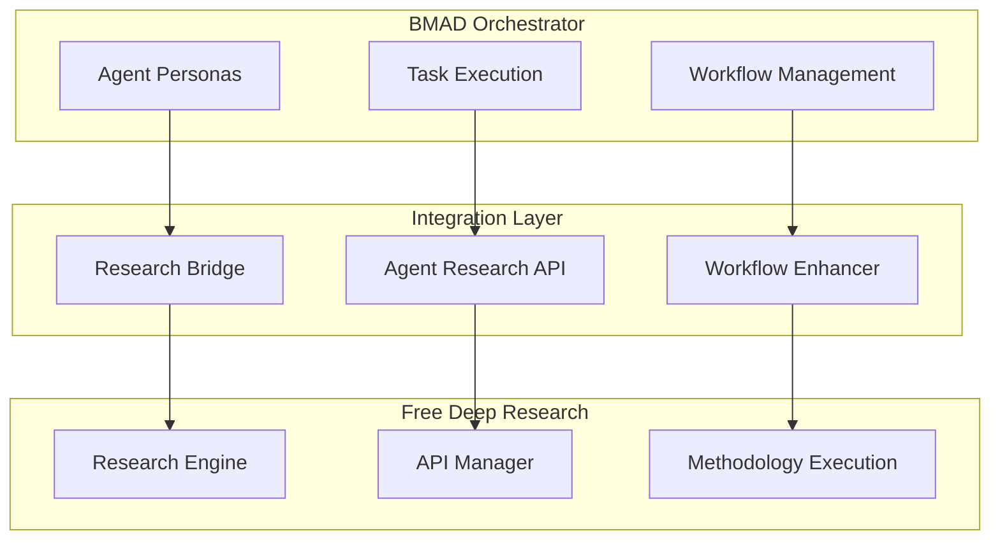

# BMAD-Research Integration Layer

## Overview

This integration layer connects the BMAD AI Agent Orchestrator with the Free Deep Research system, enabling BMAD agents to leverage sophisticated research capabilities.

## Integration Architecture



## Research-Enhanced Agent Capabilities

### Product Manager (John) Research Integration
```yaml
research_capabilities:
  market_analysis:
    methodology: "hybrid"
    apis: ["serpapi", "exa", "tavily"]
    focus: ["market_size", "competitors", "trends", "user_needs"]
    
  competitive_research:
    methodology: "nick_scamara"
    apis: ["firecrawl", "jina", "openrouter"]
    focus: ["competitor_features", "pricing", "positioning", "reviews"]
    
  user_research:
    methodology: "don_lim"
    apis: ["serpapi", "tavily"]
    focus: ["user_behavior", "pain_points", "preferences", "demographics"]
```

### Technical Architect (Fred) Research Integration
```yaml
research_capabilities:
  technology_evaluation:
    methodology: "hybrid"
    apis: ["github_search", "documentation_crawl", "expert_analysis"]
    focus: ["performance", "scalability", "community", "maintenance"]
    
  architecture_patterns:
    methodology: "academic_research"
    apis: ["academic_search", "technical_documentation"]
    focus: ["proven_patterns", "case_studies", "best_practices", "anti_patterns"]
    
  security_research:
    methodology: "comprehensive"
    apis: ["security_databases", "vulnerability_research", "compliance_docs"]
    focus: ["threats", "mitigations", "compliance", "best_practices"]
```

### Platform Engineer (Alex) Research Integration
```yaml
research_capabilities:
  infrastructure_research:
    methodology: "cost_optimized"
    apis: ["cloud_documentation", "pricing_analysis", "performance_benchmarks"]
    focus: ["cost_efficiency", "performance", "reliability", "scalability"]
    
  devops_best_practices:
    methodology: "industry_analysis"
    apis: ["devops_communities", "case_studies", "tool_comparisons"]
    focus: ["automation", "monitoring", "deployment", "security"]
    
  compliance_research:
    methodology: "regulatory_analysis"
    apis: ["compliance_databases", "regulatory_updates", "audit_requirements"]
    focus: ["requirements", "frameworks", "implementation", "validation"]
```

## Integration API Specification

### Research Request Interface
```typescript
interface ResearchRequest {
  agent_id: string;
  research_type: 'market_analysis' | 'technical_research' | 'competitive_analysis';
  query: string;
  methodology: 'don_lim' | 'nick_scamara' | 'hybrid';
  focus_areas: string[];
  depth: 'basic' | 'comprehensive' | 'expert';
  max_duration_minutes: number;
}

interface ResearchResponse {
  research_id: string;
  status: 'completed' | 'in_progress' | 'failed';
  results: {
    summary: string;
    key_findings: string[];
    evidence: ResearchEvidence[];
    recommendations: string[];
    confidence_score: number;
  };
  metadata: {
    methodology_used: string;
    apis_accessed: string[];
    duration_seconds: number;
    cost_estimate: number;
  };
}
```

### Agent Enhancement Interface
```typescript
interface EnhancedAgentTask {
  base_task: AgentTask;
  research_phase: {
    enabled: boolean;
    research_requests: ResearchRequest[];
    synthesis_prompt: string;
  };
  execution_phase: {
    research_integration: boolean;
    evidence_requirements: string[];
    validation_criteria: string[];
  };
}
```

## Implementation Components

### 1. Research Bridge Service
```rust
pub struct ResearchBridge {
    research_client: Arc<ResearchEngineClient>,
    agent_registry: Arc<AgentRegistry>,
    config: ResearchIntegrationConfig,
}

impl ResearchBridge {
    pub async fn conduct_agent_research(
        &self,
        agent_id: &str,
        research_request: ResearchRequest,
    ) -> AppResult<ResearchResponse> {
        // Implementation details
    }
    
    pub async fn enhance_agent_task(
        &self,
        task: AgentTask,
        research_config: ResearchConfig,
    ) -> AppResult<EnhancedAgentTask> {
        // Implementation details
    }
}
```

### 2. Agent Research API
```rust
#[tauri::command]
pub async fn agent_conduct_research(
    agent_id: String,
    research_type: String,
    query: String,
    options: ResearchOptions,
) -> Result<ResearchResponse, String> {
    // Implementation details
}

#[tauri::command]
pub async fn get_research_status(
    research_id: String,
) -> Result<ResearchStatus, String> {
    // Implementation details
}
```

### 3. Workflow Enhancer
```rust
pub struct WorkflowEnhancer {
    research_bridge: Arc<ResearchBridge>,
    template_manager: Arc<TemplateManager>,
}

impl WorkflowEnhancer {
    pub async fn enhance_documentation_mode(
        &self,
        workflow: DocumentationWorkflow,
    ) -> AppResult<EnhancedDocumentationWorkflow> {
        // Add research phases to workflow
        // Integrate research results into document generation
        // Enhance validation with evidence-based criteria
    }
    
    pub async fn enhance_development_mode(
        &self,
        workflow: DevelopmentWorkflow,
    ) -> AppResult<EnhancedDevelopmentWorkflow> {
        // Add research-driven decision making
        // Integrate real-time research capabilities
        // Enhance agent collaboration with shared research
    }
}
```

## Configuration Integration

### Enhanced Agent Configuration
```yaml
agents:
  - id: "product-manager"
    name: "John"
    title: "Product Manager"
    # ... existing configuration ...
    research_integration:
      enabled: true
      default_methodology: "hybrid"
      research_capabilities:
        - "market_analysis"
        - "competitive_research"
        - "user_research"
        - "technology_trends"
      auto_research_triggers:
        - task: "create-prd"
          research_type: "market_analysis"
          depth: "comprehensive"
        - task: "analyze-requirements"
          research_type: "user_research"
          depth: "basic"
```

### Research Integration Settings
```yaml
research_integration:
  enabled: true
  default_settings:
    max_research_duration_minutes: 30
    cost_limit_per_research: 5.00
    confidence_threshold: 0.7
    evidence_requirements: "medium"
  
  methodology_preferences:
    market_research: "hybrid"
    technical_research: "nick_scamara"
    competitive_analysis: "don_lim"
    academic_research: "comprehensive"
  
  api_priorities:
    primary: ["openrouter", "serpapi", "tavily"]
    secondary: ["jina", "firecrawl", "exa"]
    fallback: ["basic_search"]
```

## Quality Assurance

### Research Quality Gates
- **Confidence Score Validation**: Minimum confidence threshold for research results
- **Evidence Requirements**: Minimum number of sources and evidence quality
- **Cost Controls**: Maximum research cost per agent task
- **Time Limits**: Maximum research duration to prevent workflow delays
- **Source Diversity**: Ensure research draws from multiple, diverse sources

### Integration Testing
- **Agent Research Workflows**: Test each agent's research capabilities
- **End-to-End Integration**: Test complete research-enhanced workflows
- **Performance Testing**: Ensure research integration doesn't impact performance
- **Cost Testing**: Validate cost controls and optimization
- **Quality Testing**: Verify research quality and relevance

---

*This integration layer transforms BMAD agents from simple AI assistants into research-powered experts capable of delivering evidence-based, thoroughly informed outputs.*
