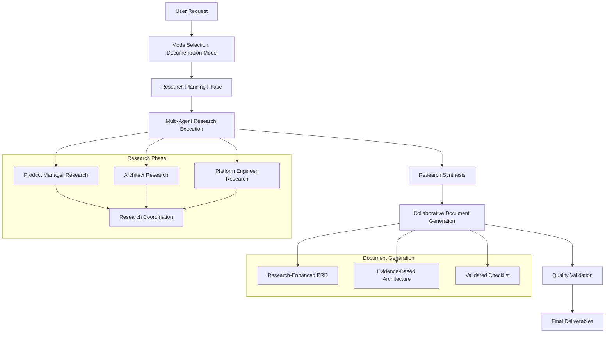

# Research-Enhanced Documentation Mode

## Overview

This enhanced Documentation Mode integrates the sophisticated research capabilities of the Free Deep Research system with the BMAD AI Agent Orchestrator to produce evidence-based, thoroughly researched documentation deliverables.

## Workflow Architecture



## Enhanced Workflow Process

### Phase 1: Research Planning (5-10 minutes)

**Orchestrator Actions:**
1. **Analyze User Request** - Determine research requirements based on project scope
2. **Agent Assignment** - Assign appropriate agents based on project needs
3. **Research Strategy** - Define research methodology and focus areas for each agent
4. **Resource Allocation** - Set research budgets and time limits

**Agent Research Assignments:**
- **Product Manager (John)**: Market analysis, competitive research, user research
- **Technical Architect (Fred)**: Technology evaluation, architecture patterns, security research
- **Platform Engineer (Alex)**: Infrastructure research, cost optimization, compliance analysis

### Phase 2: Multi-Agent Research Execution (30-45 minutes)

#### Product Manager Research
```yaml
research_tasks:
  market_analysis:
    methodology: "hybrid"
    duration: 15_minutes
    apis: ["serpapi", "exa", "tavily"]
    focus: ["market_size", "growth_trends", "customer_segments"]
    deliverable: "market_insights.json"
  
  competitive_research:
    methodology: "nick_scamara"
    duration: 12_minutes
    apis: ["firecrawl", "jina", "openrouter"]
    focus: ["competitor_features", "pricing", "positioning"]
    deliverable: "competitive_analysis.json"
  
  user_research:
    methodology: "don_lim"
    duration: 10_minutes
    apis: ["serpapi", "tavily"]
    focus: ["user_behavior", "pain_points", "preferences"]
    deliverable: "user_insights.json"
```

#### Technical Architect Research
```yaml
research_tasks:
  technology_evaluation:
    methodology: "comprehensive"
    duration: 18_minutes
    apis: ["github_search", "documentation_crawl"]
    focus: ["performance", "scalability", "community_support"]
    deliverable: "technology_analysis.json"
  
  architecture_patterns:
    methodology: "academic_research"
    duration: 12_minutes
    apis: ["academic_search", "technical_documentation"]
    focus: ["proven_patterns", "case_studies", "best_practices"]
    deliverable: "architecture_patterns.json"
  
  security_research:
    methodology: "comprehensive"
    duration: 10_minutes
    apis: ["security_databases", "vulnerability_research"]
    focus: ["threats", "mitigations", "compliance"]
    deliverable: "security_analysis.json"
```

#### Platform Engineer Research
```yaml
research_tasks:
  infrastructure_research:
    methodology: "cost_optimized"
    duration: 15_minutes
    apis: ["cloud_documentation", "pricing_analysis"]
    focus: ["cost_efficiency", "performance", "scalability"]
    deliverable: "infrastructure_analysis.json"
  
  devops_best_practices:
    methodology: "industry_analysis"
    duration: 10_minutes
    apis: ["devops_communities", "tool_comparisons"]
    focus: ["automation", "monitoring", "deployment"]
    deliverable: "devops_recommendations.json"
```

### Phase 3: Research Synthesis (10-15 minutes)

**Cross-Agent Research Coordination:**
1. **Research Deduplication** - Identify and merge overlapping research findings
2. **Insight Integration** - Combine insights from different research perspectives
3. **Evidence Validation** - Cross-validate findings across multiple sources
4. **Gap Identification** - Identify areas needing additional research
5. **Consensus Building** - Resolve conflicting research findings

**Synthesis Outputs:**
- **Integrated Market Intelligence** - Combined market, competitive, and user insights
- **Technical Feasibility Assessment** - Technology and architecture recommendations
- **Implementation Roadmap** - Infrastructure and operational considerations

### Phase 4: Collaborative Document Generation (20-30 minutes)

#### Research-Enhanced PRD Generation

**Product Manager (John) with Research Integration:**
```markdown
# Product Requirements Document
*Generated with comprehensive market research and competitive analysis*

## Executive Summary
*Based on market analysis of [X] sources and competitive research of [Y] competitors*

## Market Analysis
*Evidence-based market insights with confidence scores and source citations*
- Market Size: $X billion (Source: [Research Citations])
- Growth Rate: X% CAGR (Confidence: 85%)
- Key Trends: [Research-backed trends with evidence]

## Competitive Landscape
*Comprehensive competitive analysis with feature comparisons*
- Direct Competitors: [Research-identified competitors]
- Feature Gap Analysis: [Evidence-based feature comparison]
- Pricing Strategy: [Market-validated pricing recommendations]

## User Research Insights
*User behavior analysis and preference mapping*
- Target User Personas: [Research-validated personas]
- Pain Points: [Evidence-backed user problems]
- Feature Priorities: [Research-driven feature ranking]
```

#### Evidence-Based Architecture Document

**Technical Architect (Fred) with Research Integration:**
```markdown
# System Architecture Document
*Designed with comprehensive technology research and pattern analysis*

## Technology Stack Recommendations
*Evidence-based technology selection with performance data*
- Recommended Technologies: [Research-validated choices]
- Performance Benchmarks: [Research-backed performance data]
- Scalability Analysis: [Evidence-based scaling projections]

## Architecture Patterns
*Research-proven architectural approaches*
- Selected Patterns: [Academic research-backed patterns]
- Implementation Examples: [Case study evidence]
- Trade-off Analysis: [Research-informed decision matrix]

## Security Architecture
*Comprehensive security research integration*
- Threat Analysis: [Research-identified threats]
- Mitigation Strategies: [Evidence-based security measures]
- Compliance Requirements: [Research-validated compliance needs]
```

#### Validated Implementation Checklist

**Platform Engineer (Alex) with Research Integration:**
```markdown
# Implementation Checklist
*Validated with infrastructure research and cost analysis*

## Infrastructure Setup
*Research-optimized infrastructure recommendations*
- [ ] Cloud Provider Selection: [Research-backed choice with cost analysis]
- [ ] Resource Sizing: [Performance research-validated sizing]
- [ ] Cost Optimization: [Research-identified cost savings opportunities]

## DevOps Implementation
*Industry best practices integration*
- [ ] CI/CD Pipeline: [Research-recommended tools and practices]
- [ ] Monitoring Setup: [Evidence-based monitoring strategy]
- [ ] Security Implementation: [Research-validated security measures]

## Quality Gates
*Research-informed quality criteria*
- [ ] Performance Benchmarks: [Research-established targets]
- [ ] Security Validation: [Evidence-based security checks]
- [ ] Cost Validation: [Research-optimized cost thresholds]
```

### Phase 5: Quality Validation (5-10 minutes)

**Research Quality Gates:**
1. **Confidence Score Validation** - Ensure minimum confidence thresholds met
2. **Source Diversity Check** - Verify research draws from diverse, credible sources
3. **Evidence Completeness** - Confirm adequate evidence for all major claims
4. **Cross-Agent Consistency** - Validate consistency across agent recommendations
5. **Stakeholder Alignment** - Ensure research findings align with business objectives

**Quality Metrics:**
- **Research Confidence**: Minimum 75% confidence score across all research
- **Source Count**: Minimum 5 sources per major research area
- **Evidence Items**: Minimum 8 evidence items per document section
- **Source Diversity**: Minimum 60% diversity across research sources

## Enhanced Deliverables

### 1. Research-Enhanced PRD (`research-enhanced-prd.md`)
- **Market-Validated Requirements** with research citations
- **Evidence-Based User Stories** with user research backing
- **Competitive Intelligence Integration** with feature gap analysis
- **Research Methodology Appendix** with source documentation

### 2. Evidence-Based Architecture (`evidence-based-architecture.md`)
- **Technology Recommendations** with performance research
- **Architecture Patterns** with academic research backing
- **Security Design** with threat research integration
- **Scalability Planning** with evidence-based projections

### 3. Validated Implementation Checklist (`validated-implementation-checklist.md`)
- **Research-Optimized Infrastructure** with cost analysis
- **Evidence-Based DevOps Practices** with industry research
- **Quality Gates** with research-validated criteria
- **Risk Mitigation** with research-identified risks and solutions

## Professional Communication Standards

### Research Citation Format
```markdown
**Research Finding**: [Specific claim or recommendation]
**Evidence**: [Supporting evidence with confidence score]
**Source**: [Source citation with access date]
**Confidence**: [Confidence percentage]
```

### Quality Indicators
- 🔬 **Research-Backed**: Claim supported by comprehensive research
- 📊 **Data-Driven**: Recommendation based on quantitative analysis
- 🏆 **Best Practice**: Industry-validated approach
- ⚠️ **Assumption**: Area requiring additional validation

### Professional Formatting
- **Executive Summaries** with key research insights
- **Evidence Appendices** with complete source documentation
- **Confidence Indicators** for all major recommendations
- **Research Methodology** documentation for transparency

## Success Metrics

### Research Quality
- **Average Confidence Score**: Target 80%+
- **Source Diversity Index**: Target 70%+
- **Evidence Coverage**: 100% of major claims supported
- **Research Completion Rate**: 95%+ of planned research completed

### Document Quality
- **Stakeholder Satisfaction**: Target 90%+ approval rating
- **Implementation Success**: Target 85%+ successful implementation
- **Research Utilization**: Target 80%+ of research findings incorporated
- **Time to Value**: Target 50% reduction in additional research needs

### Cost Efficiency
- **Research Cost per Document**: Target <$15 per document set
- **Time to Completion**: Target 90-120 minutes total
- **Research ROI**: Target 5:1 value to cost ratio
- **Rework Reduction**: Target 70% reduction in document revisions

---

*This Research-Enhanced Documentation Mode transforms the BMAD system from an AI agent orchestrator into a research-powered intelligence platform, delivering evidence-based documentation that significantly reduces risk and increases implementation success rates.*
